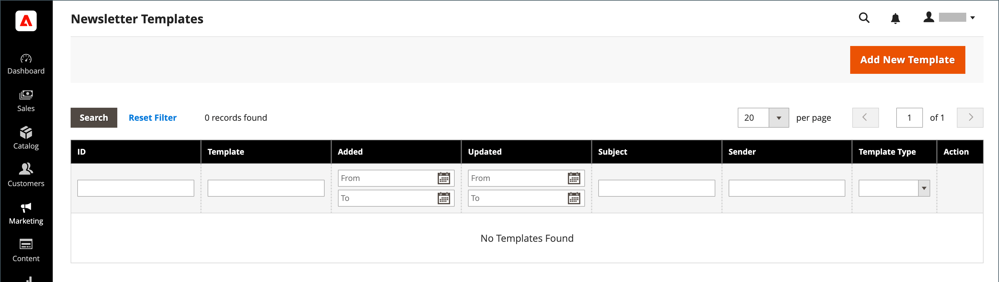

# Newsletter queues

To manage the load on the server, newsletters with many subscribers are sent in a queue of multiple batches. You can check the newsletter queue periodically to check the status, and see how many have been processed. Any problems that occur during transmission appear on the _Newsletter Problem_ report.

<!-- zoom -->

## Send a Newsletter

1. On the _Admin_ menu, go to **Marketing** > _Communications_ > **Newsletter Template**.

1. In the grid, find the template for the newsletter that is to be sent and set the **Action** column to `Queue Newsletter`.

1. For **Queue Date Start**, select the date that the transmission is to begin from the calendar ().

1. In the **Subscribers From** list, select each store view that is to be included in the email blast.

1. Complete the email header information as follows:

    - Enter a brief description of the newsletter for the **Subject** line of the email header.

    - Enter the **Sender Name**.

    - In the **Sender Email** field, enter the email address of the sender.

      The default name and email address of the sender is specified in the configuration.

      <!-- zoom -->

1. If applicable, enter a note in the **Message** box above the instructions to unsubscribe.

   >[!NOTE]
   >
   >Do not remove the instructions, which are required by law in many jurisdictions.

1. To apply custom styles to a newsletter, add them into the **Newsletter Styles** field.

1. When complete, click **Save and Resume**.

    The newsletter appears in the queue waiting to be processed.

    <!-- zoom -->

## Check for problems

On the _Admin_ menu, go to **Reports** > _Marketing_ > **Newsletter Problem Reports**.

### Button bar

|Button|Description|
|--- |--- |
|**Back**|Returns to the Newsletter Templates page without saving changes.|
|**Reset**|Resets any unsaved changes in the queue information form to their previous values.|
|**Preview Template**|Opens a preview page in a separate tab.|
|**Save and Resume**|Saves all made changes. Puts the newsletter to queue.|
|**Save Newsletter**|Saves all made changes. Puts the newsletter to queue.|

{style="table-layout:auto"}

## Grid columns

|Column|Description|
|--- |--- |
|ID|A unique numeric identifier that is assigned to each newsletter template.|
|Queue Start|The date when the newsletter was sent out.|
|Queue End|The date when the newsletter finished sending.|
|Subject|Subject of newsletter template.|
|Status|Indicates a current status of the newsletter mailing. Possible values: Sent, Canceled, Not Sent, Sending, Paused.|
|Processed|Indicates how many newsletters were sent.|
|Recipients|Indicates how many newsletters were received by subscribers.|
|Actions|**Preview**: opens a separate window to preview the template.|

{style="table-layout:auto"}
