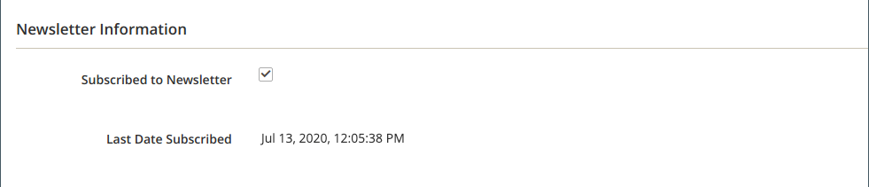
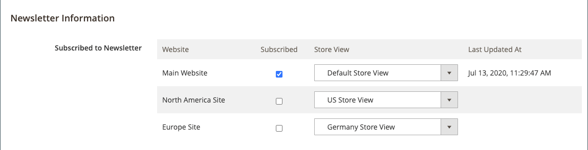
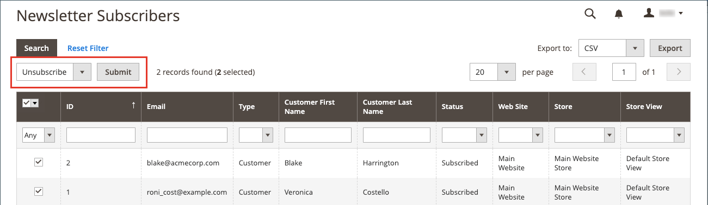
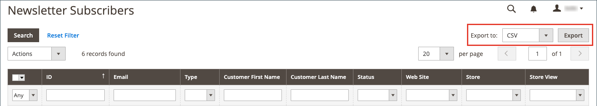

# Manage newsletter subscribers

As a best practice you should manage your subscription list regularly, and make sure to process any requests to unsubscribe. In some jurisdictions, it is required by law that requests to unsubscribe are processed within a specific time period.

You can easily manage your subscribers using a simple list of active subscriptions. When a customer submits an unsubscribe request, you can simply apply an _Unsubscribe_ action to one or more selected subscriptions.

In single-site setups with multiple store views, a customer account subscription can be associated with a specific store view.

In multi-store and multi-site setups with a global [customer account scope](https://docs.magento.com/user-guide/customers/account-scope.html), a customer account can be subscribed to newsletters for multiple sites/stores. In this case, you may want to edit the customer account to manage a group of subscriptions or cancel a subscription for a specific site/store to honor a request.

If you want to use a third-party service to send newsletters, you can export your subscription list as a CSV or XML file.

## Manage subscriptions for a customer

1. On the _Admin_ sidebar, go to **[!UICONTROL Customers]** > **[!UICONTROL All Customers]**.

1. Find the customer in the grid and click **[!UICONTROL Edit]** in the _[!UICONTROL Action]_ column.

1. Click **[!UICONTROL Newsletter]** in the left panel.

1. Modify the subscriptions for the customer according to your site/store setup.

   For a single site/single store setup, you can simply select or clear the **[!UICONTROL Subscribed to Newsletter]** checkbox.

   <!-- zoom -->

   For a single site/multi-store setup, you can select or clear the **[!UICONTROL Subscribed to Newsletter]** checkbox and set **[!UICONTROL Subscribed on Store View]** to the correct store view for the subscription.

   <!-- zoom -->

   For a multi-site/multi-store setup with a global customer account scope, the page displays the subscription status for all sites. You can select or clear the **[!UICONTROL Subscribed]** checkbox and/or change the **[!UICONTROL Store View]** for the subscription.

   <!-- zoom -->

1. Click **[!UICONTROL Save Customer]**.

## Cancel a subscription from the subscribers list

1. On the _Admin_ sidebar, go to **[!UICONTROL Marketing]** > _[!UICONTROL Communications]_ > **[!UICONTROL Newsletter Subscribers]**.

   For a multi-site setup where some customers have subscriptions for more than one site, each subscription is displayed as a line item in the grid.

1. Find the subscriber in the grid and select the checkbox in the first column.

   >[!NOTE]
   >
   >For a bulk unsubscribe, select the checkbox of each subscriber that you want to cancel.

1. Set the _[!UICONTROL Action]_ control to **[!UICONTROL Unsubscribe]** and click **[!UICONTROL Submit]**.

   <!-- zoom -->

   The status of the record changes to `Unsubscribed`.

## Export the list of subscribers

1. From the _[!UICONTROL Newsletter Subscribers]_ list, use the filter controls to include only records with a _Status_ of `Subscribed` and for the appropriate website, store, or store view.

1. Set the **[!UICONTROL Export to]** control to one of the following:

   - `CSV`
   - `XML`

1. Click **[!UICONTROL Export]** and look for the prompt at the bottom of the screen and save the file.

   <!-- zoom -->

## Delete a subscriber from the subscribers list

1. On the _Admin_ sidebar, go to **[!UICONTROL Marketing]** > _[!UICONTROL Communications]_ > **[!UICONTROL Newsletter Subscribers]**.

1. Find the subscriber in the grid and select the checkbox in the first column.

1. Set the _[!UICONTROL Action]_ control to **[!UICONTROL Delete]** and click **[!UICONTROL Submit]**.

1. When prompted to confirm, click **[!UICONTROL OK]**.
