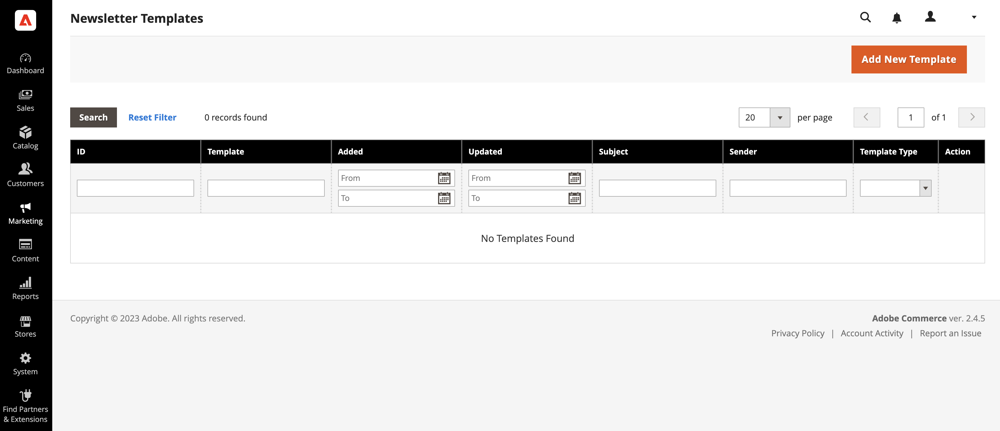
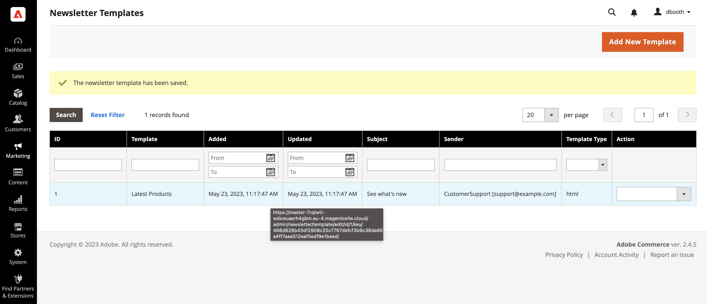
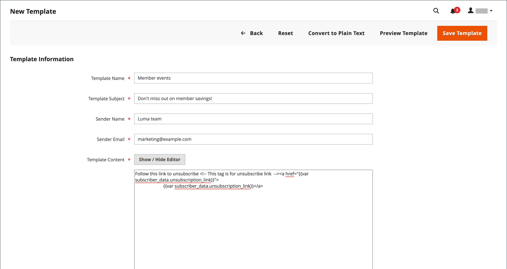

# Newsletter templates

You can create as many newsletter templates as you need for different purposes. You might send a weekly product update, a monthly newsletter, or annual holiday newsletter. Newsletter templates can be prepared with HTML markup, or as plain text. Unlike HTML, plain text newsletters contain no images, rich text, or formatted links. In the grid, the Template Type column indicates whether a template is HTML or text.

<!-- zoom -->

## Create a newsletter template

1. On the Admin sidebar, go to **Marketing** > _Communications_ > **Newsletter Template**.

1. To add a new template, click **Add New Template** and do the following:

    - In the **Template Name** enter name for internal reference.

    - In the **Template Subject** field, describe the purpose of the newsletter.

    - In the **Sender Name** field, enter the name of the person who is to appear as the sender of the newsletter.

    - In the **Sender Email** field, enter the email address of the newsletter sender.

      <!-- zoom -->

    - At the **Template Content** field, click **Show / Hide Editor** to display the WYSIWYG editor and update the content as needed.

      To learn more, see [Using the Editor](../content-design/editor.md).

      >[!NOTE]
      >
      >Do not remove the unsubscribe link at the bottom of the template content. In some jurisdictions, the link is required by law.

    - In the **Template Styles** field, enter the CSS declarations needed to format the content.

      <!-- zoom -->

1. Click **Preview Template** to see how it looks and make any changes that are needed.

1. When complete, click **Save Template**.

   After you save a template, **Save As** appears the next time you edit the template. It can be used to save variations of the template without overwriting the original.

## Convert the Template to Plain Text

1. At the top of the page, click **Convert to Plain Text**. When prompted to confirm, click **OK**.

1. To preview the plain text version of the template, click **Preview Template**.

   The preview opens in a new browser tab.

1. To save the plain text version, click **Save Template**.

## Restore the HTML

1. At the top of the page, click **Return HTML Version**.  

1. To preview the HTML version of the template, click **Preview Template**.

    The preview opens in a new browser tab.

1. To save the HTML version, click **Save Template**.

## Delete Newsletter Template

1. On the _Admin_ sidebar, go to **Marketing** > _Communications_ > **Newsletter Template**.

1. Find the newsletter template to be deleted and open it in Edit mode.

1. In the menu bar, click the **Delete Template** button.

1. To confirm the action, click **OK**.

## Grid columns

|Column|Description|
|--- |--- |
|ID|A unique numeric identifier that is assigned to each newsletter template.|
|Template|The name of template entity.|
|Added|The date when the template entity was created.|
|Updated|The date when the template entity was last updated.|
|Subject|Subject of newsletter template.|
|Sender|Contact the template will be sent from.|
|Template Type|The template type: **html** or **text**.|
|Actions|**Preview**: opens a separate window to preview the template  **Queue Newsletter**: puts the newsletter template into the sending queue.|

{style="table-layout:auto"}
