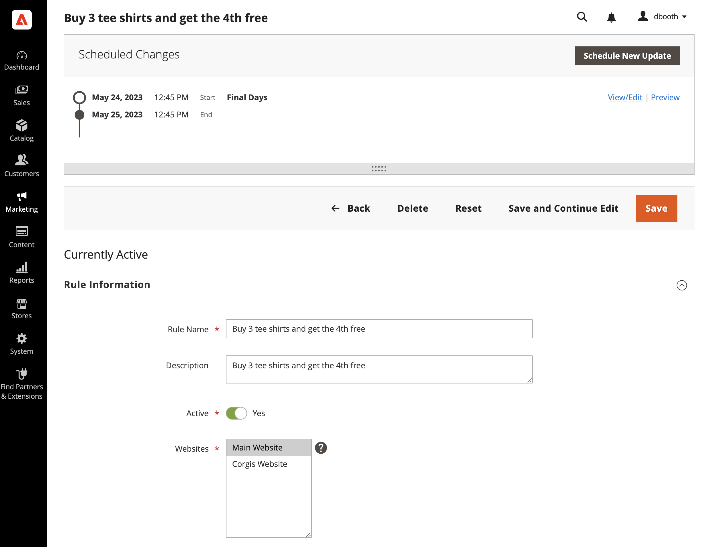

# Scheduled changes for cart price rules

{{ee-feature}}

Cart price rules can be applied on schedule as part of a campaign and grouped with other content changes. You can create a campaign based on scheduled changes to a price rule, or apply the changes to an existing campaign.

>[!NOTE]
>
>The [!UICONTROL From] and [!UICONTROL To] fields have been removed in  Adobe Commerce and cannot be modified directly on the cart price rule. You must create a scheduled update for these activations.

{width="700" zoomable="yes"}

>[!NOTE]
>
>All scheduled updates are applied consecutively. This means that any entity can have only one scheduled update at one point of time. Any scheduled update is applied to all store views within its time frame. As a result, an entity cannot have different scheduled updates for different store views at the same time. All entity attribute values within all store views, which are not affected by the current scheduled update, are taken from the default values, and not from the previous scheduled update.

If there are multiple price rules running in the same campaign, the _[!UICONTROL Priority]_ setting of the price rule determines which rule takes precedence. To learn more, see [Content Staging](../content-design/content-staging.md).

>[!NOTE]
>
>If an active campaign is initially created without an end date, the campaign cannot be edited later to include an end date. In such a case, it is necessary to create a duplicate campaign and enter the end date that is needed.

>[!NOTE]
>
>If a campaign is linked to more than one cart price rule, the campaign can be edited only from the [Content Staging Dashboard](../content-design/content-staging-dashboard.md).

Keep in mind the following caveats:

- If a campaign that includes a price rule is initially created without an end date, the campaign cannot later be edited to include an end date. It is recommended that you either add an end date when you create the campaign or create a duplicate version of the existing campaign and add the end date to the duplicate as needed.
- When using a scheduled update to enable a cart price rule with an end date, be sure to set the rule as initially disabled. Rules that are already active do not respect the end date.
- Coupons are not connected to cart price rules. A Scheduled Update does not provide access to the _[!UICONTROL Coupon]_, _[!UICONTROL Coupon Code]_, _[!UICONTROL Uses per Coupon]_, and _[!UICONTROL Uses per Customer]_ fields on the _[!UICONTROL Rule Information]_ tab. Also, all settings from the _[!UICONTROL Manage Coupon Codes]_ tab are not available.

>[!IMPORTANT]
>
>Campaign **[!UICONTROL Start Date]** and **[!UICONTROL End Date]** must be defined by using the **_default_** Admin time zone, which is converted from each website's local time zone. Consider an example where you have multiple websites in different time zones, but you want to start campaign based on a US time zone. In this case, you need to schedule separate update for each local time zone, and set **[!UICONTROL Start Date]** and **[!UICONTROL End Date]** converted from each local website time zone to default Admin time zone.
