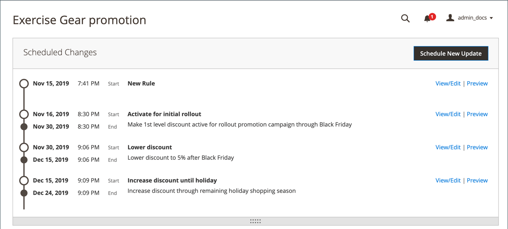
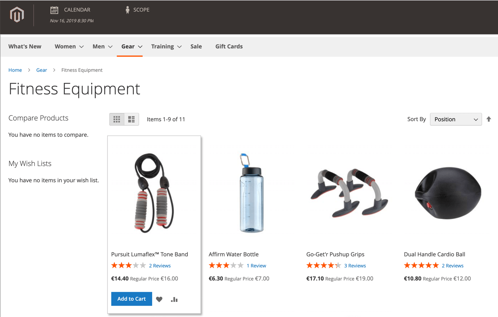

# Scheduled changes for catalog price rules

{{ee-feature}}

The Scheduled Changes box appears at the top of the page when a new price rule is saved or updated. Catalog price rules can be applied on schedule as part of a campaign and grouped with other content changes. You can create a campaign based on scheduled changes to a price rule, or apply the changes to an existing campaign.

>[!NOTE]
>
>All scheduled updates are applied consecutively. This means that any entity can have only one scheduled update at one point of time. Any scheduled update is applied to all store views within its time frame. As a result, an entity cannot have different scheduled updates for different store views at the same time. All entity attribute values within all store views, which are not affected by the current scheduled update, are taken from the default values, and not from the previous scheduled update.

If there are multiple price rules running in the same campaign, the Priority setting of the price rule determines which rule takes precedence. To learn more, see [Content Staging](../content-design/content-staging.md).

>[!IMPORTANT]
>
>If a campaign that includes a price rule is initially created without an end date, the campaign cannot be edited later to include an end date. It is recommended that you either add an end date when you create the campaign, or create a duplicate version of the existing campaign and add the end date to the duplicate as needed.

<!-- zoom -->

## Schedule an update to a catalog price rule

1. On the _Admin_ sidebar, go to **[!UICONTROL Marketing]** > _[!UICONTROL Promotions]_ > **Catalog Price Rule**.

1. Open the rule in edit mode.

1. In the **[!UICONTROL Scheduled Changes]** box at the top of the page, click **[!UICONTROL Schedule New Update]**.

1. With the **[!UICONTROL Save as a New Update]** option selected, do the following:

    - For **[!UICONTROL Update Name]**, enter a name for the update to the rule.

    - Enter a brief **[!UICONTROL Description]** of the update, including how or why it is applied.

    - Use the _Calendar_ () to choose the **[!DNL Start Date]** and **[!UICONTROL End Date]** for the scheduled change to be in effect. To create an open-ended change, leave the end date blank.

    <!-- zoom -->

   >[!NOTE]
   >
   >The start and end date/time is determined by the default Admin panel date/time and time zone, not by the time zone of a particular website. Consider the time zone of the website to properly determine start and end times. Create separate rules for websites in different time zones that need to start and/or stop at specific local times.

1. Scroll down to the **[!UICONTROL Rule Information]** section and change the rule as needed.

   You can schedule changes for any rule parameter, including the websites (scope)/customer groups for the rule, conditions of the rule, and actions applied by the rule. For more information, see [Creating a Catalog Price Rule](price-rules-catalog-create.md).

   >[!NOTE]
   >
   >If you change to any of the rule information parameters, make sure that the _[!UICONTROL Status]_ is set correctly. If you want the change to result in an actively applied rule, the status should be`Active`.

1. When complete, click **[!UICONTROL Save]**.

    The scheduled change appears at the top of the page, with the start and end dates of the campaign.

## Edit a scheduled rule change

1. In the **[!UICONTROL Scheduled Changes]** box at the top of the page, click **[!UICONTROL View/Edit]**.

1. Make any changes necessary to the scheduled update.

1. Click **[!UICONTROL Save]**.

## Preview the scheduled rule change

1. In the **[!UICONTROL Scheduled Changes]** box at the top of the page, click **[!UICONTROL Preview]**.

    The Preview opens a new browser tab that loads your storefront with the applied scheduled change. Navigate to a product that is affected by the change.

    <!-- zoom -->

1. In the upper-left corner of the Preview window, click **[!UICONTROL Calendar]**.

    The calendar detail shows other campaigns that are scheduled for the same day. Each record in the list is a separate rule update.

    <!-- zoom -->

1. To preview a different day or time, click the **[!UICONTROL Date & Time]** calendar  and do the following:

    - Choose a different date and/or time.

    - Click **[!UICONTROL Preview]**.

1. To return to the calendar, click **[!UICONTROL Calendar]** in the header of the Preview page.

   From here, you can do the following:

   **Share a Link to the Preview**

   To share a link to the store preview with your colleagues, click **[!UICONTROL Share]**. Copy the link to the clipboard and paste it into the body of an email message.

   >[!NOTE]
   >
   >An Admin user account is required to see a shared preview. If your [role has access](../systems/permissions-user-roles.md) to create an Admin user account, you must create the account for a new user before sharing.

   **Change the Scope of the Preview**

   To see scheduled changes for different store views, click **[!UICONTROL Scope]** in the header of the Preview page. Choose the website, store, or store view that you want to preview.

1. If necessary, return to the calendar and click **[!UICONTROL View/Edit]** in the _[!UICONTROL Action]_ column to open another scheduled update.
