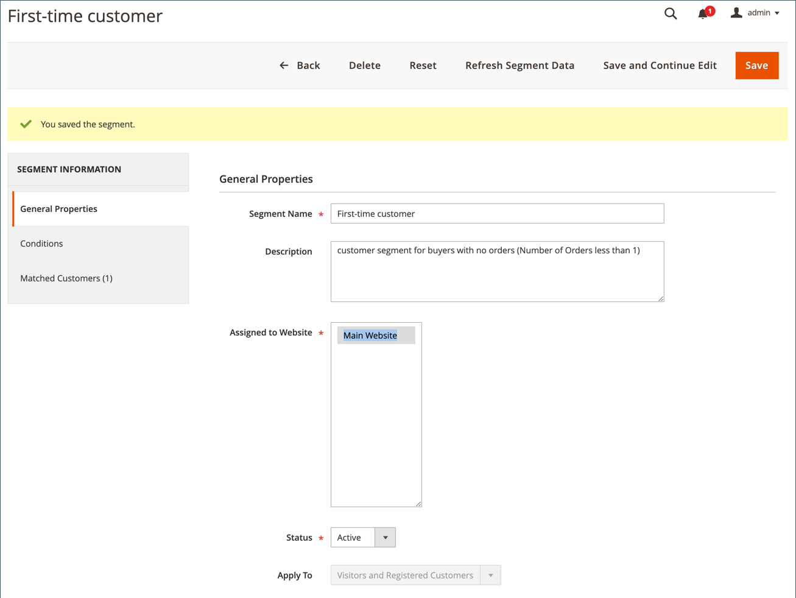
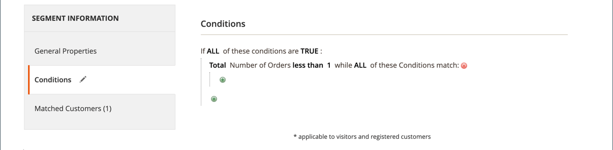
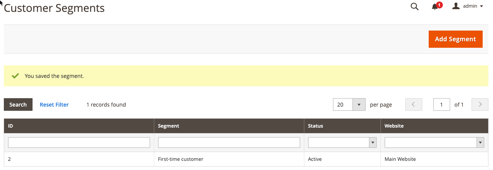
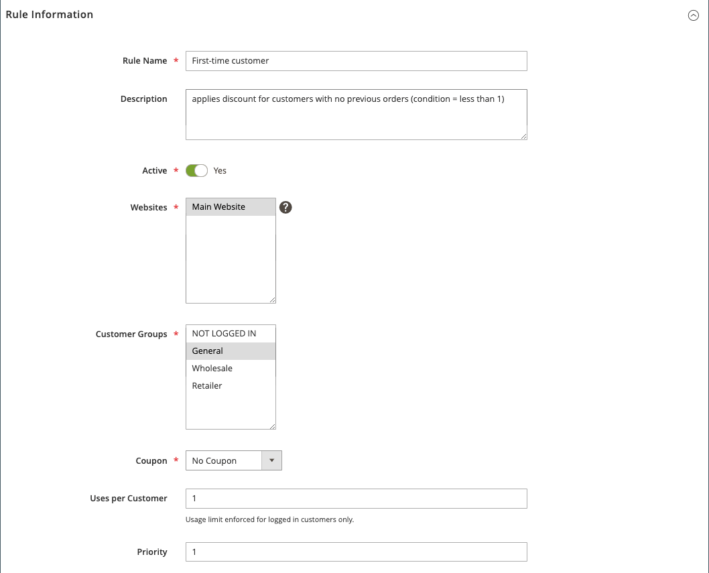
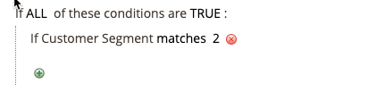
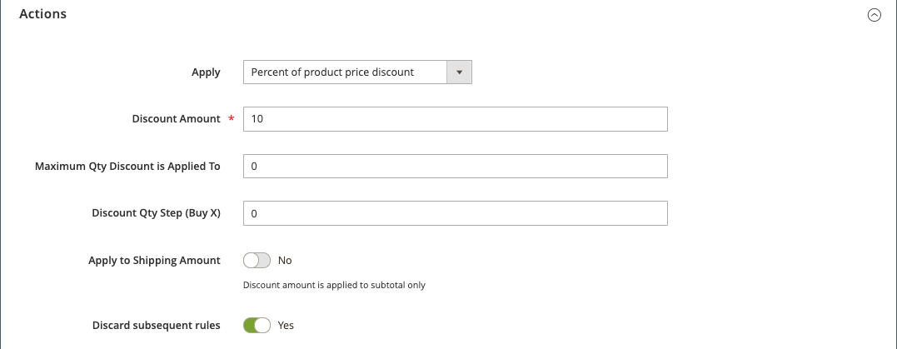

# Cart price rule example - discount with first purchase

{{ee-feature}}

Cart price rules can be used to automatically offer a discount to customers on their first purchase, with no coupon needed.

To offer a discount that is targeted to first-time customers, you can:

- Create a customer segment that is defined as _buyers with no orders_, and then
- Create a cart price rule that targets the new customer segment.

>[!NOTE]
>
>Ensure that the Customer Segments feature is enabled. Refer to [Creating a Customer Segment](https://docs.magento.com/user-guide/marketing/customer-segment-create.html).

## Step 1. Create a customer segment

1. On the _Admin_ sidebar, go to **[!UICONTROL Customers]** > **[!UICONTROL Segments]**.

1. In the upper-right corner, click **[!UICONTROL Add Segment]**.

1. Define the **[!UICONTROL General Properties]**.

   - Enter a **[!UICONTROL Segment Name]** to identify the customer segment (Example: _First-time customer_).

   - For **[!UICONTROL Assigned to Website]**, select the website where the customer segment can be used.

   - For **[!UICONTROL Status]**, select `Active`.

   - For **[!UICONTROL Apply to]**, select `Visitors and Registered Customers`.

   - When complete, click **[!UICONTROL Save and Continue Edit]**.

       Additional options become available in the panel on the left.

    <!-- zoom -->

1. Define the **[!UICONTROL Conditions]**.

   For this example, the condition targets customers for whom _Total Number of Orders is less than 1_ is True.

   - In the panel on the left, choose **[!UICONTROL Conditions]**.

       The default condition begins, "If ALL of these conditions are TRUE:"

   - Click _Add_ () and select `Number of Orders`.

   - Click **[!UICONTROL is]** and select `less than`.

   - Click **...** and enter `1` in the field.

   - Click the green checkmark (  ) to save the condition setting.

   - Click **[!UICONTROL Save]**.

   <!-- zoom -->

Your customer segment is created and displayed in the Customer Segment list.

<!-- zoom -->

>[!TIP]
>
>Make note of the segment ID. You use this ID number to create the cart price rule.

## Step 2. Create the cart price rule

1. On the _Admin_ sidebar, go to **[!UICONTROL Marketing]** > _[!UICONTROL Promotions]_ > **[!UICONTROL Cart Price Rule]**.

1. In the upper-right corner, click **[!UICONTROL Add New Rule]**.

      The **[!UICONTROL Rule Information]** section displays by default, with expandable sections for **[!UICONTROL Conditions]** and **[!UICONTROL Conditions]**.

1. Define the **[!UICONTROL Rule Information]**.

   - Complete the **[!UICONTROL Rule Name]** and **[!UICONTROL Description]** fields. These fields are for your internal reference only.

   - For **[!UICONTROL Websites]**, select the website where the rule is to be available.

   - For **[!UICONTROL Customer Groups]**, select the customer group to which this rule applies.

       To select multiple groups, hold down the Ctrl key (PC) or the Command key (Mac) and click each option.

      >[!NOTE]
      >
      >The options in this list depend on the customer groups created and managed in **[!UICONTROL Customers]** > **[!UICONTROL Customer Groups]**.

   - For **[!UICONTROL Coupon]**, select `No Coupon`.

   - For **[!UICONTROL Uses per Customer]**, enter `1`.

   - For **[!UICONTROL Priority]**, enter a number to establish the priority of this rule in relation to other rules.

      >[!NOTE]
      >
      >The Priority setting is important when the same catalog product meets the conditions set for more than one price rule. The rule with the highest Priority setting becomes active for the customer. The highest priority is 1. For this example, entering `1` means that this rule is applied before any other price rule. This value is used by the **[!UICONTROL Discard Subsequent Rules]** setting in the **[!UICONTROL Action]** section.

   - When complete, click **[!UICONTROL Save and Continue Edit]**.

      Additional options become available in the panel on the left.

   <!-- zoom -->

1. Define the **[!UICONTROL Conditions]**.

   - Scroll down and expand  the **[!UICONTROL Conditions]** section.

      The default rule begins, "If ALL of these conditions are TRUE:".

   - Click _Add_ () and select `Customer Segment`.

       The qualifier field defaults to `matches`.

   - Click **...** and enter the segment ID of the customer segment you want to target.

      For this example, the segment ID for the new segment created in Step 1 is `2`.

      >[!NOTE]
      >
      >If you don't know the segment ID, click the chooser icon (  ) to display the Customer Segment list. You can manually enter the ID in the field or select the checkbox for the desired segment to auto-populate the field.

   - Click the green checkmark (  ) to save the condition setting.

   - When complete, click **[!UICONTROL Save and Continue Edit]**.

       This line of the rule applies to all customers who match customer segment ID 2.

   <!-- zoom -->

1. Scroll down and expand the **[!UICONTROL Conditions]** section and define the actions for the rule.

   In this section, you define the type of discount and value/amount of the discount you want to apply for first-time customers. This example defines a 10% discount for all customers who meet the defined condition. For information on other available options, see [Creating a Cart Price Rule](price-rules-cart-create.md).

   - For **[!UICONTROL Apply]**, select Percent of product price discount.

   - For **[!UICONTROL Discount Amount]**, enter `10`.

   - To apply this price rule only to product amounts, set **[!UICONTROL Apply to Shipping Amount]** to `No`.

   - To prevent the system from applying multiple price rules to the same product, set **[!UICONTROL Discard Subsequent Rules]** to `Yes`.

   - When complete, click **[!UICONTROL Save]**.

   <!-- zoom -->

The new rule is normally available within the hour. Test the rule to ensure that it works as you defined it.

## Step 3: Save and test the rule

{{new-price-rule}}

1. When your rule is complete, click **[!UICONTROL Save Rule]**.

1. Test the rule to make sure that it works correctly.
