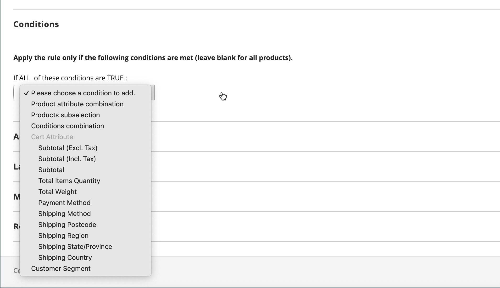
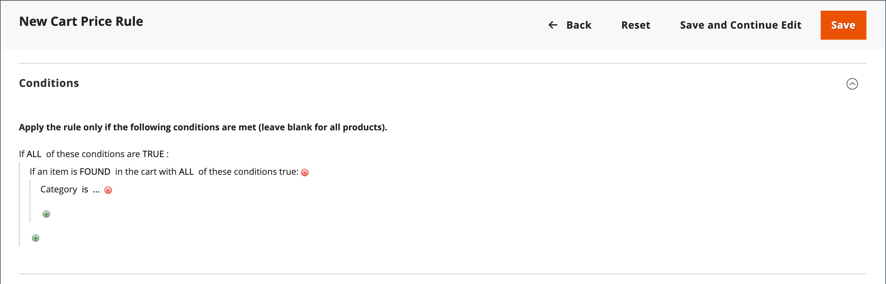
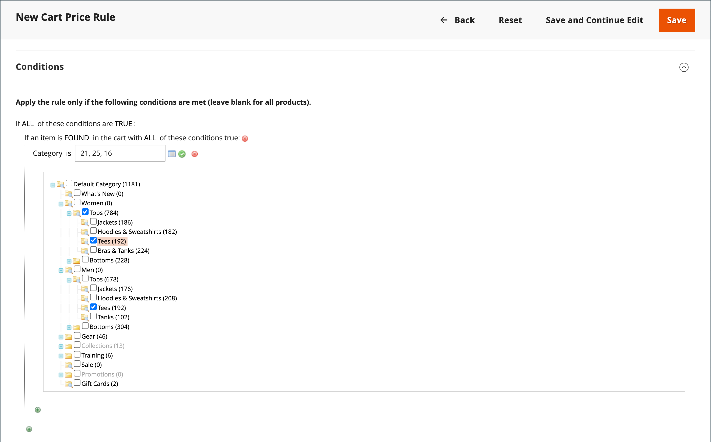
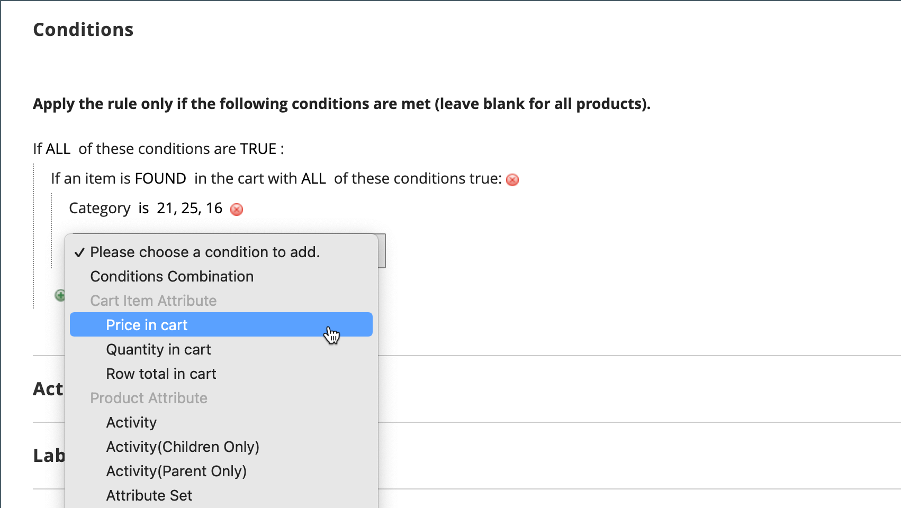
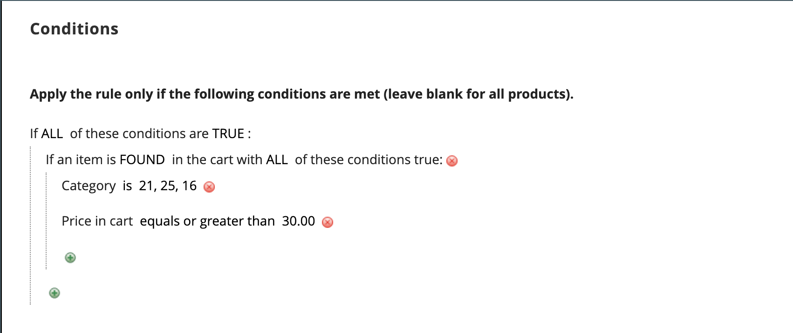
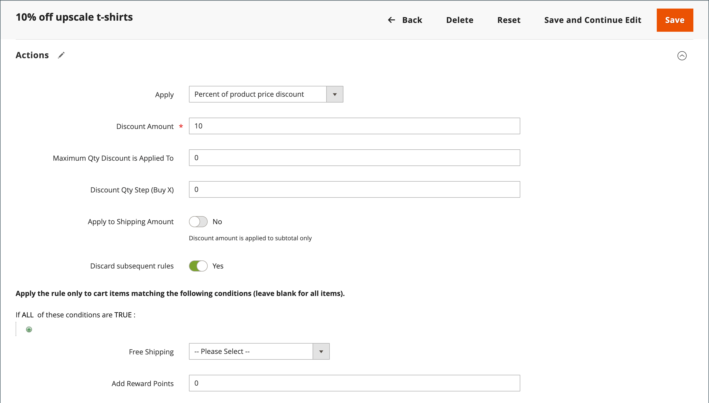

# Cart price rule example - discount with minimum product price

Cart price rules can be used to offer a percentage discount based on a minimum product price in the cart. In the following example, a 10% discount is applied to all products in the whole cart when at least 1 product with a price over $30.00 from a specified category is added to the cart. The format of the discount is as follows:

   X% whole cart off when at least 1 product is from Y category, and its price is over $Z dollars.

## Step 1. Create a cart rule

Follow the basic [instructions](price-rules-cart.md) to create a cart rule.

## Step 2. Define the conditions

1. Scroll down and expand  the **[!UICONTROL Conditions]** section.

1. Click _Add_ () and choose **[!UICONTROL Product Attribute Combination]**.

    {width="500" zoomable="yes"}

1. Click _Add_ () at the beginning of the next line and in the list under **[!UICONTROL Product Attribute]**, choose **[!UICONTROL Category]**.

    - Click the (**…**) _more_ link to display additional options.

      {width="600" zoomable="yes"}

    - Click the _Chooser_ () icon to see the available categories. In the category tree, select the checkbox of each category that you want to include. Click the check icon to accept the category selections.

      {width="600" zoomable="yes"}

1. Click _Add_ () at the beginning of the next line and do the following:

    - In the list under **[!UICONTROL Cart Item Attribute]**, choose **[!UICONTROL Price in cart]**.

      {width="500"}

    - Click **is** and choose `equals or greater than`.

    - Click **...** and enter the amount that the Price in Cart must be to meet the condition. For example, enter `30`.

        {width="500"}

1. Click **[!UICONTROL Save and Continue Edit]**.

## Step 3. Define the actions

1. Expand  the **[!UICONTROL Actions]** section and do the following:

    {width="600" zoomable="yes"}

    - Set **[!UICONTROL Apply]** to `Percent of product price discount`.

    - Enter the **[!UICONTROL Discount Amount]**. For example, enter `10` for a 10% discount.

    - To prevent additional promotions from being applied to the purchase, set **[!UICONTROL Discard subsequent rules]** to `Yes`.

1. Click **[!UICONTROL Save and Continue Edit]** and complete the rule as needed.

## Step 4. Complete the labels

Complete [Step 4](price-rules-cart.md) of the cart price rule instructions to enter any labels that appear during checkout.

## Step 5: Save and test the rule

{{new-price-rule}}

1. When your rule is complete, click **[!UICONTROL Save Rule]**.
1. Test the rule to make sure that it works correctly.
