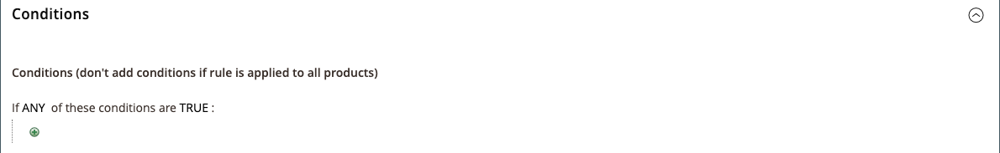
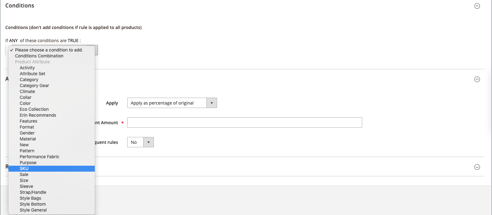
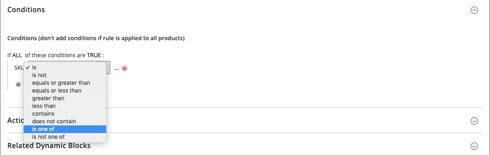
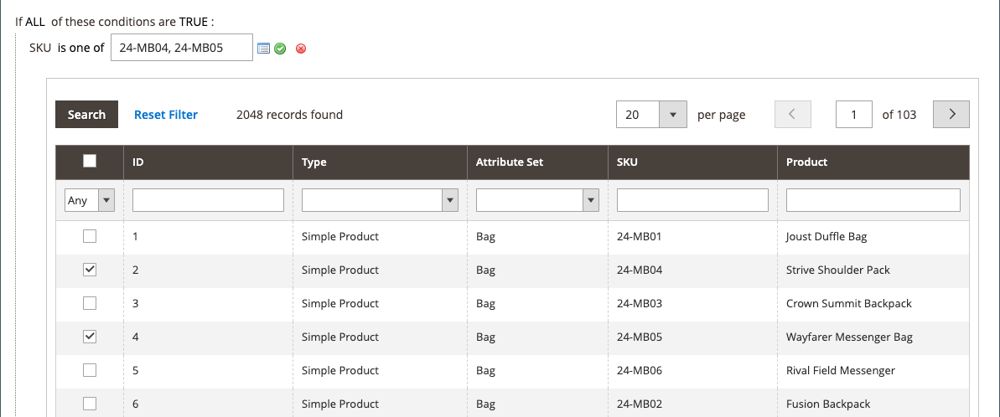

# Catalog price rule with multiple SKUs

A single catalog price rule can be applied to multiple SKUs, which makes it possible to create various promotions based on a product, brand, or category. When creating this rule, you want to set conditions that match the selected SKUs. When building the rule, you can easily browse and select SKUs from the grid.

## Step 1. Verify storefront properties of the product attribute

Before you begin, make sure that the [Storefront Properties](../catalog/attribute-product-create.md#step-4-describe-the-storefront-properties) of the `sku` attribute are set to `Use in Promo Rules`.

1. On the _Admin_ sidebar, go to **[!UICONTROL Stores]** > _[!UICONTROL Attributes]_ > **[!UICONTROL Product]**.

1. In the search filter at the top of the _[!UICONTROL Attribute Code]_ column, enter `sku` and click **[!UICONTROL Search]**.

1. Click to open the `sku` attribute in edit mode.

1. In the left panel, click **[!UICONTROL Storefront Properties]** and make sure that **[!UICONTROL Use for Promo Rule Conditions]** is set to `Yes`.

1. If you changed the value of the property, click **[!UICONTROL Save Attribute]**.

## Step 2. Apply a price rule to multiple SKUs

1. On the _Admin_ sidebar, go to **[!UICONTROL Marketing]** > _[!UICONTROL Promotions]_ > **[!UICONTROL Catalog Price Rules]**.

1. Do one of the following:

    - Follow the instructions to create a [catalog price rule](price-rules-catalog.md).
    - Open an existing catalog price rule.

1. Expand  the **[!UICONTROL Conditions]** section, and do the following:

    - In the first line, set the first parameter to `ANY`.

      <!-- zoom -->

    - Click _Add_ () at the beginning of the next line and in the list under **[!UICONTROL Product Attribute]**, click `SKU`.

      <!-- zoom -->

    - For the comparison, you have options. If you want to locate at least one from a list of SKUs, `select is one of`. If you want to locate a group of SKUs that all must be found to apply, select `is`. We recommend selecting `is one of`.

      <!-- zoom -->

    - To complete the condition, click the more (**…**) link and click the _Chooser_ () icon for the list of available products.

      <!-- zoom -->

    - Browse, filter, or search to find the SKUs you want to add. In the list, select the checkbox of each product that is to be included. Click **[!UICONTROL Save and Apply]** to add the SKUs to the condition.

      <!-- zoom -->

1. Complete the rule, including any [Actions](price-rules-catalog.md) to be taken when the conditions are met.

1. When your rule is complete, click **[!UICONTROL Save]**.

{{new-price-rule}}
