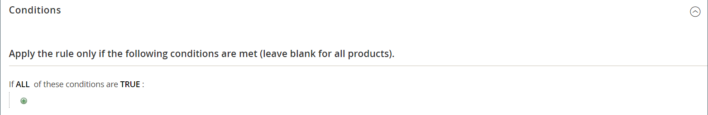
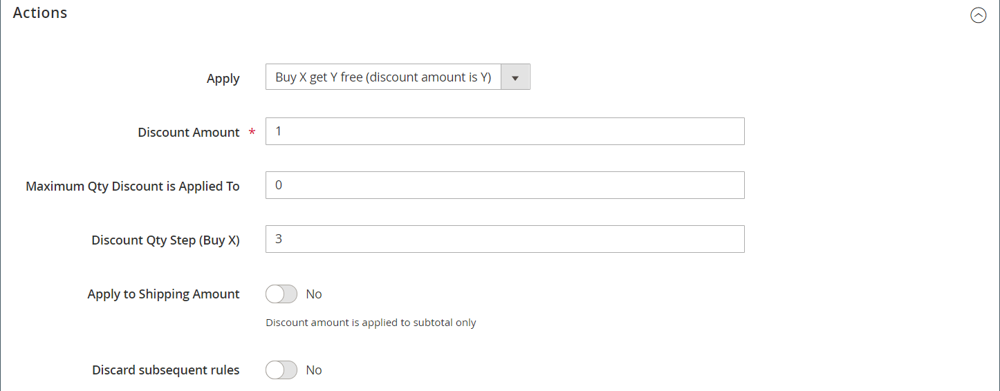
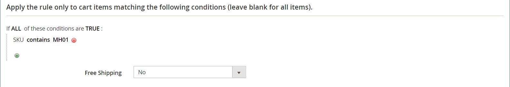

# Cart price rule example - buy this get that

This example shows how to set up a [cart price rule](price-rules-cart.md) for a _Buy this, get that free_ promotion. The format of the discount is as follows:

_Buy X quantity of product, get Y quantity for free_

## Step 1. Create a cart price rule

Complete [Step 1](price-rules-cart.md) of the cart price rule instructions to complete the rule information.

## Step 2. Define the conditions

Complete [Step 2](price-rules-cart.md) of the cart instructions to define the conditions for the price rule. This is the first of two conditions that can be added to the rule, and determines when the rule is triggered. It can be based on a combination of the following:

- Product attributes
- Products
- Cart attributes
-  (Adobe Commerce only) Customer segments

If left blank, the rule is triggered for every cart.

<!-- zoom -->

## Step 3. Define the actions

1. Expand  the **[!UICONTROL Actions]** section and do the following:

   - Set **[!UICONTROL Apply]** to `Buy X get Y free (_[!UICONTROL _[!UICONTROL Discount Amount]_]_ is Y)`.

   - Set **[!UICONTROL Discount Amount]** to `1`. This is the quantity that the customer receives for free.

   - To limit the number of discounts that can be applied when the condition is met, enter the number in the **[!UICONTROL Maximum Qty Discount is Applied To]** field. This is calculated using this [formula](#maximum-quantity-discount).

   - For **[!UICONTROL Discount Qty Step (Buy X)]**, enter the quantity that the customer must purchase to qualify for the discount. In this example, the customer must purchase three.

   - If you want to prevent other discounts from being applied to the purchase, set **[!UICONTROL Discard subsequent rules]** to `Yes`.

   <!-- zoom -->

1. To apply the rule only to specific items in the cart, complete the condition to describe the cart items and/or product attributes that are required for the promotion.

   The following example uses the SKU to apply the rule to all associated variations of a configurable product.

   <!-- zoom -->

1. To include **[!UICONTROL Free Shipping]**, choose `For matching items only`.

1. Click **[!UICONTROL Save and Continue Edit]** and complete the rest of the rule as needed.

## Step 4. Complete the label

Complete [Step 4](price-rules-cart.md) of the cart price rule instructions to enter the label that appears during checkout.

## Step 5: Save and test the rule

{{new-price-rule}}

1. When your rule is complete, click **[!UICONTROL Save Rule]**.

1. Test the rule to make sure that it works correctly.

## Variations

Buy X Get Y Free is processed as a single action, with a _row total_ dependency. All items must be from the same SKU to qualify for the promotion. For example:

   Buy X quantity of product from category A, get Y quantity of the same product for free.

To limit the free product to categories A, B, and C, set the action as follows:

   If ALL of these conditions are TRUE:
   Category is one of A, B, C

To limit the free items from any category (A, B, or C) and receive Y from SKUs (D123, E123, or F123), set the action as follows:

   If ALL of these conditions are TRUE:
   SKU is one of D123, E123, F123

## Maximum quantity discount

Use the following formula to determine the correct value for the Maximum Qty Discount:

   Formula = `(X+Y) * (M/Y)`
    Where
    `X` = number of items purchased
    `Y` = number of free items
    `M` = Maximum number of free items allowed

For example:

Buy five and get two free with a maximum of four free items allowed.

    Where
    X = 5
    Y = 2
    M = 4
    Maximum Qty Discount = (5+2)*(4/2)=(7)*(2)=14

Buy five and get three free with a maximum of nine free items allowed.

    Where
    X = 5
    Y = 3
    M = 9
    Maximum Qty Discount = (5+3)*(9/3)=24

Buy 20 and get two free with a maximum of 20 free items allowed.

    Where
    X = 20
    Y = 2
    M = 20
    Maximum Qty Discount = (20+2)*(20/2)=(22)*(10)=220
