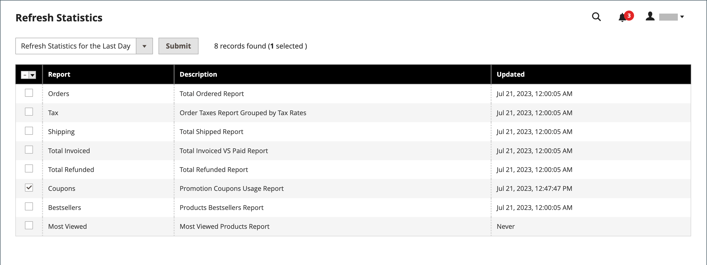

# Coupon codes

Coupons codes are used with [cart price rules](price-rules-cart.md) to apply a discount when a set of conditions is met. For example, a coupon code can be created for a specific customer group, or for anyone who makes a purchase over a certain amount. To apply the coupon to a purchase, the customer can enter the coupon code in the cart, or possibly at the cash register of your _brick and mortar_ store. Here are a few ways that you can use coupons in your store:

- Email coupons to customers
- Produce printed coupons
- Create in-store coupons for mobile users

Coupon codes can be sent by email, or included in newsletters, catalogs, and advertisements. The list of coupon codes can be exported and sent to a commercial printer. You can also create in-store coupons with a quick response code that shoppers can scan with their smart phones. The QR code can link to a page on your site with more information about the promotion.

## Configure coupon codes

The length and format of automatically generated coupon codes is controlled by the configuration. The characters can be set to all numbers, all letters, or a combination. You can insert a dash at set intervals to make it easy to read, and add a .prefix and suffix to associate the code with a specific campaign or initiative.

<!-- zoom -->

1. On the _Admin_ sidebar, go to **Stores** > _Settings_ > **Configuration**.

1. In the left panel, expand **Customers** and choose **Promotions**.

1. In the **Auto Generated Specific Coupon Codes** section, do the following:

   - Enter the **Code Length**, including prefix, sufix, and separators.

   - Set the **Code Format** to one of the following:

      - `Alphanumeric`
      - `Alphabetical`
      - `Numeric`

   - To add a **Code Prefix**, enter the value that you want to appear at the beginning of all coupon codes.

   - To add a **Code Suffix**, enter the value that you want to appear at the end of all coupon codes.

   - To insert a **Dash Every X Characters**, enter the number of characters between each dash. Coupon codes with different dash patterns are considered to be different codes, even if the numbers are the same.

1. When complete, click **Save Config**.

## Create coupons

>[!NOTE]
>
>Before you create coupons, use the [bin/magento cron:run](https://experienceleague.adobe.com/docs/commerce-operations/configuration-guide/cli/configure-cron-jobs.html#run-cron-from-the-command-line) command to verify that cron is running.

### Method 1: Create a specific coupon

1. Follow the instructions to create a [cart price rule](price-rules-cart.md).

1. In the **Rule Information** section, set **Coupon** to `Specific Coupon`.

1. Enter a **Coupon Code** to be used with the promotion.

   The format of the code as numeric, alphanumeric or alphabetical is determined by the [configuration](#configure-coupon-codes).

1. To limit the number of times the coupon can be used, do the following:

   - Enter the number of **Uses per Coupon**.
   - Enter the number of **Uses per Customer**.

   For unlimited use, leave these fields blank.

   <!-- zoom -->

   >[!NOTE]
   >
   >In case of simultaneous use of the same coupon by multiple customers at the same time, it is possible that the usage limit that is set could be exceeded due to delayed coupon processing.

1. To make the coupon valid for a period of time, do the following:

   -  (Magento Open Source only) Complete the **From** and **To** dates. To select the date, click the **Calendar** () icon next to each field. If you leave the date range empty, the rule does not expire.

   -  (Adobe Commerce only) Do one of the following:

      **Option 1:** Schedule a new update

      - Click **Schedule New Update** in the upper-right corner of the page.

        <!-- zoom -->

      - Enter the **Update Name** and **Description**.

      - Choose the **Start Date** and **End Date** from the Calendar (  ). If you leave the date range empty, the rule will not expire.

      - When complete, click **Save**.

        <!-- zoom -->

      **Option 2:** Assign to an existing update:

      - Select **Assign to Another Update**.

      - Find the update in the list, and click **Select**.

1. Complete the [cart price rule](price-rules-cart.md) as needed.

### Method 2: Generate a batch of coupons

The generation of discount coupons is an asynchronous operation, which executes in the background so that you can continue working in the Admin without waiting for the operation to finish. The system displays a message when the task is complete.

1. Follow the instructions to create a [cart price rule](price-rules-cart.md).

1. Under **Coupon Code**, select the **Use Auto Generation** checkbox.

1. To limit the number of times each customer can use the coupon, enter the number of **Uses per Customer**.

   <!-- zoom -->

   >[!NOTE]
   >
   >In case of simultaneous use of the same coupon by multiple customers at the same time, it is possible that the usage limit that is set could be exceeded due to delayed coupon processing.

1. Scroll down and expand  the **Manage Coupon Codes** section and do the following:

   <!-- zoom -->

   - For **Coupons Qty**, enter the number of coupons that you want to generate.

   - Enter the **Code Length**, not including the prefix, suffix, or separators.

   - Set the **Code Format** to one of the following:

      - `Alphanumeric`
      - `Alphabetical`
      - `Numeric`

   - (Optional) Enter a **Code Prefix** to be added to the beginning of the code.

   - (Optional) Enter a **Code Suffix** to be added to the end of the code.

   - (Optional) In the **Dash Every X Characters** field, enter the number of characters between each dash. For example, if the code is twelve characters long, and there is a dash every four characters, it will look like `xxxx-xxxx-xxxx`. Dashes make codes easier to read and enter.

1. When complete, click **Generate**.

   The system displays `Message is added to queue, wait to get your coupons soon`.

   After the cron job completes, the list of generated codes displays.

   <!-- zoom -->

| Field       | Description |
|-------------|-------------|
| Coupon Code | A unique code of coupon that was created and can be used for receiving special conditions. |
| Created     | The date when the coupon code was created.|
| Used        | Indicates if the coupon was used. |
| Times Used  | Indicates how many times the coupon code was used. |

You can export coupon codes to a CSV or Excel XML file by selecting the file format and clicking **Export**.

To delete coupon codes, select one or more codes from the list. Select `Delete` from the **Actions**  selector, and then click **Submit**.

>[!NOTE]
>
>Although Commerce allows configuring multiple coupon codes, a customer can use only one coupon code in the cart. To allow the use of more than one coupon code in the cart simultaneously, you could consider using a corresponding extension from [Commerce Marketplace](https://marketplace.magento.com/).

## Coupons report

The _Coupons_ report aggregates data from each coupon that is used during a specific date range. Because coupons are applied from the shopping cart, the report includes data from all redeemed coupons, regardless of [order status](https://docs.magento.com/user-guide/sales/order-status.html). As a result, the report might include both projected and actual totals. The report can be filtered for a specific store view, time period, order status, and cart price rule.

In the following example, the coupon code "H20" was used by two customers. One of the orders is invoiced, but the other is still _pending_. The projected Sales Subtotal, Sales Discount, and Sales Total columns show the aggregated amounts from both orders, but only the actual invoiced order appears in the Subtotal, Discount, and Total columns. Each row in the report represents a single coupon promotion.

<!-- zoom -->

### Run the report

1. On the _Admin_ sidebar, go to **Reports** > _Sales_ > **Coupons**.

1. If you have multiple store views, set **Store View** in the upper-left corner to establish the scope of the report.

1. To refresh the sales [statistics](https://docs.magento.com/user-guide/reports/statistics.html) for the day, click the _Last Updated_ message at the top of the workspace.
   
   Next, click to select the **Coupons** checkbox and click **Refresh**.

   <!-- zoom -->

1. To filter the data, do the following:

   <!-- zoom -->

   - Set **Date Used** to one of the following:

      - `Order Created`
      - `Order Updated`

        The Order Updated report is created in real-time and does not require a refresh.

   - To define the period of time covered by the report, set **Period** to one of the following:

      - `Day`
      - `Month`
      - `Year`

   - To define the date range of the report, enter the **From** and **To** dates in M/D/YY format.

   - To print a report for a specific [order status](https://docs.magento.com/user-guide/sales/order-status.html), set **Order Status** to `Specified` and choose the order status from the list.

   - To omit rows without data from the report, set **Empty Rows** to `No`.

   - To define coupon activity included in the report, do one of the following:

      - To include all coupon activity from all price rules, set **Cart Price Rule** to `Any`.
      - To include only activity related to a specific price rule, set **Cart Price Rule** to `Specified` and select the cart price rule in the list.

1. When ready to run the report, click **Show Report**.

   The report appears at the bottom of the page.

### Filter options

|Field|Description|
|--- |--- |
|Date Used |Identifies the date field that is used as the basis of the report. Options: **Order Created**: Generates the report based on the date the order was placed by the customer. To ensure that the most current data is included, click the link in the message to refresh statistics.  **Order Updated**: Generates the report based on the date orders were last updated. This report uses real-time data and does not require statistics to be refreshed.|
|Period|Determines the type of date range that is used for the report. Options: Day / Month / Year|
|From|Indicates the first date in the range of order data that is included in the report.|
|To|Indicates the last date in the range of order data that is included in the report.|
|Order Status|Filters the report by order status. The report can be generated for all orders or can be limited to a specific order status. Options:  **Any**: Includes all orders regardless of status.  **Specified**: Includes only orders with the specified status. Canceled orders are not included in the report.|
|Empty Rows|Determines if the report includes any rows of empty data that might be retrieved. Options: Yes / No|
|Cart Price Rules|Determines which coupon promotions are included in the report. Options: **Any**: Includes order information for any coupon promotion that was used during the specified date range. **Specified**: Includes only order information for the selected coupon promotion during the specified date range.|

### Report columns

|Column|Description|
|--- |--- |
|Interval|Indicates the date range of coupon usage to be included in the report. The interval can be a specific day, month, or year, or range of dates. The interval date is formatted as in the following examples, according to the value set in **Period** setting: Day: 6/21/19 Month: 6/2019 Year: 2019|
|Coupon Code|The Discount Code that is entered by customers in the shopping cart to receive the discount.|
|Price Rule|The name of the price rule that is associated with the coupon.|
|Uses|The number of times the coupon has been used during the date range specified for the report.|
|Sales Subtotal|The projected Subtotal from all orders that were placed with the coupon.  The Sales Subtotal represents the aggregated Subtotal from all qualifying orders and includes `Pending` sales orders that are not yet invoiced.|
|Sales Discount|The projected Discount amount from all orders that were placed with the coupon.  The Discount represents the aggregated discount amount from all qualifying orders and includes `Pending` sales orders that are not yet invoiced.|
|Sales Total|The projected Grand Total from all orders that were placed with the coupon. The Sales Total includes any shipping and handling fees, less the discount amount.  The Sales Total represents the aggregated Grand Total amount from all qualifying orders and includes `Pending` sales orders that are not yet invoiced. The value includes the Subtotal plus Shipping and Handling, less the Discount, plus Tax.   Calculated by: `((Subtotal + Shipping & Handling) - Discount) + Tax` |
|Subtotal|The aggregated Subtotal from all invoiced orders that used the coupon.|
|Discount|The aggregated Discount from all invoiced orders that used the coupon.|
|Total|The aggregated Order Total from all invoiced orders that used the coupon.|
