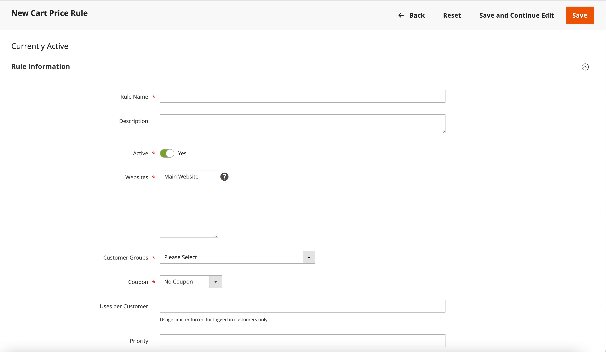
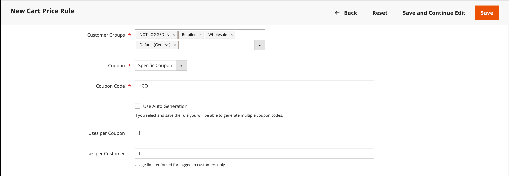
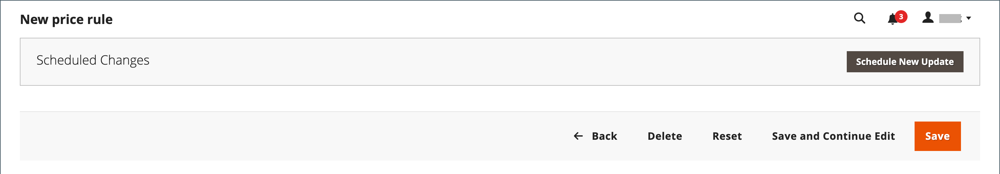
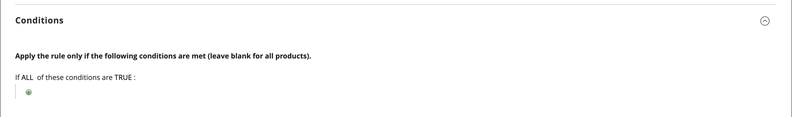
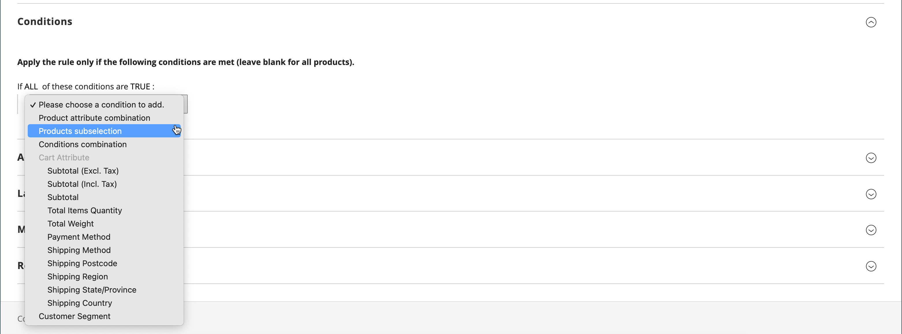
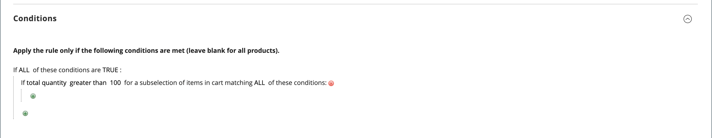
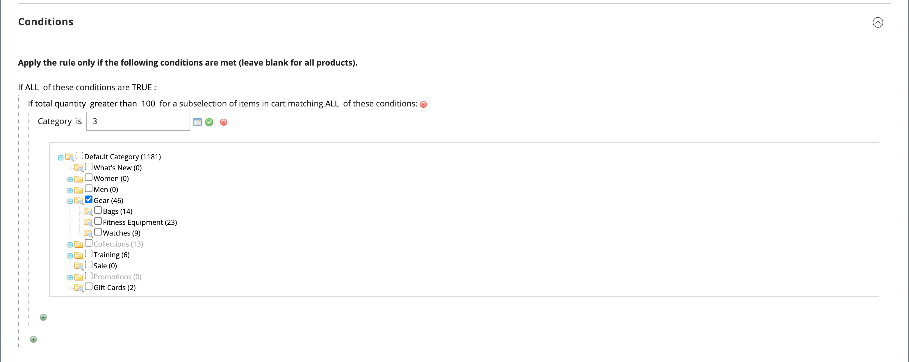
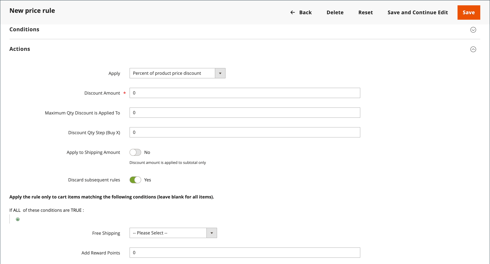
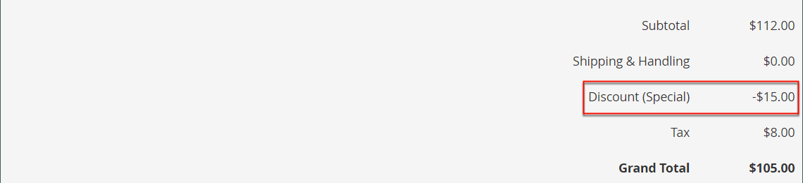
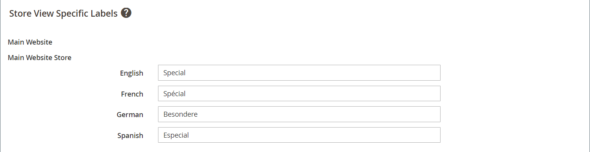

# Create a cart price rule

Complete the following steps to add a rule, describe the conditions, and define the actions. Also complete the labels and test the rule. Price rule conditions can be based on cart or [product attributes](../catalog/product-attributes.md) or [Real-Time CDP Audiences](#use-real-time-cdp-audiences-to-set-a-condition), but not on [customizable options](../catalog/settings-advanced-custom-options.md).

## Step 1: Add a rule

1. On the _Admin_ sidebar, go to **[!UICONTROL Marketing]** > _[!UICONTROL Promotions]_ > **[!UICONTROL Cart Price Rules]**.

1. Click **[!UICONTROL Add New Rule]** and do the following:

   - Under _[!UICONTROL Rule Information]_, complete the **[!UICONTROL Rule Name]** and **[!UICONTROL Description]**.

   - If you do not want the rule to go into effect immediately, set **[!UICONTROL Active]** to `No`.

   {width="600" zoomable="yes"}

1. To establish the [scope](../getting-started/websites-stores-views.md#scope-settings) of the rule, do the following:

   - Select the **[!UICONTROL Websites]** where the promotion is to be available.

   - Select the **[!UICONTROL Customer Groups]** to which the promotion applies.

      If you want the promotion to be available only to registered customers, **_do not_** choose the `NOT LOGGED IN` option.

1. Set the rule to apply with or without a [coupon](price-rules-cart-coupon.md) as follows:

   - To have the cart rule applied without the use of a coupon code, set **[!UICONTROL Coupon]** to `No Coupon` and skip to step 5.

   - To associate a coupon with a price rule, set **[!UICONTROL Coupon]** to `Specific Coupon` and do the following:

      - Enter a free-text **[!UICONTROL Coupon Code]** that the customer must enter to receive the discount.

      - To set a limit on the number of times the coupon can be used, complete the following options:

      |Option|Description|
      |------|-----------|
      |`Uses per Coupon` |Determines how many times that the coupon code can be used. If there is no limit, leave the field blank. |
      |`Uses per Customer` |Determines how many times that the cart price rule can be used by the same registered customer who belongs to any of the selected customer groups. The setting does not apply to guest shoppers who are members of the NOT LOGGED IN customer group, or to customers who shop without logging in to their accounts. If there is no limit, leave the field blank. |

      {style="table-layout:auto"}

      To learn more, see [Coupon Codes](price-rules-cart-coupon.md).

      {width="600" zoomable="yes"}

   -  (Magento Open Source only) Use the _Calendar_ () to choose the **[!UICONTROL From]** and **[!UICONTROL To]** date range for the promotion.

1. Enter a number to define the **[!UICONTROL Priority]** of this price rule in relation to the Action settings of other price rules which are active at the same time.

   >[!NOTE]
   >
   >The Priority setting is important when two cart rules/coupon codes are valid for the same product at the same time. The rule with the highest Priority setting (`1` being the highest) controls the cart action. See _Discard Subsequent Price Rules_ in the _Define the Actions_ step.

   >[!NOTE]
   >
   >Cart price rules that have the same priority do not result in a combined discount. Each rule is applied to matching products separately, one-by-one.

1. To apply the rule to published [RSS feeds](social-rss.md#rss-feeds), set **Public In RSS Feed** to `Yes`.

1. Click **[!UICONTROL Save and Continue Edit]**.

   -  (Magento Open Source only) After the rule is saved, the name of the cart price rule appears at the top of the page.

   -  (Adobe Commerce only) After the rule is saved, the name of the cart price rule and the [Scheduled Changes](price-rule-cart-scheduled-changes.md) box appears at the top of the page.

      {width="600" zoomable="yes"}

## Step 2: Describe the conditions

In this step, the conditions are described that must be met for an order to qualify for the promotion. The rule goes into action whenever the set of conditions is met.

If you are using audiences from Real-Time CDP, skip to [this section](#use-real-time-cdp-audiences-to-set-a-condition).

>[!NOTE]
>
>The cart price rule is applied to **_each_** product in the shopping cart whenever the set of conditions in the _[!UICONTROL Conditions]_ tab is met. Add conditions in the _[!UICONTROL Actions]_ tab to limit the number of products affected by the cart price rule.

>[!NOTE]
>
>If at least one conditional product attribute has an empty value, the cart price rule is not applied to the product.

1. In the left panel, select **[!UICONTROL Conditions]**.

   {width="600" zoomable="yes"}

   The first condition appears by default, and states:

   `If **ALL** of these conditions are **TRUE**:`

   The statement has two bold links that you can click to display the selection of options for that part of the statement. You can create different conditions by changing the combination of these values. Do any of the following:

   - Click **[!UICONTROL ALL]** and select `ALL` or `ANY`.
   - Click **[!UICONTROL TRUE]** and select `TRUE` or `FALSE`.
   - Leave the condition unchanged to apply the rule to all products.

1. Click _Add_ () at the beginning of the next line and select an option for the condition, such as cart attribute, product subselection, or combination.

   For this example, complete the next part of the condition as follows:

   - When prompted to **[!UICONTROL Choose the condition to add]**, choose `Products Subselection`.

      {width="600" zoomable="yes"}

   - In the condition statement, click **[!UICONTROL total quantity]** and select `total quantity` or `total amount`.

   >[!IMPORTANT]
   >
   >[!UICONTROL Total amount] is a row total, so taxes are not included into the `total amount` for the [!UICONTROL Products Subselection] cart price rule condition. Use the [!UICONTROL Subtotal (Incl. Tax)] condition to include taxes.

   - In the condition statement, click **[!UICONTROL is]** and select `greater than`.

1. When the next part of the condition appears, click the elements of the statement so you can see where each link with variable values is located.

1. Click the "more" (...) link, and enter `100`.

   This condition requires the total quantity of the cart to be `101` or greater.

   {width="600" zoomable="yes"}

1. Click **Add** () at the beginning of the next line, and then add a condition that is based on **Category**.

   {width="600" zoomable="yes"}

1. In the next part of the condition, click the _more_ (**...**) link to display the input field, and then open the _Chooser_ () to display the category tree.

1. Select the checkbox of the category that you want to use as a condition for the price rule and click the  icon to accept the category selections.

   The condition can be based on any category that is a child of the store's [root category](../catalog/category-root.md).

   {width="600" zoomable="yes"}

1. To add more conditions, click _Add_ () and define another condition.

   You can repeat the process as many times as needed to describe the conditions that must be met for the price rule. Here are some examples:

   **Example 1:** Regional Price Rule

   To create a regional price rule, use one of the following cart attributes:

   - `Shipping Postcode`
   - `Shipping Region`
   - `Shipping State/Province`
   - `Shipping Country`

   **Example 2:** Shopping Cart Totals

   To base the condition on shopping cart totals, use one of the following cart attributes:

   - `Subtotal`
   - `Total Items Quantity`
   - `Total Weight`

>[!NOTE]
>
>In a case of multiple parallel promotions, the _Subtotal_ condition is applied to the _base_ shopping cart subtotal **_before_** any discounts.

>[!IMPORTANT]
>
>**For purchase orders only**: When a cart price rule is set based on one or more specific payment methods, the discount is applied to the total when a purchase order is created. After the purchase order is created, the discount remains applied to the total if the payment method is changed to one that is not covered by the cart price rule.

### Add a product attribute to cart price rules

1. Go to **[!UICONTROL Stores]** > _[!UICONTROL Attributes]_ > **[!UICONTROL Product]** and open the product attribute.

1. In the left panel, select **[!UICONTROL Storefront Properties]**.

1. Set **[!UICONTROL Use for Promo Rule Conditions]** to `Yes`.

1. Click **[!UICONTROL Save Attribute]**.

1. Go to **[!UICONTROL Marketing]** > **[!UICONTROL Cart Price Rules]** and open the required cart price rule.

1. Expand  the **[!UICONTROL Condition]** section and select **[!UICONTROL Product attribute combination]**.

1. Set this condition to one of the following values:

   - Click **[!UICONTROL FOUND]** and select `FOUND` or `NOT FOUND`.

   - Click **[!UICONTROL ALL]** and select `ALL` or `ANY`.

1. Click the _Add_ () icon and select the **[!UICONTROL Product Attribute]** that you set up for promotional rule conditions.

1. Click **[!UICONTROL Save]**.

>[!NOTE]
>
>When using the `is not one of` condition with a _SKU_ product attribute and configurable product, both the parent and child product SKUs must be selected. To avoid listing all child SKUs in the rule, you can use the `does not contain` condition with common SKU parts of a configurable product and its child products.

### Use Real-Time CDP audiences to set a condition

You can set a condition for a cart price rule based on a Real-Time CDP [audience](../customers/audience-activation.md).

1. Expand **[!UICONTROL Conditions]**, click the "+" icon, and select **[!UICONTROL Real-Time CDP Audience]** from the list.

   {width="300"}

1. Select the _More_ (**...**) icon, click **[!UICONTROL Open Chooser]**, and view all available Real-Time CDP audiences.

   {width="600" zoomable="yes"}

1. Select the Real-Time CDP audience you want to use for the cart price rule.

   |Option|Description|
   |------|-----------|
   |`ID`|An internal identifier of the audience used within the Admin|
   |`Real-Time CDP Audience ID`|Unique identifier of the audience when it was created in Experience Platform|
   |`Name` |Name of the audience, such as `Orders over $50`|
   |`Description`|Description of the audience, such as `People who placed an order over $50 in the last month.`.|
   |`Source`|Indicates where the audience came from, such as `Experience Platform`.|
   |`Website`|Indicates which website you have linked to the datastream that contains the audiences. You create this link when you connect your Commerce instance to the Experience Platform through the [[!DNL Data Connection]](https://experienceleague.adobe.com/docs/commerce-merchant-services/data-connection/fundamentals/connect-data.html) extension.|

   {style="table-layout:auto"}

In the next step, you define the action to occur when the condition is met.

## Step 3: Define the actions

The shopping cart price rule actions describe how prices are updated when the conditions are met.

1. Scroll down to **[!UICONTROL Actions]**, and expand  the section.

   {width="600" zoomable="yes"}

1. Set **[!UICONTROL Apply]** to one of the following discount options:

   |Option|Description|
   |------|-----------|
   |`Percent of product price discount` |Discounts item by subtracting a percentage from the original price. The discount applies to each qualifying item in the cart. For example: Enter `10` in [!UICONTROL Discount Amount] for an updated price that is 10% less than the original price. |
   |`Fixed amount discount` |Discounts item by subtracting a fixed amount from the original price of each qualifying item in the cart. For example: Enter `10` in [!UICONTROL Discount Amount] for an updated price that is $10 less than the original price. |
   |Fixed amount discount for whole cart |Discounts the entire cart by subtracting a fixed amount from the cart total. For example: Enter 10 in [!UICONTROL Discount Amount] to subtract $10 from the cart total. By default, the discount applies only to the cart subtotal. To apply the discount to the subtotal and shipping separately, use the _[!UICONTROL Apply to Shipping Amount]_ option. |
   |`Buy X get Y free` |Defines a quantity X that the customer must purchase to receive a quantity Y **of the same product/variation** for free. (The [!UICONTROL Discount Amount] is Y.) A total quantity of X+Y of that same item must be present in/added to the cart for the discount to be applied. |

   {style="table-layout:auto"}

   - Enter the **[!UICONTROL Discount Amount]** as a number, without symbols. For example, depending on the discount option selected, the number 10 might indicate a percentage, a fixed amount, or a quantity of items.

   - For a _Buy X get Y Free_ discount, enter the quantity in the **[!UICONTROL Discount Qty Step (Buy X)]** field of a single product/SKU/line item that the customer must purchase to receive the discount on the Y quantity. Both X and Y refer to quantities of the same SKU, and that specific quantity (variations of a configurable products are counted separately) of the item must be added to the cart manually.

   - In the **[!UICONTROL Maximum Qty Discount is Applied To]** field, enter the maximum quantity of the same product that can qualify for the discount in the same purchase.

   - Set **[!UICONTROL Apply to Shipping Amount]** () as follows:

      |Option|Description|
      |------|-----------|
      |`Yes` |Applies the discount amount separately to the subtotal and shipping amounts. |
      |`No` |Applies the discount amount only to the subtotal. |

      {style="table-layout:auto"}

   - To stop processing other rules after this rule is applied, set **[!UICONTROL Discard Subsequent Rules]** () to `Yes`. This setting prevents multiple discounts from being applied to the same product.

      |Option|Description|
      |------|-----------|
      |`Yes` |Prevents any other pricing rules that may apply to a product from being applied. When multiple pricing rules apply to the same product, only the pricing rule with the highest defined priority (in a rule [!UICONTROL Priority] field) is applied to the qualifying product. This prevents multiple pricing rules from stacking and providing unintended additional discounts. |
      |`No` |Allows multiple pricing rules to apply to the same product. This could result in stacking and providing multiple discounts applied to your listing price. |

      {style="table-layout:auto"}

      >[!IMPORTANT]
      >
      >To discard subsequent rules, a pricing rule must use the defined priorities that are set in the Priority field of each rule, and multiple rules should not have the same priority defined . See **[!UICONTROL Priority]** in the _Add a New Rule_ step.

1. To define the **_exact_** products in the shopping cart that are affected by the cart price rule, add the **_additional_** conditions that are needed for the action.

   To determine if free shipping is applied to orders that meet the conditions, set **[!UICONTROL Free Shipping]** to one of the following:

   |Option|Description|
   |------|-----------|
   |`No` |Free shipping is not available. |
   |`For matching items only` |Free shipping is available only for items that match the conditions of the rule. |
   |`For shipment with matching items` |Free shipping is available for any shipment that includes matching items. The [Free Shipping](../stores-purchase/shipping-free.md) delivery method must be enabled to use this option. |

   {style="table-layout:auto"}

1.  (Adobe Commerce only) For **[!UICONTROL Add Rewards Points]**, enter the fixed number of points the customer earns **_once_** per order whenever the cart price rule is applied. 

   If reward points are not enabled, leave this field blank.

1. When complete, click **[!UICONTROL Save and Continue Edit]**.

## Step 4: Complete the labels

The label appears in the totals section of the order to identify the discount. The label text is enclosed in parentheses, after the word `Discount`. You can enter a default label for all store views, or enter a different label for each view.

{width="600"}

1. Scroll down to **[!UICONTROL Labels]**, and expand the section.

1. Enter the text that you want used as the **[!UICONTROL Default Rule Label for All Store Views]**.

   {width="600" zoomable="yes"}

1. If your store has multiple views, or multiple websites with multiple views, enter the appropriate label text for each. 

   For example, if each store view is in a different language, enter the translation of the label for each view.

   {width="600" zoomable="yes"}

## Step 5: Add related dynamic blocks (optional)

{{ee-feature}}

[Dynamic Blocks](../content-design/dynamic-blocks.md) that are associated with the rule appear in the storefront whenever the conditions are met.

1. Expand  the **[!UICONTROL Related Dynamic Blocks]** section.

1. Use the [search filters](../getting-started/admin-workspace.md) to locate the blocks that you want to associate with the rule.

1. Select the checkbox in the first column to associate the block with the rule.

   To learn more, see [Dynamic Blocks in Price Rules](../content-design/dynamic-blocks-price-rules.md).

## Step 6: Save and test the rule

1. When complete, click **[!UICONTROL Save Rule]**.

1. Test the rule to make sure that it works correctly.

   Price rules are automatically processed with other system rules each night. When you create a price rule, allow enough time for it to get into the system. Also test the rule to make sure that it works correctly. As new rules are added, Commerce recalculates the prices and the priorities accordingly.

## Cart price rule demo

Watch this video to learn about creating cart price rules:

>[!VIDEO](https://video.tv.adobe.com/v/343835?quality=12)

## Field descriptions

### [!UICONTROL Rule Information]

|Field|Description|
|--- |--- |
|[!UICONTROL Rule Name]|(Required) The name of the rule is for internal reference.|
|[!UICONTROL Description]|A description of the rule should include the purpose of the rule, and explain how it is used.|
|[!UICONTROL Active]|(Required) Determines if the rule is active in the store. Options: `Yes` / `No`|
|[!UICONTROL Websites]|(Required) Identifies the websites where the rule can be used.|
|[!UICONTROL Customer Groups]|(Required) Identifies the customer groups to which the rule applies.|
|[!UICONTROL Coupon]|(Required) Indicates if a coupon is associated with the rule. Options:  **[!UICONTROL No Coupon]** - No coupon is associated with the rule.  **[!UICONTROL Specific Coupon]** - A specific coupon is associated with the rule.  **[!UICONTROL Coupon Code]** - When prompted, enter the Coupon Code that the customer must enter to take advantage of the promotion.  **[!UICONTROL Use Auto Generation]** - Select the checkbox to automatically generate multiple coupon codes that can be used with the promotion.  **[!UICONTROL Auto]** - Displays the _[!UICONTROL Manage Coupon Codes]_ section to define the format of the  coupon codes to be generated.|
|[!UICONTROL Uses per Coupon]|Determines how many times that the coupon code can be used. If there is no limit, leave the field blank.|
|[!UICONTROL Uses per Customer]|Determines how many times that the cart price rule can be used by the same registered customer who belongs to any selected customer group. Does not apply to guest shoppers who are members of the NOT LOGGED IN customer group, or to customers who shop without logging in to their accounts. For no limit, leave blank.|
|[!UICONTROL Priority]|A number that indicates the priority of this rule in relation to others. The highest priority is number `1`.|
|[!UICONTROL Public in RSS Feed]|Determines if the promotion is included in your store's public RSS feed. Options:  `Yes` / `No`|
|[!UICONTROL From]| (Magento Open Source only) The first date the coupon can be used.|
|[!UICONTROL To]| (Magento Open Source only) The last date the coupon can be used.|

{style="table-layout:auto"}

### [!UICONTROL Conditions]

Specifies the conditions that must be met before the cart price rule goes into action. If left blank, the rule applies to all products in the cart. Conditions can be based on any combination of cart and product attributes. However, [customizable options](../catalog/settings-advanced-custom-options.md) cannot be referenced in cart price rule conditions.

|Field|Description|
|--- |--- |
|[!UICONTROL **Cart Item Attribute**]||
|[!UICONTROL Price in cart]|Product price. Will pass if product meets product price in cart condition.|
|[!UICONTROL Quantity in cart]|Product quantity. Will pass if product meets product quantity in cart condition.|
|[!UICONTROL Row total in cart]|Product row total. Will pass if product meets product row total in cart condition.|
|[!UICONTROL **Product Attribute**]||
|[!UICONTROL Attribute Set]|Product attribute set. Will pass if product meets product attribute condition.|
|[!UICONTROL Category]|Product category. Will pass if either the product itself or its child product meets the category condition.|
|[!UICONTROL Category (Children Only)]|Child product category. Will pass if only the product children meet the category condition (the product itself is not checked here).|
|[!UICONTROL Category (Parent Only)]|Parent product category. Will pass if only the product itself meets the category condition (children products are not checked here).|
|[!UICONTROL **Cart Attribute**]||
|[!UICONTROL Subtotal (Excl. Tax)]|Cart subtotal (excluding tax). Will pass if shopping cart meets subtotal (excluding tax) condition.|
|[!UICONTROL Subtotal (Incl. Tax)]|Cart subtotal (including tax). Will pass if shopping cart meets subtotal (including tax) condition.|
|[!UICONTROL Subtotal]|Cart subtotal. Will pass if shopping cart meets subtotal condition. Will include or exclude tax according to the current tax settings.|
|[!UICONTROL Total Items Quantity]|Total quantity of all products in the shopping cart. Will pass if shopping cart meets total items quantity condition.|
|[!UICONTROL Total Weight]|Total weight of all products in the shopping cart. Will pass if shopping cart meets total weight condition.|
|[!UICONTROL Payment Method]|Payment method selected on checkout. Will pass if payment method condition is met.|
|[!UICONTROL Shipping Method]|Shipping method selected on checkout. Will pass if shipping method condition is met.|
|[!UICONTROL Shipping Postcode]|Shipping address postcode. Will pass if shipping address meets postcode condition.|
|[!UICONTROL Shipping Region]|Shipping address region. Will pass if shipping address meets region condition.|
|[!UICONTROL Shipping State/Province]|Shipping address state/province. Will pass if shipping address meets state/province condition.|
|[!UICONTROL Shipping Country]|Shipping address country. Will pass if shipping address meets country condition.|
|[!UICONTROL Customer Segment]|Will pass if registered or guest customer meets customer segment condition.|

### [!UICONTROL Actions]

|Field|Description|
|--- |--- |
|[!UICONTROL Apply]|Determines the type of calculation that is applied to the purchase. Options:  **[!UICONTROL Percent of product price discount]** - Discounts item by subtracting a percentage from the original price. For example: Enter `10` in _[!UICONTROL Discount Amount]_ for an updated price that is 10% less than the original price.  **[!UICONTROL Fixed amount discount]** - Discounts item by subtracting a fixed amount from the original price of each qualifying item in the cart. For example: Enter `10` in _[!UICONTROL Discount Amount]_ for an updated price that is $10 less than the original price.  **[!UICONTROL Fixed amount discount for whole cart]** - Discounts the entire cart by subtracting a fixed amount from the cart subtotal. For example: Enter `10` in _[!UICONTROL Discount Amount]_ to subtract $10 from the cart subtotal. By default, the discount applies only to the cart subtotal. To apply the discount to the subtotal and shipping separately, see _Apply to Shipping Amount_.  **[!UICONTROL Buy X Get Y Free (discount amount is Y)]** - Defines a  quantity that the customer must purchase to receive a quantity for free. (The _[!UICONTROL Discount Amount]_ is Y.)|
|[!UICONTROL Discount Amount]|(Required) The amount of discount that is offered.|
|[!UICONTROL Maximum Qty Discount is Applied To]|Sets the maximum number of products that the discount can be applied to in the same purchase.|
|[!UICONTROL Discount Qty Step (Buy X)]|Sets the number of products represented by `X` in a `Buy X Get Y Free` promotion.|
|[!UICONTROL Apply to Shipping Amount]|Determines if the discount is applied separately to the subtotal and shipping amounts. Otherwise, it is applied only to the subtotal. Options: `Yes` / `No`|
|[!UICONTROL Discard Subsequent Rules]|Determines if lower priority rules (1 is the highest priority) can be applied to the product when this cart price rule is a match. Enable this option to prevent multiple discounts from being applied to the same product. Options: `Yes` / `No`|
|[!UICONTROL Free Shipping]| Determines if free shipping is included in the promotion, and if so, for which items. Options:  **[!UICONTROL No]** - Free shipping is not available for the current rule.  **[!UICONTROL For matching items only]** - Free shipping is available only for specific items in the cart that match the rule.  **[!UICONTROL For shipment with matching items]** - Free shipping is available for all items in the cart. The [Free Shipping](../stores-purchase/shipping-free.md) delivery method must be enabled to use this option.|
|[!UICONTROL Add Reward Points]| (Adobe Commerce only) Specifies the number of [reward points](rewards-loyalty.md) that are earned by the customer whenever the price rule is applied.|

{style="table-layout:auto"}

### [!UICONTROL Labels]

|Field|Description|
|--- |--- |
|[!UICONTROL Default Rule Label for All Store Views]|A default label that identifies the discount and can be used for all store views.|
|[!UICONTROL Store View Specific Labels]|If applicable, specifies a different label to identify the discount for each store view.|

{style="table-layout:auto"}

### [!UICONTROL Related Dynamic Blocks]

{{ee-feature}}

Identifies any [dynamic blocks](../content-design/dynamic-blocks.md) that are associated with the rule.
