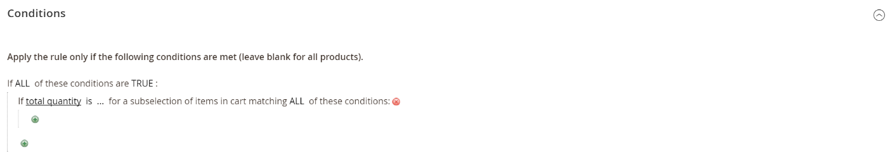

# Create a cart price rule

Complete the following steps to add a new rule, describe the conditions, and define the actions. Also complete the labels and test the rule.  Price rule conditions can be based on cart or [product attributes](../catalog/product-attributes.md), but not on [customizable options](../catalog/settings-advanced-custom-options.md).

## Step 1: Add a rule

1. On the _Admin_ sidebar, go to **Marketing** > _Promotions_ > **Cart Price Rules**.

1. Click **Add New Rule** and do the following:

   - Under **Rule Information**, complete the **Rule Name** and **Description**.

   - If you do not want the rule to go into effect immediately, set **Active** to `No`.

    <!-- zoom -->

1. To establish the [scope](../getting-started/websites-stores-views.md#scope-settings) of the rule, do the following:

   - Select the **Websites** where the promotion is to be available.

   - Select the **Customer Groups** to which the promotion applies.

      If you want the promotion to be available only to registered customers, **do not** choose the `NOT LOGGED IN` option.

1. Set the rule to apply with or without a [coupon](price-rules-cart-coupon.md) as follows:

   - To have the cart rule applied without the use of a coupon code, set **Coupon** to `No Coupon` and skip to step 5.

   - To associate a coupon with a price rule, set **Coupon** to `Specific Coupon` and do the following:

      - Enter a free-text **Coupon Code** that the customer must enter to receive the discount.

      - To set a limit on the number of times the coupon can be used, complete the following options:

      |Option|Description|
      |------|-----------|
      |Uses per Coupon |Determines how many times the coupon code can be used. If there is no limit, leave the field blank. |
      |Uses per Customer |Determines how many times the coupon code can be used by the same registered customer who belongs to any of the selected customer groups. The setting does not apply to guest shoppers who are members of the NOT LOGGED IN customer group, or to customers who shop without logging in to their accounts. If there is no limit, leave the field blank. |

        To learn more, see [Coupon Codes](price-rules-cart-coupon.md).

        <!-- zoom -->

   -  (Magento Open Source only) Use the **Calendar** () to choose the **From** and **To** date range for the promotion.

1. Enter a number to define the **Priority** of this price rule in relation to the Action settings of other price rules which are active at the same time.

   >[!NOTE]
   >
   >The Priority setting is important when two cart rules/coupon codes are valid for the same product at the same time. The rule with the highest Priority setting (1 being the highest) will control the cart action. See **Discard Subsequent Price Rules** in the **Define the Actions** step.

1. To apply the rule to published [RSS feeds](social-rss.md#rss-feeds), set **Public In RSS Feed** to `Yes`.

1. Click **Save and Continue Edit**.

   -  (Magento Open Source only) After the rule is saved, the name of the cart price rule appears at the top of the page.

   -   (Adobe Commerce only) After the rule is saved, the name of the cart price rule and the [Scheduled Changes](price-rule-cart-scheduled-changes.md) box appears at the top of the page.

      <!-- zoom -->

## Step 2: Describe the conditions

In this step, the conditions are described that must be met for an order to qualify for the promotion. The rule goes into action whenever the set of conditions is met.

1. In the left panel, select **Conditions**.

   <!-- zoom -->

   The first condition appears by default, and states:

   If **ALL** of these conditions are **TRUE**:

   The statement has two bold links that you can click to display the selection of options for that part of the statement. You can create different conditions by changing the combination of these values. Do any of the following:

   - Click **ALL** and select `ALL` or `ANY`.
   - Click **TRUE** and select `TRUE` or `FALSE`.
   - Leave the condition unchanged to apply the rule to all products.

1. Click **Add** () at the beginning of the next line and select an option for the condition, such as cart attribute, product subselection, or combination.

   For this example, complete the next part of the condition as follows:

   - When prompted to **Choose the condition to add**, choose `Products Subselection`.

   <!-- zoom -->

   - In the condition statement, click **total quantity** and select `total quantity` or `total amount`.

   - In the condition statement, click **is** and select `greater than`.

1. When the next part of the condition appears, hover over the line so you can see where each link with variable values is located.

   <!-- zoom -->

1. Click the "more" (...) link, and enter `100`.

   This condition requires the total quantity of the cart to be 101 or greater.

   <!-- zoom -->

1. Click **Add** () at the beginning of the next line, and then add a condition that is based on **Category**.

   <!-- zoom -->

1. In the next part of the condition, click the **more** (...) link to display the input field, and then open the **Chooser** () to display the category tree.

1. Select the checkbox of the category that you want to use as a condition for the price rule and click the  icon to accept the category selection(s).

   The condition can be based on any category that is a child of the store's [root category](../catalog/category-root.md).

   <!-- zoom -->

1. To add more conditions, click **Add** () and define another condition.

   You can repeat the process as many times as needed to describe the conditions that must be met for the price rule. Here are some examples:

   **Example 1:** Regional Price Rule

   To create a regional price rule, use one of the following cart attributes:

   - Shipping Postcode
   - Shipping Region
   - Shipping State/Province
   - Shipping Country

   **Example 2:** Shopping Cart Totals

   To base the condition on shopping cart totals, use one of the following cart attributes:

   - Subtotal
   - Total Items Quantity
   - Total Weight

>[!NOTE]
>
>In a case of multiple parallel promotions, the _Subtotal_ condition is applied to the **base** shopping cart subtotal amount **_before_** any discounts.

>[!IMPORTANT]
>
>**For purchase orders only**: When a cart price rule is set based on one or more specific payment methods, the discount is applied to the total when a purchase order is created. If, after the purchase order is created, the payment method is changed to one that is not covered by the cart price rule, the discount remains applied to the total.

### Add a product attribute to cart price rules

1. Go to **Stores** > _Attributes_ > **Product** and open the product attribute.

1. In the left panel, select **Storefront Properties**.

1. Set **Use for Promo Rule Conditions** to `Yes`.

1. Click **Save Attribute**.

1. Go to **Marketing** > **Cart Price Rules** and open the required cart price rule.

1. Expand  the **Condition** section and select **Product attribute combination**.

1. Set this condition to one of the following values:

   - Click **FOUND** and select `FOUND` or `NOT FOUND`.

   - Click **ALL** and select `ALL` or `ANY`.

1. Click the Add () icon and select the **Product Attribute** that you set up for promotional rule conditions.

1. Click **Save**.

## Step 3: Define the actions

The shopping cart price rule actions describe how prices are updated when the conditions are met.

1. Scroll down to **Actions**, and expand  the section.

   <!-- zoom -->

1. Set **Apply** to one of the following discount options:

   |Option|Description|
   |------|-----------|
   |Percent of product price discount |Discounts item by subtracting a percentage from the original price. The discount applies to each qualifying item in the cart. For example: Enter 10 in Discount Amount for an updated price that is 10% less than the original price. |
   |Fixed amount discount |Discounts item by subtracting a fixed amount from the original price of each qualifying item in the cart. For example: Enter 10 in Discount Amount for an updated price that is $10 less than the original price. |
   |Fixed amount discount for whole cart |Discounts the entire cart by subtracting a fixed amount from the cart total. For example: Enter 10 in Discount Amount to subtract $10 from the cart total. By default, the discount applies only to the cart subtotal. To apply the discount to the subtotal and shipping separately, use the _Apply to Shipping Amount_ option. |
   |Buy X get Y free |Defines a quantity that the customer must purchase to receive a quantity for free. (The Discount Amount is Y.) |

   - Enter the **Discount Amount** as a number, without symbols. For example, depending on the discount option selected, the number 10 might indicate a percentage, a fixed amount, or a quantity of items.

   - For a _Buy X get Y Free_ discount, enter the quantity in the **Discount Qty Step (Buy X)** field that the customer must purchase to receive the discount.

   - In the **Maximum Qty Discount is Applied To** field, enter the maximum quantity of the same product that can qualify for the discount in the same purchase.

   - Set **Apply to Shipping Amount** () as follows:

      |Option|Description|
      |------|-----------|
      |Yes |Applies the discount amount separately to the subtotal and shipping amounts. |
      |No |Applies the discount amount only to the subtotal. |

   - To stop processing other rules after this rule is applied, set **Discard Subsequent Rules** () to `Yes`. This setting prevents multiple discounts from being applied to the same product.

      |Option|Description|
      |------|-----------|
      |Yes |Prevents any other pricing rules that may apply to a product from being applied. Discarding subsequent rules means that, in the event that multiple pricing rules apply to the same product, only the pricing rule with the highest defined priority (in a rule's Priority field) will be applied to the qualifying product. This prevents multiple pricing rules from stacking and providing unintended additional discounts. |
      |No |Allows multiple pricing rules to apply to the same product. This could result in stacking and providing multiple discounts applied to your listing price. |

      >[!IMPORTANT]
      >
      >To discard subsequent rules, a pricing rule must use the defined priorities that are set in the Priority field of each rule, and multiple rules should not have the same defined priority. See **Priority** in the **Add a New Rule** step.

1. Define as many additional conditions as needed for the action.

   To determine if free shipping is applied to orders that meet the conditions, set **Free Shipping** to one of the following:

   |Option|Description|
   |------|-----------|
   |No |Free shipping is not available. |
   |For matching items only |Free shipping is available only for items that match the conditions of the rule. |
   |For shipment with matching items |Free shipping is available for any shipment that includes matching item(s). |

1.  (Adobe Commerce only) In the **Add Rewards Points** field, enter the fixed number of points the customer earns **_once_** per order whenever the cart price rule is applied. (If reward points are not enabled, leave this field blank.)

1. When complete, click **Save and Continue Edit**.

## Step 4: Complete the labels

The label appears in the totals section of the order to identify the discount. The label text is enclosed in parentheses, after the word `Discount`. You can enter a default label for all store views, or enter a different label for each view.

<!-- zoom -->

1. Scroll down to **Labels**, and expand the section.

1. Enter the text that you want used as the **Default Rule Label for All Store Views**.

   <!-- zoom -->

1. If your store has multiple views, or multiple websites with multiple views, enter the appropriate label text for each. 

   For example, if each store view is in a different language, enter the translation of the label for each view.

   <!-- zoom -->

## Step 5: Add related dynamic blocks (optional)

{{ee-feature}}

[Dynamic Blocks](../content-design/dynamic-blocks.md) that are associated with the rule appear in the storefront whenever the conditions are met.

1. Expand  the **Related Dynamic Blocks** section.

1. Use the [search filters](../getting-started/admin-workspace.md) to locate the block(s) that you want to associate with the rule.

1. Select the checkbox in the first column to associate the block with the rule.

   To learn more, see [Dynamic Blocks in Price Rules](../content-design/dynamic-blocks-price-rules.html).

## Step 6: Save and test the rule

1. When complete, click **Save Rule**.

1. Test the rule to make sure that it works correctly.

   Price rules are automatically processed with other system rules each night. When you create a new price rule, allow enough time for it to get into the system. Also test the rule to make sure that it works correctly. As new rules are added, Commerce recalculates the prices and the priorities accordingly.

## Cart price rule demo

Watch this video to learn about creating cart price rules:

>[!VIDEO](https://video.tv.adobe.com/v/343835?quality=12)

## Field descriptions

### Rule Information

|Field|Description|
|--- |--- |
|Rule Name|(Required) The name of the rule is for internal reference.|
|Description|A description of the rule should include the purpose of the rule, and explain how it is used.
|Active|(Required) Determines if the rule is currently active in the store. Options: Yes / No
|Websites|(Required) Identifies the websites where the rule can be used.
|Customer Groups|(Required) Identifies the customer groups to which the rule applies.
|Coupon|(Required) Indicates if a coupon is associated with the rule. Options:  **No Coupon** - No coupon is associated with the rule.  **Specific Coupon** - A specific coupon is associated with the rule.  **Coupon Code** - When prompted, enter the Coupon Code that the customer must enter to take advantage of the promotion.  **Use Auto Generation** - Select the checkbox to automatically generate multiple coupon codes that can be used with the promotion.  **Auto** - Displays the Manage Coupon Codes section to define the format of the  coupon codes to be generated.|
|Uses per Customer|Determines how many times the coupon code can be used by the same registered customer who belongs to any selected customer group. Does not apply to guest shoppers who are members of the NOT LOGGED IN customer group, or to customers who shop without logging in to their accounts. For no limit, leave blank.|
|Priority|A number that indicates the priority of this rule in relation to others. The highest priority is number 1.|
|Public in RSS Feed|Determines if the promotion is included in your store's public RSS feed. Options:  Yes / No|
|From| (Magento Open Source only) The first date the coupon can be used.|
|To| (Magento Open Source only) The last date the coupon can be used.|

### Conditions

Specifies the conditions that must be met before the cart price rule goes into action. If left blank, the rule applies to all products in the cart. Conditions can be based on any combination of cart and product attributes. However, [customizable options](../catalog/settings-advanced-custom-options.md) cannot be referenced in cart price rule conditions.

### Actions

|Field|Description|
|--- |--- |
|Apply|Determines the type of calculation that is applied to the purchase. Options:  **Percent of product price discount** - Discounts item by subtracting a percentage from the original price. For example: Enter 10 in Discount Amount for an updated price that is 10% less than the original price.  **Fixed amount discount** - Discounts item by subtracting a fixed amount from the original price of each qualifying item in the cart. For example: Enter 10 in Discount Amount for an updated price that is $10 less than the original price.  **Fixed amount discount for whole cart** - Discounts the entire cart by subtracting a fixed amount from the cart subtotal. For example: Enter 10 in Discount Amount to subtract $10 from the cart subtotal. By default, the discount applies only to the cart subtotal. To apply the discount to the subtotal and shipping separately, see _Apply to Shipping Amount_.  **Buy X Get Y Free (discount amount is Y)** - Defines a  quantity that the customer must purchase to receive a quantity for free. (The Discount Amount is Y.)|
|Discount Amount|(Required) The amount of discount that is offered.|
|Maximum Qty Discount is Applied To|Sets the maximum number of products that the discount can be applied to in the same purchase.|
|Discount Qty Step (Buy X)|Sets the number of products represented by `X` in a `Buy X Get Y Free` promotion.|
|Apply to Shipping Amount|Determines if the discount is applied separately to the subtotal and shipping amounts. Otherwise, it is applied only to the subtotal. Options: Yes / No
|Discard Subsequent Rules|Determines if additional rules can be applied to this purchase. To prevent multiple discounts from being applied to the same purchase, select `Yes`.  Options: Yes / No|
|Free Shipping| Determines if free shipping is included in the promotion, and if so, for which items. Options:  **No** - Free shipping is not available when a coupon that is based on the rule is used.  **For matching items only** - Free shipping is available only for specific items in the cart that match the rule.  **For shipment with matching items** - Free shipping is available for the entire cart when a coupon that is based on the rule is used.|
|Add Reward Points| (Adobe Commerce only) Specifies the number of [reward points](rewards-loyalty.md) that are earned by the customer whenever the price rule is applied.|

### Labels

|Field|Description|
|--- |--- |
|Default Rule Label for All Store Views|A default label that identifies the discount and can be used for all store views.|
|Store View Specific Labels|If applicable, specifies a different label to identify the discount for each store view.|

### Related Dynamic Blocks

{{ee-feature}}

Identifies any dynamic block(s) that are associated with the rule.
