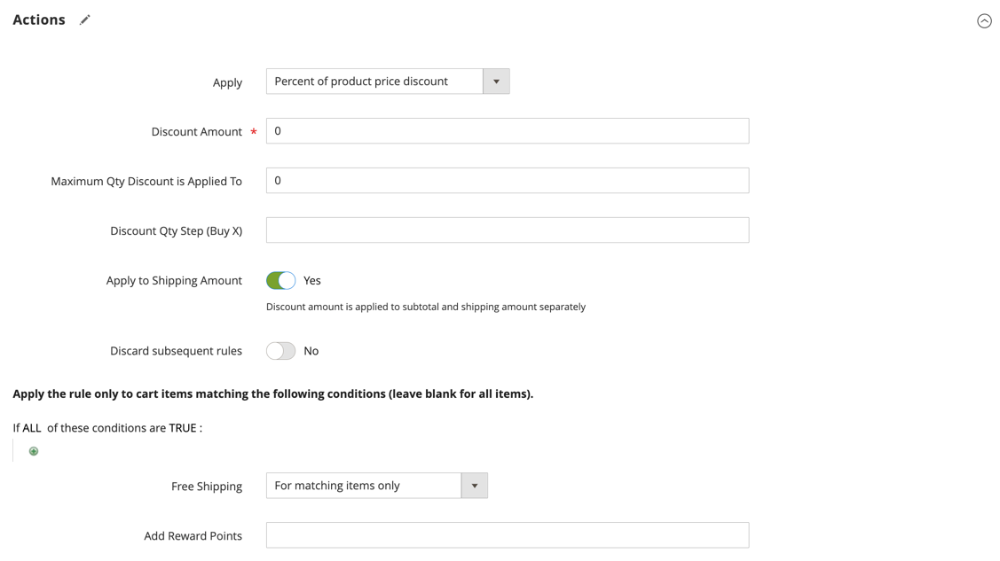

# Cart price rule example - free shipping promotion

Free shipping can be offered as a promotion, either with, or without a [coupon](price-rules-cart-coupon.md). A free shipping coupon, or voucher, can also be applied to customer pick-up orders, so the order can be invoiced and shipped to complete the [workflow](../stores-purchase/order-processing.md#order-workflow-and-processing).

Some shipping carrier configurations give you the ability to offer free shipping based on a minimum order. To expand upon this basic capability, you can use shopping cart price rules to create complex conditions based on multiple product attributes, cart contents, and customer groups.

## Step 1. Enable free shipping

1. Enable [free shipping](../stores-purchase/shipping-free.md) in your store configuration.

1. Complete the free shipping settings for any [carrier service](../stores-purchase/carriers.md) that you want to use for free shipping.

## Step 2. Create a cart price rule

On the _Admin_ sidebar, go to **[!UICONTROL Marketing]** > _[!UICONTROL Promotions]_ > **[!UICONTROL Cart Price Rules]**.

Follow the steps below to set up the type of free shipping promotion that you want to offer.

### Example 1: Free shipping for any order

1. Complete the **[!UICONTROL Rule Information]** as follows:

   - Enter a **[!UICONTROL Rule Name]** for internal reference.
   - Enter a brief **[!UICONTROL Description]** to describe the rule.
   - Set **[!UICONTROL Active]** to `Yes`.
   - In the **[!UICONTROL Websites]** box, select each site where the free shipping coupon is to be available.
   - Select the **[!UICONTROL Customer Groups]** to which the rule applies.
   - Set **[!UICONTROL Coupon]** to one of the following:
      - To offer a free shipping promotion without a coupon, accept the default (`No Coupon`) setting.
      - To use a coupon with the price rule, select `Specific Coupon`. If necessary, complete the instructions to set up a [coupon](price-rules-cart-coupon.md).

1. Scroll down and expand  the **[!UICONTROL Actions]** section and do the following:

   - Set **[!UICONTROL Apply]** to `Percent of product price discount`.
   - Set **[!UICONTROL Apply to Shipping Amount]** to `Yes`.
   - Set **[!UICONTROL Free Shipping]** to `For matching items only`.

   <!-- zoom -->

### Example 2: Free shipping for orders over $ amount

1. Complete the **[!UICONTROL General Information]** settings as described in the previous example.

1. Scroll down and expand  the **[!UICONTROL Conditions]** section.

1. Click _Add_ () to insert a condition and do the following:

   - In the list under **[!UICONTROL Cart Attribute]**, choose `Subtotal`.
   - Click **[!UICONTROL is]** and choose `equals or greater than`.
   - Click **...** and enter a threshold value for the Subtotal, such as `100`, to complete the condition.

   <!-- zoom -->

1. If necessary, expand  the **[!UICONTROL Actions]** section and do the following:

   - Set **[!UICONTROL Apply]** to `Percent of product price discount`.
   - Set **[!UICONTROL Apply to Shipping Amount]** to `Yes`.
   - Set **[!UICONTROL Free Shipping]** to `For matching items only`.

## Step 3. Complete the labels

Complete [Step 4](price-rules-cart.md) of the cart price rule instructions to enter any labels that appear during checkout.

## Step 4. Save and test the rule

{{new-price-rule}}

1. When your rule is complete, click **[!UICONTROL Save Rule]**.

1. Test the rule to make sure that it works correctly.
