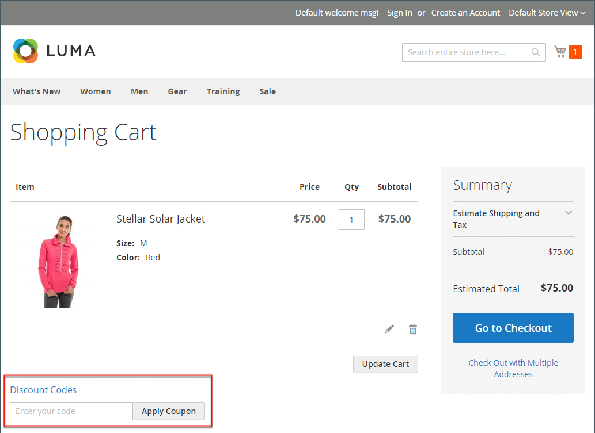
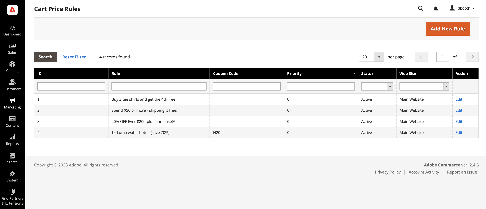

# Cart price rules

Cart price rules apply discounts to items in the shopping cart, based on a set of conditions. The discount can be applied automatically when the conditions are met, or when the customer enters a valid coupon code. When applied, the discount appears in the cart under the subtotal. A cart price rule can be used as needed for a season or promotion by changing its status and date range.

>[!NOTE]
>
>If the coupon cart rule has conditions that specify checkout options, such as certain shipping or payment methods, the conditions are met only in checkout after the specific shipping/payment methods are selected. In this case, the coupon can be applied at checkout in the last step.

<!-- zoom -->

## Access cart price rules

1. On the _Admin_ sidebar, go to **[!UICONTROL Marketing]** > _[!UICONTROL Promotions]_ > **[!UICONTROL Cart Price Rules]**.

   <!-- zoom -->

1. If you have many rules, use the filter options at the top of each column to streamline the list and click **[!UICONTROL Search]** to apply the filters.

1. To clear all filter options and display the complete list, click **[!UICONTROL Reset Filter]**.

1. Update properties for a rule:

    -  (Adobe Commerce only) Click **[!UICONTROL Edit]** to display the Rule Information page.

    -  (Magento Open Source only) Click the rule in the list to display the Rule Information page.

    There you can change the settings for the rule (similar to creating a rule).

## Filter options by column

|Column|Description|
|--- |--- |
|[!UICONTROL ID]|Enter text to filter the list for a specific rule ID number.|
|[!UICONTROL Rule]|Enter text to filter the list based on the rule name defined when the rule was created.|
|[!UICONTROL Coupon Code]|Enter text to filter the list based on the code name defined when the rule was created.|
|[!UICONTROL Priority]|Free-text field that filters the list based on the priority defined for a rule.|
|[!UICONTROL Status]|Use this option to filter the list based on rule status (`Active` or `Inactive`).|
|[!UICONTROL Web Site]|Use this option to filter the list based on websites defined for a rule.|
|[!UICONTROL Action]| (Adobe Commerce only) Click **[!UICONTROL Edit]** to display the _[!UICONTROL Rule Information]_ page and update the rule settings (similar to creating a rule).|
|[!UICONTROL Start]| (Magento Open Source only) Use the dynamic calendar fields (_[!UICONTROL To:]_ and _[!UICONTROL From:]_) to filter the list based on the start date for the rule as defined when the rule was created.|
|[!UICONTROL End]| (Magento Open Source only) Use the dynamic calendar fields (_[!UICONTROL To:]_ and _[!UICONTROL From:]_) to filter the list based on the end date for the rule as defined when the rule was created.|

{style="table-layout:auto"}

## Use Real-Time CDP audiences to inform cart price rules

Learn how to [activate](../customers/audience-activation.md) Real-Time CDP audiences into your Adobe Commerce instance to inform cart price rules.
