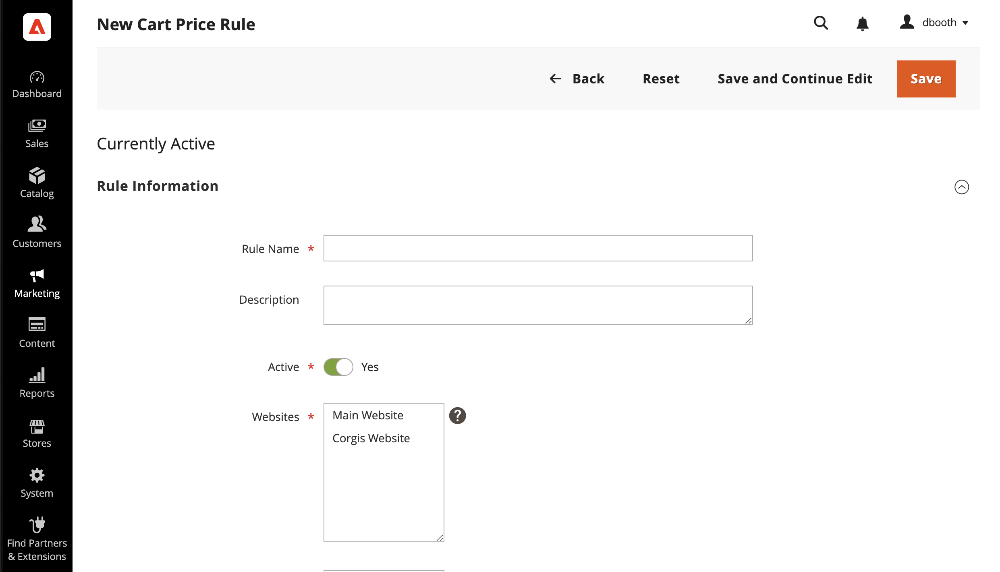
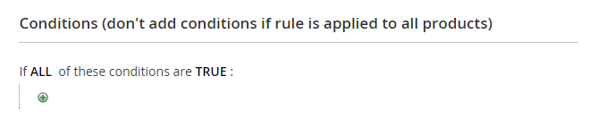
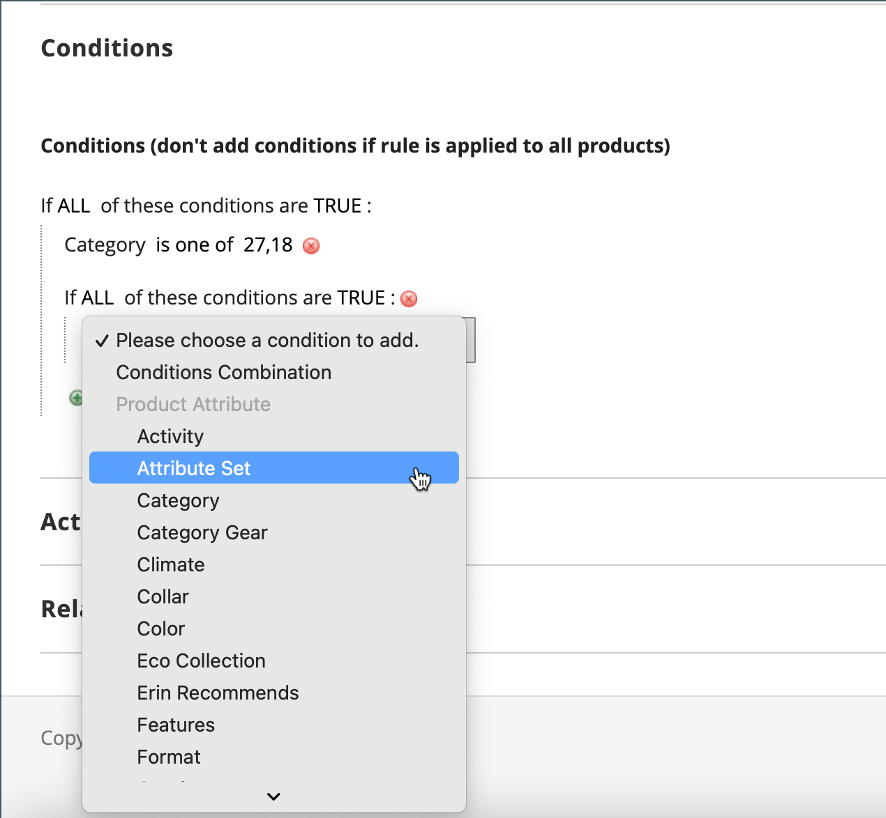
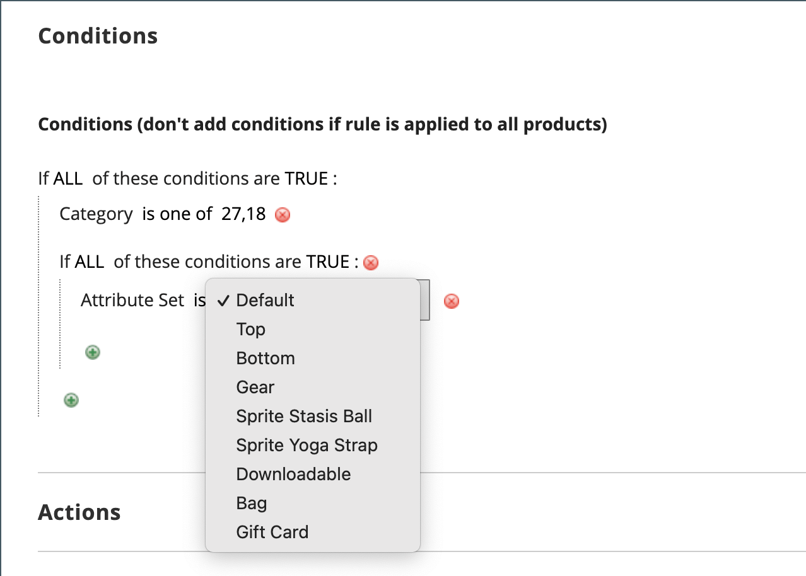
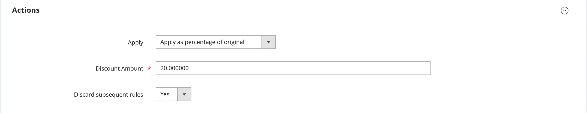
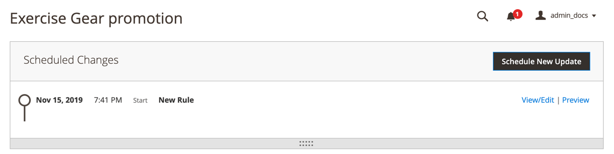
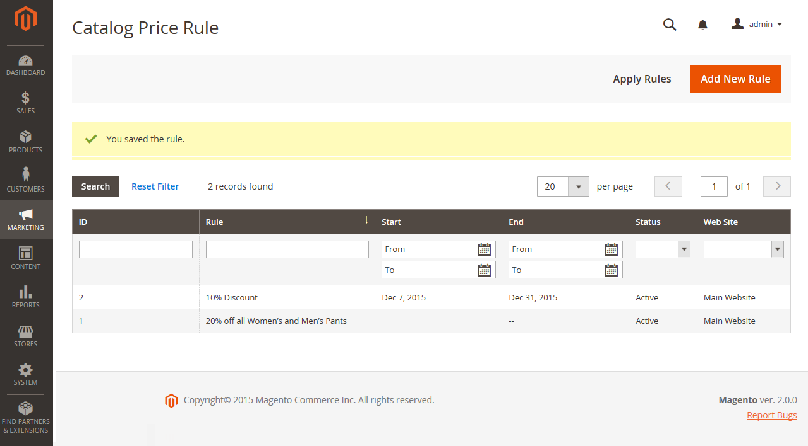
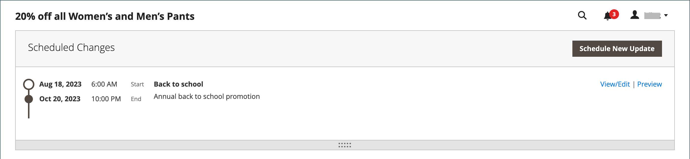

# Create a catalog price rule

Follow these instructions to apply a discount to specific products whenever a set of conditions is met. Catalog price rule discounts go into effect before the product is placed into the shopping cart.

## Step 1: Add a rule

1. On the _Admin_ sidebar, go to **[!UICONTROL Marketing]** > _[!UICONTROL Promotions]_ > **[!UICONTROL Catalog Price Rule]**.

1. In the upper-right corner, click **[!UICONTROL Add New Rule]**.

   The _[!UICONTROL Rule Information]_ section includes expandable sections for **[!UICONTROL Conditions]** and **[!UICONTROL Actions]**.

   <!-- zoom -->

1. Complete the **[!UICONTROL Rule Name]** and **[!UICONTROL Description]** fields.

   These fields are for your internal reference only.

1. Set the **[!UICONTROL Status]** of the price rule as needed.

   By default, the status is `Inactive`.

   >[!NOTE]
   >
   >After the rule is created, its status can be updated by changing the status to `Active` or `Inactive` as needed.

1. Select the **[!UICONTROL Websites]** where the rule is to be available.

1. Select the **[!UICONTROL Customer Groups]** to which this rule applies.

   To choose multiple groups, hold down the Ctrl key (PC) or the Command key (Mac) and click each option.

   >[!NOTE]
   >
   >The options in this list depend on the customer groups created and managed in _Customers_ > _Customer Groups_.

1.  (Magento Open Source only) Enter the **[!UICONTROL From]** and **[!UICONTROL To]** dates to determine when the price rule is in effect.

   You can enter the dates or use the **[!UICONTROL Calendar]** () to choose the dates. If you leave the dates blank, the rule is enabled when the price rule is saved.

1. Enter a number to establish the **[!UICONTROL Priority]** of this rule in relation to other rules.

   >[!NOTE]
   >
   >The _[!UICONTROL Priority]_ setting is important when the same catalog product meets the conditions set for more than one price rule. The rule with the highest priority setting (1 being the highest) becomes active for the product.

## Step 2: Define the conditions

Most of the available conditions are based on existing attribute values. To apply the rule to all products, leave the conditions blank.

>[!NOTE]
>
>To apply a `Category` product attribute condition to any [bundle](../catalog/product-create-bundle.md) or [grouped](../catalog/product-create-grouped.md) product, all child products must be assigned to the same category for the rule to apply correctly. If not, you can use a [Cart Price Rule](price-rules-cart-create.md) promotion instead.

1. Scroll down and expand  the **[!UICONTROL Conditions]** section.

   The first condition appears by default, and states:

      `If **ALL** of these conditions are **TRUE**:`

   <!-- zoom -->

   The statement has two bold links that you can click to display the selection of options for that part of the statement. You can create different conditions by changing the combination of these values. 
   
1. Change the statement in any of the following ways:

   - Click **[!UICONTROL ALL]** and select `ALL` or `ANY`.
   - Click **[!UICONTROL TRUE]** and select `TRUE` or `FALSE`.
   - Leave the condition unchanged to apply the rule to all products.

   You can create different conditions by changing the combination of these values. For this example, the default condition is used.

1. Click the _Add_ () icon at the beginning of the next line and select an option for the condition, such as a product attribute or combination.

1. In the list under **[!UICONTROL Product Attribute]**, choose the attribute that you want to use as the basis of the condition.

   For this example, the condition is `Attribute Set`.

   <!-- zoom -->

   >[!NOTE]
   >
   >For an attribute to appear in the list, it must be configured for use in promotional rule conditions. To learn more, see [Product Attributes](../catalog/product-attributes.md).

   >[!NOTE]
   >
   >When using the `is not one of` condition with a _SKU_ product attribute and configurable product, both the parent and child product SKUs must be selected. To avoid listing all child SKUs in the rule, you can use the `does not contain` condition with a common SKU parts of a configurable product and its child products.

   The selected condition appears in the statement, followed by two more bold links. The options differ depending on the condition attribute that you select. The statement now says:

      `If **ALL** of these conditions are **TRUE**:  Attribute Set **is** …`

1. Click **[!UICONTROL is]** and choose the comparison operator that describes the condition to be met.

   These options may include an option for different comparisons. In this example, the options are `is` and `is not`.

1. Select or enter values for the condition. Depending on the condition, you may select products from a grid or list, enter a numerical value, and so on.

   For this example, click the (**...**) more link and choose the attribute set upon which the condition is based.

   <!-- zoom -->

   The selected item appears in the statement to complete the condition.

      `If **ALL** of these conditions are **TRUE**:   Attribute Set **is Default**`

1. To add another condition line to the statement, click the _Add_ () icon and choose one of the following:

   - `Conditions Combination`
   - `Product Attribute`

   Repeat the process until all desired conditions are complete.

   If at any time you want to delete part of the condition statement, click the **[!UICONTROL Delete]** ( icon at the end of the line.

## Step 3: Define the actions

1. Expand the **[!UICONTROL Actions]** section and do the following:

   <!-- zoom -->

1. Under **[!UICONTROL Pricing Structure Rules]**, set **[!UICONTROL Apply]** to one of the following:

   - `Apply as percentage of original` - Discounts item by subtracting a percentage of the regular price. For example: Enter 10 in Discount Amount for a final price that is marked down 10% from the regular price.
   - `Apply as fixed amount` - Discounts item by subtracting a fixed amount from the regular price. For example: Enter 10 in Discount Amount for a final price that is $10 less than the regular price.
   - `Adjust final price to this percentage` - Adjusts the final price by a percentage of the regular price. For example: Enter 25 in Discount Amount for a final price that is marked down 75% from the regular price.
   - `Adjust final price to discount value` - Sets the final price to a fixed, discounted amount. For example: Enter 20 in Discount Amount for a final price of $20.00.

   >[!NOTE]
   >
   >_Regular price_ refers to the base product price without any advanced pricing (special/tier/group) or promotional discounts. _Final price_ refers to the discounted price that appears in the shopping cart.  The **_final_** product price is calculated as the **_minimum_** relevant price, using the following formula:  `Final Price=Min(Regular(Base) Price, Group(Tier) Price, Special Price, Catalog Price Rule) + Sum(Min Price per each required custom option)`

1. Enter the **[!UICONTROL Discount Amount]**.

1. To stop processing other rules after this rule is applied, set **[!UICONTROL Discard Subsequent Rules]** to `Yes`.

   >[!NOTE]
   >
   >Setting this to `Yes` is a safeguard to prevent the system from applying multiple discounts (rules) to the same product.

## Step 4: Add related dynamic blocks

{{ee-feature}}

[Dynamic blocks](../content-design/dynamic-blocks.md) that are associated with a catalog price rule appear in the storefront whenever the conditions are met. This is an optional step.

1. Expand the **[!UICONTROL Related Dynamic Blocks]** section.

1. Use the [search filters](../getting-started/admin-workspace.md) to locate the dynamic blocks that you want to associate with the rule.

1. Select the checkbox in the first column to associate the dynamic block with the rule.

   <!-- zoom -->

## Step 5: Schedule the rule

{{ee-feature}}

>[!NOTE]
>
>Setting the rule to active must be added as a scheduled update. To learn more, see [Scheduled Changes](price-rule-catalog-scheduled-changes.md).

1. Click **[!UICONTROL Save and Continue Edit]**.

   <!-- zoom -->

1. In the _Scheduled Changes_ box, click **[!UICONTROL View/Edit]** to the right of the listed change (or you can click **[!UICONTROL Schedule New Update]** at the top of the box).

   You can either edit the existing update or assign the catalog price rule to another campaign. The **Edit Existing Update** option is selected by default.

1. To schedule the rule, enter the **[!UICONTROL Start Date]** and **[!UICONTROL End Date]** that the price rule is to be active.

   You can either enter the dates or choose the dates from the _Calendar_ ().

   <!-- zoom -->

1. Scroll to the _Rule Information_ section and set the **[!UICONTROL Status]** to `active`.

## Step 6: Save and test the rule

1. When complete, save the rule.

   -  (Magento Open Source only) Click **[!UICONTROL Save and Apply]**.

      <!-- zoom -->

   -  (Adobe Commerce only) Click **[!UICONTROL Save]**.

      The Rule Information page displays an updated timeline in the Scheduled Changes for the rule.

      <!-- zoom -->

1. Update properties for a rule:

   -  (Adobe Commerce only) Click **[!UICONTROL Edit]** to display the _[!UICONTROL Rule Information]_ page.

   -  (Magento Open Source only) Click the rule in the list to display the _[!UICONTROL Rule Information]_ page.

1. Test the rule to make sure that it works correctly.

   Price rules are automatically processed with other system rules each night. When you create a price rule, allow enough time for it to get into the system before you test the rule to make sure that it works correctly. As new rules are added, Commerce recalculates the prices and the priorities accordingly.

## Catalog price rule demo

Watch this video to learn about creating catalog price rules:

>[!VIDEO](https://video.tv.adobe.com/v/343834?quality=12)

## Field descriptions

### [!UICONTROL Rule Information]

|Field|Description|
|-----|-----------|
|[!UICONTROL Rule name]|(Required) The name of the rule is for internal reference.|
|[!UICONTROL Description]|A description of the rule should include the purpose of the rule and explain how it is used.|
|[!UICONTROL Websites]|(Required) Identifies the websites where the rule can be used.|
|[!UICONTROL Customer Groups]|(Required) Identifies the customer groups to which the rule applies.|
|[!UICONTROL Priority]|A number that indicates the priority of this rule in relation to others. The highest priority is number 1.|
|[!UICONTROL Status]| (Magento Open Source only) Determines if the rule is active in the store. Options: `Yes` / `No`|
|[!UICONTROL From]| (Magento Open Source only) Specifies the first day that the price rule is in effect. If left blank, the price rule goes into effect when it is saved.|
|[!UICONTROL To]| (Magento Open Source only) Specifies the last day that the price rule is in effect. If left blank, the price rule continues indefinitely.|

{style="table-layout:auto"}

### [!UICONTROL Conditions]

Specifies the conditions that must be met before the catalog price rule goes into action. If left blank, the rule applies to all products.

### [!UICONTROL Actions]

|Field|Description|
|-----|-----------|
|[!UICONTROL Apply]|Determines the type of calculation that is applied to the purchase. Options:  **[!UICONTROL Apply as percentage of original]** - Discounts item by subtracting a percentage of the regular price.  **[!UICONTROL Apply as fixed amount]** - Discounts item by subtracting a fixed amount from the regular price.  **[!UICONTROL Adjust final price to this percentage]** - Adjusts the final price by a percentage of the regular price.  **[!UICONTROL Adjust final price to discount value]** - Sets the final price to a fixed, discounted amount.   **_Note:_** Regular price refers to the base product price without any advanced pricing (special/tier/group) or promotional discounts. Final price refers to the discounted price that appears in the shopping cart.  The **_final_** product price is calculated as the **_minimum_** relevant price, using the following formula:  `Final Price=Min(Regular(Base) Price, Group(Tier) Price, Special Price, Catalog Price Rule) + Sum(Min Price per each required custom option)`|
|[!UICONTROL Discount Amount]|(Required) The amount of discount that is offered.|
|[!UICONTROL Discard Subsequent Rules]|Determines if additional rules can be applied to this purchase. To prevent multiple discounts from being applied to the same purchase, select `Yes`. Options: `Yes` / `No`|

{style="table-layout:auto"}

### [!UICONTROL Related Dynamic Blocks]

{{ee-feature}}

Identifies any [dynamic blocks](../content-design/dynamic-blocks.md) that are associated with the rule.
