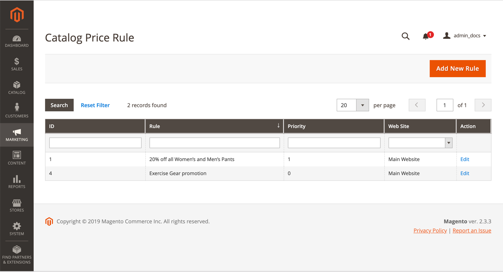

# Catalog price rules

Catalog price rules can be used to offer products to buyers at a discounted price, based on a set of defined conditions. Catalog price rules do not use [coupon codes](price-rules-cart-coupon.md), because they are triggered before a product is placed into the shopping cart.

For example, you can define and set the conditions for a price rule that when met, automatically display products with a special or promotional price. Defined rule properties might include customer groups, product categories, a discount amount or percentage, product color, product size, or just about any product attribute set up in your store. You can set start and end dates for a price rule that automatically start and stop a promotion on the dates you define in the rule. The properties of a saved rule can be updated or modified as needed.

-  (Adobe Commerce only) You can also link a defined rule to a [dynamic block](../content-design/dynamic-blocks.md) to help promote the event or product in your store.

-  (Magento Open Source only) For recurring promotions, you can manually set a saved rule to _Active_ or _Inactive_ status each time you want to run the promotion.

## Access catalog price rules

1. On the _Admin_ sidebar, go to **Marketing** > _Promotions_ > **Catalog Price Rules**.

   <!-- zoom -->

1. Update properties for a rule:

   -  (Adobe Commerce only) Click **Edit** to display the _Rule Information_ page.

   -  (Magento Open Source only) Click the rule in the list to display the Rule Information page.

   There you can change the settings for the rule (similar to [creating new rule](price-rules-catalog-create.md)).

## Filter options

|Field|Description|
|--- |--- |
|ID|Enter text to filter the list for a specific rule ID number.|
|Rule|Enter text to filter the list based on the rule name defined when the rule was created.|
|Start| (Magento Open Source only) Use the dynamic calendar fields (To: and From:) to filter the list based on the start date for the rule as defined when the rule was created.|
|End| (Magento Open Source only) Use the dynamic calendar fields (To: and From:) to filter the list based on the end date for the rule as defined when the rule was created.|
|Status| (Magento Open Source only) Use this option to filter the list based on rule status, `Active` or `Inactive`.|
|Priority| (Adobe Commerce only) Enter text in this field to filter the list based on the priority defined for a rule.|
|Web Site| (Adobe Commerce only) Use this option to filter the list based on websites defined for a rule.|
|Action| (Adobe Commerce only) Click **Edit** to display the Rule Information screen and update the rule's settings (similar to creating a new rule).|

>[!NOTE]
>
>To update rule properties, click the rule in the list to display the _Rule Information_ page. There you can change the settings for the rule (similar to creating a new rule).

## Troubleshooting resources

For help with troubleshooting catalog price rule issues, see the following Commerce Support articles:

- [404 Error on store front once catalog price rule schedules update is performed](https://support.magento.com/hc/en-us/articles/360025522891)
- [Improved performance of product page with related products and target rules](https://support.magento.com/hc/en-us/articles/360052455691)
- [Catalog price rules don't work](https://support.magento.com/hc/en-us/articles/360055855591)
- [GraphQL price calculations](https://support.magento.com/hc/en-us/articles/360055782351)
