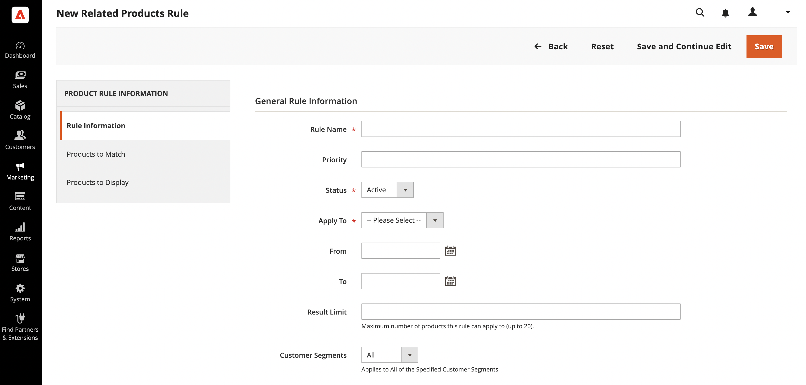
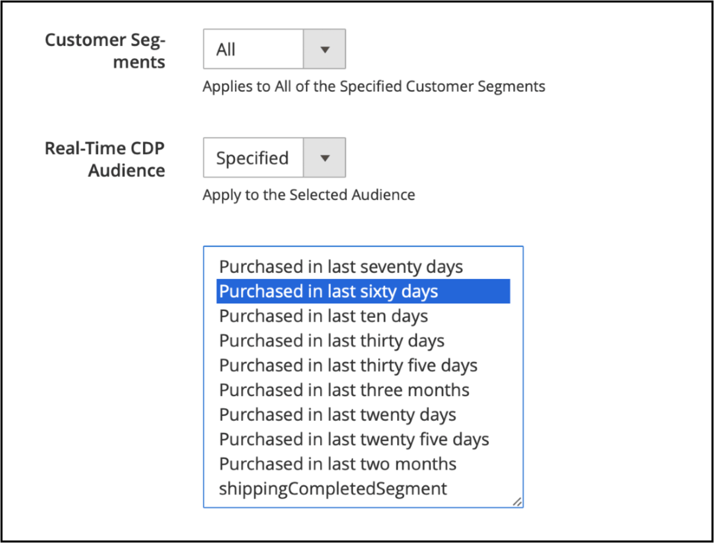
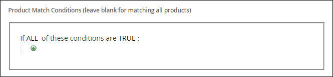
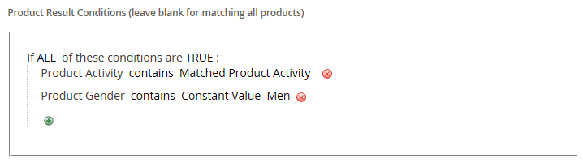

# Create a related product rule

{{ee-feature}}

The process of creating a related product rule is similar to setting up a price rule. First, you define the conditions to match, and then choose the products that you want to display. At any given time, there might be several active rules that can be triggered to display related products, up-sells, and cross-sells. The priority of each rule determines the order in which the block of products appears on the page.

>[!NOTE]
>
>For an attribute to be used in a targeted rule, the [_[!UICONTROL Use for Promo Rule Conditions]_](../catalog/product-attributes.md) property must be set to `Yes`.

>[!NOTE]
>
>The `All Store Views` scope value is always used for both [!UICONTROL Products to Match] and [!UICONTROL Products to Display] conditions for all product attributes. This also applies when the product attributes have different values for different store views and websites.

## Create a related product rule

1. On the _Admin_ sidebar, go to **[!UICONTROL Marketing]** > _[!UICONTROL Promotions]_ > **[!UICONTROL Related Product Rules]**.

1. In the upper-right corner, click **[!UICONTROL Add Rule]**.

   {width="600" zoomable="yes"}

1. Complete the **[!UICONTROL Rule Information]** as follows:

   - Enter a **[!UICONTROL Rule Name]** to identify the rule when working in the Admin.

   - For **[!UICONTROL Priority]**, enter a number that determines the order that the results appear on the page when results from other rules target the same location. Number `1` is top priority.

   - To enable the rule, set **[!UICONTROL Status]** to `Active`.

   - Set **[!UICONTROL Apply To]** to one of the following:

      - `Related Products`
      - `Up-sells`
      - `Cross-sells`

   - If the rule is to be active for a specific range of time, enter the **[!UICONTROL From]** and **[!UICONTROL To]** dates.

   - For **[!UICONTROL Result Limit]**, enter the number of records to appear in the results list. The maximum number is 20.

   - If the rule applies to a specific [customer segment](../customers/customer-segments.md), set **[!UICONTROL Customer Segments]** to `Specified` and choose the customer segment from the list.

   - (**Beta**) If the rule applies to a specific [Real-Time CDP audience](../customers/audience-activation.md), set **[!UICONTROL Real-Time CDP Audience]** to `Specified` and choose the Real-Time CDP audience from the list.

      {width="500"}

1. In the left panel, choose **[!UICONTROL Products to Match]** and build the conditions as you would for a [catalog price rule](price-rules-catalog.md).

   {width="500"}

1. In the left panel, choose **[!UICONTROL Products to Display]** and build the results conditions as you would for a [catalog price rule](price-rules-catalog.md).

   {width="500"}

   Complete the condition to describe the products that you want to include in the displayed results.

1. When complete, click **[!UICONTROL Save]**.

## Delete a related product rule

1. On the _Admin_ sidebar, go to **[!UICONTROL Marketing]** > _[!UICONTROL Promotions]_ > **[!UICONTROL Related Product Rules]**.

1. Find the related product rule that you want to delete.

1. Click the rule to open the details page.

1. In the upper right corner, click **[!UICONTROL Delete]**.

1. To confirm the action, click **[!UICONTROL OK]**.

## Related product rule demo

Watch this video to learn about creating related product rules:

>[!VIDEO](https://video.tv.adobe.com/v/343837?quality=12&learn=on)

## Field descriptions

|Field|Description|
|--- |--- |
|[!UICONTROL Rule Name]|A name that identifies the rule for internal use.|
|[!UICONTROL Priority]|Determines the sequence in which the results of the rule appear when displayed with other sets of results that target the same place on the page. The value can be set to any whole number, with the highest priority of 1. For example, if there are multiple up-sell rules that apply, the one with the highest priority appears before the others. The sort order of the products within each set of results is random. Any up-sell, cross-sell, and related products that were manually configured always appear on the page before any rule-based product promotions.|
|[!UICONTROL Status]|Controls the active status of the rule. Options: `Active` / `Inactive`|
|[!UICONTROL Apply To]|Identifies the type of product relationship that is associated with the rule. Options: `Related Products` / `Up-sells` / `Cross-sells`|
|[!UICONTROL From Date]|If the rule is active for a range of time, this setting determines the first date the rule is active.|
|[!UICONTROL To Date]|If the rule is active for a range of time, this setting determines the last date the rule is active.|
|[!UICONTROL Result Limit]|Determines the number of products that appear in the results at one time. The maximum number is 20. If more matching results are found, the products rotate through the block each time the page is refreshed.|
|[!UICONTROL Customer Segments]|Identifies the customer segments to which the rule applies. Options: `All` / `Specified`|

{style="table-layout:auto"}
