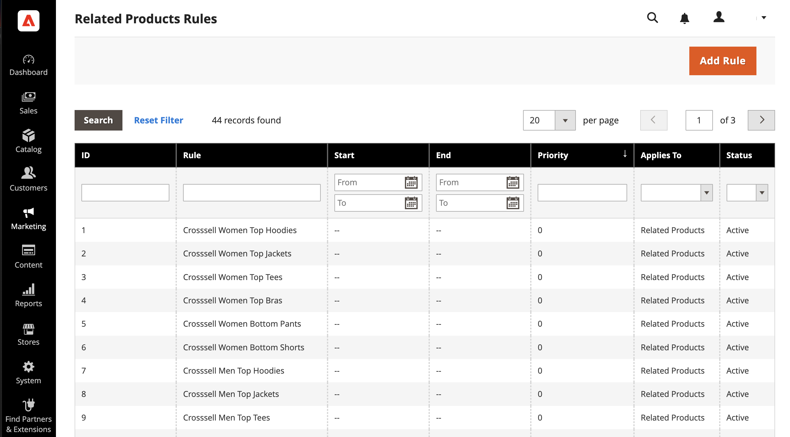

# Related product rules

{{ee-feature}}

Related product rules give you the ability to target the selection of products that are presented to customers as related products, up-sells, and cross-sells. Each product rule can be associated with a [customer segment](https://docs.magento.com/user-guide/marketing/customer-segments.html) to produce a dynamic display of targeted merchandising.

Since several active rules can be triggered at the same time, you can set a priority for each rule. It defines the order in which rules are applied and products are displayed on the page.

To access the related product rules, go to **[!UICONTROL Marketing]** > _[!UICONTROL Promotions]_ > **[!UICONTROL Related Product Rules]**.

<!-- zoom -->

## Column descriptions

|Column|Description|
|--- |--- |
|[!UICONTROL ID]|A unique numeric identifier that is assigned to each related product rule|
|[!UICONTROL Rule]|The name of the related product rule|
|[!UICONTROL Start]|Use the dynamic calendar fields (_[!UICONTROL To:]_ and _[!UICONTROL From:]_) to filter the list based on the start date for the rule as defined when the rule was created.|
|[!UICONTROL End]|Use the dynamic calendar fields (_[!UICONTROL To:]_ and _[!UICONTROL From:]_) to filter the list based on the end date for the rule as defined when the rule was created.|
|[!UICONTROL Priority]|Enter text in this field to filter the list based on the priority defined for a rule.|
|[!UICONTROL Applies To]|This option filters the list of rules that apply to `Related Products`, `Up-sells`, and `Cross-sells`.|
|[!UICONTROL Status]|Use this option to filter the list based on rule status (`Active` or `Inactive`).|

{style="table-layout:auto"}

## Rule priority

At any given time, there might be several active rules that can be triggered to display related products, up-sells, and cross-sells. The priority of each rule determines the order in which the products appear on the page. The value can be set to any whole number, with `1` having the highest priority.

The number of product IDs that can be included in a product relations rule is determined by the `Result Limit` value, which has a maximum of 20. The `Result Limit` value, combined with the `Configurable Maximum` for the specific rule-based product promotion becomes the `Real Limit`, and determines the actual number of matching products that can appear in the list.

   [Result Limit] + [Configurable Maximum] = [Real Limit]

For example, suppose you have three rules with a priority of `1`, `2`, and `3`.

- There are two matching products returned for _Rule 1_, six matching products for _Rule 2_, and 20 matching products for _Rule 3_.
- In the configuration, the _[!UICONTROL Maximum Number of Products for Related Products List]_ is set to `6`.

   | Rules | Priority | Matching Products |
   |---|---|-----|
   | Rule 1 | `1` | `2` |
   | Rule 2 | `2` | `6` |
   | Rule 3 | `3` | `20` |

If the first rule returns more matching products than allowed by the _configurable maximum limit_, but less than the _real limit_, the matching products from the other rules are used (in order of priority) until the _real limit_ is reached.

By priority, the matching products returned from _Rule 1_ can be used first to fill all 26 available slots. Because Rule 1 returned only two matching products, there is still room for 24 more. _Rule 2_ has the next highest priority, and returns six more matching products. There are now 18 available slots to be filled. _Rule 3_ has the next level of priority, with enough matching products to fill the remaining 18 slots. When all available slots are filled, and depending on the rotation mode that is set, products might be shuffled or ordered by ID inside each priority and then reduced to the configurable maximum limit. In this case, the remaining six products appear in the store.

>[!NOTE]
>
>Selected products are always displayed before the rule-based products regardless of the rotation mode.

## Configure rule-based product relations

The behavior of product relationship rules and display of matched products are determined by the configuration settings. These settings determine how many of the products that match the rule can be displayed and the order in which they appear.

1. On the _Admin_ sidebar, go to **[!UICONTROL Stores]** > _[!UICONTROL Settings]_ > **[!UICONTROL Configuration]**.

1. In the panel on the left, expand **[!UICONTROL Catalog]** and choose **[!UICONTROL Catalog]** underneath.

1. Expand  the **[!UICONTROL Rules-Based Product Relations]** section.

   <!-- zoom -->

1. Enter the **[!UICONTROL Maximum Number of Products in the Related Products List]**.

1. Set **[!UICONTROL Show Related Products]** to one of the following:

   - `Both Selected and Rule Based`
   - `Selected Only`
   - `Rule-Based Only`

1. Set **[!UICONTROL Rotation Mode for Products in Related Product List]** to one of the following:

   - `By Priority, Then by ID`
   - `By Priority, Then Random`
   - `Weighted Random`

1. To complete the cross-sell product settings, do the following:

   - Enter the **[!UICONTROL Maximum Number of Products in the Cross-Sell Product List]**.

   - Set **[!UICONTROL Show Cross-Sell Products]** to one of the following:

      - `Both Selected and Rule Based`
      - `Selected Only`
      - `Rule-Based Only`

   - Set **[!UICONTROL Rotation Mode for Products in Cross-Sell Product List]** to one of the following:

      - `By Priority, Then by ID`
      - `By Priority, Then Random`
      - `Weighted Random`

1. To complete the up-sell product settings, do the following:

   - Enter the **[!UICONTROL Maximum Number of Products in the Upsell Product List]**.

   - Set **[!UICONTROL Show Upsell Products]** to one of the following:

      - `Both Selected and Rule Based`
      - `Selected Only`
      - `Rule-Based Only`

   - Set **[!UICONTROL Rotation Mode for Products in Upsell Product List]** to one of the following:

      - `By Priority, Then by ID`
      - `By Priority, Then Random`
      - `Weighted Random`

1. When complete, click **[!UICONTROL Save Config]**.

### Rotation modes

| Mode | Description |
|---|---|
| [!UICONTROL By Priority, Then by ID] | Products are sorted by priority and then reordered by ID inside each priority. Products from lower priority rule appear only when they are no products left from higher priority rule to fill the available slots. |
| [!UICONTROL By Priority, Then Random] | Products are sorted by priority and then randomized inside each priority. Products from lower priority rule appear only when they are no products left from higher priority rule to fill the available slots. |
| [!UICONTROL Weighted Random] | Products are randomized so that products belonging to a rule with higher priority have higher probability to appear than those belonging to a rule with lower priority. Products are then reduced to the configurable maximum limit and regrouped back by priority. This mode gives a chance to products from lower priority to appear sometimes even if the remaining slots could be filled up with products from rule with higher priority|

{style="table-layout:auto"}
