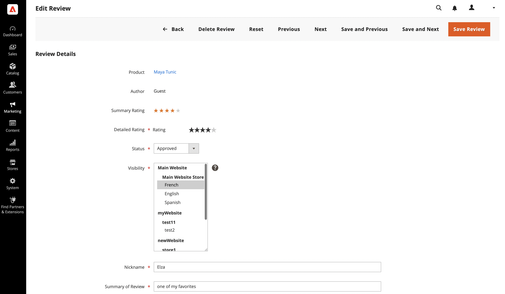

# Moderate product reviews

For Commerce product reviews, a submitted product review must be approved before it can be displayed. This ensures that reviews are appropriate for public display your store. A submitted review is in a `Pending` status until it is approved or rejected.

## View product reviews in the Admin

To view all reviews for a specific product in the Admin, do the following:

1. On the _Admin_ sidebar, go to **[!UICONTROL Catalog]** > **[!UICONTROL Products]**.

1. Find the product that you want to view and click **[!UICONTROL Edit]** in the _[!UICONTROL Action]_ column.

1. On the product page, scroll down and expand  the **[!UICONTROL Product Reviews]** section.

   In this grid, you can also change the specific review by clicking the **[!UICONTROL Edit]** link in the _[!UICONTROL Action]_ column.

## Update status for reviews

1. On the _Admin_ sidebar, go to **[!UICONTROL Marketing]** > _[!UICONTROL User Content]_ > **[!UICONTROL Pending Reviews]** or **[!UICONTROL All Reviews]**.

1. In the list, click a pending review to view the details and edit if necessary.

1. Change the **[!UICONTROL Status]** according to your assessment:

   - To approve a pending review, select `Approved`.

   - To reject a review, select `Not Approved`. Unapproved reviews disappear from the list of _[!UICONTROL Pending Reviews]_ page.

   >[!NOTE]
   >
   >Reviews with the `Pending` and `Not Approved` statuses are not displayed on the storefront.

1. If applicable, set the **[!UICONTROL Visibility]** of a product review for appearing in different store views.

1. If needed, change the values for **[!UICONTROL Detailed Rating]**, **[!UICONTROL Nickname]**, and **[!UICONTROL Summary of Review]**.

   To change the store view where a review is available, choose the needed store view in the _[!UICONTROL Visibility]_ column.

   {width="600" zoomable="yes"}

1. When complete, click **[!UICONTROL Save Review]**.

## Batch update

You can update or delete multiple reviews at the same time:

1. On the _Admin_ sidebar, go to **[!UICONTROL Marketing]** > _[!UICONTROL User Content]_ > **[!UICONTROL All Reviews]**.

1. Select the reviews that you want to update.

1. Use the _[!UICONTROL Action]_ selector at the top-left corner to apply an action.

1. Click **[!UICONTROL Submit]**

## Delete a product review

1. On the _Admin_ sidebar, go to **[!UICONTROL Marketing]** > _[!UICONTROL User Content]_ > **[!UICONTROL All Reviews]**.

1. Find the product review to be deleted and open it in edit mode.

1. In the menu bar, click **[!UICONTROL Delete Review]** button.

1. To confirm the action, click **[!UICONTROL OK]**.

## Button bar

| Button   | Description  |
|----------|--------------|
| **[!UICONTROL Back]** | Returns to the Reviews page without saving changes |
| **[!UICONTROL Delete Review]** | Deletes the review |
| **[!UICONTROL Reset]** | Resets any unsaved changes in the review form to their previous values |
| **[!UICONTROL Previous]** | Opens the previous review |
| **[!UICONTROL Next]** | Opens the next review |
| **[!UICONTROL Save and Previous]** | Saves current changes and opens the previous review. This button is displayed if there are other reviews. |
| **[!UICONTROL Save and Next]** | Saves the current changes and opens the next view. This button is displayed if there are other reviews. |
| **[!UICONTROL Save Review]** | Saves changes and closes the review edit page |
