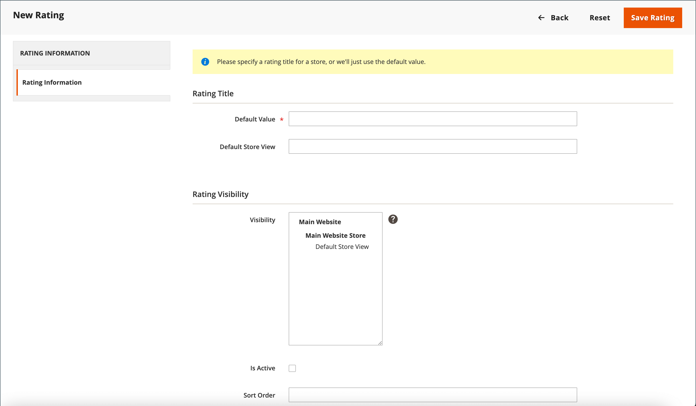

# Product reviews

Product reviews help to build a sense of community, and are considered more credible than any advertising money can buy. In fact, some search engines give sites with product reviews a higher ranking than those without. For those who find your site by searching for a specific product, a product review is essentially the landing page of your store. Product reviews help people find your store, keep them engaged, and often lead to sales.

Commerce includes a native product reviews capability that you can manage from the Admin. You can also use an extension from the [Commerce Marketplace](../getting-started/commerce-marketplace.md) to use a hosted review management system.

>[!NOTE]
>
>Adobe Commerce and Magento Open Source releases 2.4.0 through 2.4.3 included the Yotpo vendor-developed extension. Starting with the 2.4.4 release, this extension is no longer bundled with the core release and must be installed and updated from the Commerce Marketplace. The Marketplace also provides access to current documentation provided by the extension developer.
>  
>If you have the bundled extension enabled and configured, you must update your composer.json file as part of the 2.4.4 upgrade process and to manage extension updates going forward. See [Upgrade modules](https://experienceleague.adobe.com/docs/commerce-operations/upgrade-guide/modules/upgrade.html) in the _Upgrade Guide_ for more information.

## Product reviews on the storefront

When the native Product Reviews function is enabled, customers can write reviews for any product in your catalog. Reviews can be written from the product page by clicking:

- **Add Your Review** for products with existing reviews.

- **Be the first to review this product** for products with no existing reviews.

The [!UICONTROL Reviews] tab lists all current reviews and the form that was used to submit a review.

Your configuration determines whether customers must open an account with your store before writing product reviews or if they can submit reviews as guests. Requiring reviewers to open an account prevents anonymous submissions and improves the quality of reviews.

{width="700" zoomable="yes"}

The number of stars indicates the product's satisfaction rating. Visitors can click the link to read the reviews and write their own. As an incentive, customers can receive reward points for submitting a review. When a review is submitted, it is sent to the Admin for moderation. When approved, the review is published in your store.

{width="700" zoomable="yes"}

### [!UICONTROL My Product Reviews]

The _[!UICONTROL My Product Reviews]_ section of the customer account dashboard lists all the reviews submitted by the customer and approved for publication. Each review summary includes the date that the review was submitted, links to the product page, and review details.

{width="700" zoomable="yes"}

1. In the sidebar of their account, the customer chooses **[!UICONTROL My Product Reviews]**.

1. To view the full review, clicks **[!UICONTROL See Details]**.

   {width="700" zoomable="yes"}

## Enable product review features

The Commerce Product Reviews function is enabled by default.

>[!NOTE]
>
>To set these fields to `No` and disable Commerce Product Reviews, you must clear the **Use system value** checkboxes.

1. On the _Admin_ sidebar, go to **[!UICONTROL Stores]** > _[!UICONTROL Settings]_ > **[!UICONTROL Configuration]**.

1. In the left panel, expand **[!UICONTROL Catalog]** and select **[!UICONTROL Catalog]** underneath.

1. Expand  the **[!UICONTROL Product Reviews]** section.

   {width="600" zoomable="yes"}

1. Set **[!UICONTROL Enabled]** to `Yes`.

   This is the default setting that enables product reviews.

1. Set **[!UICONTROL Allow Guests to Write Reviews]** to `Yes`.

   This is the default setting that determines if customers must open an account with your store to be able to write product reviews.

1. When complete, click **[!UICONTROL Save Config]**.

## Create custom ratings

With the Commerce Product Reviews, customers can assign ratings when they submit a product review. The default ratings are quality, price, and value. In addition to these, you can add your own custom ratings. The five-star ratings that appear on catalog pages are averaged for each product.

{width="700" zoomable="yes"}

1. On the _Admin_ sidebar, go to **[!UICONTROL Stores]** > _[!UICONTROL Attributes]_ > **[!UICONTROL Rating]**.

1. In the upper-right corner, click **[!UICONTROL Add New Rating]**.

   {width="700" zoomable="yes"}

1. In the _[!UICONTROL Rating Title]_ section, enter the **[!UICONTROL Default Value]** for the new rating.

   If applicable, also enter the translation for each store view.

   {width="600" zoomable="yes"}

1. In the _Rating Visibility_ section, set **[!UICONTROL Visibility In]** to the store view where the rating is to be used.

   To select multiple store views, hold down the Ctrl key (PC) or the Command key (Mac) and click each item.

   >[!NOTE]
   >
   >Ratings are not visible unless assigned to a store view.

1. For **[!UICONTROL Sort Order]**, enter a number to determine the order of this rating when listed with others.

1. If you want to show your rating on the storefront, select the **[!UICONTROL Is Active]** checkbox.

   {width="600" zoomable="yes"}

1. When complete, click **[!UICONTROL Save Rating]**.

   The average rating for all reviews is displayed for each product on the catalog product grid page.

   {width="700" zoomable="yes"}
