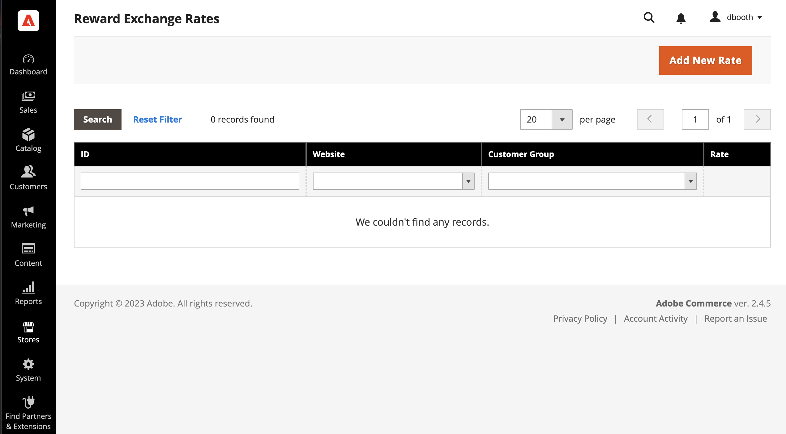
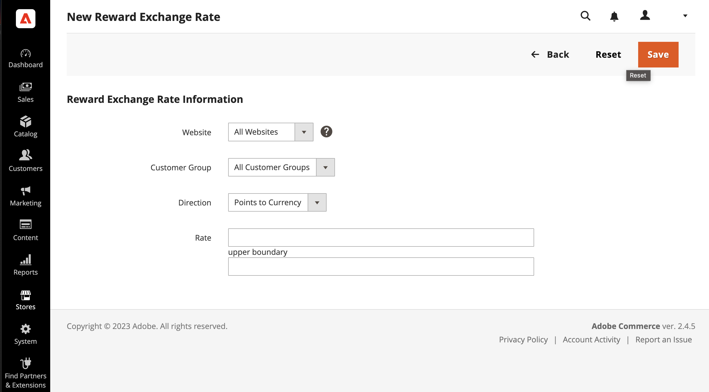

# Reward exchange rates

{{ee-feature}}

Reward exchange rates determine the number of points that are earned based on the order amount, and the value of the points earned. Different exchange rates can be applied to different websites and different customer groups. If multiple exchange rates from different websites and customer groups apply to the same customer, the following rules of priority apply:

## Exchange rate priority

**1**: Applies to specific website and specific customer group.

**2**: Applies to all websites and a specific customer group.

**3**: Applies to a specific website and all customer groups.

**4**: Applies to all websites and all customer groups.

When converting currency to points, the number of points cannot be divided. Any currency remainder is rounded down. For example, if $2.00 converts to ten points, points are earned in groups of $2.00. Therefore, a $7.00 order would earn 30 points, and the remaining $1.00 would be rounded down. The monetary amount of the order is defined as the amount which the merchant receives, or the grand total minus shipping, tax, discounts, store credit, and gift cards. The points are earned the moment when there are no non-invoiced items in the order (all items are either paid or canceled). If an Admin user does not want to allow customers to earn Reward Points for canceled orders, those points can be manually deducted from the Manage Customers page.

## Set up exchange rates

{width="700" zoomable="yes"}

1. On the _Admin_ sidebar, go to **[!UICONTROL Stores]** > _[!UICONTROL Other Settings]_ > **[!UICONTROL Reward Exchange Rates]**.

1. In the upper-right corner, click **[!UICONTROL Add New Rate]**.

1. In the **[!UICONTROL Reward Exchange Rate Information]** section, do the following:

   {width="600" zoomable="yes"}

   - Set **[!UICONTROL Website]** to the sites where the reward exchange rate applies.

   - Set **[!UICONTROL Customer Group]** to the groups where the reward exchange rate applies.

   - Set **[!UICONTROL Direction]** to one of the following:

      - `Points to Currency`
      - `Currency to Points`

    For either Direction setting, the amount is represented in the base currency of the website.

1. Enter the **[!UICONTROL Rate]** values according to the _[!UICONTROL Direction]_ setting.

   |Direction|Rate settings|
   |---------|-------------|
   | [!UICONTROL Points to Currency] | In the first _[!UICONTROL Rate]_ field, enter the number of points. In the second  _[!UICONTROL Rate]_ field, enter the monetary value of the points. |
   | [!UICONTROL Currency to Points] | In the first  _[!UICONTROL Rate]_ field, enter the monetary value. In the second  _[!UICONTROL Rate]_ field, enter the number of points that is represented by the monetary value. |

   When converting points to currency, the number of points cannot be divided. For example, if ten points convert to $2.00, points must be redeemed in groups of ten. Therefore, 25 points would redeem for $4.00, with 5 points remaining in the customer's balance.

   It is recommended that you set up a conversion for both `Points to Currency` and `Currency to Points`.

1. When complete, click **[!UICONTROL Save]**.

## Delete a reward exchange rate

1. On the _Admin_ sidebar, go to **[!UICONTROL Stores]** > _[!UICONTROL Other Settings]_ > **[!UICONTROL Reward Exchange Rates]**.

1. Find the reward exchange rate to be deleted and open it in edit mode.

1. In the menu bar, click **[!UICONTROL Delete]**.

1. To confirm the action, click **[!UICONTROL OK]**.

## Field descriptions

|Field|Description|
|--- |--- |
|[!UICONTROL Website]|The websites where the reward rates apply.|
|[!UICONTROL Customer Group]|The customer groups to which the reward rates apply.|
|[!UICONTROL Direction]|Determines which type of transaction the exchange rate define. Options:  **[!UICONTROL Points to Currency]** - Defines the number of points that can be applied as credit towards the amount of an order. In the first _[!UICONTROL Rate]_ field, enter the number of points. In the second  _[!UICONTROL Rate]_ field, enter the monetary value of the points.  **[!UICONTROL Currency to Points]** - Defines the amount of an order that can earn the customer points. In the first  _[!UICONTROL Rate]_ field, enter the monetary value. In the second  _[!UICONTROL Rate]_ field, enter the number of points that is represented by the monetary value.|
