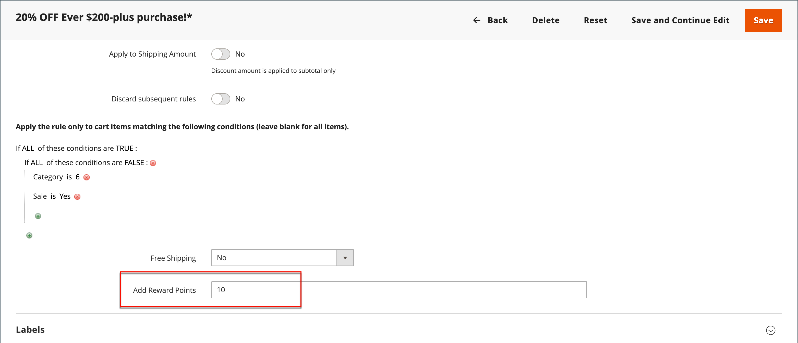

# Reward points in price rules

{{ee-feature}}

Reward points can be awarded to customers according to a [cart price rule](price-rules-cart.md). The award of points can be the only action of the price rule, or can be used with a discount.

>[!NOTE]
>
>[Reward Exchange Rates](../merchandising-promotions/reward-exchange-rates.md) must be configured to be able to redeem reward points during the checkout.

## Add reward points to a price rule

1. On the _Admin_ sidebar, go to **[!UICONTROL Marketing]** > _[!UICONTROL Promotions]_ > **[!UICONTROL Cart Price Rules]**.

1. Click **[!UICONTROL Add New Rule]** to create a cart price rule or click an existing cart price rule to open it.

1. Scroll down, expand  the **[!UICONTROL Actions]** section, set the conditions, and enter the number of points in the **[!UICONTROL Add Reward Points]** field.

   <!-- zoom -->

1. Follow the standard instructions to complete the [cart price rule](price-rules-cart-create.md).

   When the price rule is activated, a message appears in the cart to let customers know how many points they can earn by placing the order. This applies only to registered users and may vary when a user is logged in.
