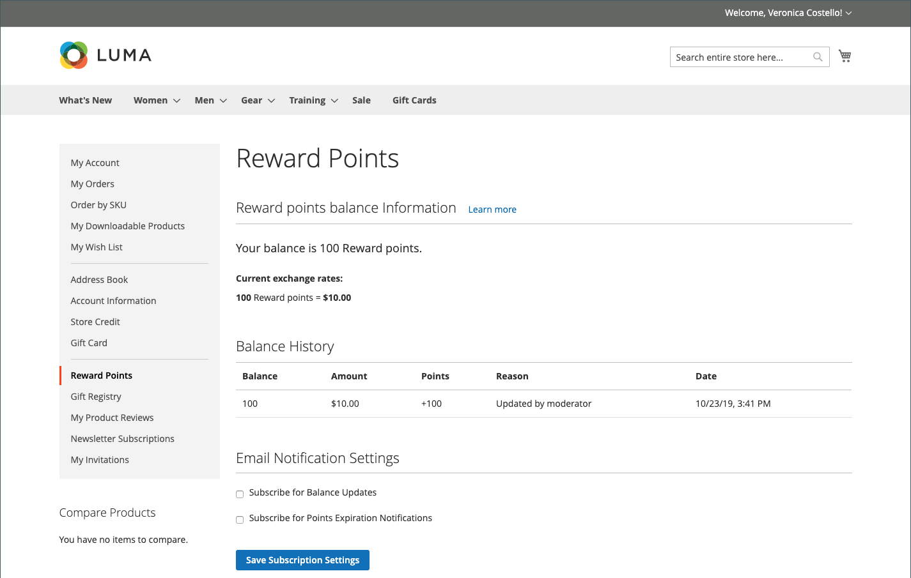

# Reward points storefront experience

{{ee-feature}}

The [Reward Points](rewards-loyalty.md) section of the customer account shows that the current balance of reward points earned by the customer, and a history of their reward point balance.

<!-- zoom -->

## Redeem the reward points during the checkout

If [Reward Exchange Rate](reward-exchange-rates.md) with `Points to Currency` direction is configured, customers can use reward points during the checkout.

1. After adding all needed products into their shopping cart, the customer navigates to checkout.

1. Enters all required shipping information and navigates to the _Review & Payments_ step.

1. In the _[!UICONTROL Reward points]_ section, checks the number of available points and their currency value.

1. Clicks **[!UICONTROL Use reward points]**.

<!-- zoom -->

The available points discount is applied to the subtotal.

>[!NOTE]
>
>If the available balance is greater than the grand total for the order, another payment method is not required.
