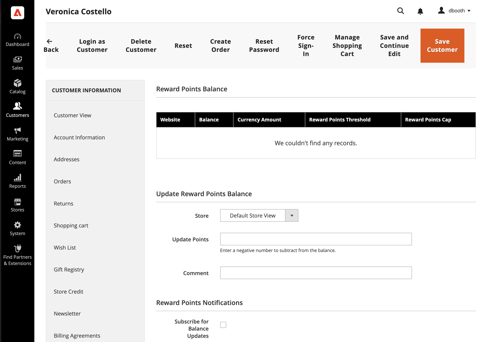

# Reward and loyalty programs

{{ee-feature}}

The _reward points_ system in Adobe Commerce gives you the ability to implement unique programs that drive customer engagement and promote customer loyalty. Points can be awarded for a wide range of transaction and customer activities, and the configuration can be set to control the point allotment, balance, and expiration. Customers can redeem points toward purchases, based on the conversion rate that you establish between reward points and currency.

## Shopping cart price rules

Points can be rewarded to customers based on a [shopping cart rule](price-rules-cart.md). They can be rewarded as the only action of the price rule, or along with a discount.

## Customer balance

Reward point balances can be managed by Admin users per customer. If enabled in the storefront, customers can also view the details of their points balance.

## Redeeming points

>[!NOTE]
>
>[Reward Exchange Rates](reward-exchange-rates.md) configuration is required for redemption of reward points by customers and Admin users during checkout.

Points can be redeemed by Admin users and customers (if enabled) during checkout. In the Payment Method section, a Use my Reward Points checkbox appears above the enabled payment methods. The available points and monetary exchange rate is included. If the available balance is greater than the grand total of the order, no additional payment method is required. The number of reward points that are applied to the order appears with the order totals, subtracted from the grand total, similar to a store credit or gift cards. If reward points are used along with store credit or a gift card, the reward points are deducted first. The store credit or gift card is then deducted if the order total is greater than the redeemable number of reward points.

>[!NOTE]
>
>Reward points are not recommended for use with COD purchases, because receipt of payment cannot be confirmed until after the order is invoiced.

## Refund to reward points

Orders placed with reward points can be refunded to the reward points balance up to the amount redeemed in the order. On the [_New Credit Memo_ page](../stores-purchase/credit-memo-create.md), the number of points to be applied to the customer's balance can be entered. By default, the field contains the full number of points that were used in the order.

## Enable reward point operations for your store

The Reward Points configuration determines how reward points are presented in the store and defines the basic operating parameters.

{width="600" zoomable="yes"}

### Step 1. Configure the reward points

1. On the _Admin_ sidebar, go to **[!UICONTROL Stores]** > _[!UICONTROL Settings]_ > **[!UICONTROL Configuration]**.

1. In the left panel, expand **[!UICONTROL Customers]** and choose **[!UICONTROL Reward Points]**.

1. Expand  the **[!UICONTROL Reward Points]** section and do the following:

   - To activate reward points, set **[!UICONTROL Enable Reward Points Functionality]** to `Yes`.

   - To allow customers to earn their own reward points, set **[!UICONTROL Enable Reward Points Functionality on Storefront]** to `Yes`.

   - To allow customers to see a detailed history of their rewards, set **[!UICONTROL Customers May See Reward Point History]** to `Yes`.

1. For **[!UICONTROL Reward Points Balance Redemption Threshold]**, enter the number of points that must accrue before they can be redeemed (blank for no minimum).

1. For **[!UICONTROL Cap Reward Points Balance At]**, enter the maximum number of points a customer can accrue (blank for no limit).

1. For **[!UICONTROL Reward Points Expire in (days)]**, enter the number of days before the reward points expire (blank for no expiration).

1. Set **[!UICONTROL Reward Points Expiry Calculation]** to one of the following:

   - `Static` - Determines the remaining lifetime of reward points based on the number of days set in the configuration. If the expiration limit in the configuration changes, the expiration date of existing points does not change.
   
   - `Dynamic` - Calculates the remaining number of days whenever the reward point balance increases. If the expiration limit in the configuration changes, the expiration of all existing points update accordingly.

1. If you want to refund available reward points automatically, set **[!UICONTROL Refund Reward Points Automatically]** to `Yes`.

1. To void reward points earned through purchases when the order that earned the points is fully or partially refunded, set **[!UICONTROL Deduct Reward Points from Refund Amount Automatically]** to `Yes`.

   >[!NOTE]
   >
   >Only the points earned with the order that is being refunded are affected.

1. Set **[!UICONTROL Landing Page]** to the content page that explains your reward points program.

   Make sure to update the default Rewards Points page with your own information.

1. When complete, click **[!UICONTROL Save Config]**.

### Step 2. Configure points earned for customer activities

In this step, the number of reward points that can be earned for various customer activities is specified. When customers complete an action that has points assigned, a message appears to the customer that indicates how many points they have earned.

1. Expand  the **[!UICONTROL Actions for Acquiring Reward Points by Customer]** section.

   {width="600" zoomable="yes"}

1. To allow reward points to be earned for the purchases based on the configured [Reward Exchange Rates](reward-exchange-rates.md), set **[!UICONTROL Purchase]** to `Yes`.

   >[!NOTE]
   >
   >To earn reward points for their _first_ order, the customer must be registered _before_ the transaction is captured by the payment method. Most payment methods could be configured to capture transactions _automatically_ when the order is placed, but _before_ the customer account registration is finished.

1. For **[!UICONTROL Registration]**, enter the number of points earned for opening a customer account.

1. For **[!UICONTROL Newsletter Signup]**, enter the number of points earned by registered customers who subscribe to a newsletter.

1. For **[!UICONTROL Converting Invitation to Customer]**, enter the number of points earned by a customer who sends an invitation and the recipient then opens a customer account.

   You can limit the number of invitation conversions that can be used to earn points for the customer who sends the invitation (blank for no limit). To do this, enter a number in the **[!UICONTROL Invitation to Customer Conversions Quantity Limit]** field.

1. For **[!UICONTROL Converting Invitation to Order]**, enter the number of points earned by a customer who sends an invitation to the recipient who then places an order and do the following:

   - For **Invitation to Order Conversions Quantity Limit**, enter the number of points earned by the customer sending the invitation when the recipient places an initial order (blank for no limit).

   - For **[!UICONTROL Invitation Conversion to Order Reward]**, select the `Each` option to earn points for each placed by recipient order, or select the `First` option to earn points only for the first placed order by the recipient.

1. For **[!UICONTROL Review Submission]**, enter the number of points earned by a customer who submits a review that is approved for publication.

1. Then to limit the number of reviews that can be used to earn points per customer, enter the number in the **[!UICONTROL Rewarded Reviews Submission Quantity Limit]** field (blank for no limit).

1. When complete, click **[!UICONTROL Save Config]**.

### Step 3. Complete the email notification settings

1. Expand  the **[!UICONTROL Email Notification Settings]** section.

    {width="600" zoomable="yes"}

1. Set **[!UICONTROL Email Sender]** to the store contact that appears as the sender of balance updates and expiration notifications.

1. If you want to subscribe customers by default to be notified of balance updates and upcoming expiration dates, set **[!UICONTROL Subscribe Customers by Default]** to `Yes`.

1. Set **[!UICONTROL Balance Update Email]** to the template used for the notification that is sent to customers whenever their point balance is updated.

1. Set **[!UICONTROL Reward Points Expiry Warning Email]** to the template used for the notification that is sent to customers when the expiration limit for a batch of points is reached.

1. For **[!UICONTROL Expiry Warning Before (days)]**, enter the number of days before points expire that notification is sent.

1. When complete, click **[!UICONTROL Save Config]**.

## Update the reward points balance

The reward points balance can be updated from the Admin.

1. On the _Admin_ sidebar, go to **[!UICONTROL Customers]** > **[!UICONTROL All Customers]**.

1. Find the customer in the grid and click **[!UICONTROL Edit]** in the _[!UICONTROL Action]_ column.

1. Under _Customer Information_, choose the **[!UICONTROL Reward Points]** section.

1. Enter the number of **[!UICONTROL Update Points]**:

   - To update the reward points amount, enter the number to increase the total points balance.
   - To subtract the reward points amount, enter the negative number you want to reduce the total points balance.

1. Enter **[!UICONTROL Comments]** related to the reward points adjustment, if needed.

   {width="700" zoomable="yes"}

1. Optionally, subscribe the customer to _Reward Points Notifications_:

   - **[!UICONTROL Subscribe for Balance Updates]**
   - **[!UICONTROL Subscribe for Points Expiration Notifications]**

1. Click **[!UICONTROL Save Customer]**.

All actions related to reward points are displayed in the customer's _[!UICONTROL Reward Points History]_ block in their account on the storefront.

## Field descriptions

|Field|Description|
|--- |--- |
|[!UICONTROL Balance]|Current balance of reward points for client|
|[!UICONTROL Amount Balance]|The amount of the current cash balance|
|[!UICONTROL Points]|The number of added or subtracted points|
|[!UICONTROL Amount]|Amount of money added or subtracted|
|[!UICONTROL Rate]|The [reward exchange rate](reward-exchange-rates.md)|
|[!UICONTROL Website]|Website to which the reward points history is assigned|
|[!UICONTROL Reason]|Reasons for awarding points: **[!UICONTROL Making purchases]** — Every time the customer makes a purchase, they can earn points. **[!UICONTROL Registering on the site]** - Accrued upon registration (once). **[!UICONTROL Subscribing to a newsletter]** - Accrued for the first-time subscription (once). **[!UICONTROL Sending Invitations]** — Earn points by inviting their friends to join the site. **[!UICONTROL Converting Invitations to Customer]** — Earn points for every invitation that they send out, leading friends registering on the site. **[!UICONTROL Converting Invitations to Order]** — Earn points for each sale resulting from a sent invitation. **[!UICONTROL Review Submission]** — Earn points for submitting product reviews.|
|[!UICONTROL Created]|Date and time of reward points update|
|[!UICONTROL Expired]|Number of expired reward points|
|[!UICONTROL Comment]|Comments when adding or subtracting points|

{style="table-layout:auto"}

