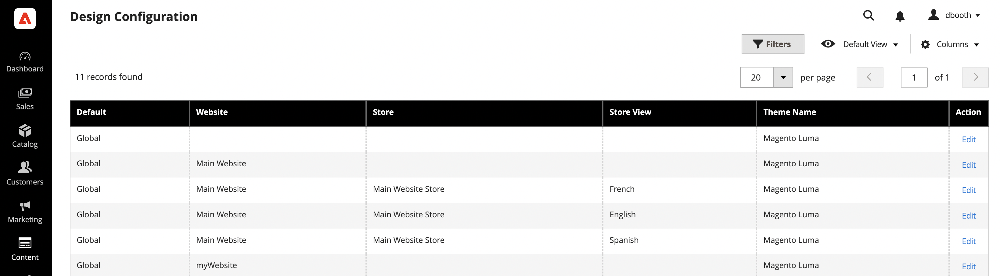
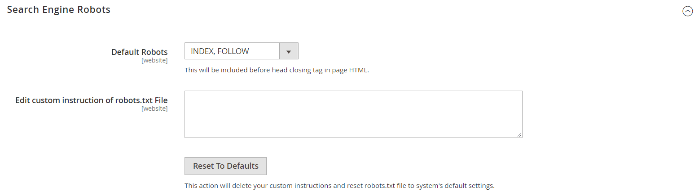

# SEO overview

_Search engine optimization_ (SEO) is the practice of fine-tuning the content and presentation of a site to improve the way the pages are indexed by search engines. Commerce includes various features to support your ongoing SEO effort.

>[!TIP]
>
>For Adobe Commerce as a Cloud Service, see the [SEO guidelines](https://experienceleague.adobe.com/developer/commerce/storefront/setup/seo/indexing/) in the Commerce Storefront documentation

## Metadata

[!BADGE PaaS only]{type=Informative url="https://experienceleague.adobe.com/en/docs/commerce/user-guides/product-solutions" tooltip="Applies to Adobe Commerce on Cloud projects (Adobe-managed PaaS infrastructure) and on-premises projects only."}

Learn more about adding and enhancing keyword-rich [metadata](meta-data.md) for your site and store.

## Using a sitemap

[!BADGE PaaS only]{type=Informative url="https://experienceleague.adobe.com/en/docs/commerce/user-guides/product-solutions" tooltip="Applies to Adobe Commerce on Cloud projects (Adobe-managed PaaS infrastructure) and on-premises projects only."}

A [site map](sitemap-xml.md) improves the way that your store is indexed by search engines, and is designed to find pages that might be overlooked by web crawlers. A site map can be configured to index all pages and images.

## URL rewrites

[!BADGE PaaS only]{type=Informative url="https://experienceleague.adobe.com/en/docs/commerce/user-guides/product-solutions" tooltip="Applies to Adobe Commerce on Cloud projects (Adobe-managed PaaS infrastructure) and on-premises projects only."}

The [URL Rewrite](url-rewrite.md) tool lets you change any URL that is associated with a product, category, or CMS page.

## Search engine robots

The Commerce configuration includes settings to generate and manage instructions for web crawlers and bots that index your site. If the request for `robots.txt` reaches Commerce (rather than a physical file), it is dynamically routed to the robots controller. The instructions are directives that are recognized and followed by most search engines.

By default, the robots.txt file that is generated by Commerce contains instructions for web crawler to avoid indexing certain parts of the site that contain files that are used internally by the system. You can use the default settings, or define your own custom instructions for all, or for specific search engines. There are many articles online that explore the subject in detail.

### Custom instructions example

**Allows Full Access**

    User-agent:*
    Disallow:

**Disallows Access to All Folders**

    User-agent:*
    Disallow: /

**Default Instructions**

    User-agent: *
    Disallow: /index.php/
    Disallow: /*?
    Disallow: /checkout/
    Disallow: /app/
    Disallow: /lib/
    Disallow: /*.php$
    Disallow: /pkginfo/
    Disallow: /report/
    Disallow: /var/
    Disallow: /catalog/
    Disallow: /customer/
    Disallow: /sendfriend/
    Disallow: /review/
    Disallow: /*SID=

### Configure `robots.txt`

1. On the _Admin_ sidebar, go to **[!UICONTROL Content]** > _[!UICONTROL Design]_ > **[!UICONTROL Configuration]**.

1. Find the **[!UICONTROL Global]** configuration in the first row of the grid and click **[!UICONTROL Edit]**.

   {width="700" zoomable="yes"}

1. Scroll down and expand  the **[!UICONTROL Search Engine Robots]** section and do the following:

    {width="600" zoomable="yes"}

    - Set **[!UICONTROL Default Robots]** to one of the following:

      |Option| Description|
      |------|------------|
      |`INDEX, FOLLOW`|Instructs web crawlers to index the site and to check back later for changes.|
      |`NOINDEX, FOLLOW`|Instructs web crawlers to avoid indexing the site, but to check back later for changes.|
      |`INDEX, NOFOLLOW`|Instructs web crawlers to index the site once, but to not check back later for changes.|
      |`NOINDEX, NOFOLLOW`|Instructs web crawlers to avoid indexing the site, and to not check back later for changes.|

      {style="table-layout:auto"}

    - If needed, enter custom instructions into the **[!UICONTROL Edit Custom instruction of robots.txt file]** box. For example, while a site is in development, you might want to disallow access to all folders.

    - To restore the default instructions, click **[!UICONTROL Reset to Default]**.

1. When complete, click **[!UICONTROL Save Configuration]**.
