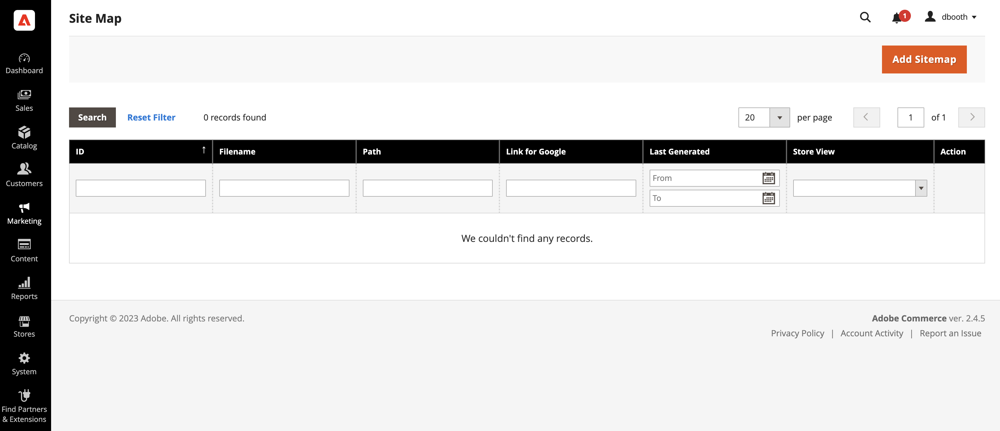
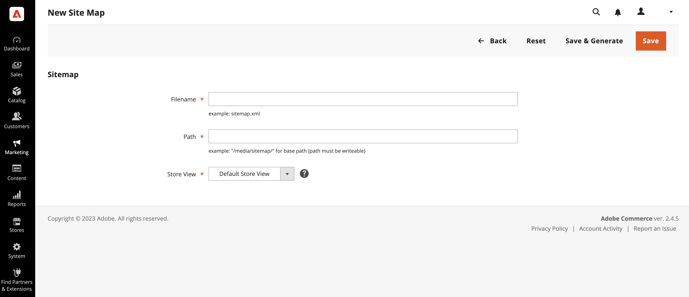
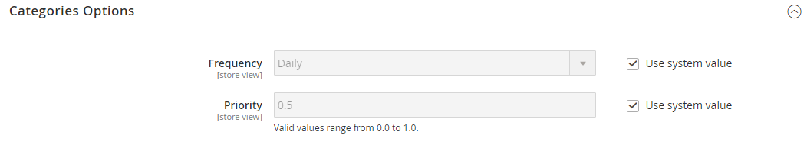
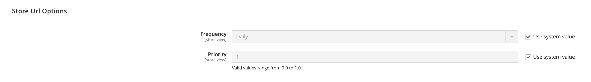
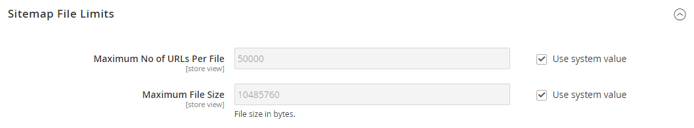

# Site maps

A site map improves the way your store is indexed by search engines, and is specifically designed to find pages that might be overlooked by web crawlers. A site map can be configured to index all pages and images.

When enabled, Commerce creates a file called `sitemap.xml` that is saved to your installation in the location that you specify. The configuration gives you the ability to set the frequency of the updates, and the priority for each type of content. Your site map should be updated as frequently as the content on your site changes, which might be daily, weekly, or monthly.

While your site is in development, you might include instructions in the `robots.txt` file for web crawlers to avoid indexing the site. Then before the launch, you can change the instructions to allow the site to be indexed.

For technical information, see [Add sitemap and robots.txt][1]{:target="_blank"} in the developer documentation.

<!-- zoom -->

## Step 1. Configure the site map

Complete the [XML Sitemap configuration](sitemap-xml-configure.md) to determine what is included, and how frequently the site map is updated.

## Step 2. Generate the site map

1. On the _Admin_ menu, go to **Marketing** > _SEO & Search_ > **Site Map**.

1. Click **Add Site Map** and do the following:

    <!-- zoom -->

    - Enter the site map **Filename**. For example: `sitemap.xml`

    - Enter the **Path** to determine where the site map file is to reside on the server. Make sure that the path is writeable.

      - `/sitemap/` - Places the site map file in a directory called _sitemap_.

      - `/` - Places the site map file at the base path, or root of your Commerce installation.

   <!-- zoom -->

1. When complete, click **Save & Generate**.

    It might take a few minutes for the site map to appear in the grid.

## Step 3. Configure and enable robots.txt (optional)

Complete the [search engine robots](seo-overview.md#search-engine-robots) configuration with instructions that direct search engines to crawl the parts of your site that you want to be indexed.

## Step 4. Submit your site map to search engines

You can submit your site map to different search engines by providing them the link to the `sitemap.xml` file in your Commerce installation. To copy the link, do the following:

1. In the Site Map grid, right-click the URL in the **Link for Google** column.

1. On the menu, choose **Copy Link Address**.

For more information, see the instructions for the specific search engine. Here are links to instructions for two top search engines:

- [Google][2]
- [Microsoft Bing][3]

## Step 5: Restore previous robot instructions (optional)

You can now restore either the original (default) restrictions.

## Manage sitemaps and robots.txt for multiple websites

If you have multiple websites, you can simplify the process of creating and submitting sitemaps by [creating](sitemap-xml-configure.md) one or more sitemaps that include URLs for all your verified stores, and saving the sitemaps to a single location. All sites must be verified in [Google Search Console](https://support.google.com/webmasters/answer/7451001).

To create sitemaps for a multistore instance, do the following:

1. Create a new folder called `sitemaps` at the root of your website, then create subfolders for each domain:

       /sitemaps/domain_1/
       /sitemaps/domain_2/

1. On the _Admin_ sidebar, go to **Marketing** > _SEO & Search_ > **Site Map**.

1. Create or edit the sitemap listings for each store and set the **Path** to the one you created for the store:

       /sitemaps/domain_1/
       /sitemaps/domain_2/

1. If needed, update your robots.txt file.

   To make sure that the search engine spiders are properly directed to the new sitemaps, you might need to update or create the robots.txt file and add the following lines at the top.

Website Sitemap

    Sitemap: http://www.domain_1.com/sitemaps/domain_1/sitemap.xml
    Sitemap: http://www.domain_2.com/sitemaps/domain_2/sitemap.xml

>[!NOTE]
>
>If your site uses the [Apache](https://experienceleague.adobe.com/docs/commerce-operations/installation-guide/prerequisites/web-server/apache.html) web server engine, you should update the [.htaccess](https://httpd.apache.org/docs/current/howto/htaccess.html) file in the root of your website to direct any other sitemap requests to the proper place.

## Column descriptions

|Column|Description|
|------|-----------|
|ID|The sequential record number of the current site map.|
|Filename|The file name of the site map.|
|Path|The location where the site map resides on the server. For example:  `/sitemap/` - Places the site map file in a directory called _sitemap_, one level below the root of the Commerce installation.  `/` - Places the site map file at the base path, or root of the Commerce installation.|
|Link for Google|The URL of the site map that is to be submitted to Google and other search engines.|
|Last Generated|Indicates the date and time the site map was last generated.|
|Store View|The store view where the site map applies.|
|Generate|Regenerates the site map.|

## Site map configuration

Your site map should be updated as frequently as the content on your site changes, which could be on a daily, weekly, or monthly basis. The configuration lets you set the frequency and priority for each type of content.

### Step 1. Set the frequency and priority of content updates

1. On the _Admin_ sidebar, go to **Stores** > _Settings_ > **Configuration**.

1. In the left panel, expand **Catalog** and choose **XML Sitemap**.

1. Expand  the **Categories Options** section and do the following:

   If needed, clear the **Use system value** checkbox to change these settings.

   - Set **Frequency** to one of the following:

      - `Always`
      - `Hourly`
      - `Daily`
      - `Weekly`
      - `Monthly`
      - `Yearly`
      - `Never`

   - For **Priority**, enter a value between 0.0 and 1.0. Zero has the lowest priority.

   <!-- zoom -->

   For a detailed list of these options, see [Categories Options](https://docs.magento.com/user-guide/configuration/catalog/xml-sitemap.html#categories-options) in the _Configuration Reference_.

1. Expand  the **Products Options** section and complete the **Frequency** and **Priority** settings as needed.

   For a detailed list of these options, see [Products Options](https://docs.magento.com/user-guide/configuration/catalog/xml-sitemap.html#products-options) in the _Configuration Reference_.

1. To determine the extent that images are included in the sitemap, set **Add Images into Sitemap** to one of the following:

   - `None`
   - `Base Only`
   - `All`

   <!-- zoom -->

1. Expand  the **CMS Pages Options** section and complete the **Frequency** and **Priority** settings as needed.

   <!-- zoom -->

   For a detailed list of these options, see [CMS Pages Options](https://docs.magento.com/user-guide/configuration/catalog/xml-sitemap.html#cms-pages-options) in the _Configuration Reference_.

1. Expand  the **Store Url Options** section and complete the **Frequency** and **Priority** settings as needed.

   <!-- zoom -->

   For a detailed list of these options, see [Store Url Options](https://docs.magento.com/user-guide/configuration/catalog/xml-sitemap.html#store-url-options) in the _Configuration Reference_.

1. When complete, click **Save Config**.

### Step 2. Complete the generation settings

1. Expand  the **Generation Settings** section.

   If needed, clear the **Use system value** checkbox to change these settings.

   <!-- zoom -->

   For a detailed list of these options, see [Generation Settings](https://docs.magento.com/user-guide/configuration/catalog/xml-sitemap.html#generation-settings) in the _Configuration Reference_.

1. To generate a sitemap, set **Enabled** to `Yes` and do the following:

   - Set **Start Time** to the hour, minute, and second that you want the sitemap to be updated.

   - Set **Frequency** to one of the following:

      - `Daily`
      - `Weekly`
      - `Monthly`

   - In the **Error Email Recipient** field, enter the email address of the person who is to receive notification if an error occurs during a sitemap update.

   - Set **Error Email Sender** to the store contact who appears as the sender of the error notification.

   - Set **Error Email Template** to the template used for the error notification.

### Step 3. Set the site map file limits

1. Expand  the **Sitemap File Limits** section.

   If needed, clear the **Use system value** checkbox to change these settings.

   <!-- zoom -->

   For a detailed list of these options, see [Sitemap File Limits](https://docs.magento.com/user-guide/configuration/catalog/xml-sitemap.html#sitemap-file-limits) in the _Configuration Reference_.

1. For **Maximum No of URLs per File**, enter the maximum number of URLs that can be included in the sitemap. By default, the limit is 50,000.

1. For **Maximum File Size**, enter the largest size in bytes that is allocated for the sitemap. The default size is 10,485,760 bytes.

## Step 4. Set the search engine submission settings

1. Expand  the **Search Engine Submission Settings** section.

   If needed, clear the **Use system value** checkbox to change these settings.

   <!-- zoom -->

   For a detailed list of these options, see [Search Engine Submission Settings](https://docs.magento.com/user-guide/configuration/catalog/xml-sitemap.html#search-engine-submission-settings) in the _Configuration Reference_.

1. If using a `robots.txt` file to provide instructions to search engines that crawl your site, set **Enable Submission to Robots.txt** to `Yes`.

1. When complete, click **Save Config**.

[1]: https://devdocs.magento.com/cloud/trouble/robots-sitemap.html
[2]: https://support.google.com/webmasters/answer/183669?hl=en
[3]: https://www.bing.com/webmasters/help/Sitemaps-3b5cf6ed
