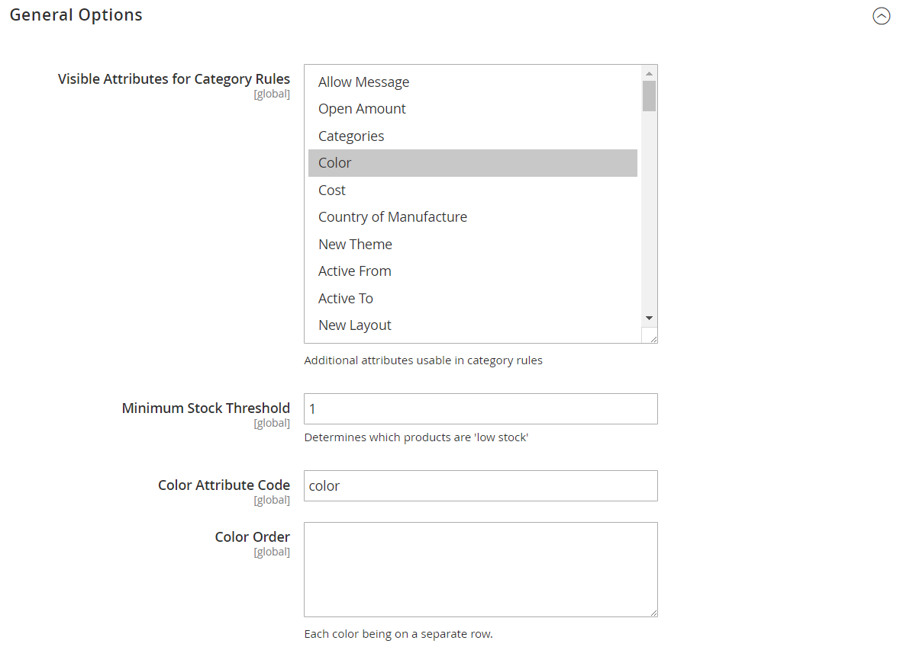

# Configure smart attributes for Visual Merchandiser

{{ee-feature}}

The Visual Merchandiser configuration determines the attributes that can be used in the merchandising window and the minimum stock threshold. The configuration also identifies the attribute used for color and the order of color values.

1. On the _Admin_ sidebar, go to **[!UICONTROL Stores]** > _[!UICONTROL Settings]_ > **[!UICONTROL Configuration]**.

1. In the left panel, expand **[!UICONTROL Catalog]** and choose **[!UICONTROL Visual Merchandiser]** underneath.

1. Expand  the **[!UICONTROL General Options]** section.

   <!-- zoom -->
   
1. In the **[!UICONTROL Attributes for Category Rules]** list, select each attribute that you want to make available for visual merchandising.
   
   To select multiple attributes, hold down the Ctrl key (PC) or the Command key (Mac) and click each item.

1. Enter the **[!UICONTROL Minimum Stock Threshold]** for a product to appear in the Visual Merchandiser window.

1. Enter the **[!UICONTROL Color Attribute Code]**.

   The default value is `color`. If your catalog uses a different attribute, enter the attribute name in lowercase.

1. For **[!UICONTROL Color Order]**, enter each color value on a separate line and in sequence to determine the priority of each color.

1. When complete, click **[!UICONTROL Save Config]**.
