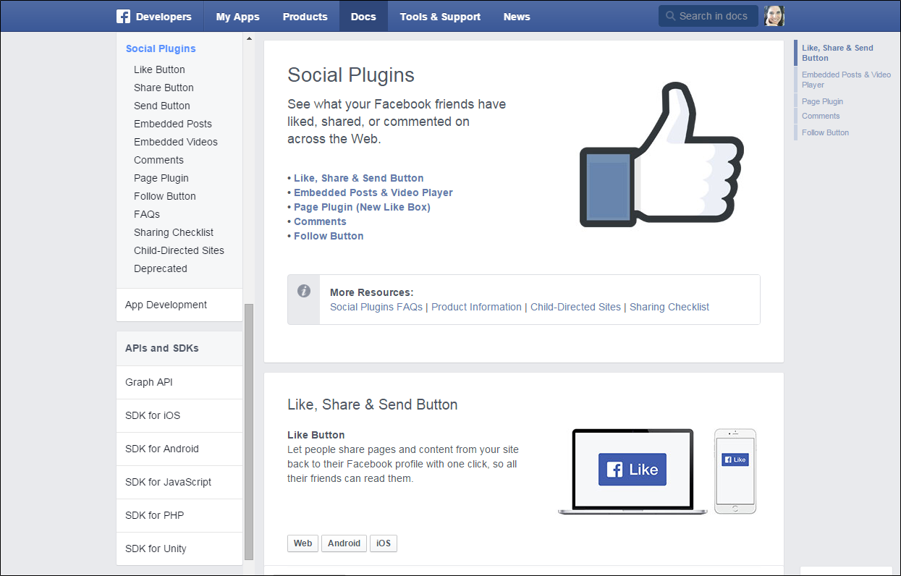
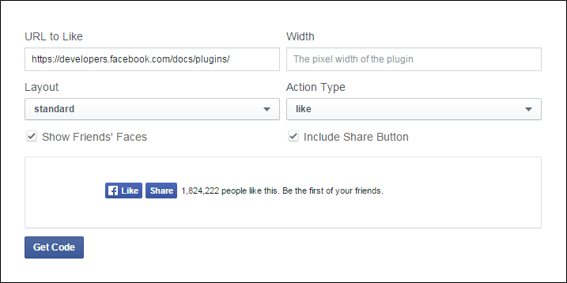
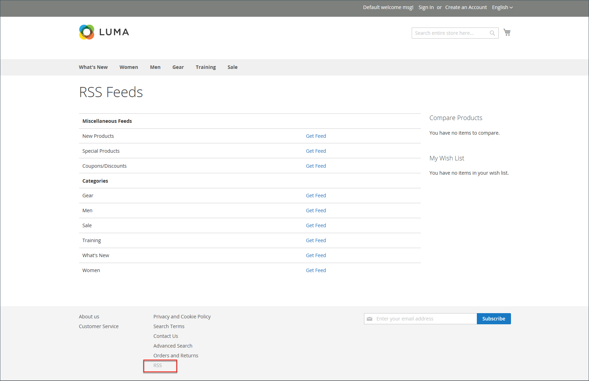
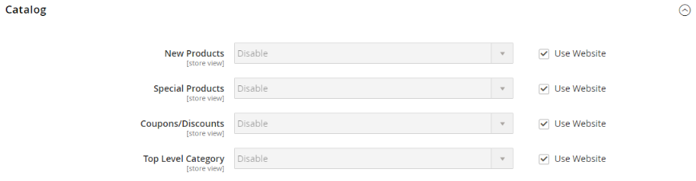
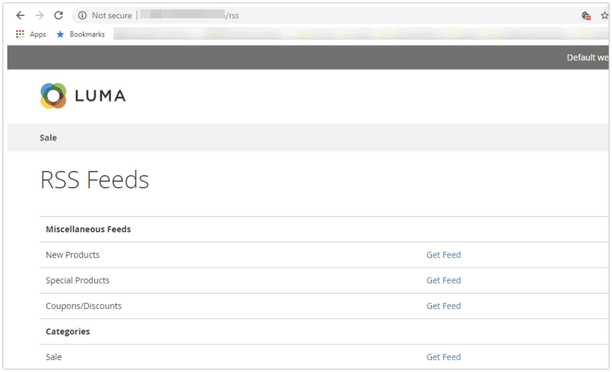

# Social media and RSS feeds

Many merchants use social media and other digital tools to build brand and product awareness. You can integrate your store with your social networks by installing a Marketplace extension or adding a plugin to your content pages. Use RSS feeds to publish your product information to shopping aggregation sites, and even include them in your newsletters. Customers can subscribe to your RSS feeds to learn about new products and promotions.

## Social networks

Your store can be connected to social networks by installing a [Marketplace extension](../getting-started/commerce-marketplace.md). In addition, you can easily add social plugins such as the _Like_ button to CMS blocks that can be incorporated into pages throughout your store. 

Social networking sites have a numerous plugins that can easily be added to your store. In addition, there are many extensions on the Commerce Marketplace that can be used to integrate your store with social media. The following example shows how to add a Facebook _Like_ button to your store.

<!-- zoom -->

>[!NOTE]
>
>Adobe Commerce has removed the native _Magento Social_ Facebook integration and no longer supports the extension. Go to the [Commerce Marketplace](https://marketplace.magento.com/catalogsearch/result/?q=Facebook){:target="_blank"} to locate alternative extensions for Facebook integration.

### Step 1. Get the button code

1. On the Meta developers website, go to the [button setup](https://developers.facebook.com/docs/plugins/like-button) page.

1. For **[!UICONTROL URL to Like]**, enter the URL of the page in your store that you want people to _Like_.
   
   For example, you might enter the URL of your store's home page.

1. Choose the **[!UICONTROL Layout]** for the button.

1. Enter the **[!UICONTROL Width]** in pixels that is available on your site for the button and any associated text message.

1. Set **[!UICONTROL Action Type]** to one of the following:

   - `Like`
   - `Recommend`

1. Click **[!UICONTROL Get Code]** to copy the generated code to the clipboard.

   <!-- zoom -->

### Step 2. Create a content block

1. Return to your store Admin.

1. On the _Admin_ sidebar, go to **[!UICONTROL Content]** > _[!UICONTROL Elements]_ > **[!UICONTROL Blocks]**.

1. In the upper-right corner, click **[!UICONTROL Add New Block]**.

1. Enter a descriptive **[!UICONTROL Block Title]** for internal reference.

   For example: `Facebook Like Button`.

1. Assign a unique **[!UICONTROL Identifier]** to the block, using all lowercase characters, and underscores instead of spaces.

   For example: `facebook_like_button`.

1. If your Commerce instance has multiple store views, choose each **[!UICONTROL Store View]** where the block is to be available.

1. Add the code snippet to the block content, depending on your content tool:

   - When using [!DNL Page Builder], add an [HTML Code](../page-builder/html-code.md) block to the stage and paste the snippet of code that you copied from the Facebook site. Otherwise, paste the snippet of code into the **[!UICONTROL Content]** box.

   - With the editor, paste the snippet of code that you copied from the Facebook site into the **[!UICONTROL Content]** box.

1. If the block is not ready to go live, set **[!UICONTROL Enable Block]** to `No`.

1. When complete, click **[!UICONTROL Save Block]**.

### Step 3. Place the block

1. Add the block, depending on your content tool:

   - When using [!UICONTROL Page Builder], follow the instructions to [add the block](../page-builder/block.md) to the stage.

   - On the _Admin_ sidebar, go to **[!UICONTROL Content]** > _[!UICONTROL Elements]_ > **[!UICONTROL Widgets]**.

1. In the upper-right corner, click **[!UICONTROL Add Widget]** and do the following:

   -  (Available with B2B for Adobe Commerce only) In the _Settings_ section, set **[!UICONTROL Type]** to `CMS Static Block` and click **[!UICONTROL Continue]**.

   - Verify that **[!UICONTROL Design Theme]** is set to the current theme.

   - Click **[!UICONTROL Continue]**.

1. In the **[!UICONTROL Storefront Properties]** section, do the following:

   - For **[!UICONTROL Widget Title]**, enter a title for internal reference.

   - Set **[!UICONTROL Assign to Store Views]** to `All Store Views`, or to the view where you want the app to be available. To select multiple views, hold down the Ctrl key (PC) or the Command key (Mac) and click each option.

   - Enter a number in the **[!UICONTROL Sort Order]** field to determine the order of the block if it assigned to appear in the same location on the page as other content elements. The top position is zero.

1. In the _[!UICONTROL Layout Updates]_ section, click **[!UICONTROL Add Layout Update]** and set **[!UICONTROL Display On]** to the category, product, or page where you want the block to appear.

   For example, if you choose `All Pages` and position the block in either the header or footer, the block appears in the same place on every page of the store.

   To place the block on a specific page, do the following:

   - Set **[!UICONTROL Display On]** to `Specified Page` and select the **[!UICONTROL Page]** where you want the block to appear.

   - Choose the **[!UICONTROL Block Reference]** to identify the place on the page where the block is to be placed.

   - Accept the default setting for **[!UICONTROL Template]**, which is set to `CMS Static Block Default Template`.

   - Click **[!UICONTROL Save and Continue Edit]**.

1. In the panel on the left, choose **[!UICONTROL Widget Options]**.

1. Click **[!UICONTROL Select Block…]** and choose the block that you want to place.

1. When complete, click **[!UICONTROL Save]**.

1. When prompted, follow the instructions at the top of the workspace to update the index and page cache.

   The widget now appears in the _[!UICONTROL Widgets]_ list.

### Step 4. Verify the location in the store

Return to your storefront to verify that the block is in the correct location. To move the block, you can reopen the widget try a different page or block reference.

## RSS feeds

RSS (Really Simple Syndication) is an XML-based data format that is used to distribute information online. Your customers can subscribe to your RSS feeds to learn about new products and promotions. RSS feeds can also be used to publish your product information to shopping aggregation sites, and can be included in newsletters.

When RSS feeds are enabled, any additions to products, specials, categories, and coupons are automatically sent to the subscribers of each feed. A link to all RSS feeds that you publish is in the footer of your store.

 

The software that is required to read an RSS feed is called a feed reader, and allows people to subscribe to headlines, blogs, podcasts, and much more. Google Reader is one of the many feed readers that are available online for free.

<!-- zoom -->

### Benefits of setting up an RSS feed

- Download the latest update from your store or blog
- Light ads
- Ordinary shares
- Boost SEO
- Increase sales

### Types of RSS feeds

|RSS Feed|Description|
|--- |--- |
|[!UICONTROL Wish List]|When enabled, an RSS feed link appears at the top of customer wish list pages. Also, the wish list sharing page includes a checkbox that lets you include a link to the feed from shared wish lists.|
|[!UICONTROL New Products]|Publishes notification of new products added to the catalog.|
|[!UICONTROL Special Products]|Publishes notification of any products with special pricing.|
|[!UICONTROL Coupons / Discounts]|Publishes notification of any special coupons or discounts that are available in the store.|
|[!UICONTROL Top Level Category]|Publishes notification of any change to the top-level category structure of your catalog, which is reflected in the main menu.|
|[!UICONTROL Customer Order Status]|Gives customers the ability to track their order status by RSS feed. When enabled, an RSS feed link appears on the order.|

{style="table-layout:auto"}

### Set up RSS feeds for your store

1. On the _Admin_ sidebar, go to **[!UICONTROL Stores]** > _[!UICONTROL Settings]_ > **[!UICONTROL Configuration]**.

1. In the upper-right corner, set **[!UICONTROL Store View]** to the views where the feeds are to be available.

   If you are prompted to confirm, click **[!UICONTROL OK]**.

1. In the left panel, expand **[!UICONTROL Catalog]** and choose **[!UICONTROL RSS Feeds]**.

1. Expand  the **[!UICONTROL Rss Config]** section and set **[!UICONTROL Enable RSS]** to `Enable`.
    
   <!-- zoom -->

   If necessary, clear the **[!UICONTROL Use Default]** checkbox to change the default value.

1. Expand  the **[!UICONTROL Wish List]** section and set **[!UICONTROL Enable RSS]** to `Enable`.

1. Expand  the **[!UICONTROL Catalog]** section and set other feeds to `Enable` as needed.

   - **[!UICONTROL New Products]**
   - **[!UICONTROL Special Products]**
   - **[!UICONTROL Coupons/Discounts]**
   - **[!UICONTROL Top Level Category]**

   <!-- zoom -->

1. Expand  the **[!UICONTROL Order]** section and set **[!UICONTROL Customer Order Status Notification]** to `Enable`.

1. When complete, click **[!UICONTROL Save Config]**.

1. See result on the storefront with `/rss` at the end of the page URL.

   <!-- zoom -->
