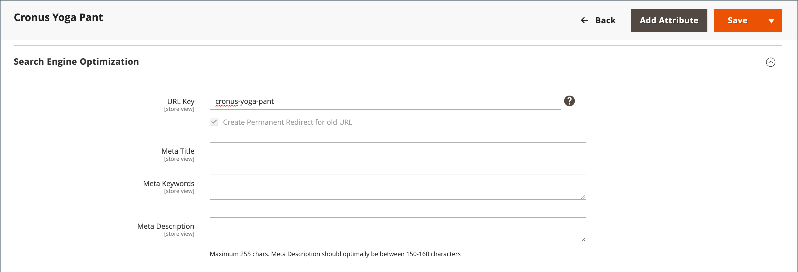
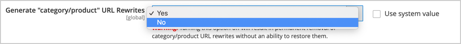

# Automatic redirects

Your store can be configured to automatically generate a permanent redirect whenever the URL key of a product or category changes. In the Search Engine Optimization section, the checkbox below the URL key indicates if permanent redirects are enabled. If your store is already configured to automatically redirect catalog URLs, a redirect is a simple update to the URL key. The process to create an automatic redirect is the same for both products and categories.

>[!NOTE]
>
>When automatic redirects are enabled and you save a category, all product and category rewrites are generated in real time and stored in database tables by default. This could result in significant performance issues for categories with many assigned products. The solution is to change this default and skip the generation of category/products URL rewrites for products on category save. In this case, product rewrites are generated only for the canonical product URL.

## Set up automatic redirects

1. On the _Admin_ sidebar, go to **[!UICONTROL Stores]** > _[!UICONTROL Settings]_ > **[!UICONTROL Configuration]**.

1. In left panel, expand **[!UICONTROL Catalog]** and choose **[!UICONTROL Catalog]** underneath.

1. Expand  the **[!UICONTROL Search Engine Optimization]** section.

1. Set **[!UICONTROL Create Permanent Redirect for URLs if URL Key Changed]** to `Yes`.

1. When complete, click **[!UICONTROL Save Config]**.

    <!-- zoom -->

## Automatically redirect product URLs

1. On the _Admin_ sidebar, go to **[!UICONTROL Catalog]** > **[!UICONTROL Products]**.

1. Find the product in the list and click to open the record.

1. Expand  the **[!UICONTROL Search Engine Optimization]** section.

   <!-- zoom -->

1. For **[!UICONTROL URL Key]**, do the following:

   - Make sure that the **[!UICONTROL Create Permanent Redirect for old URL]** checkbox is selected. If not, follow the instructions to [enable automatic redirects](url-rewrite.md#configure-url-rewrites).

   - Update the **[!UICONTROL URL Key]** as needed, using all lowercase characters and non-trailing hyphens between these characters instead of spaces.

1. When complete, click **[!UICONTROL Save]**.

1. When prompted to refresh the cache, follow the links in the message at the top of the workspace.

   The permanent redirect is now in effect for the product and any associated category URLs.

## Automatically redirect category URLs

1. On the _Admin_ sidebar, go to **[!UICONTROL Catalog]** > **[!UICONTROL Categories]**.

1. Find the category in the tree and click to open the record.

1. Expand  the **[!UICONTROL Search Engine Optimization]** section.

1. For **[!UICONTROL URL Key]**, do the following:

   - Make sure that the **[!UICONTROL Create Permanent Redirect for old URL]** checkbox is selected. If not, follow the instructions to [enable automatic redirects](url-rewrite.md#configure-url-rewrites).

   - Update the **[!UICONTROL URL Key]** as needed, using all lowercase characters and non-trailing hyphens between these characters instead of spaces.

1. When complete, click **[!UICONTROL Save]**.

1. When prompted to refresh the cache, follow the links in the message at the top of the workspace.

   The permanent redirect is now in effect for the category and any associated product URLs.

## Skip generation of product URL rewrites for category save {#skip-rewrite}

>[!WARNING]
>
>Turning off automatic generation of category/products URL rewrites results in permanent removal of all existing category/product type URL rewrites, which cannot be restored. This could potentially cause unresolved category/product type URL conflicts that require a manual update of the URL key to resolve.

1. On the _Admin_ sidebar, go to **[!UICONTROL Stores]** > _[!UICONTROL Settings]_ > **[!UICONTROL Configuration]**.

1. In left panel, expand **[!UICONTROL Catalog]** and choose **[!UICONTROL Catalog]** underneath.

1. Expand  the **[!UICONTROL Search Engine Optimization]** section.

1. Set **[!UICONTROL Generate "category/product" URL Rewrites]** to `No`.

   <!-- zoom -->

1. In the confirmation dialog, click **[!UICONTROL OK]** to confirm the change and the removal of existing URL rewrites.

   <!-- width="350px" -->

1. When complete, click **[!UICONTROL Save Config]**.
