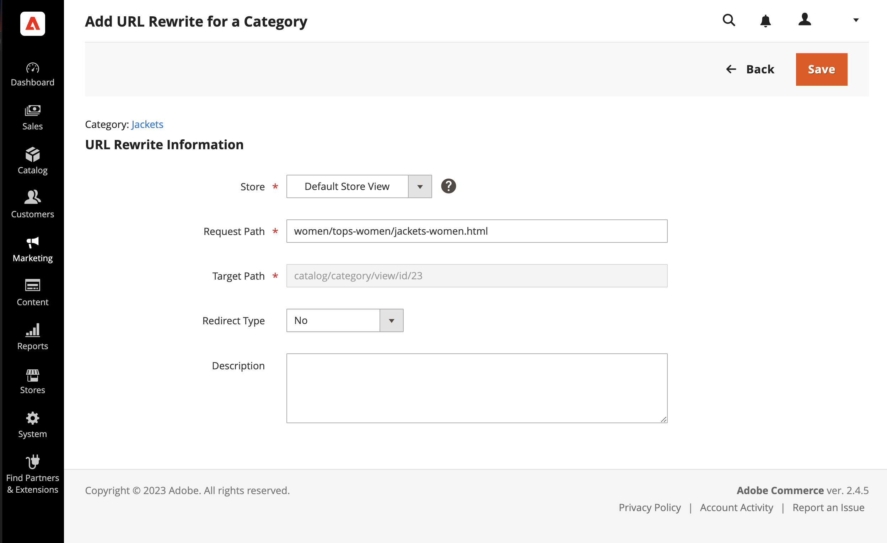
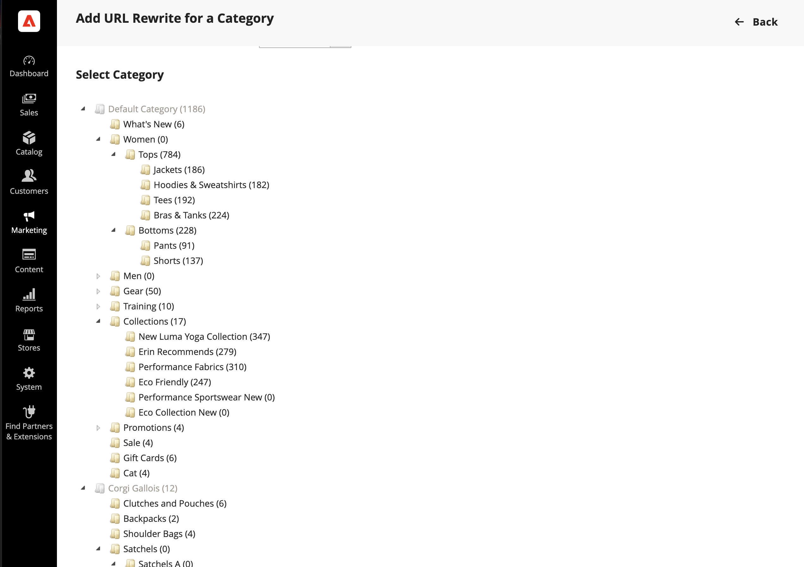
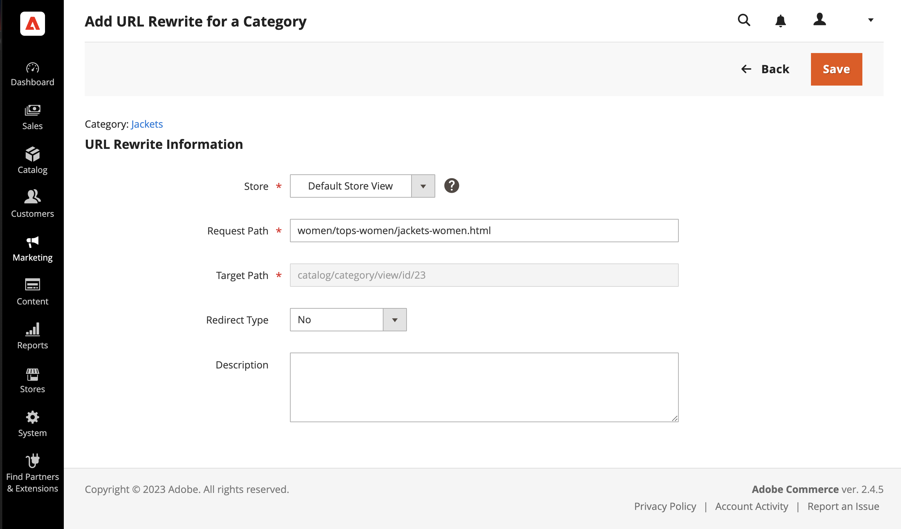
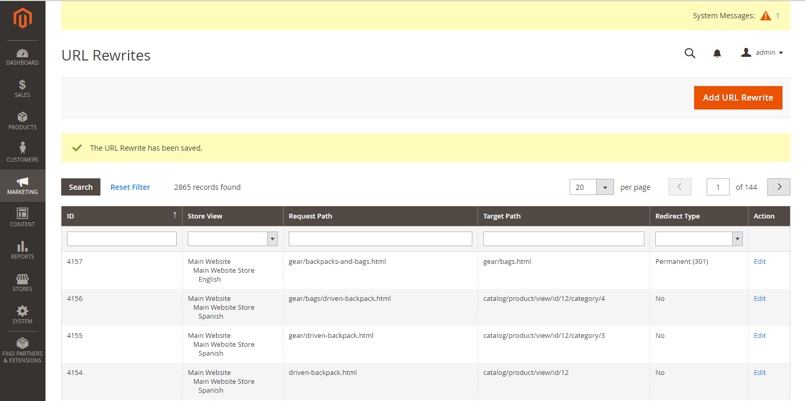

# Category URL rewrites

If a category is removed from your catalog, you can use a category rewrite to redirect links to the URL of another category in your store. Think in terms of _target_ / _original request_  or _redirect to_ / _redirect from_. Although people might still navigate to the former page from search engines or outdated links, the redirect causes your store to switch to the new target.

If [automatic redirects](url-redirect-product-automatic.md) are enabled for your store, there is no need to create a rewrite when a category [URL Key](../catalog/catalog-urls.md) is changed.

<!-- zoom -->

{{url-rewrite-skip}}

## Step 1. Plan the rewrite

To avoid mistakes, write down the _redirect to_ path and _redirect from_ path and include the URL Key and suffix (if applicable).

If you are not sure, open each category page in your store, and copy the path from the address bar of your browser.

**Example:**

Redirect to: `gear/backpacks-and-bags.html`

Redirect from: `gear/bags.html`

## Step 2. Create the rewrite

{{url-rewrite-params}}

1. On the _Admin_ sidebar, go to **[!UICONTROL Marketing]** > _[!UICONTROL SEO & Search]_ > **[!UICONTROL URL Rewrites]**.

1. Before you proceed, do the following to verify that the request path is available:

   - In the search filter at the top of the **[!UICONTROL Request Path]** column, enter the URL key of the category that is to be redirected and click **[!UICONTROL Search]**.

   - If there are multiple redirect records for the page, find the one that matches the applicable store view and open the redirect record in edit mode.

   - In the upper-right corner, click **[!UICONTROL Delete]**. When prompted, click **[!UICONTROL OK]** to confirm.

1. When you return to the _[!UICONTROL URL Rewrites]_ page, click **[!UICONTROL Add URL Rewrite]**.

1. Set **[!UICONTROL Create URL Rewrite]** to `For category` and choose the target category in the tree that is the destination of the redirect.

   <!-- zoom -->

1. In the _URL Rewrite_ section, do the following:

   - If you have multiple stores, select the **[!UICONTROL Store]** where the rewrite applies.

   - For **[!UICONTROL Request Path]**, enter the URL key of the category that the customer requests. This is the _redirect from_ category.

      >[!NOTE]
      >
      >The request path must be unique for the specified store. If there is already a redirect that uses the same request path, you receive an error when you try to save the redirect. The previous redirect must be deleted before you can create one.

   - Set **[!UICONTROL Redirect]** to one of the following:

      - `Temporary (302)`
      - `Permanent (301)`

   - For your reference, enter a brief description of the rewrite.

      <!-- zoom -->

1. Before saving the redirect, review the following:

   - The link in the upper-left corner displays the name of the target category.
   - The Request Path contains the path for the original _redirect from_ category.

1. When complete, click **[!UICONTROL Save]** button.

   The new category rewrite appears at the top of the URL Rewrites grid.

   <!-- zoom -->

## Step 3. Test the result

1. Go to the home page of your store.

1. Do one of the following:

   - Navigate to the original _redirect from_ category.
   - In the address bar of the browser, enter the path to the original _redirect from_ category immediately after the store URL and press **[!UICONTROL Enter]**.

   The new target category appears instead of the original category request.

## Field descriptions

|Field|Description|
|--- |--- |
|[!UICONTROL Create URL Rewrite]|Indicates the type of rewrite. The type cannot be changed after the rewrite is created. Options: `Custom` / `For category` / `For product` / `For CMS page`|
|[!UICONTROL Request Path]|The category that is to be redirected. Depending on your configuration, the request path might include the .html or .htm suffix, and parent category. The request path must be unique, and cannot be in use by another redirect. If you receive an error that the request path exists, delete the existing redirect, and try again.|
|[!UICONTROL Target Path]|The internal path that is used by the system to point to the destination of the redirect. The target path is grayed out and cannot be edited.|
|[!UICONTROL Redirect]|Determines the type of redirect. Options:  **[!UICONTROL No]** - No redirect is specified. Many operations create redirect requests of this type. For example, every time you add products to a category, a redirect of the `No` type is created each store view.  **[!UICONTROL Temporary (302)]** - Indicates to search engines that the rewrite is for a limited time. Search engines generally do not retain page rank information for temporary rewrites.  **[!UICONTROL Permanent (301)]** - Indicates to search engines that the rewrite is permanent. Search engines generally retain page rank information for permanent rewrites.|
|[!UICONTROL Description]|Describes the purpose of the rewrite for internal reference.|

{style="table-layout:auto"}
