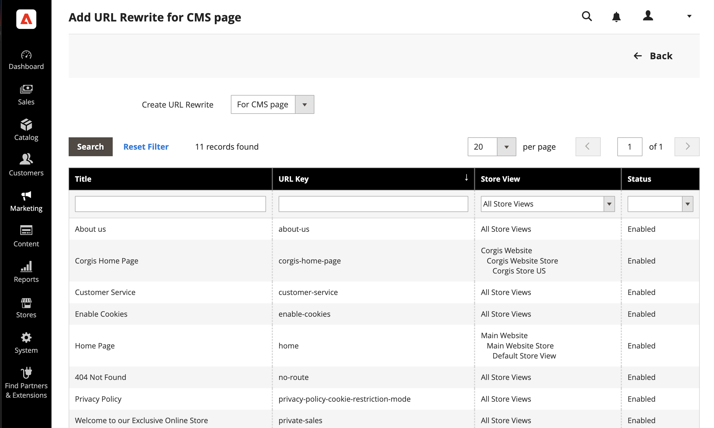
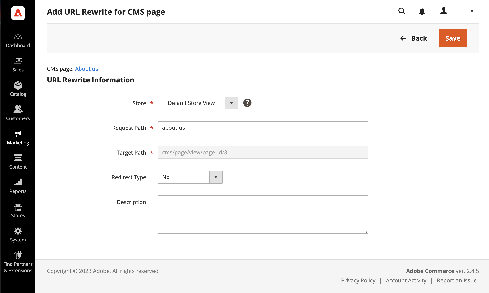

# Content page URL rewrites

Before you begin, make sure that you understand exactly what the redirect is to accomplish. Think in terms of _target_ / _source_ or _redirect to_ / _redirect from_. Although people might still navigate to the former page from search engines or outdated links, the redirect causes your store to switch to the new target.

{width="700" zoomable="yes"}

## Step 1. Plan the rewrite

To avoid mistakes, write down the URL key of the _redirect to_ page and _redirect from_ page.

If you are not sure, open each page in your store, and copy the path from the address bar of your browser.

### CMS page path

Redirect to: `new-page`

Redirect from: `old-page`

## Step 2. Create the rewrite

{{url-rewrite-params}}

1. On the _Admin_ sidebar, go to **[!UICONTROL Marketing]** > _[!UICONTROL SEO & Search]_ > **[!UICONTROL URL Rewrites]**.

1. Before you proceed, do the following to verify that the request path is available.

   - In the search filter at the top of the **[!UICONTROL Request Path]** column, enter the URL key of the page that is to be redirected and click **[!UICONTROL Search]**.

   - If there are multiple redirect records for the page, find the one that matches the applicable store view and open it in edit mode.

   - In the upper-right corner, click **[!UICONTROL Delete]**. When prompted, click **[!UICONTROL OK]** to confirm.

1. When you return to the URL Rewrites page, click **[!UICONTROL Add URL Rewrite]**.

1. Set **[!UICONTROL Create URL Rewrite]** to `for CMS page`.

1. Find your new target page in the grid, and open in edit mode.

   {width="700" zoomable="yes"}

1. Under URL Rewrite Information, do the following:

   - If you have multiple store views, select the **[!UICONTROL Store]** where the rewrite applies.

   - For **[!UICONTROL Request Path]**, enter the URL key of the original page that the customer requests. This is the _redirect from_ page.

      >[!NOTE]
      >
      >The Request Path must be unique for the specified store. If there is already a redirect that uses the same Request Path, you receive an error when you try to save the redirect. The previous redirect must be deleted before you can create one.

   - Set **[!UICONTROL Redirect]** to one of the following:

      - `Temporary (302)`
      - `Permanent (301)`

   - For your reference, enter a brief description of the rewrite.

    {width="600" zoomable="yes"}

1. Before saving the redirect, review the following:

   - The link in the upper-left corner displays the name of the target page.
   - The Request Path contains the path for the original _redirect from_ page.

1. When complete, click **[!UICONTROL Save]**.

    The new rewrite appears in the grid at the top of the list.

## Step 3. Test the result

1. Go to the home page of your store.

1. Do one of the following:

   - Navigate to the original _redirect from_ page.
   - In the address bar of the browser, enter the name of the original _redirect from_ page immediately after the store URL and press **Enter**.

    The new target page appears instead of the original page request.

## Field descriptions

|Field|Description|
|--- |--- |
|[!UICONTROL Create URL Rewrite]|Indicates the type of rewrite. The type cannot be changed after the rewrite is created. Options: `Custom` / `For category` / `For product` / `For CMS page`|
|[!UICONTROL Request Path]|The CMS page that is to be redirected. The request path must be unique, and cannot be in use by another redirect. If you receive an error message that the request path exists, delete the existing redirect, and try again.|
|[!UICONTROL Target Path]|The internal path that is used by the system to point to the destination. The target path is grayed out and cannot be edited.|
|[!UICONTROL Redirect]|Determines the type of redirect. Options:  **[!UICONTROL No]** - No redirect is specified.  **[!UICONTROL Temporary (302)]** - Indicates to search engines that the rewrite is for a limited time. Search engines generally do not retain page rank information for temporary rewrites.  **[!UICONTROL Permanent (301)]** - Indicates to search engines that the rewrite is permanent. Search engines generally retain page rank information for permanent rewrites.|
|[!UICONTROL Description]|Describes the purpose of the rewrite for internal reference.|

{style="table-layout:auto"}
