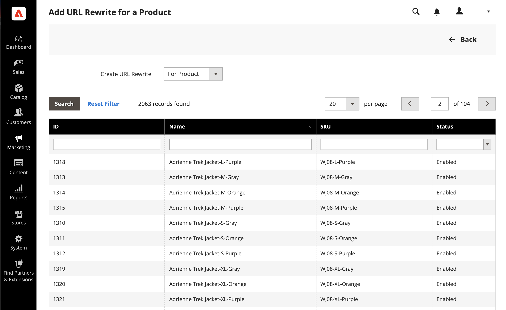
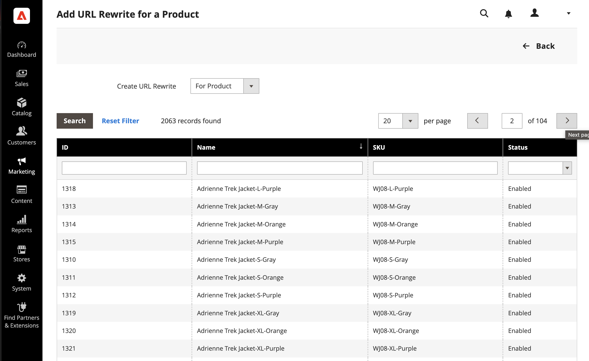
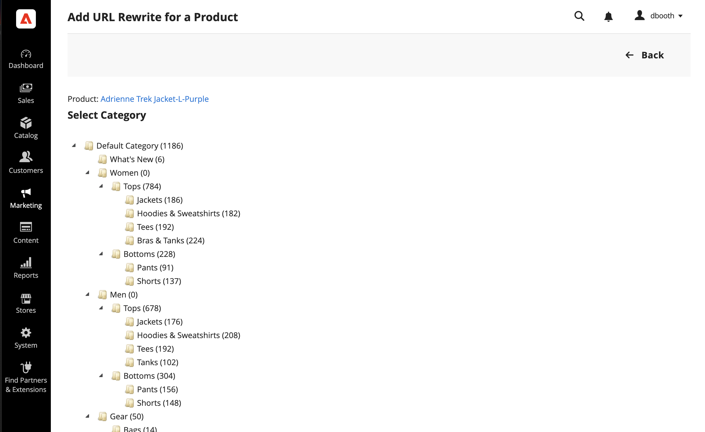
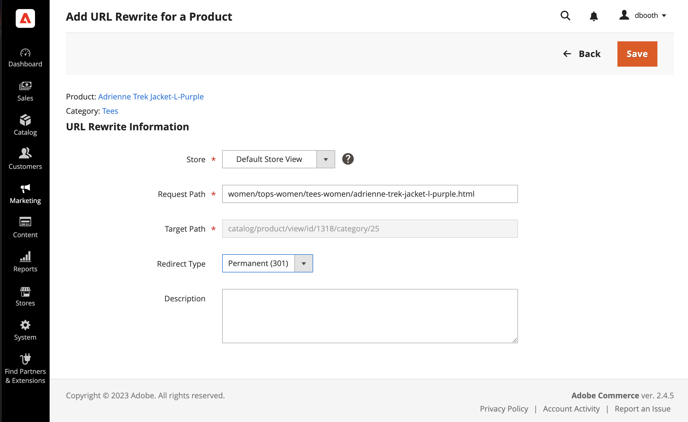
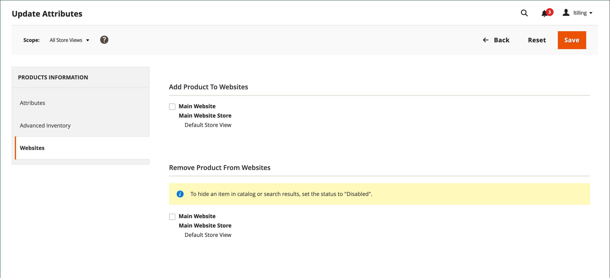

# Product URL rewrites

Before you begin, make sure that you understand exactly what the redirect should accomplish. Think in terms of _target_ / _original request_ or _redirect to_ / _redirect from_. Although people might still navigate to the former page from search engines or outdated links, the redirect causes your store to switch to the new target.

If [automatic redirects](url-redirect-product-automatic.md) are enabled for your store, there is no need to create a rewrite when a product [URL Key](../catalog/catalog-urls.md) is changed.

<!-- zoom -->

{{url-rewrite-skip}}

## Step 1. Plan the rewrite

To avoid mistakes, write down the _redirect to_ path and _redirect from_ path and include the URL Key and suffix (if applicable).

If you are not sure, open each product page in your store, and copy the path from the address bar of your browser. When creating a product redirect, you can either include or exclude the [category path](../catalog/catalog-urls.md). For this example, we create a product redirect without a category path.

### Product with category path

Redirect to: `gear/bags/impulse-duffle.html`

Redirect from: `gear/bags/overnight-duffle.html`

### Product without category path

Redirect to: `impulse-duffle.html`

Redirect from: `overnight-duffle.html`

## Step 2. Create the rewrite

{{url-rewrite-params}}

1. On the _Admin_ sidebar, go to **[!UICONTROL Marketing]** > _[!UICONTROL SEO & Search]_ > **[!UICONTROL URL Rewrites]**.

1. Before you proceed, do the following to verify that the request path is available.

   - In the search filter at the top of the **[!UICONTROL Request Path]** column, enter the URL key of the page to be redirected and click **[!UICONTROL Search]**.

   - If there are multiple redirect records for the page, find the one that matches the applicable store view and open it in edit mode.

   - In the upper-right corner, click **[!UICONTROL Delete]**. When prompted, click **[!UICONTROL OK]** to confirm.

1. In the upper-right corner of the URL Rewrites page, click **Add URL Rewrite**.

1. Set **[!UICONTROL Create URL Rewrite]** to `For product`.

1. In the grid, find the product that is the target (destination) of the redirect and click the row.

   <!-- zoom -->

1. Below the category tree, click **[!UICONTROL Skip Category Selection]**. 

   For this example, the redirect does not include a category.

    <!-- zoom -->

    The Add URL Rewrite for a Product page displays a link to the target in the upper-left corner, and the Target Path field displays the system version of the path, which cannot be changed. Initially, the Redirect Path field also displays the target path.

   - If you have multiple store views, set **[!UICONTROL Store]** to the view where the rewrite applies. Otherwise, a rewrite is created for each view.

   - For **[!UICONTROL Request Path]**, replace the default by entering the URL key and suffix (if applicable) of the original product request. This is the _redirect from_ product that you identified in the planning step.

      >[!NOTE]
      >
      >The request path must be unique for the specified store. If there is already a redirect that uses the same request path, you receive an error when you try to save the redirect. The previous redirect must be deleted before you can create one.

   - Set **[!UICONTROL Redirect Type]** to one of the following:

      - `Temporary (302)`
      - `Permanent (301)`

   - For your own reference, enter a brief **[!UICONTROL Description]** of the rewrite.

    <!-- zoom -->

1. Before saving the redirect, review the following:

   - The link in the upper-left corner displays the name of the target product.
   - The Request Path contains the path for the original _redirect from_ product.

1. When complete, click **[!UICONTROL Save]**.

    The new product rewrite now appears at the top of the URL Rewrites grid.

## Step 3. Test the result

1. Go to the home page of your store.

1. Do one of the following:

   - Navigate to the original _redirect from_ product request page.
   - In the address bar of the browser, enter the path to the original _redirect from_ product immediately after the store URL and press **Enter**.

   The new target product appears instead of the original product request.

## Field descriptions

|Field|Description|
|--- |--- |
|[!UICONTROL Create URL Rewrite]|Indicates the type of rewrite. The type cannot be changed after the rewrite is created. Options: `Custom` / `For category` / `For product` / `For CMS page`|
|[!UICONTROL Request Path]|The product that is to be redirected. Depending on your configuration, the Request Path might include the `.html` or `.htm` suffix, and category. The Request Path must be unique, and cannot be in use by another redirect. If you receive an error that the Request Path exists, delete the existing redirect, and try again.|
|[!UICONTROL Target Path]|The internal  path that is used by the system to point to the destination of the redirect. The target path is grayed out and cannot be edited.|
|[!UICONTROL Redirect]|Determines the type of redirect. Options:  **[!UICONTROL No]** - No redirect is specified. Many operations create redirect requests of this type. For example, every time you add products to a category, a redirect of the `No` type is created each store view.  **[!UICONTROL Temporary (302)]** - Indicates to search engines that the rewrite is for a limited time. Search engines generally do not retain page rank information for temporary rewrites.  **[!UICONTROL Permanent (301)]** - Indicates to search engines that the rewrite is permanent. Search engines generally retain page rank information for permanent rewrites.|
|[!UICONTROL Description]|Describes the purpose of the rewrite for internal reference.|

{style="table-layout:auto"}

## Multiple URL rewrites

You can quickly update URL rewrites for multiple or all products simultaneously using the following steps.

1. On the _Admin_ sidebar, go to **[!UICONTROL Catalog]** > **[!UICONTROL Products]**.

1. Select all the products for which you want to update URL rewrites.

1. Under _[!UICONTROL Actions]_, choose **[!UICONTROL Update attributes]** to update multiple or all rewrites.

1. Under _[!UICONTROL PRODUCTS INFORMATION]_, click the **[!UICONTROL Websites]** tab.

1. In the _[!UICONTROL Add Product To Websites]_ section, select all websites for which you want to restore URL rewrites.

1. When ready to update, click **[!UICONTROL Save]**.

>[!NOTE]
>
>All selected products are readded to the selected websites and URL rewrites are regenerated.

<!-- zoom -->
