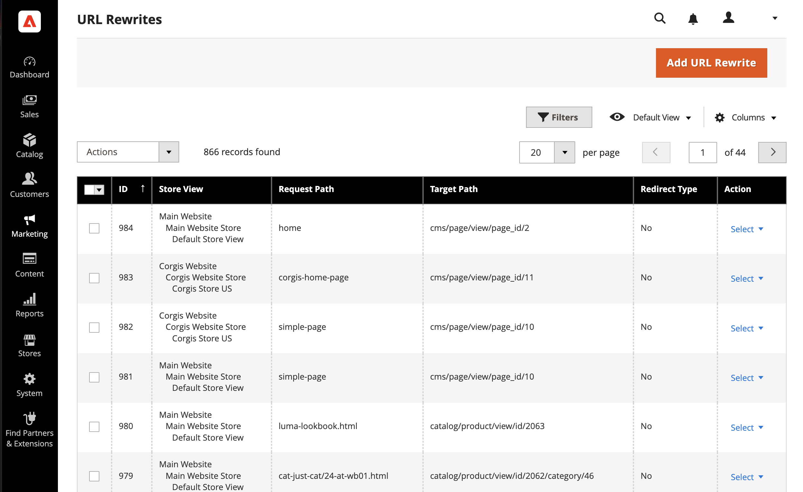

# URL rewrites

>[!TIP]
>
>For Adobe Commerce as a Cloud Service, see the [SEO guidelines](https://experienceleague.adobe.com/developer/commerce/storefront/setup/seo/indexing/) in the Commerce Storefront documentation

The URL rewrite tool lets you change any URL that is associated with a product, category, or CMS page. When the rewrite goes into effect, any links that point to the previous URL are redirected to the new address.

>[!NOTE]
>
>To update URL rewrites for multiple or all products simultaneously, refer to [Multiple URL rewrites](url-rewrite-product.md#multiple-url-rewrites).

The terms _rewrite_ and _redirect_ are often used interchangeably, but refer to slightly different processes. A URL rewrite changes the way that a URL appears in the browser. A URL redirect updates the URL that is stored on the server. A URL redirect can be either temporary or permanent. Your store uses URL rewrites and redirects to make it easy for you to change the URL key of a product, category, or page and preserve existing links.

By default, [automatic URL redirects](url-redirect-product-automatic.md) are enabled for your store and the **Create Permanent Redirect for old URL** checkbox is selected under the URL key field of each product.

{{url-rewrite-skip}}

{{url-rewrite-params}}

{width="600" zoomable="yes"}

## Canonical URLs

For SEO purposes, is a good idea that each of your web pages has only one, distinct URL.

If you have a single page accessible by multiple URLs, or different pages with similar content, Google sees these as duplicate versions of the same page. Google chooses one URL as the canonical version and crawl that, and all other URLs are considered duplicate URLs and are crawled less often.

If you don't explicitly tell Google which URL is canonical, it makes the choice for you, or might consider them both of equal weight. This could lead to unwanted behavior, and runs the risk of an ineffective crawl budget and low distributed backlinks.

Depending on how you set up your website, there may be multiple versions of your site in the index, including:

    https://www.example.com
    https://www.example.com/
    http://www.example.com
    https://example.com
    https://www.example.com/index.html

To specify a canonical page, see [Google Search Central documentation](https://developers.google.com/search/docs/crawling-indexing/consolidate-duplicate-urls).

## Configure URL rewrites

Enabling Web Server Apache Rewrites is part of the initial Commerce setup. Commerce routinely uses URL rewrites to remove the file name `index.php` that normally appears in the URL just after the root folder. When Web Server Rewrites are enabled, the system rewrites each URL to omit `index.php`. The rewrite removes words that convey nothing of value to search engines or customers, and has no impact on performance or site rank.

URL without Web Server Rewrite

    http://www.yourdomain.com/magento/index.php/storeview/url-identifier

URL with Web Server Rewrite

    http://www.yourdomain.com/magento/storeview/url-identifier

1. On the _Admin_ sidebar, go to **[!UICONTROL Stores]** > _[!UICONTROL Settings]_ > **[!UICONTROL Configuration]**.

1. In the left panel where **[!UICONTROL General]** is expanded, choose **[!UICONTROL Web]**.

1. Expand  the **[!UICONTROL Search Engine Optimization]** section.

   {width="600" zoomable="yes"}

1. Set **[!UICONTROL Use Web Server Rewrites]** to your preference.

1. When complete, click **[!UICONTROL Save Config]**.

## Create URL rewrites

You can use the URL rewrite tool to create product and category rewrites, and custom rewrites for any page in your store. When the rewrite goes into effect, any existing links that point to the previous URL are seamlessly redirected to the new address.

URL rewrites can be used to add high-value keywords to improve the way the product is indexed by search engines. You can also use rewrites to create additional URLs for a temporary seasonal change, or permanent change. Rewrites can be created for any valid path, including CMS content pages. Internally, the system always references products and categories by their ID. No matter how often the URL changes, the ID remains the same. Here are some ways that you can use a URL rewrite:

System URL

     http://www.example.com/catalog/category/id/6

Original URL

    http://www.example.com/peripherals/keyboard.html

Redirected Product URL

    http://www.example.com/ergonomic-keyboard.html

Additional Category URLs

    http://www.example.com/all-on-sale.html
    http://www.example.com/save-now/spring-sale

{width="700" zoomable="yes"}

Commerce offers these URL rewrite types:

* [Product Rewrites](url-rewrite-product.md)
* [Category Rewrites](url-rewrite-category.md)
* [CMS Page Rewrites](url-rewrite-cms-page.md)
* [Custom Rewrites](url-rewrite-custom.md)

## URL rewrites demo

Watch this video to learn about managing URL rewrites:

>[!VIDEO](https://video.tv.adobe.com/v/343751?quality=12&learn=on)
