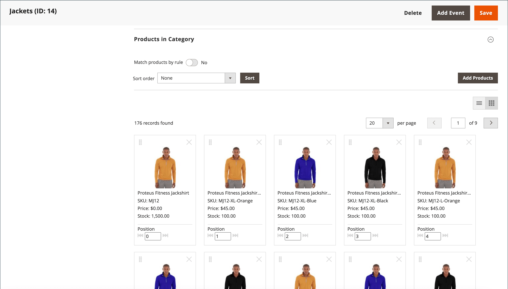

# Visual Merchandiser

{{ee-feature}}

The _Visual Merchandiser_ is a set of advanced tools that allows you to position products and apply conditions that determine which products appear in the category listing. The result can be a dynamic selection of products that adjusts to changes in the catalog. You can work in _visual mode_, which shows each product as a tile on a grid, or to work from a list of products in the category. The same tools are available in each mode and you can use the buttons in the upper-right corner to toggle between each type of display.

<!-- zoom -->

## Access the Visual Merchandiser

1. On the _Admin_ sidebar, go to **[!UICONTROL Catalog]** > **[!UICONTROL Categories]**.

1. Drill down through the category tree and click the category that you want to edit.

1. Scroll down and expand  the **[!UICONTROL Products in Category]** section.

1. Click the _View as Tiles_ (  ) button to display the products as a grid.

1. When complete, click **[!UICONTROL Save Category]**.

## Change the position of a product

1. Use the [sort order](../catalog/navigation-product-listings.md) to view the product that you want to move.

   - **Method 1: Drag and Drop**

      Grab the _Drag_ () control in the upper-right corner of the product tile and drop the product into position. The number of each product adjusts to reflect the new position.

   - **Method 2: Set Position Value**

      In the _Position_ controller () on the product tile, enter the number where you want the product to appear. Enter `0` to place the product at the top of the list.

1. When complete, click **[!UICONTROL Save Category]**.

>[!NOTE]
>
>In a clean installation, Adobe Commerce reserves the category ID `2` for the root catalog of the default store. Visual Merchandiser can use only categories with an ID number of `3` or greater.

## Workspace controls

|Control|Description|
|--- |--- |
||View as list|
||View as tiles|
||Match by rule - no|
||Match by rule - yes|
||Drag|
||Position|
||Remove from category|
||View per page|
||Go to next / previous|

{style="table-layout:auto"}
