# Walkthrough Part 2: Blocks

The following exercise illustrates the difference between [simple blocks](../content-design/blocks.md) and [dynamic blocks](dynamic-block.md), and how to use [!DNL Page Builder] to create each type of block.

>[!NOTE]
>
>[!DNL Page Builder] has a new content type called _Banner_, which is featured in the first walkthrough exercise and is unrelated to the previous banner functionality. What was previously the Banner option in the [Content menu](../content-design/content-menu.md), is now _Dynamic Block_.

{width="700" zoomable="yes"}

This exercise assumes that you have completed [Part 1: Simple Page](1-simple-page.md), including the prerequisites and [downloaded sample files](./assets/simple-page-assets.zip). Follow the parts of this walkthrough exercise in order.

>[!NOTE]
>
>These walkthrough exercises are updated to reflect recent changes to the [!DNL Page Builder] workspace in the 2.4.1 release. If you are using an earlier Adobe Commerce release, use the [!DNL Page Builder] exercises included in the [[!DNL Commerce] 2.3 User Guide](https://docs.magento.com/user-guide/v2.3/cms/page-builder-learn.html).

## Part 1: Create a simple block

In this walkthrough exercise, you create a simple block with content from [!DNL Google Maps]. Simple blocks are sometimes called _CMS blocks_ or _static blocks_, because the content does not change. A simple block is ideal for content that you might want to reuse.

### Step 1: Create a block

1. On the _Admin_ sidebar, go to **[!UICONTROL Content]** > _[!UICONTROL Elements]_ > **[!UICONTROL Blocks]**.

1. In the upper-right corner, click **[!UICONTROL Add New Block]**.

1. For **[!UICONTROL Block Title]**, enter `Google Map`.

1. For **[!UICONTROL Identifier]**, enter `google-map`.

1. Choose the **[!UICONTROL Store View]** where the block is to be available.

   {width="600" zoomable="yes"}

1. In the upper-right corner, click **[!UICONTROL Save]**.

### Step 2: Add a [!DNL Google Map]

1. Scroll down to the [!DNL Page Builder] content preview (currently empty) and click **[!UICONTROL Edit with Page Builder]**.

1. In the [!DNL Page Builder] panel, expand **[!UICONTROL Media]** and drag a **[!UICONTROL Map]** placeholder to the stage.

   {width="600" zoomable="yes"}

   A map to your store location appears if [!DNL Google Maps] is configured for your store.

   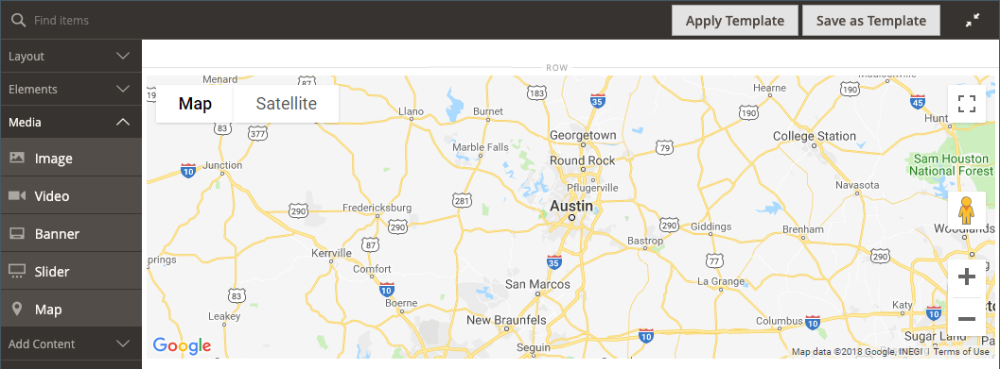{width="600" zoomable="yes"}

   A placeholder map appears if [!DNL Google Maps] isn't yet configured for your store.

   ![[!DNL Google Maps] placeholder](./assets/pb-tutorial2-media-map-not-configured.png){width="600" zoomable="yes"}

1. In the upper-right corner of the stage, click the _Close Full Screen_ () icon.

   Clicking this icon returns you to the _[!UICONTROL Content]_ section for the block with the preview displayed.

1. In the upper-right corner, click the **[!UICONTROL Save]** arrow and choose **[!UICONTROL Save & Close]**.

### Step 3: Configure [!DNL Google Maps]

If [!DNL Google Maps] is already configured for your store, you can skip this step and proceed to the next.

1. Go to the [Google Cloud Platform Console](https://console.cloud.google.com/google/maps-apis/overview).

1. Click the project drop-down and select or create the project for which you want to add an API key.

1. To configure your API credentials, follow the [instructions][1] in the [!DNL Google Maps] documentation.

1. Copy your API Key to the clipboard.

1. Return to the [!DNL Commerce] Admin and go to **[!UICONTROL Stores]** > _[!UICONTROL Settings]_ > **[!UICONTROL Configuration]**.

1. In the left panel under _[!UICONTROL General]_, choose **[!UICONTROL Content Management]**.

1. Expand  **[!UICONTROL Advanced Content Tools]**.

   {width="600" zoomable="yes"}

   For more information about the [!UICONTROL Content Management Advanced Tools] configuration options, see the [_Configuration Reference Guide_](../configuration-reference/general/content-management.md).

1. For **[!UICONTROL Google Maps API Key]**, paste the key you copied.

1. Click **[!UICONTROL Test Key]**.

   If there is a problem with your key, return to the [!DNL Google Maps] Platform site to resolve the problem. Then, try again.

1. After your key is verified, click **[!UICONTROL Save Config]**.

### Step 4: Add the block to a page

1. On the _Admin_ sidebar, go to **[!UICONTROL Content]** > _[!UICONTROL Elements]_ > **[!UICONTROL Pages]**.

1. In the grid, find the _[!UICONTROL Simple Page]_ that you created in the first tutorial and select **[!UICONTROL Edit]** in the _[!UICONTROL Action]_ column.

1. Expand  the **[!UICONTROL Content]** section and click **[!UICONTROL Edit with Page Builder]** or inside the content preview area.

1. In the [!DNL Page Builder] panel under _[!UICONTROL Layout]_, drag a **[!UICONTROL Row]** placeholder to the top of the stage.

   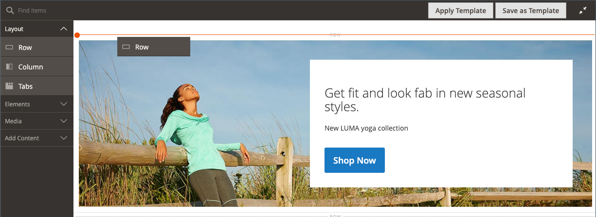{width="600" zoomable="yes"}

1. In the [!DNL Page Builder] panel, expand **[!UICONTROL Add Content]** and drag a **[!UICONTROL Block]** placeholder to the new row.

1. Hover over the empty block container to display the toolbox and choose the _Settings_ ({width="20"} ) icon.

   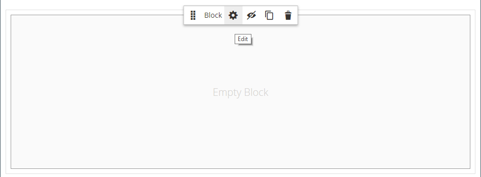{width="600" zoomable="yes"}

1. On the Edit Block page, click **[!UICONTROL Select Block]**.

   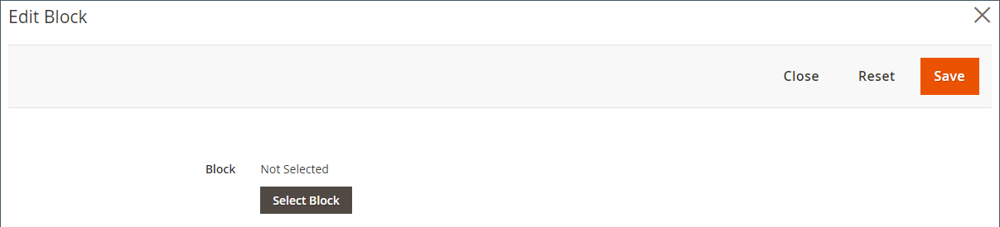{width="600" zoomable="yes"}

1. In the search box, enter `map` and press the Enter/Return key to find the block that you created.

   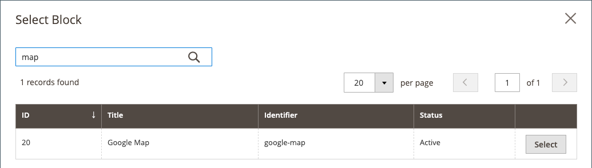{width="600" zoomable="yes"}

1. In the grid, click **[!UICONTROL Select]** to choose the [!DNL Google Maps] block.

1. In the upper-right corner, click **[!UICONTROL Save]** to save the settings and return to the [!DNL Page Builder] workspace.

1. In the upper-right corner of the stage, click the _Close Full Screen_ () icon.

   Clicking this icon returns you to the _[!UICONTROL Content]_ section for the page with the preview displayed.

1. In the upper-right corner, click the **[!UICONTROL Save]** arrow and choose **[!UICONTROL Save & Close]**.

**Congratulations!** You have completed the first part of the Block exercise. Make sure to keep your work for reference.

## Part 2: Create a dynamic block

A dynamic block includes logic that determines where, when, and to whom it appears. In this walkthrough exercise, you create a dynamic block for a promotion that is triggered when price rule conditions are met, and that appears only to a specific customer segment. The result of this example is similar to the banner that was created in the first exercise, but with logic that controls when it appears in the storefront.

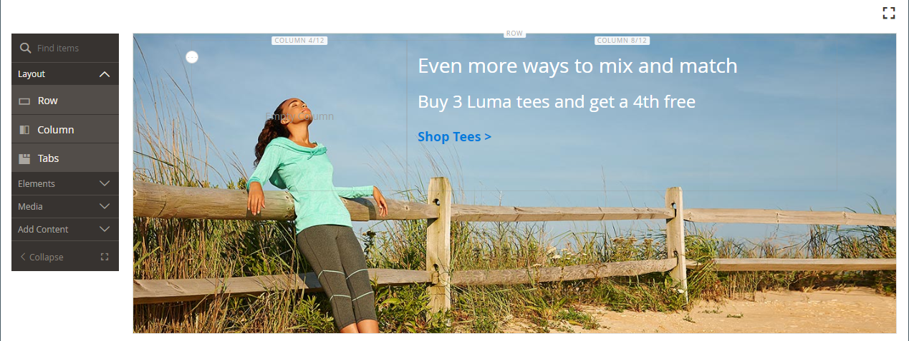{width="600" zoomable="yes"}

### Step 1: Create a new dynamic block

1. On the _Admin_ sidebar, go to **[!UICONTROL Content]** > _[!UICONTROL Elements]_ > **[!UICONTROL Dynamic Blocks]**.

   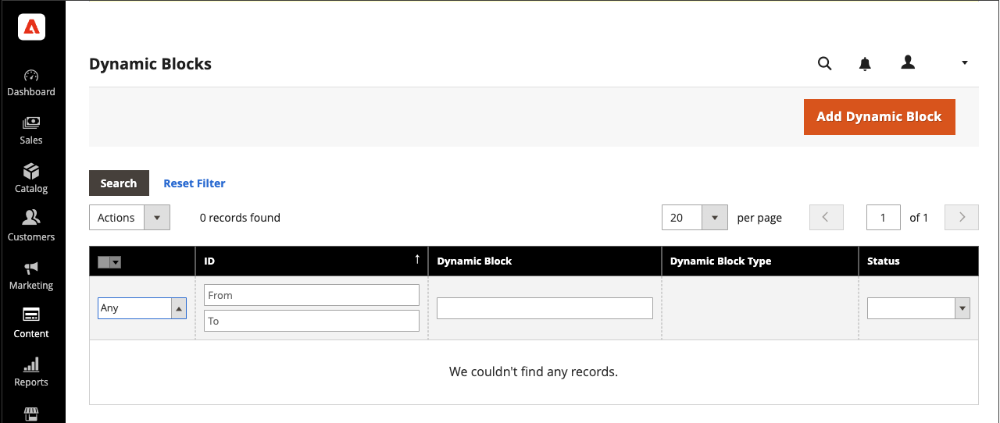{width="700" zoomable="yes"}

1. In the upper-right corner, click **[!UICONTROL Add Dynamic Block]**.

   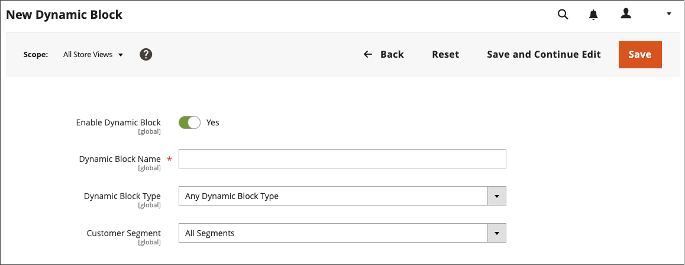{width="600" zoomable="yes"}

1. Complete the basic settings for the new dynamic block:

   - Set **[!UICONTROL Enable Dynamic Block]** to `Yes`.

   - For **[!UICONTROL Dynamic Block Name]**, enter `Tee Shirt Promo`.

   - Set **[!UICONTROL Dynamic Block Type]** to `Content Area` and click **[!UICONTROL Done]**.

      The Dynamic Block Type determines where in the [page layout](../content-design/page-layout.md) that the block is placed. When setting up a dynamic block for your store, consider both the page layout and the [theme](../content-design/themes.md), so you can put the available space to good use. Some stores have an active content area that is limited to a fixed width, while others extend the full width of the screen.

      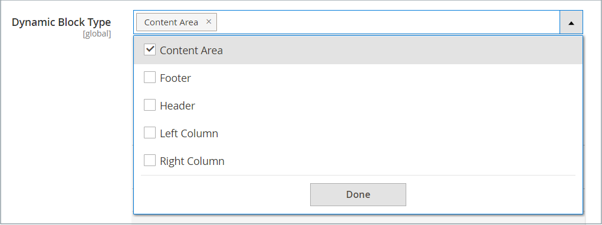{width="600" zoomable="yes"}

   - For **[!UICONTROL Customer Segment]**, select the checkbox of each segment that you want to apply to the dynamic block and click **Done** to save the list of segments.

      For the following example, there are two [customer segments](../customers/customer-segments.md) that identify registered customers by gender. This dynamic block appears only to registered female customers who are logged in to their accounts while they shop in your store.

      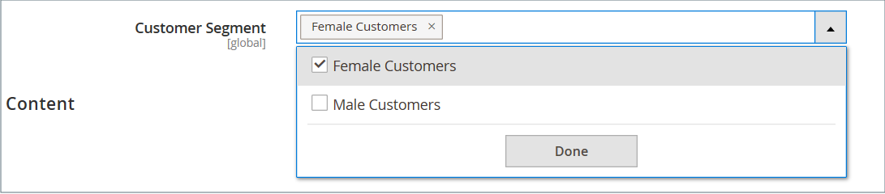{width="600" zoomable="yes"}

### Step 2: Complete the settings

Scroll down to the _[!UICONTROL Content]_ section, which displays an empty [!DNL Page Builder] content preview, and click **[!UICONTROL Edit with Page Builder]**. Then, complete the following tasks:

**Task 1:** Add a background image

1. Hover over the row container to display the toolbox and choose the _Settings_ ({width="20"} ) icon.

1. Under _[!UICONTROL Appearance]_, choose **[!UICONTROL Full Bleed]**.

1. For **[!UICONTROL Minimum Height]**, enter `400px`.

1. Scroll to the _[!UICONTROL Background]_ section and set the **[!UICONTROL Background Image]** by clicking **[!UICONTROL Select from Gallery]** and choosing the `wide-banner-background.png` image uploaded in the first tutorial.

1. In the upper-right corner, click **[!UICONTROL Save]** to apply the settings and return to the [!DNL Page Builder] workspace.

   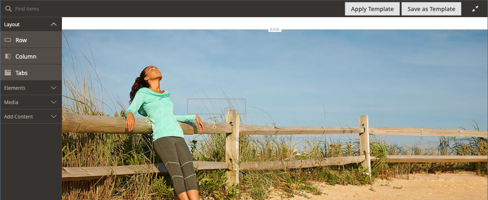{width="600" zoomable="yes"}

**Task 2:** Add columns

In the [!DNL Page Builder] panel under _[!UICONTROL Layout]_, drag a **[!UICONTROL Column]** placeholder onto the row.

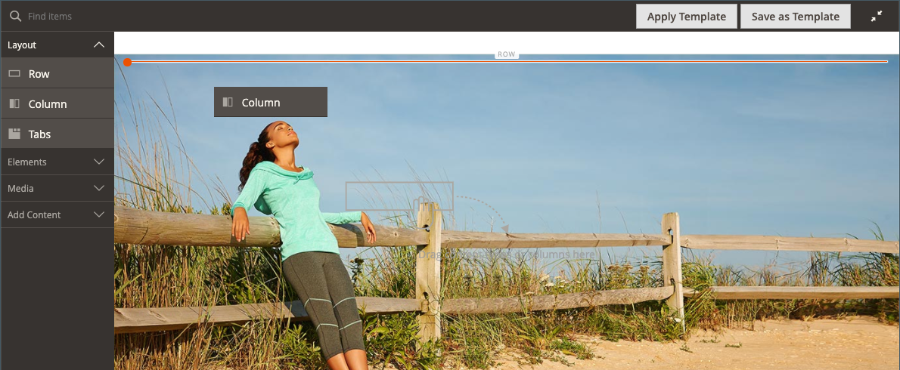{width="600" zoomable="yes"}

The row is now divided into two columns of equal width.

**Task 3:** Add text

1. In the [!DNL Page Builder] panel, expand **[!UICONTROL Elements]** and drag a **Text** placeholder to the second column.

   {width="600" zoomable="yes"}

1. Enter the following three lines of text into the editor:

   `Even more ways to mix and match.`

   `Buy 3 Luma tees and get a 4th free.`

   `Shop Tees >`

   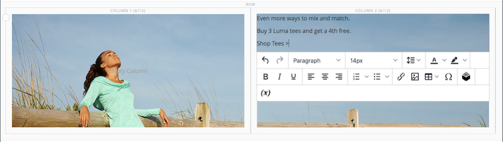{width="600" zoomable="yes"}

1. Select all three lines of text and use the toolbar to set the **Line Height** to `40px`.

   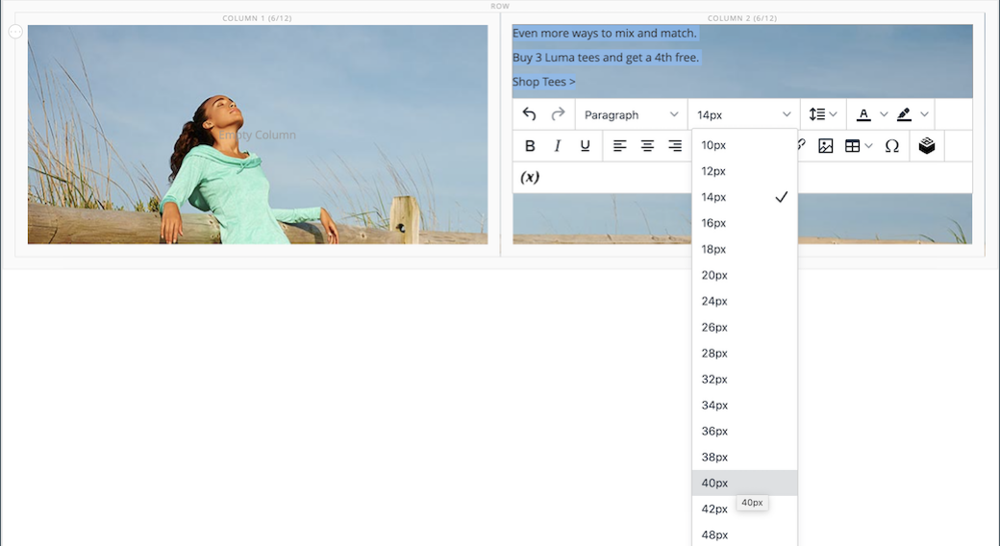{width="600" zoomable="yes"}

1. Set the **[!UICONTROL Font Size]** for each line as follows:

   |Line | Font size |
   |-----| ---------- |
   | Line 1: | `28px` |
   | Line 2: | `24px` |
   | Line 3: | `18px` |

   Because this block could be placed anywhere on the page, use the default paragraph style, rather than heading levels. Also, don't worry that the text does not yet wrap correctly in the column.  

   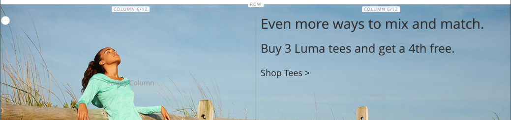{width="600" zoomable="yes"}

**Task 4:** Add a Link

In the first exercise, you learned how to use the [Button](buttons.md) content type to create a link. This example shows how to insert a link from the editor toolbar.

1. In another browser tab, open the storefront and navigate to the page that is to be the target destination for the link.

   You can use the fully qualified URL or a relative URL that omits the reference to your store domain.

   Full URL
   : `https://mystore.com/women/tops-women/tees-women.html`

   Relative URL
   : `../women/tops-women/tees-women.html`

1. Return to the [!DNL Page Builder] workspace tab and text editor, select the `Shop Tees >` text in the third line, and choose **Bold** (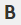) in the editor toolbar.

1. With the `Shop Tees >` text in the third line still selected, choose **Insert/edit link** (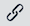) in the editor toolbar.

   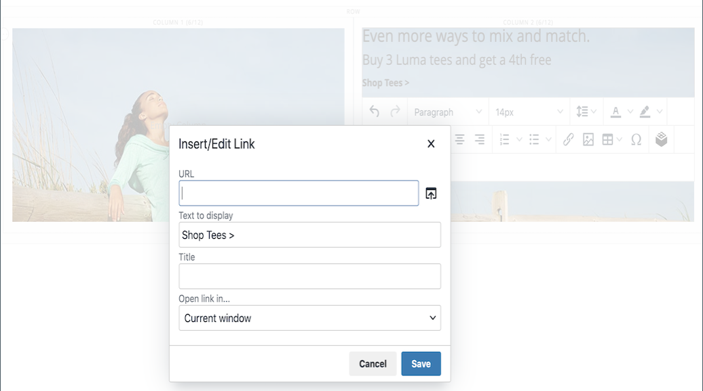{width="600" zoomable="yes"}

1. For **[!UICONTROL URL]**, enter the relative link that you prepared.

1. Set **[!UICONTROL Target]** to `None`.

   This setting opens the page in the same browser window, rather than opening a new tab.

1. For **[!UICONTROL Title]**, enter `Shop Tees`.

   The Title link attribute is used by some browsers as a tooltip.

1. To save the link and return to the [!DNL Page Builder] workspace, click **[!UICONTROL OK]**.

   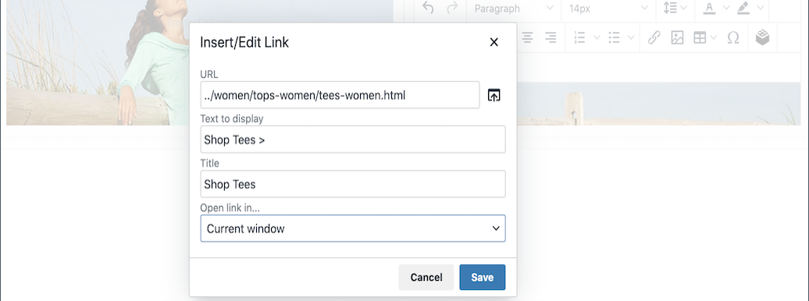{width="600" zoomable="yes"}

1. In the upper-right corner of the stage, click the _Close Full Screen_ () icon.

   Clicking this icon returns you to the _[!UICONTROL Content]_ section for the dynamic block with the preview displayed.

1. In the upper-right corner, click **[!UICONTROL Save]**.

### Step 3: Add a price rule

1. Open the _Tee Shirt Promo_ dynamic block in edit mode again.

1. Expand  the **[!UICONTROL Related Promotions]** section and click **[!UICONTROL Add Cart Price Rules]**.

   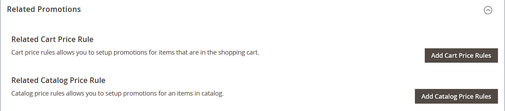{width="600" zoomable="yes"}

1. On the _Add Related Cart Price Rules_ page, select the checkbox for the _Buy 3 tee shirts and get the 4th free_ price rule and click **[!UICONTROL Add Selected]**.

   {width="600" zoomable="yes"}

   The price rule appears in the _Related Promotions_ section, under _Related Cart Price Rule_. You can associate multiple price rules with a dynamic block. However, this simple example uses just one.

   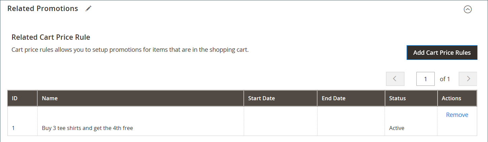{width="600" zoomable="yes"}

1. In the upper-right corner, click **[!UICONTROL Save]**.

### Step 4: Add the dynamic block to a page

1. In the _Admin_ sidebar, go to **[!UICONTROL Content]** > _[!UICONTROL Elements]_ > **[!UICONTROL Pages]**

1. Find the _Simple Page_ that you created in the [first walkthrough exercise](1-simple-page.md) and open it in edit mode.

1. Expand  the **[!UICONTROL Content]** section and click **[!UICONTROL Edit with Page Builder]**.

1. Hover over the top row with the same image as the dynamic block to display the toolbox and the _Remove_ ( {width="20"} ) icon.

   To confirm removal of the row from the page, click  **[!UICONTROL OK]** .

1. In the [!DNL Page Builder] panel under _[!UICONTROL Layout]_, drag a new **[!UICONTROL Row]** placeholder to the top of the stage.

1. In the [!DNL Page Builder] panel, expand **[!UICONTROL Add Content]** and drag a **[!UICONTROL Dynamic Block]** placeholder to the new row.

   {width="600" zoomable="yes"}

1. Hover over the dynamic block container to display the toolbox and choose the _Settings_ ( {width="20"} ) icon.

   {width="600" zoomable="yes"}

1. On the _[!UICONTROL Edit Dynamic Block]_ page, click **[!UICONTROL Select Dynamic Block]**.

   {width="600" zoomable="yes"}

1. Find the _[!DNL Tee Shirt Promo]_ dynamic block that you created and click **[!UICONTROL Select]**.

   A summary of the dynamic block information appears below.

   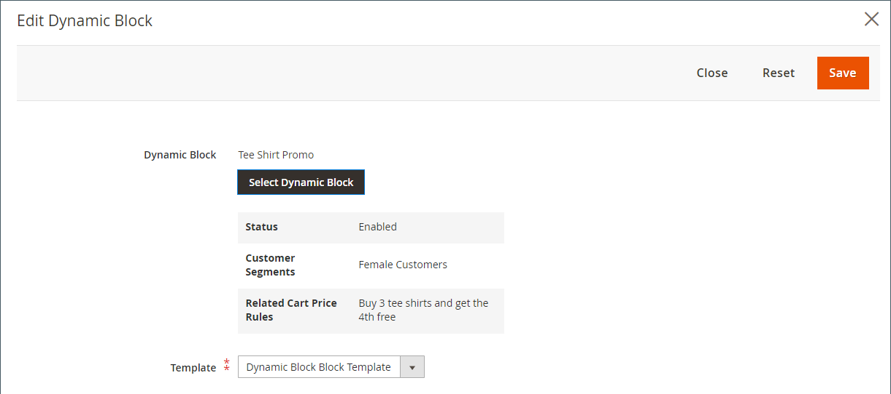{width="600" zoomable="yes"}

1. Accept the default **[!UICONTROL Template]**, `Dynamic Block Block Template`.

1. When complete, click **[!UICONTROL Save]** to save the settings and return to the [!DNL Page Builder] workspace.

   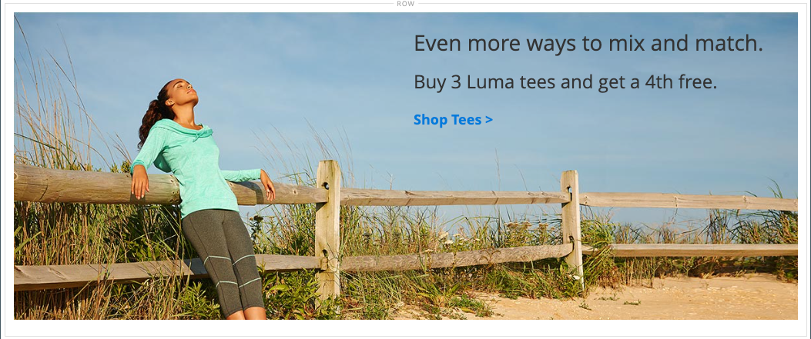{width="600" zoomable="yes"}

1. In the upper-right corner of the stage, click the _Close Full Screen_ () icon.

   Clicking this icon returns you to the _[!UICONTROL Content]_ section for the page with the preview displayed.

1. In the upper-right corner, click the **[!UICONTROL Save]** arrow and choose **[!UICONTROL Save & Close]**.

You have completed the second part of the Block exercise. Make sure to keep your work for reference.

## Part 3: Update the dynamic block

In this final part of the exercise, you edit a dynamic block while the page is live in your store. Then, log in to the store as a member of the customer segment to make the block appear.

{width="600" zoomable="yes"}

### Step 1: Edit the dynamic block

1. In the _Admin_ sidebar, go to **[!UICONTROL Content]** > _[!UICONTROL Elements]_ > **[!UICONTROL Dynamic Blocks]**.

1. Find your _[!DNL Tee Shirt Promo]_ dynamic block in the grid and open it in edit mode.

1. Expand  the **[!UICONTROL Content]** section and click **[!UICONTROL Edit with Page Builder]**.

1. Change the column width:

   - Hover over the border between the two columns.

   - Hold down the mouse button and drag the border two divisions to the left.

      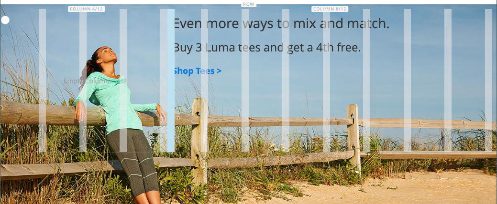{width="600" zoomable="yes"}

      The first column is now four of 12 (4/12) grid divisions wide, and the second column is eight of 12 (8/12) divisions wide.

      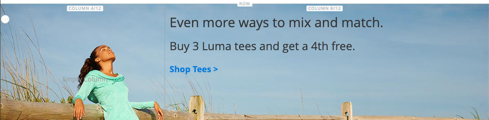{width="600" zoomable="yes"}

1. Change the text color:

   - Select the first two lines of text.

   - On the editor toolbar, choose **[!UICONTROL Text Color]** and click the **[!UICONTROL White]** swatch.

   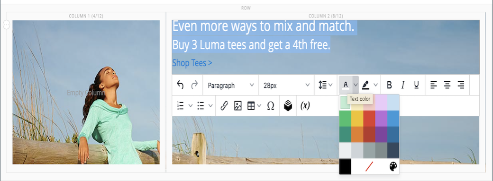{width="600" zoomable="yes"}

1. In the upper-right corner of the stage, click the _Close Full Screen_ () icon.

   Clicking this icon returns you to the _[!UICONTROL Content]_ section for the dynamic block with the preview displayed.

1. In the upper-right corner, click **[!UICONTROL Save]**.

### Step 2: View the Dynamic Block

Because this dynamic block is visible only to members of a specific customer segment, you must log in as a customer who is a member of the customer segment to see the promotion. In this example, the block appears only to female customers.

1. Open a browser window to your storefront.

1. To view your sample page, modify the URL in the address bar as follows:

      mystore.com/sample-page

   If your store is configured to include the html suffix, include the suffix as follows:

      mystore.com/sample-page.html

1. Sign in as a female customer:

   - In the upper-right corner of your home page, click **[!UICONTROL Sign In]**.

   - If the sample Luma data is installed on your system, use the following credentials:

      **[!UICONTROL Email]** - `roni_cost@example.com`

      **[!UICONTROL Password]** -  `roni_cost3@example.com`

   - Click **[!UICONTROL Sign In]**.

   - Return to the sample page to see the dynamic block that you created with the Tee Shirt Promo.

   {width="700" zoomable="yes"}

You have completed the third part of the Block exercise. Make sure to keep your work for reference.

When you are ready, proceed to [Part 3: Catalog Content](3-catalog-content.md)

[1]: https://developers.google.com/maps/documentation/javascript/get-api-key
