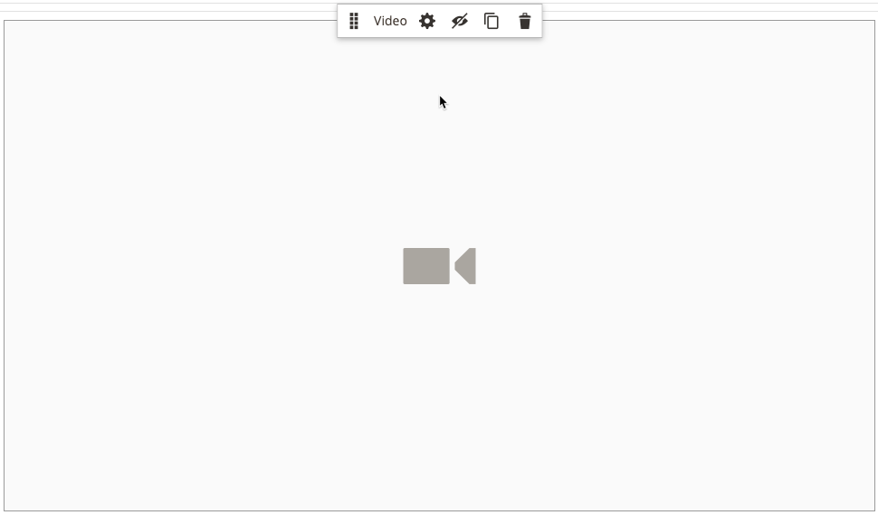

# Walkthrough Part 3: Catalog Content

In this exercise demonstrates how easy it is to add a product list to a page, customize product pages, and create a custom attribute that adds the Page Builder workspace to a product attribute set.

<!-- zoom -->

This exercise assumes that you have completed [Part 1: Simple Page](1-simple-page.md) and [Part 2: Blocks](2-blocks.md), including the prerequisites and downloaded sample files. Follow the three parts of this exercise in order.

>[!NOTE]
>
>These exercises are updated to reflect recent changes to the Page Builder workspace in the 2.4.1 release. If you are using an earlier Adobe Commerce release, use the Page Builder walkthrough exercises included in the [Commerce 2.3 User Guide](https://docs.magento.com/user-guide/v2.3/cms/page-builder-learn.html).

## Part 1: Add a product list

Page Builder makes it easy to add a product list to the stage. In this example, the product list is added directly to a page.

### Step 1: Add a product list to the stage

1. On the _Admin_ sidebar, go to **Content** > _Elements_ > **Pages**.

1. Find the _Simple Page_ that you created in the first exercise and modified in the second, and select **Edit** in the _Action_ column.

1. Expand  the **Content** section and click **Edit with Page Builder** or inside the content preview area.

1. In the Page Builder panel under _Layout_, drag a **Row** to the top of the stage.

1. In the Page Builder panel, expand **Add Content** and drag a **Products** placeholder to the new row.

   <!-- zoom -->

### Step 2: Compose the condition

1. Hover over the empty products container to display the toolbox and choose the _Settings_ (<!-- width="20px" --> ) icon.

   <!-- zoom -->

1. For **Select Products By**, choose **Condition**.

1. Add a condition:

   - Click the _Add_ () icon.

   - Under _Product Attribute_, choose **Category**.

      <!-- zoom -->

   - Complete the _Category is ..._ part of the condition by clicking the More (...) icon and then click the _Chooser_ () icon.

      <!-- zoom -->

   - In the category tree, drill down to the **Women > Tops** category and select the **Tees** checkbox.

      <!-- zoom -->

   - Click the Checkmark () icon.

      The corresponding category ID appears in the field to complete the condition.

### Step 3: Complete the settings

1. Enter the **Number of Products to Display**.

   By default, the list displays five products.

1. Complete the remaining settings as needed.

   If needed, use the field descriptions at the end of the [Add Products](products.md) topic for reference.

1. When complete, click **Save** to save the settings and return to the Page Builder workspace.

   <!-- zoom -->

1. In the upper-right corner of the stage, click the _Close Full Screen_ () icon.

   Clicking this icon returns you to the _Content_ section for the page with the preview displayed.

1. In the upper-right corner, click the **Save** arrow and choose **Save & Close**.

## PART 2: Customize the product page

In this part of the exercise, you learn how easy it is to customize a product page by placing a video below the set of tabs on the product page. The process to update [category page](https://docs.magento.com/user-guide/catalog/categories-content-settings.html) content is basically the same.

1. On the _Admin_ sidebar, go to **Catalog** > **Products**.

1. Find a simple product that you can use for this example and open it in edit mode.

1. Scroll down and expand  the **Content** section.

1. Next to _Description_, click **Edit with Page Builder**.

   <!-- zoom -->

   If the product description was entered previously without Page Builder, the current description appears as HTML in an [HTML Code](html-code.md) container. With the Luma theme, the product description appears on the Detail tab.

1. In the Page Builder panel under _Layout_, drag a **Row** to the stage, placing it below the HTML code container.

   Look for the red guideline to appear when the row is in the correct position.

   <!-- zoom -->

1. In the Page Builder panel, expand **Media** and drag a **Video** placeholder to the new row.

   <!-- zoom -->

1. Hover over the empty video container to display the toolbox and choose the _Settings_ (<!-- width="20px" --> ) icon.

   <!-- zoom -->

1. Enter the **Video URL**.

   The video can be hosted on either [YouTube][1] or [Vimeo][2]. The video in this example can be found on YouTube at the following URL:

      `https://www.youtube.com/watch?v=ZpFrNyD4100`

   <!-- zoom -->

1. Enter the **Maximum Width** in pixels for the video display.

   If you leave the Maximum Width blank, the video fills the available space.

1. Click **Save** to save the settings and return to the Page Builder workspace.

   <!-- zoom -->

1. In the upper-right corner of the stage, click the _Close Full Screen_ () icon.

   Clicking this icon returns you to the _Content_ section for the page with the preview displayed.

1. In the upper-right corner, click the **Save** arrow and choose **Save & Close**.

In the storefront, the video appears below the set of tabs. To see how the page looks on a mobile device, you can resize the window.

<!-- zoom -->

**Congratulations!** You have completed the second part of the Catalog Content tutorial. Keep the work that you created, so you can refer to it later.

## PART 3: Add custom attributes

Use the Page Builder custom attribute to add a fully functioning Page Builder workspace to a product page, which you can use to create engaging content. In this part of the exercise, you learn how to create a custom attribute using the Page Builder input type and apply it to product pages in your catalog. For more information about these attributes, see [Product Attributes](https://docs.magento.com/user-guide/stores/attributes-product.html).

<!-- zoom -->

### Step 1: Create a product

To avoid changes to your live store, create a product using the described properties.

1. On the _Admin_ sidebar, go to **Catalog** > **Products**.

1. In the upper-right corner, click **Add Product**.

1. Create the product with the following properties:

   | Attribute Set: | Default |
   | Product Name: | My Product |
   | SKU: | Tutorial |
   | Price: | 75.00 |
   | Quantity: | 100 |
   | Stock Status: | In Stock |
   | Weight: | 1 |
   | Categories: | Women > Tops > Tees |

1. In the upper-right corner, click the **Save** arrow and choose **Save & Close**.

### Step 2: Create custom attributes

In this step, you create two new custom attributes to show how the Page Builder and Text Editor input types can be used.

1. On the _Admin_ sidebar, go to **Stores** > _Attributes_ > **Product**.

1. In the upper-right corner, click **Add New Attribute**.

1. Enter a **Default Label** for the attribute.

   For this example, use `My Page Builder Attribute` for the label.

1. Set **Catalog Input Type for Store Owner** to `Page Builder`.

   When creating a custom attribute, you can specify the editor that is most suitable to the application as either `Page Builder` or the standard, WYSIWYG `Text Editor`.

   <!-- zoom -->

1. Expand  the **Advanced Attribute Properties** section and make the following settings:

   | Attribute Code: | Enter an attribute code in lowercase characters, using hyphens instead of spaces. For this example, use `my_page_builder_attribute`. |
   | Scope: | Accept the default value, `Store View`. |
   | Default Value: | Enter a default value for the attribute. |
   | Unique Value: | No |
   | Add to Column Options: | No |
   | Use in Filter Options: | Yes |

1. In the **Attribute Information** panel on the left, choose **Storefront Properties** and make the following settings:

   | Use for Promo Rule Conditions: | Yes |
   | Visible on Catalog Pages on Storefront: | Yes |
   | Used in Product Listing: | Yes |

1. When complete, click **Save Attribute**.

1. Repeat the previous steps to create a second attribute with the same basic properties, but with the Text Editor input type as follows:

   | Default Label: | My Text Editor Attribute |
   | Catalog Input Type for Store Owner: | Text Editor |
   | Attribute Code: | `my_text_editor_attribute` |

### Step 3: Update the product attribute set

1. On the _Admin_ sidebar, go to **Stores** > _Attributes_ > **Attribute Set**.

   For this example, you temporarily add the new attributes to the `default` attribute set. At the end of this exercise, remove the attributes from the attribute set, so don't impact your catalog.

   >[!NOTE]
   >
   >If you don't want to change your live store, you can follow along without updating the attribute set.

1. Find the _Default_ attribute set in the list and double-click it to open it in edit mode.

1. In the _Unassigned Attributes_ list, find the new attributes you created and drag each one to the _Groups_ column, under **Content**.

   The location of the attribute in the Groups column determines where it appears on the page.

   <!-- zoom -->

1. Click **Save** to return to the Attribute Sets list.

1. When prompted, click the **Cache Management** link at the top of the page and refresh any invalid cache.

### Step 4: Update the product

1. On the _Admin_ sidebar, go to **Catalog** > **Products**.

1. In the Products grid, find _My Product_ and open it in edit mode.

1. Scroll down and expand  the **Content** section.

   At the top of the section, there are two standard attributes for product content:

   - _Short Description_, which uses the standard WYSIWYG [editor](https://docs.magento.com/user-guide/cms/editor.html).
   - _Description_, which displays the Page Builder preview.

   <!-- zoom -->

   As you scroll to the lower half of the section, there are the two attributes you created and assigned:

   - _My Page Builder Attribute_, which displays the Page Builder preview.
   - _My Text Editor Attribute_, which uses the standard WYSIWYG editor.

   <!-- zoom -->

1. In the **My Text Editor Attribute** editor, enter `Text Editor Attribute placeholder text`.

   - In the upper-right corner, click the **Save** arrow and choose **Save & Close**.

1. For **My Page Builder Attribute**, click **Edit with Page Builder** and add the description text:

   - In the Page Builder panel, expand **Elements** and drag a **Text object** to the stage.

   - Enter `Page Builder attribute placeholder text`.

   - In the upper-right corner of the stage, click the _Close Full Screen_ () icon.

      <!-- zoom -->

1. Scroll up to **Description**, click **Edit with Page Builder**, and add any text that you like using the same method as the previous step.

1. In the upper-right corner of the product page, click the **Save** arrow and choose **Save & Close**.

1. If prompted, click the **Cache Management** link in the message at the top of the page and refresh any invalid cache.

### Step 5: Check it out

1. Navigate to your sample product page in the storefront.

   In this example, the product can be found in the top navigation under Women > Tops > Tees.

1. Scroll down to the _My Page Builder Attribute_ information.

   The position of the attributes on the product page is determined by the theme. In the Luma theme, the new attributes are located just after the product description.

   <!-- zoom -->

**Congratulations!** You have completed the Page Builder Catalog Content exercise. Keep the work that you created, so you can refer to it later.

[1]: https://www.youtube.com/
[2]: https://vimeo.com/
