# Media - Banner

Use the _Banner_ content type to add an illustrated, interactive component that engages users with a call to action and button in the [[!DNL Page Builder] stage](workspace.md#stage).

>[!NOTE]
>
>What was previously the _Banner_ option in the Content menu, is now [Dynamic Block](../content-design/dynamic-blocks.md).

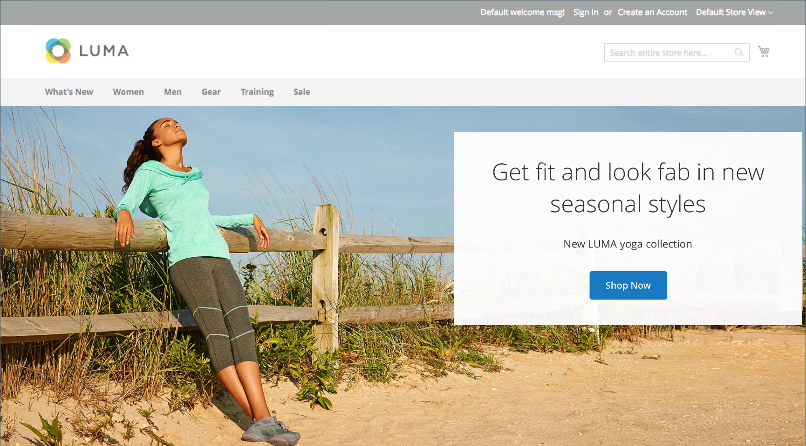{width="700" zoomable="yes"}

{{$include /help/_includes/page-builder-save-timeout.md}}

## Banner toolbox

The banner toolbox appears when you hover over the banner container.

{width="600" zoomable="yes"}

|Tool|Icon|Description|
|--- |--- |--- |
|Move|{width="25"}|Moves the banner to another position on the stage.|
|(label)|Banner|Identifies the current content container as a banner. Hover over the container to see the toolbox.|
|Settings|{width="25"}|Opens the Edit Banner page, where you can change the properties of the banner and container.|
|Hide|{width="25"}|Hides the current banner.|
|Show|{width="25"}|Shows the  hidden banner.|
|Duplicate|{width="25"}|Makes a copy of the banner.|
|Remove|{width="25"}|Deletes the banner from the stage.|
|[!UICONTROL Upload New Image]||Uploads an image from your local file system to the gallery for the banner background.|
|[!UICONTROL Select from Gallery]||Uses an existing image from the gallery for the banner background.|

{style="table-layout:auto"}

## Add a banner

1. In the [!DNL Page Builder] panel, expand **[!UICONTROL Media]** and drag a **[!UICONTROL Banner]** placeholder to the stage.

   {width="600" zoomable="yes"}

   The _[!UICONTROL Upload Image]_ and _[!UICONTROL Select from Gallery]_ buttons are included so you can make quick changes to the banner content directly from the stage. You can also change the content on the _[!UICONTROL Edit Banner]_ page.

1. Click in the banner placeholder to display the [text editor](../content-design/editor.md) and enter content for the banner.

   You can also include more complex banner content using the [Content](#content) settings.

## Change banner settings

1. Hover over the banner container to display the toolbox and choose the _Settings_ () icon.

1. Use the following sections for detailed information about updating the available settings:

   - [[!UICONTROL Appearance]](#appearance)
   - [[!UICONTROL Content]](#content)
   - [[!UICONTROL Background]](#background)
   - [[!UICONTROL Advanced]](#advanced)

1. When complete, click **[!UICONTROL Save]** in the upper-right corner to close the _[!UICONTROL Edit Banner]_ page.

1. In the upper-right corner, click **[!UICONTROL Save]** to apply the settings and return to the [!DNL Page Builder] workspace.

## [!UICONTROL Appearance]

Banners are easy to set up and maintain, because they are based on one of four predefined templates.

- Choose one of the following banner placement types:

   | Placement | Description |
   | --------- | ----------- |
   | [!UICONTROL Poster] | Centers content and button on the banner. The overlay, if used, extends the full width of the banner. |
   | [!UICONTROL Collage Left] | Places content and button in a defined area on the left side of the banner. The overlay, if used, covers only the defined area. |
   | [!UICONTROL Collage Center] | Places content and button in a defined area that is centered on the banner. The overlay, if used, covers only the defined area. |
   | [!UICONTROL Collage Right] | Places content and button in a defined area on the right side of the banner. The overlay, if used, covers only the defined area. |

   {style="table-layout:auto"}

   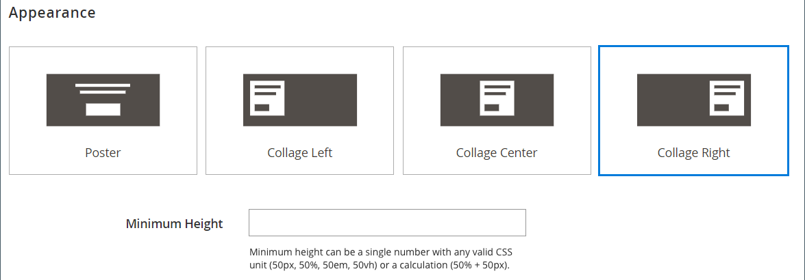{width="600" zoomable="yes"}

- (Optional) Enter the **[!UICONTROL Minimum Height]** for the row.

   The minimum height can be a number with any valid CSS unit (such as `100px`, `50%`, `50em`, `100vh`) or a calculation (such as `100vh - 237px`).

   For example, you can set the minimum height of a banner to stretch the full height of the page, giving you compelling options for full-page background images and videos.

## [!UICONTROL Background]

There are many options for defining the background display of a banner. You can apply a simple color or background image, and manage more sophisticated effects.

### [!UICONTROL Background Color]

Specify the background color by choosing a swatch, clicking the color picker, or by entering a valid color name or equivalent hexadecimal value. This setting determines the background color of the row. You can also adjust the opacity of the color.

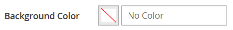{width="200"}

You can set the value in one of three ways:

- A predefined color name, such as `White`
- The hexadecimal color value for the color, such as `#ffffff`
- The rgba value for the color, with opacity percent, such as `rgba(255, 255, 255, 0.75)`

If you want to choose a color, click the swatch to the left of the _No Color_ box.

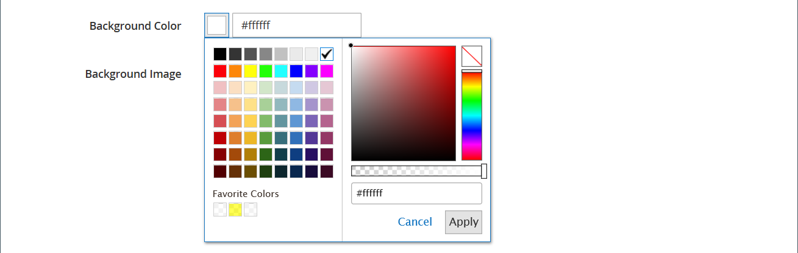{width="600" zoomable="yes"}

If you click the color box to open the color picker again, the box below the slider shows the current red, green, blue, and alpha values (rgba). The last number indicates the current opacity percentage as a decimal. You can use the slider to adjust the opacity, or enter the desired decimal value.

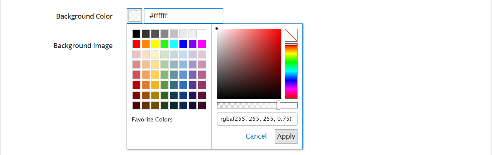{width="600" zoomable="yes"}

>[!NOTE]
>
>[!DNL Page Builder] also supports a transparency layer, or _alpha channel_, in background images that can be used to create backgrounds with varying degrees of opacity.

### [!UICONTROL Background Type]

A background type can be an image or a video. [!DNL Page Builder] defaults to `Image` and shows various image settings. If you select `Video`, [!DNL Page Builder] swaps the image settings with video settings. Both background type settings are described in the following sections.

{width="200"}

### Image type settings

If you set the _Background Type_ to `Image`, use the following settings to define the background image display.

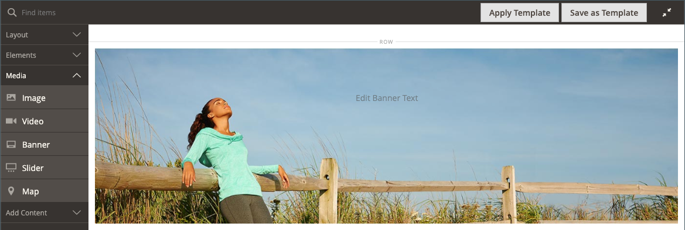{width="600" zoomable="yes"}

- **[!UICONTROL Background Image]** - If needed, use the provided tools to choose a background image to apply to the banner:

   | Tool | Description |
   | ---- | ----------- |
   | [!UICONTROL Upload] | Uploads an image file from your local computer to the gallery and then applies it as the background image for the banner. |
   | [!UICONTROL Select from Gallery] | Prompts you to choose an existing image from the gallery as the background image for the banner. |
   | {width="25"} | Allows you to either drag the image to the camera tile or browse to the image in your local file system. |

   {style="table-layout:auto"}

- **[!UICONTROL Background Mobile Image]** - If needed, use the same tools to choose a different background image to be used for display on mobile devices.

- **[!UICONTROL Background Size]** - Set this option to determine how the background image is scaled in relation to the width of the banner:

   | Option | Description |
   | ------ | ----------- |
   | `Cover` | The background image covers the full width of the banner. |
   | `Contain` | The background image is limited to the width of the content area. |
   | `Auto` | Applies the size from the current style sheet. |

   {style="table-layout:auto"}

   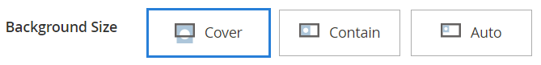{width="200"}

- **[!UICONTROL Background Position]** - Set this option to determine how the background image is anchored in relation to the banner:

   | Anchor | Positions |
   | ------ | ----------- |
   | `Top` | Left / Center / Right |
   | `Center` | Left / Center / Right |
   | `Bottom` | Left / Center / Right |

   {style="table-layout:auto"}

   The anchor point is like a push pin that attaches the image to the banner at the specified background position.

- **[!UICONTROL Background Attachment]** - Set the attachment type to determine how the background image moves in relation to the scrolling page:

   | Option | Description |
   | ------ | ----------- |
   | `Scroll` |The attached background image is synchronized to move down as the page scrolls.|
   | `Fixed` |(Not available for mobile) The background image does not move as the container scrolls over the image and is fixed at the specified background position.|

   {style="table-layout:auto"}

- **[!UICONTROL Background Repeat]** - If you want to repeat the background image to fill the space, change this setting `Yes`.

### Video type settings

If you set the _[!UICONTROL Background Type]_ to `Video`, use the following settings to define the background image display.

- **[!UICONTROL Video URL]** - Enter a valid video URL. Valid video URLs can be links to:

  - YouTube videos: `https://youtu.be/CoDhMRUUjeI`
  - Vimeo videos: `https://vimeo.com/190156113`
  - Valid video files (`.mp4` is recommended): `https://myvideos.com/spiral.mp4`

   {width="200"}

- **[!UICONTROL Overlay Color]** - Select a color to apply a transparent tint to the video.

- **[!UICONTROL Infinite Loop]** - Set to `No` to make the video play once and stop. When it is set to `Yes` (default), the video repeats in an infinite loop.

- **[!UICONTROL Lazy Load]** - Set to `No` to make the video load with the page, even when not visible. When it is set to `Yes` (default), the video loads from the source only when visible on the screen.

- **[!UICONTROL Play Only When Visible]** - Set to `No` to make the video start playing immediately after it loads, regardless of whether it is visible. When it is set to `Yes` (default), the video starts playing only when it is visible.

- **[!UICONTROL Fallback Image]** - If needed, specify an image to display on the screen before the video loads and if the video does not load for some reason.

## [!UICONTROL Content]

You can modify the banner content directly on the stage or when you are changing the settings. The settings provide more complex content features, such as banner links and buttons, and overlays. The position of the content reflects the [Appearance](#appearance) placement setting.

### Simple content on the stage

1. Click the placeholder text and enter the text that you want to appear on the banner.

   The editor toolbar appears above the text box.

   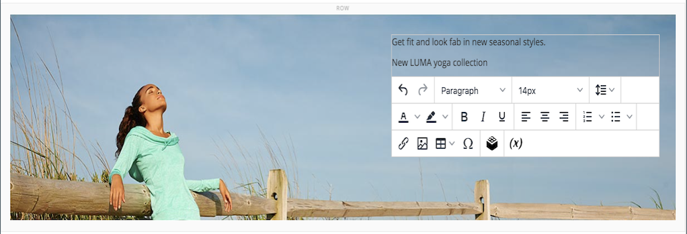{width="600" zoomable="yes"}

1. Use the editor toolbar to enter and format text, as well as insert elements, such as links, images, and widgets.

   {width="600" zoomable="yes"}

### Complex content in the settings

1. Hover over the banner container to display the toolbox and choose the _Settings_ ( {width="25"} ) icon.

1. Scroll down to the _[!UICONTROL Content]_ section and use the **[!UICONTROL Message Text]** editor to enter and format banner text.

   You can also insert elements, such as text links, images, and widgets.

   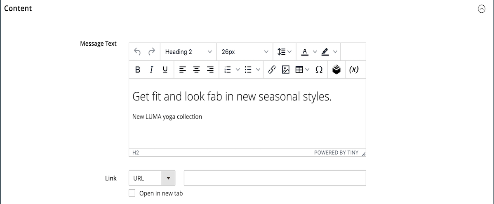{width="600" zoomable="yes"}

1. If needed, specify a **[!UICONTROL Link]** for the banner.

   The link is the destination page that appears when the customer clicks the banner button or area. You can use one of three link types:

   - **[!UICONTROL URL]** - Links to either a relative or fully qualified URL.
   - **[!UICONTROL Product]** - Identifies the destination page based on the product name or SKU. Search for the product by name based on either a partial or full name. Choose the product from the search results list.
   - **[!UICONTROL Category]** - Identifies the destination page as a specific category or subcategory in the category tree. Search for the category based on either a partial or full name. Choose the category from the expanded section of the displayed tree.
   - **[!UICONTROL Page]** - Identifies the destination page as a specific content page. Search for the page based on either a partial or full name. Choose the page from the search results list.

   >[!NOTE]
   >
   >Starting with the 2.4.1 release, [!DNL Page Builder] no longer supports linking the banner and links within the nested text due to issues with display on the storefront. If you are using a link in the _[!UICONTROL Message Text]_, you cannot configure the _[!UICONTROL Link]_ option. If you prefer to use a single link for the whole banner, you can remove all links from the text. 
   >
   >{width="200"}

1. If needed, add a button to prompt customers to follow the link.

   The banner Appearance setting places a single link or button below the text. Complete the properties of the link or button that you want to add.

   {width="600" zoomable="yes"}

   >[!NOTE]
   >
   >You can also use multiple buttons or links by adding a [block](block.md) to the banner. To avoid conflict, keep all the links or buttons in the separate block, and do not add a link or button directly to the banner.

   - Set **[!UICONTROL Show Button]** to one of the following:

      | Option | Description |
      | ------ | ----------- |
      | `Always` | A button always appears on the banner. |
      | `On Hover` | A button appears on the banner only on hover. |
      | `Never Show` | A button never appears on the banner. |

      {style="table-layout:auto"}

   - Enter the **[!UICONTROL Button Text]** to appear on the button.

   - Set **[!UICONTROL Button Type]** to one of the following:

      | Option | Description |
      | ------ | ----------- |
      | `Primary` | Applies the primary button style from the current style sheet.|
      | `Secondary` | Applies the secondary button style from the current style sheet, if applicable.|
      | `Link` | Creates a hyperlink rather than a button. |

      {style="table-layout:auto"}

      The button style from the current theme determines the button format. Typically, a primary button has a more prominent background color than a secondary button.

1. Set **[!UICONTROL Show Overlay]** to one of the following:

   | Option | Description |
   | ------ | ----------- |
   | `Always` | The overlay is always visible. |
   | `On Hover` | The overlay appears only on hover. |
   | `Never Show` | The overlay is not visible. |

   {style="table-layout:auto"}

   You can use an overlay to apply a background color to the active content area that is defined by the [!UICONTROL Appearance] setting. The banner background image remains visible for the full width of the banner.

   If you choose to show an overlay, set the **[!UICONTROL Overlay Color]**:

   - Click the **No Color** swatch, and choose a swatch.
   - In the **No Color** field, either enter a valid color name, or hexadecimal value.

   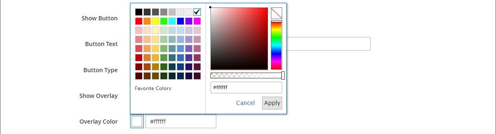{width="600" zoomable="yes"}

1. In the upper-right corner, click **[!UICONTROL Save]** to apply the settings and return to the [!DNL Page Builder] workspace.

   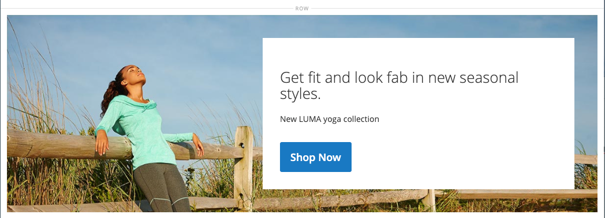{width="600" zoomable="yes"}

## [!UICONTROL Search Engine Optimization] {#seo}

Text for these settings is visible to search engines and improves the way the page is indexed.

- For **[!UICONTROL Alternative Text]**, enter an _alt_ text description for digital accessibility tools to display.

   The use of alt text is an accessibility best practice, and is required by law in some locales. In HTML, the `alt` attribute is a subset of the `image` tag: `<image title="tooltip" alt="description" src="image.jpg">`.

- For **[!UICONTROL Title Attribute]**, enter the text to display as a tooltip on mouseover.

   As a best practice, choose a descriptive, keyword-rich title to improve the way the image is indexed by search engines. In HTML, the `title` attribute is a subset of the `image` tag: `<image title="tooltip" alt="description" src="image.jpg">`.

## [!UICONTROL Advanced]

1. To control the horizontal positioning of content containers that are added to the banner, choose an **[!UICONTROL Alignment]**:

   | Option | Description |
   | ------ | ----------- |
   | `Default` | Applies the alignment default setting that is specified in the style sheet of the current theme. |
   | `Left` | Aligns the content containers along the left border of the banner container, with allowance for any padding that is specified. |
   | `Center` | Aligns the content container in the center of the banner container, with allowance for any padding that is specified. |
   | `Right` | Aligns the content container along the right border of the banner container, with allowance for any padding that is specified. |

   {style="table-layout:auto"}

1. Set the **[!UICONTROL Border]** style applied to all four sides of the banner container:

   | Option | Description |
   | ------ | ----------- |
   | `Default` | Applies the default border style that is specified by the associated style sheet. |
   | `None` | Does not provide any visible indication of the container borders. |
   | `Dotted` | The container border appears as a dotted line. |
   | `Dashed` | The container border appears as a dashed line. |
   | `Solid` | The container border appears as a solid line. |
   | `Double` | The container border appears as a double line. |
   | `Groove` | The container border appears as a grooved line. |
   | `Ridge` | The container border appears as a ridged line. |
   | `Inset` | The container border appears as an inset line. |
   | `Outset` | The container border appears as an outset line. |

   {style="table-layout:auto"}

1. If you set a border style other than `None`, complete the border display options:

   - **[!UICONTROL Border Color]** - Specify the color by choosing a swatch, clicking the color picker, or by entering a valid color name or equivalent hexadecimal value.

      {width="600" zoomable="yes"}

   - **[!UICONTROL Border Width]** - Enter the number of pixels for the border line width.

   - **[!UICONTROL Border Radius]** - Enter the number of pixels to define the size of the radius that is used to round each corner of the border.

1. (Optional) Specify the names of **[!UICONTROL CSS classes]** from the current style sheet to apply to the banner container.

   Separate multiple class names with a space.

1. Enter values, in pixels, for the **[!UICONTROL Margins and Padding]** to specify the outer margins and inner padding of the banner.

   Enter each corresponding value in the banner container diagram.

   | Option | Description |
   | ------ | ----------- |
   | [!UICONTROL Margins] | The amount of blank space that is applied to the outside edge of all sides of the container. |
   | [!UICONTROL Padding] | The amount of blank space that is applied to the inside edge of all sides of the container. |

   {style="table-layout:auto"}
