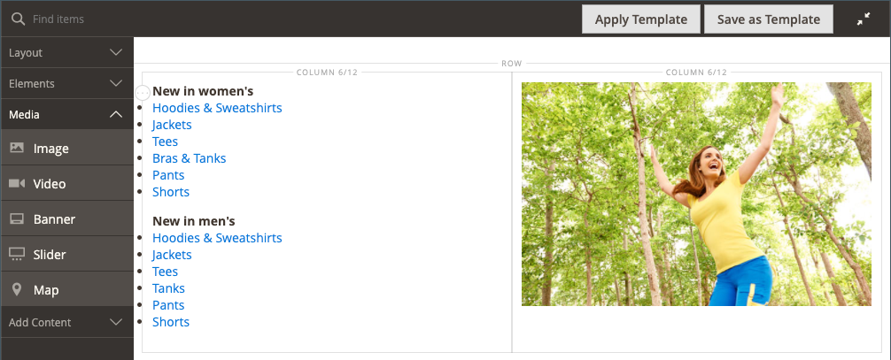
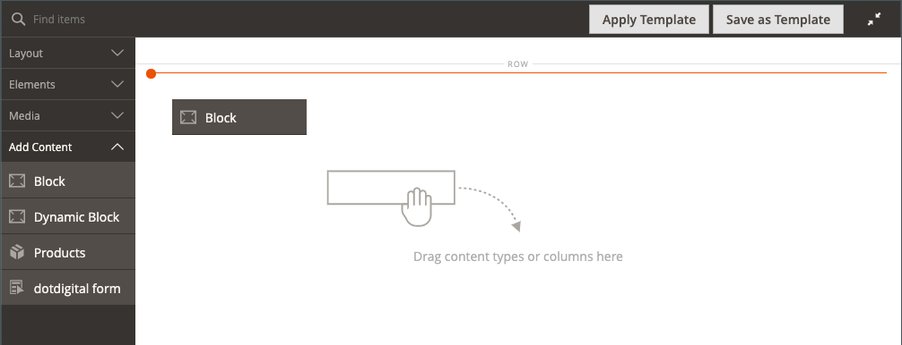
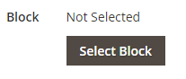
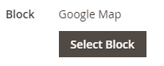

# Add Content - Block

Use the _Block_ content type to add an existing, active [block](../content-design/blocks.md) to the [[!DNL Page Builder] stage](workspace.md#stage). In the following example, the first column contains the block with a side menu for the page. The second column contains an image.

{width="600" zoomable="yes"}

{{$include /help/_includes/page-builder-save-timeout.md}}

## Block toolbox

| Tool      | Icon     | Description   |
| --------- | -------- | ------------- |
| Move      |  | Moves the block container and its content to another position on the stage. |
| Settings  |  | Opens the Edit Block page, where you can choose the block, and change the properties of the container. |
| Hide      |   | Hides the current block container and its content. |
| Show      |  | Shows the  hidden block container and its content. |
| Duplicate |  | Makes a copy of the block container and its content. |
| Remove    |  | Deletes the block container and its content from the stage. |

{style="table-layout:auto"}

{{$include /help/_includes/page-builder-hidden-element-note.md}}

## Add an existing block

1. Navigate to the [!DNL Page Builder] workspace on the target page, block, dynamic block, product, or category.

1. In the [!DNL Page Builder] panel, expand **[!UICONTROL Add Content]** and drag a **[!UICONTROL Block]** placeholder to the stage.

   {width="600" zoomable="yes"}

1. Hover over the empty block container to display the toolbox and choose the _Settings_ ( {width="25"} ) icon.

1. Click **[!UICONTROL Select Block]**.

   {width="200"}

1. In the row of the block that you want to add, click **[!UICONTROL Select]** in the last column.

   {width="600" zoomable="yes"}

   The name of the selected block appears on the page.

   {width="200"}

1. Complete the remaining settings as needed, using the field descriptions at the end of this page for reference.

1. When complete, click **[!UICONTROL Save]** to apply the settings and return to the [!DNL Page Builder] workspace.

### Advanced Settings

1. To control the positioning of the block within the parent container, choose an **[!UICONTROL Alignment]**:

   | Option | Description |
   | ------ | ----------- |
   | `Default` | Applies the alignment default setting that is specified in the style sheet of the current theme. |
   | `Left` | Aligns the list along the left border of the parent container, with allowance for any padding that is specified. |
   | `Center` | Aligns the list in the center of the parent container, with allowance for any padding that is specified. |
   | `Right` | Aligns the block along the right border of the parent container, with allowance for any padding that is specified. |

   {style="table-layout:auto"}

1. Set a **[!UICONTROL Border]** style that is applied to all four sides of the block container:

   | Option | Description |
   | ------ | ----------- |
   | `Default` | Applies the default border style that is specified by the associated style sheet. |
   | `None` | Does not provide any visible indication of the container borders. |
   | `Dotted` | The container border appears as a dotted line. |
   | `Dashed` | The container border appears as a dashed line. |
   | `Solid` | The container border appears as a solid line. |
   | `Double` | The container border appears as a double line. |
   | `Groove` | The container border appears as a grooved line. |
   | `Ridge` | The container border appears as a ridged line. |
   | `Inset` |The container border appears as an inset line. |
   | `Outset` |The container border appears as an outset line. |

   {style="table-layout:auto"}

1. If you set a border style other than `None`, complete the border display options:

   | Option | Description |
   | ------ |------------ |
   | [!UICONTROL Border Color] | Specify the color by choosing a swatch, clicking the color picker, or by entering a valid color name or equivalent hexadecimal value. |
   | [!UICONTROL Border Width] | Enter the number of pixels for the border line width. |
   | [!UICONTROL Border Radius] | Enter the number of pixels to define the size of the radius that is used to round each corner of the border. |

   {style="table-layout:auto"}

1. (Optional) Specify the names of **[!UICONTROL CSS classes]** from the current style sheet to apply to the container.

   Separate multiple class names with a space.

1. Enter values, in pixels, for the **[!UICONTROL Margins and Padding]** to determine the outer margins and inner padding of the block container.

   Enter the corresponding values in the diagram.

   | Container area | Description |
   | -------------- | ----------- |
   | [!UICONTROL Margins] | The amount of blank space that is applied to the outside edge of all sides of the container. Options: `Top` / `Right` / `Bottom` / `Left` |
   | [!UICONTROL Padding] | The amount of blank space that is applied to the inside edge of all sides of the container. Options: `Top` / `Right` / `Bottom` / `Left` |

   {style="table-layout:auto"}

## Edit block settings

1. Hover over the block container and choose the _Settings_ ( {width="25"} ) icon in the toolbox.

   {width="600" zoomable="yes"}

1. To choose a different block, click **[!UICONTROL Select Block]**.

   - In the list of active blocks, click **[!UICONTROL Select]** the block that you want to add.
   - Click **[!UICONTROL Add Selected]**.

1. Update the remaining settings as needed, using the field descriptions at the end of this page for reference.

1. When complete, click **[!UICONTROL Save]** to apply the settings and return to the [!DNL Page Builder] workspace.

## Duplicate a block

1. Hover over the block container to display the toolbox and choose the _Duplicate_ () icon.

    The duplicate appears just below the original.

1. To move the new block to a new position, hover over the container, and then click _Move_ () in the toolbox.

1. Select and drag the block until the red guideline appears at the new position.

    The top and bottom borders of each container appear as dashed lines while the block is moved.

## Remove a block from the stage

1. Hover over the block container to display the toolbox and choose the _Remove_ () icon.

1. When prompted to confirm, click **[!UICONTROL OK]**.
