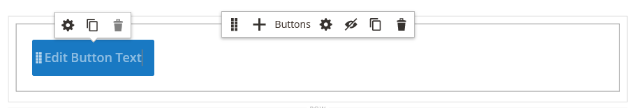

# Elements - Buttons

Use the _Buttons_ content type to add either an individual button or a set of buttons in the [[!DNL Page Builder] stage](workspace.md#stage). You can arrange buttons horizontally or vertically, and add them directly to rows, columns, tabs, and banners on the stage.

{width="600" zoomable="yes"}

{{$include /help/_includes/page-builder-save-timeout.md}}

## Toolboxes

When you are working with the Buttons content type, you add and edit individual buttons and the buttons container that holds one or more buttons. Each has its own toolbox that you use to design buttons on the [!DNL Page Builder] stage.

### Individual button toolbox

{width="500" zoomable="yes"}

| Tool      | Icon     | Description    |
| --------- | -------- | -------------- |
| Settings  | {width="25"}  | Opens the Edit Button page, where you can change the properties of the button. |
| Duplicate | {width="25"} | Makes a copy of the button. |
| Remove    | {width="25"}    | Deletes the button from the stage. |

{style="table-layout:auto"}

### Buttons container toolbox

{width="500" zoomable="yes"}

| Tool      | Icon              | Description |
| --------- | ----------------- | ----------- |
| Move      | {width="25"} | Moves the button container to another valid place on the page. |
| Add       | {width="25"} | Adds a button to the container. |
| (label)   | Button  | Identifies the current container as a button element. |
| Settings  | {width="25"} | Opens the Edit Buttons page, where you can change the properties of the container. |
| Hide      | {width="25"} | Hides the button container. |
| Show      | {width="25"} | Shows the hidden button container. |
| Duplicate | {width="25"} | Makes a copy of the button container. |
| Remove    | {width="25"} | Deletes the button container and its content from the stage. |

{style="table-layout:auto"}

{{$include /help/_includes/page-builder-hidden-element-note.md}}

## Add an individual button

1. In the [!DNL Page Builder] panel, expand **[!UICONTROL Elements]** and drag a **[!UICONTROL Buttons]** placeholder to a row, column, or tab set on the stage.

   {width="500" zoomable="yes"}

1. Hover over the button to display the toolbox and choose the _Settings_ () icon.

1. Enter the **[!UICONTROL Button Text]** to be displayed on the button.

   {width="600" zoomable="yes"}

1. Set **[!UICONTROL Button Type]** to one of the following:

   | Type | Description |
   | ------ | ----------- |
   | `Primary` | Applies the primary button style from the current style sheet. |
   | `Secondary` | Applies the secondary button style from the current style sheet if applicable. |
   | `Link` | Creates a hyperlink rather than a button. |

   {style="table-layout:auto"}

   {width="500" zoomable="yes"}

1. Set the **[!UICONTROL Button Link]** using one of the following types:

   - **[!UICONTROL URL]** - Enter the destination URL for the link.

      The URL can be either a relative link to a product or page in your store, or a fully qualified URL.

      Relative URL example - `../luma-analog-watch.html` 

      Fully qualified URL example - `http://mystore.com/luma-analog-watch.html`

      If the link goes to a different website, you can keep the current page open to your store by opening the link in a new browser tab.

      To prevent the visitor from navigating away from your store, select the **[!UICONTROL Open in new tab]** checkbox.

   - **[!UICONTROL Product]** - Enter a product name (partial or full) or SKU, then choose the product name in the list.

      >[!NOTE]
      >
      >The products are displayed in the list according to the _Show out of stock products_ settings. For Multi Source merchants using [Inventory Management](../inventory-management/introduction.md), the products list is limited by the source assigned to the default website only.

      {width="600" zoomable="yes"}

   - **[!UICONTROL Category]** - Enter a category name (partial or full) or click in the blank field to display the category tree. Then, choose the category name in the tree.

      {width="600" zoomable="yes"}

   - **[!UICONTROL Page]** - Enter the name of a CMS page (partial or full) or click in the blank field to display the full list. Then, choose the name of the page in the search results list.

      {width="600" zoomable="yes"}

1. Complete the [advanced settings][advanced-settings] as needed.

1. When complete, click **[!UICONTROL Save]** in the upper-right corner to apply the settings and return to the [!DNL Page Builder] workspace.

## Add a set of buttons

The following sections describe a series of steps to start with an individual button and create a set of three buttons within a button container. If you do not already have an individual button, follow the previous instructions to add an individual button to the stage.

### Step 1: Create the second button

1. Hover over the button container to display the toolbox and choose the _Add_ ( {width="20"} ) icon.

   {width="500" zoomable="yes"}

1. Enter the text that you want to appear on the second button.

1. Click the new button to display its toolbox and choose the _Settings_ ( {width="20"} ) icon.

   {width="500" zoomable="yes"}

1. Set **[!UICONTROL Button Type]** to `Secondary`.

1. Set up the **[!UICONTROL Button Link]** as needed.

   In the following example, the link is a relative URL that goes to the [Contact Us](../getting-started/store-details.md#contact-us-form) page.

   {width="600" zoomable="yes"}

1. Complete the [advanced settings][advanced-settings] as needed.

1. When complete, click **[!UICONTROL Save]** to apply the settings and return to the [!DNL Page Builder] workspace.

### Step 2: Create the third button

1. Click the second button again on the stage and choose the _Duplicate_ ( {width="20"} ) icon.

   {width="500" zoomable="yes"}

1. Enter the text that you want to appear on the third button.

1. Click the third button to display the toolbox and choose the _Settings_ ( {width="20"} ) icon.

   {width="500" zoomable="yes"}

1. Update the **[!UICONTROL Button Link]** as needed.

1. In the upper-right corner, click **[!UICONTROL Save]** to apply the settings and return to the [!DNL Page Builder] workspace.

### Step 3: Update the button container

1. Hover over the button container to display the toolbox and choose the _Settings_ ( {width="20"} ) icon.

   {width="500" zoomable="yes"}

1. Under _[!UICONTROL Appearance]_, choose **[!UICONTROL Stacked]**.

1. Set **[!UICONTROL All Buttons are same size]** to `Yes`.

   {width="300"}

1. Update the remaining settings as needed, using the descriptions from [Change settings for a button container][button-container].

1. When complete, click **[!UICONTROL Save]** to apply the settings and return to the [!DNL Page Builder] workspace.

   The complete stacked button set appears on the stage, with one primary button and two secondary buttons.

   {width="500" zoomable="yes"}

## Move a button

1. Click the button that you want to move.

1. Select and drag the Move ( {width="20"} ) icon, which appears just before the button text, to a new position for the button within the button container.

   {width="500" zoomable="yes"}

## Change settings for a button

1. Click the button on the stage to display the toolbox and choose the _Settings_ ( {width="20"} ) icon.

   {width="500" zoomable="yes"}

1. Update the standard settings as needed.

   - **[!UICONTROL Button Text]** - Enter the text to be displayed on the button (can also be updated directly from the stage).

   - **[!UICONTROL Button Type]** - Determines the button format.

      | Type | Description |
      | ------ | ----------- |
      | `Primary` | Applies the primary button style from the current style sheet. |
      | `Secondary` | Applies the secondary button style from the current style sheet, if applicable. |
      | `Link` | Creates a hyperlink rather than a button. |

      {style="table-layout:auto"}

   - **[!UICONTROL Button Link]** - Determines the destination page that is served when the button is clicked.

      | Option | Description |
      | ------ | ----------- |
      | `URL` | Uses either a relative or fully qualified URL to identify the destination page. |
      | `Product` | Identifies the destination page based on the product name or SKU. The product name can be searched for based on either a partial or full name. The product is then chosen from the search results list. |
      | `Category` | Identifies the destination page as a specific category or subcategory in the category tree. |
      | `Page` | Identifies the destination page as a specific CMS page. |

      {style="table-layout:auto"}

1. Complete the [advanced settings][advanced-settings] as needed.

1. To save the settings and return to the [!DNL Page Builder] workspace, click **[!UICONTROL Save]** in the upper-right corner.

## Change settings for a button container

1. Hover over the button container to display the toolbox and choose the _Settings_ ( {width="20"} ) icon.

1. Update the **[!UICONTROL Appearance]** settings as needed.

   - Use the arrangement options to display the buttons either horizontally or vertically in the container:

      | Option | Description |
      | ------ | ----------- |
      | `Inline` | Arranges the buttons horizontally. |
      | `Stacked` | Arranges the buttons vertically. |

      {style="table-layout:auto"}

   - Set the **[!UICONTROL All buttons are same size]** option according to your preference.

      When set to `Yes`, all buttons in the container have a consistent size, based on the length of the longest button text.

1. Complete the [Advanced settings][advanced-settings] as needed.

1. When complete, click **[!UICONTROL Save]** to apply the settings and return to the [!DNL Page Builder] workspace.

## Change advanced settings

You can modify the _[!UICONTROL Advanced]_ settings for individual buttons and for the button container.

1. To control the positioning within the parent container, choose the **[!UICONTROL Alignment]**:

   | Option | Description |
   | ------ | ----------- |
   | `Default`| Applies the alignment default setting that is specified in the style sheet of the current theme. |
   | `Left` | Aligns the content along the left border of the parent container, with allowance for any padding that is specified. |
   | `Center` | Aligns the content in the center of the parent container, with allowance for any padding that is specified. |
   | `Right` | Aligns the content along the right border of the parent container, with allowance for any padding that is specified. |

   {style="table-layout:auto"}

1. Set the **[!UICONTROL Border]** style applied to all four sides of the button or buttons container:

   | Option | Description |
   | ------ | ----------- |
   | `Default` | Applies the default border style that is specified by the associated style sheet. |
   | `None` | Does not provide any visible indication of the container borders. |
   | `Dotted` | The container border appears as a dotted line. |
   | `Dashed` | The container border appears as a dashed line. |
   | `Solid` | The container border appears as a solid line. |
   | `Double` | The container border appears as a double line. |
   | `Groove` | The container border appears as a grooved line. |
   | `Ridge` | The container border appears as a ridged line. |
   | `Inset` | The container border appears as an inset line. |
   | `Outset` | The container border appears as an outset line. |

   {style="table-layout:auto"}

1. If you set a border style other than `None`, complete the border display options:

   | Option | Description |
   | ------ |------------ |
   | [!UICONTROL Border Color] | Specify the color by choosing a swatch, clicking the color picker, or by entering a valid color name or equivalent hexadecimal value. |
   | [!UICONTROL Border Width] | Enter the number of pixels for the border line width. |
   | [!UICONTROL Border Radius] | Enter the number of pixels to define the size of the radius that is used to round each corner of the border. |

   {style="table-layout:auto"}

1. (Optional) Specify the names of **[!UICONTROL CSS classes]** from the current style sheet to apply to the button  or buttons container.

   Separate multiple class names with a space.

1. Enter values, in pixels, for the **[!UICONTROL Margins and Padding]** to determine the outer margins and inner padding of the button or buttons container.

   Enter the corresponding values in the diagram.

   | Container area | Description |
   | -------------- | ----------- |
   | [!UICONTROL Margins] | The amount of blank space that is applied to the outside edge of all sides of the container. Options: `Top` / `Right` / `Bottom` / `Left` |
   | [!UICONTROL Padding] | The amount of blank space that is applied to the inside edge of all sides of the container. Options: `Top` / `Right` / `Bottom` / `Left` |

   {style="table-layout:auto"}

[advanced-settings]: #change-advanced-settings
[button-container]: #change-settings-for-a-button-container
