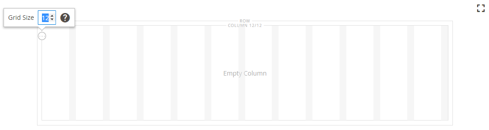
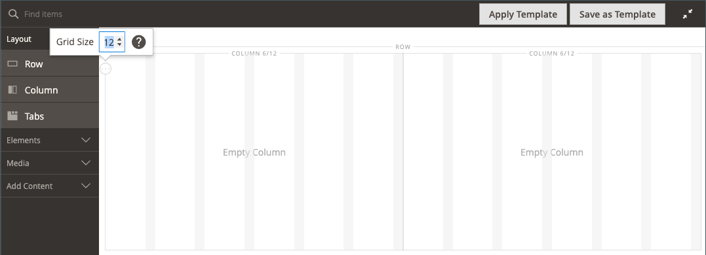
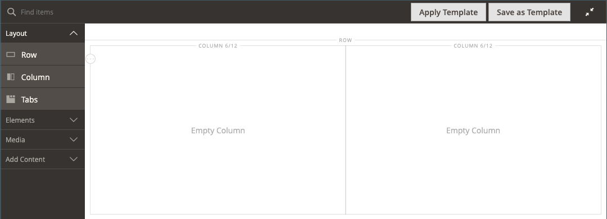
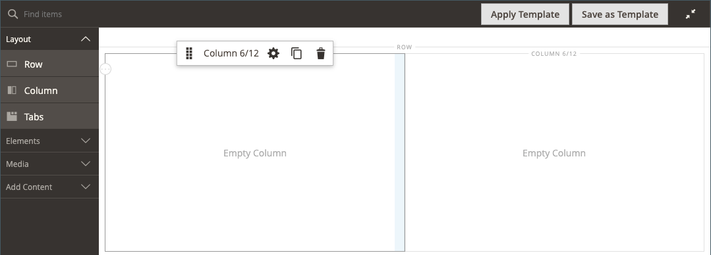
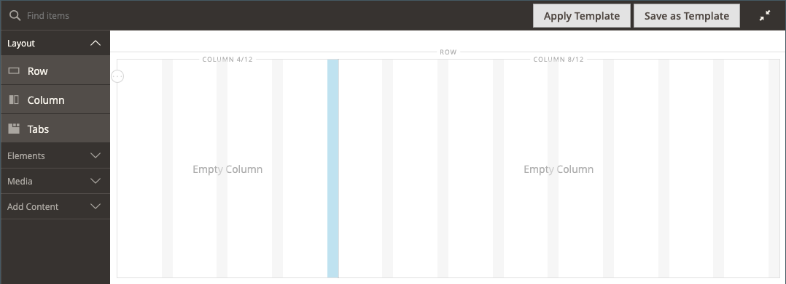
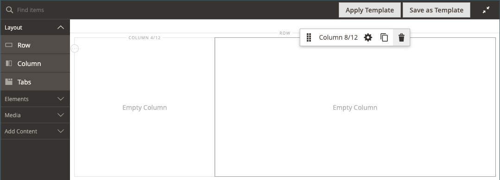
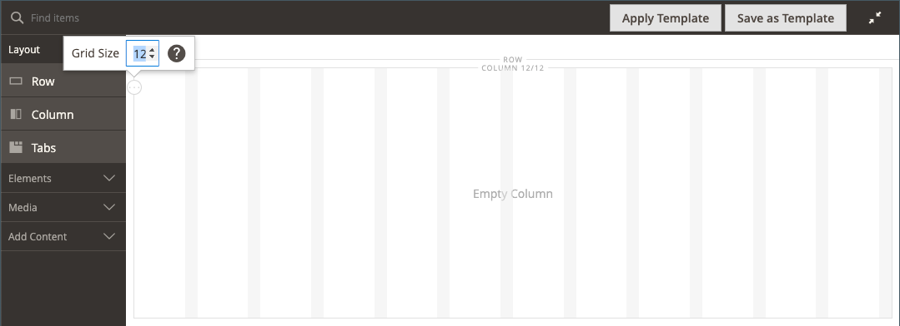
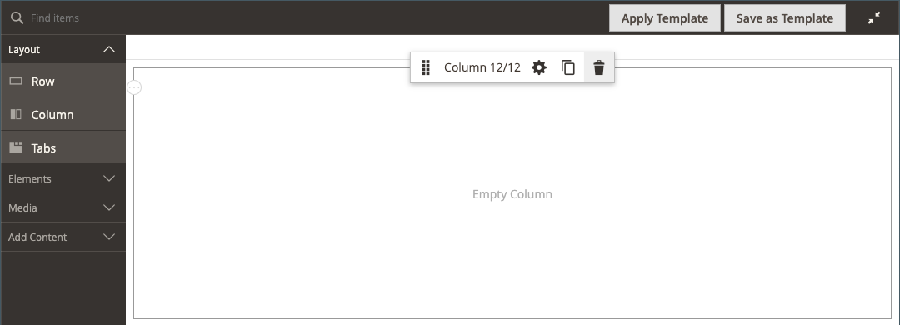

# Layout - Column

Use the _Column_ content type to divide a page into multiple columns in the [[!DNL Page Builder] stage](workspace.md#stage). When you add a column to a row or tab or directly to the stage, the column group is initially divided into two columns of equal width. You can add or remove columns, as needed. A column can be resized by dragging the border between two columns. The width of the next column is adjusted to fill the available space within the row, tab, or stage. A single column extends the full width of the stage or its container.

{width="600" zoomable="yes"}

{{$include /help/_includes/page-builder-save-timeout.md}}

## Updates in the 2.4.5 release

Page Builder capabilities are updated in the 2.4.5 release so that users now use _[!DNL Columns]_ as a parent container for individual columns. This new container also supports properties for background and eliminates the need to wrap columns in a row. It reduces unnecessary markup and gives a finer control over the storefront display and experience.

You can change the layout of the [!DNL Columns] container by dragging a column above or below other columns in the group and stack them. This opens a new variety of possible layout combinations that can be achieved without the need for customization by developers.

Watch this video for a demonstration of how the [!DNL Columns] container can be used to refine your page layouts:

>[!VIDEO](https://video.tv.adobe.com/v/345828?quality=12)

## Column toolbox

Each column has a toolbox of options that appears when you hover over the container.

|Tool|Icon|Description|
|--- |--- |--- |
|Move|{width="25"}|Moves the column and its content to another position in relation to other columns.|
|(label)|Column|Identifies the current container as a column. Hover over the column container to show the toolbox.|
|Settings|{width="25"}|Opens the Edit Column page, where you can change the properties of the container.|
|Duplicate|{width="25"}|Makes a copy of the current column.|
|Remove|{width="25"}|Deletes the current column and its content.|

{style="table-layout:auto"}

## Column grid

The [grid](workspace.md) ensures that content is aligned consistently in a column and helps the page render correctly on both desktop and mobile devices. For more information, see the [Advanced Content Tools](setup.md) section of the [!DNL Page Builder] configuration.

{width="500" zoomable="yes"}

In the following two-column example, the numbers in parentheses (6/12) in the top border of each column container indicate the number of grid divisions in each column and the total number of divisions. In this case, the column is the width of six grid units out of a total of 12.

{width="600" zoomable="yes"}

## Add a column

1. In the [!DNL Page Builder] panel under _[!UICONTROL Layout]_, drag a **[!UICONTROL Column]** to the stage.

   {width="600" zoomable="yes"}

   The column group is now divided into two columns of equal width. Each column is a separate container for content and has its own set of toolbox options.

   {width="600" zoomable="yes"}

1. In the upper-left corner of the column group, click the _Grid_ tool () and adjust the grid size as needed.

   Positioning content on the grid helps to align content consistently and renders the page correctly on both desktop and mobile devices. For more information, see the [Advanced Content Tools](../configuration-reference/general/content-management.md) section of the [!DNL Page Builder] configuration.

   {width="600" zoomable="yes"}

## Resize a column

1. Hover over the border between two columns.

   The border is highlighted and the toolbox for the selected column appears.

   {width="600" zoomable="yes"}

1. Hold down the mouse button to show the grid and drag the border to a new position on the grid.

   The width of both columns adjusts to reflect the change. The new width of each column appears after the label, such as `4/12` (four out of 12) and `8/12` (eight out of 12).

   {width="600" zoomable="yes"}

## Remove a column

1. Hover over the column that you want to remove to display the toolbox and choose the _Remove_ ( {width="20"} ) icon.

   {width="600" zoomable="yes"}

1. If the column contains content, click **[!UICONTROL OK]** to confirm.

   To speed up the process in the future, you can skip the confirmation step by selecting the **[!UICONTROL Do not show this again]** checkbox.

   The column group now has a single column (12/12) and grid. Because the grid is available only for columns, you can use this technique to show the grid.

   {width="600" zoomable="yes"}

1. If you want the column group to extend the remaining column to the full width of the row or stage:

   - Hover over the column to display the toolbox and choose the _Settings_ ( {width="20"} ) icon.

   - Scroll down to the _[!UICONTROL Advanced]_ section and set all four **[!UICONTROL Padding]** values to `0`.

      {width="600" zoomable="yes"}

   - In the upper-right corner, click **[!UICONTROL Save]** to close the _[!UICONTROL Edit Column]_ page.

1. Click the _Close Full Screen_ ( {width="20"} ) icon in the upper-right corner of the workspace, and then click **[!UICONTROL Save]** in the upper-right corner.

## Change column settings

1. Hover over the column to display the toolbox and choose the _Settings_ ( {width="20"} ) icon.

   {width="600" zoomable="yes"}

1. Change the **[!UICONTROL Appearance]** settings as needed.

   - Choose the alignment setting that determines the position of the column in relation to its container.

      | Option | Description |
      | ------ | ----------- |
      | `Full Height` | The column extends the full height of its container. |
      | `Top Aligned` | The column is aligned at the top of its container. |
      | `Centered` | The column in centered in the middle of its container. |
      | `Bottom Aligned` | The column is aligned at the bottom of its container. |

      {style="table-layout:auto"}

   - If needed, enter the **[!UICONTROL Minimum Height]** for the column. For example, you might set the minimum height to match the height of a background image.

   - If you set the minimum height, set the **[!UICONTROL Vertical Alignment]**  to control the position of content containers that are added to the column (`Top`, `Center`, or `Bottom`).

1. Change the background for the column content.

   - **[!UICONTROL Background Color]** - Specify the color by choosing a swatch, clicking the color picker, or by entering a valid color name or equivalent hexadecimal value. This setting determines the background color of the column.

   - **[!UICONTROL Background Image]** - If needed, use the provided tools to choose a background image to apply to the column:

      | Tool | Description |
      | ------ | ----------- |
      | [!UICONTROL Upload] | Uploads an image file from your local computer to the gallery and then applies it as the background image for the column. |
      | [!UICONTROL Select from Gallery] | Prompts you to choose an existing image from the gallery as the background image for the column. |
      | {width="25"} | Allows you to either drag the image to the camera tile or browse to the image in your local file system. |

      {style="table-layout:auto"}

   - **[!UICONTROL Background Mobile Image]** - If needed, use the same tools to choose a different background image to be used for display on mobile devices.

   - **[!UICONTROL Background Size]** - Change this setting to determines how the background image is scaled in relation to the width of the column:

      | Option | Description |
      | ------ | ----------- |
      | `Cover` | The background image covers the full width of the column. |
      | `Contain` | The background image is limited to the width of the content area. |
      | `Auto` | Applies the default background size that is specified in the style sheet of the current theme. |

      {style="table-layout:auto"}

   - **[!UICONTROL Background Position]** - Change this setting to determine the anchor point of the image in relation to the column. Options: `Top Left`, `Top Center`, `Top Right`, `Center Left`, `Center`, `Center Right`, `Bottom Left`, `Bottom Center`, or `Bottom Right`

   - **[!UICONTROL Background Attachment]** - Change this setting to determine how the background image moves in relation to the scrolling page:

      | Option | Description |
      | ------ | ----------- |
      | `Scroll` | The background image is synchronized to move down as the  page scrolls. |
      | `Fixed` | (Not available for mobile) The background image does not move as the container scrolls over the image, and is fixed at the specified background position. |

      {style="table-layout:auto"}

   - **[!UICONTROL Background Repeat]** - If you want to repeat the background image to fill the space, change this setting `Yes`.

1. Update the _[!UICONTROL Advanced]_ settings as needed.

   - To control the horizontal positioning of content containers that are added to the column, choose an **[!UICONTROL Alignment]**:

      | Option | Description |
      | ------ | ----------- |
      | `Default` | Applies the alignment default setting that is specified in the style sheet of the current theme. |
      | `Left` | Aligns the content containers along the left border of the column container, with allowance for any padding that is specified. |
      | `Center` | Aligns the content container in the center of the column container, with allowance for any padding that is specified. |
      | `Right` | Aligns the content container along the right border of the column container, with allowance for any padding that is specified. |

      {style="table-layout:auto"}

   - Set the **[!UICONTROL Border]** style, which is applied to all four sides of the column container:

      | Option | Description |
      | ------ | ----------- |
      | `Default` | Applies the default border style that is specified by the associated style sheet. |
      | `None` | Does not provide any visible indication of the container borders. |
      | `Dotted` | The container border appears as a dotted line. |
      | `Dashed` | The container border appears as a dashed line. |
      | `Solid` | The container border appears as a solid line. |
      | `Double` | The container border appears as a double line. |
      | `Groove` | The container border appears as a grooved line. |
      | `Ridge` | The container border appears as a ridged line. |
      | `Inset` | The container border appears as an inset line. |
      | `Outset`| The container border appears as an outset line. |

      {style="table-layout:auto"}

   - If you set a border style other than `None`, complete the border display options:

      | Option | Description |
      | ------ |------------ |
      | [!UICONTROL Border Color] | Specify the color by choosing a swatch, clicking the color picker, or by entering a valid color name or equivalent hexadecimal value. |
      | [!UICONTROL Border Width] | Enter the number of pixels for the border line width. |
      | [!UICONTROL Border Radius] | Enter the number of pixels to define the size of the radius that is used to round each corner of the border. |

      {style="table-layout:auto"}

   - (Optional) Specify the names of **[!UICONTROL CSS classes]** from the current style sheet to apply to the column container.

      Separate multiple class names with a space.

   - Enter values, in pixels, for the **[!UICONTROL Margins and Padding]** to specify the outer margins and inner padding of the column.

      Enter each corresponding value in the column container diagram.

      | Container area | Description |
      | -------------- | ----------- |
      | [!UICONTROL Margins] | The amount of blank space that is applied to the outside edge of all sides of the container. Options: `Top` / `Right` / `Bottom` / `Left` |
      | [!UICONTROL Padding] | The amount of blank space that is applied to the inside edge of all sides of the container. Options: `Top` / `Right` / `Bottom` / `Left` |

      {style="table-layout:auto"}

1. When complete, click **[!UICONTROL Save]** to apply the settings and return to the [!DNL Page Builder] workspace.
