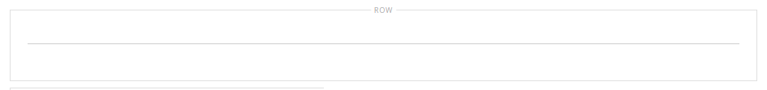
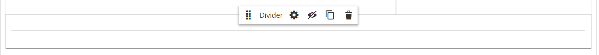
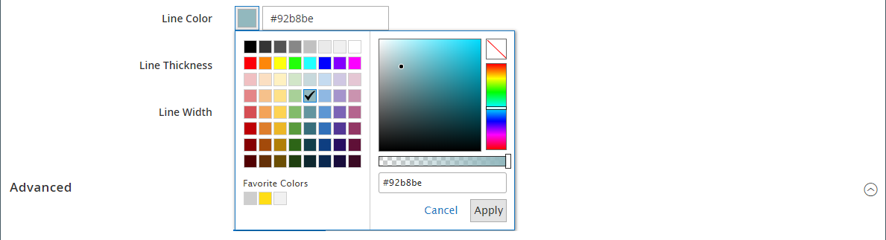
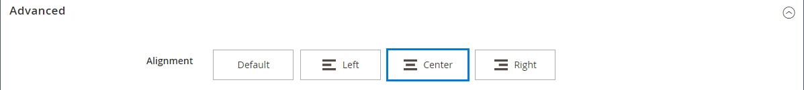

# Elements - Divider

Use the _Divider_ content type to add a rule as a visual break between sections of content in the [[!DNL Page Builder] stage](workspace.md#stage). You can specify the line color, thickness, and width of the divider. You can also control the alignment, set the margins and padding, and format of the container border. By default, the divider is a hairline rule that extends the full width of the container, with allowance for padding.

{width="500" zoomable="yes"}

Although most divider containers are invisible, the following example displays the container with a red dashed border so you can see the relationship between the divider, the padding, and the container. You can adjust the padding at the top and bottom of the divider to control the spacing between elements.

{width="500" zoomable="yes"}

{{$include /help/_includes/page-builder-save-timeout.md}}

## Divider toolbox

| Tool | Icon                | Description |
| ---- | --------------------| ------------|
| Move | {width="25"} | Moves the divider container to another valid place on the page. |
| (label) | DIVIDER | Identifies the current container as a divider element. |
| Settings | {width="25"} | Opens the Edit Divider page, where you can change the properties of the divider and its container. |
| Hide | {width="25"} | Hides the divider container. |
| Show | {width="25"} | Shows the hidden divider container. |
| Duplicate | {width="25"} | Makes a copy of the divider container. |
| Remove | {width="25"} | Deletes the divider container and its content from the stage. |

{style="table-layout:auto"}

## Add a divider

1. In the [!DNL Page Builder] panel, expand **[!UICONTROL Elements]** and drag a **[!UICONTROL Divider]** placeholder to a row, column, or tab set on the stage.

   Use the red guideline for reference as you position the divider either before or after another content container on the stage.

   {width="600" zoomable="yes"}

   In the following example, the divider marks the beginning of a new section of text.

   {width="500" zoomable="yes"}

1. To specify the settings of the new divider, follow the next procedure.

## Change the divider settings

1. Hover over the divider container to display the toolbox and choose the _Settings_ ( {width="20"} ) icon.

   {width="500" zoomable="yes"}

1. Change the divider **[!UICONTROL Line Color]** using one of the following methods:

   - Enter a valid [HTML color name][1]. For example, `Teal`.
   - Enter the hexadecimal color value. For example, `#008080`.

   When complete, click **[!UICONTROL Apply]**.

   {width="600" zoomable="yes"}

1. Enter the **[!UICONTROL Line Thickness]** in pixels.

1. To indicate the unit of measurement, enter the **[!UICONTROL Line Width]** followed by either `px` or `%`.

   {width="600" zoomable="yes"}

1. Update the _[!UICONTROL Advanced]_ settings as needed.

   - To control the positioning of the divider within the parent container, choose the **[!UICONTROL Alignment]**:

      | Option | Description |
      | ------ | ----------- |
      | `Default` | Applies the alignment default setting that is specified in the style sheet of the current theme. |
      | `Left` | Aligns the list along the left border of the parent container, with allowance for any padding that is specified. |
      | `Center` | Aligns the list in the center of the parent container, with allowance for any padding that is specified. |
      | `Right` | Aligns the block along the right border of the parent container, with allowance for any padding that is specified. |

      {style="table-layout:auto"}

      In the following example, the options are set to use a center alignment for the divider.

      {width="600" zoomable="yes"}

   - Set the **[!UICONTROL Border]** style applied to all four sides of the divider container:

      | Option | Description |
      | ------ | ----------- |
      | `Default` | Applies the default border style that is specified by the associated style sheet. |
      | `None` | Does not provide any visible indication of the container borders. |
      | `Dotted` | The container border appears as a dotted line. |
      | `Dashed` | The container border appears as a dashed line. |
      | `Solid` | The container border appears as a solid line. |
      | `Double` | The container border appears as a double line. |
      | `Groove` | The container border appears as a grooved line. |
      | `Ridge` | The container border appears as a ridged line. |
      | `Inset` | The container border appears as an inset line. |
      | `Outset` | The container border appears as an outset line. |

      {style="table-layout:auto"}

   - If you set a border style other than `None`, complete the border display options:

      | Option | Description |
      | ------ |------------ |
      | [!UICONTROL Border Color] | Specify the color by choosing a swatch, clicking the color picker, or by entering a valid color name or equivalent hexadecimal value. |
      | [!UICONTROL Border Width] | Enter the number of pixels for the border line width. |
      | [!UICONTROL Border Radius] | Enter the number of pixels to define the size of the radius that is used to round each corner of the border. |

      {style="table-layout:auto"}

   - (Optional) Specify the names of **[!UICONTROL CSS classes]** from the current style sheet to apply to the container.

      Separate multiple class names with a space.

   - Enter values, in pixels, for the **[!UICONTROL Margins and Padding]** to determine the outer margins and inner padding of the divider container.

      Enter the corresponding values in the diagram.

      | Container area | Description |
      | -------------- | ----------- |
      | [!UICONTROL Margins] | The amount of blank space that is applied to the outside edge of all sides of the container. Options: `Top` / `Right` / `Bottom` / `Left` |
      | [!UICONTROL Padding] | The amount of blank space that is applied to the inside edge of all sides of the container. Options: `Top` / `Right` / `Bottom` / `Left` |

      {style="table-layout:auto"}

1. When complete, click **[!UICONTROL Save]** to apply the settings and return to the [!DNL Page Builder] workspace.

   {width="500" zoomable="yes"}

## Duplicate a divider

For a formatted divider with specific settings, it is more efficient to make a duplicate, rather than start over with a new placeholder.

1. Hover over the divider container to display the toolbox and choose the _Duplicate_ ( {width="20"} ) icon.

   The duplicate divider container appears just below the original.

   {width="500" zoomable="yes"}

1. Hover over the new divider container to display the toolbox and choose the _Move_ ( {width="20"} ) icon.

   {width="500" zoomable="yes"}

1. Select and drag the divider until the red guideline marks the new position.

   The top and bottom borders of each container appear as dashed lines while the divider is moved.

   {width="500" zoomable="yes"}

[1]: https://en.wikipedia.org/wiki/Web_colors
