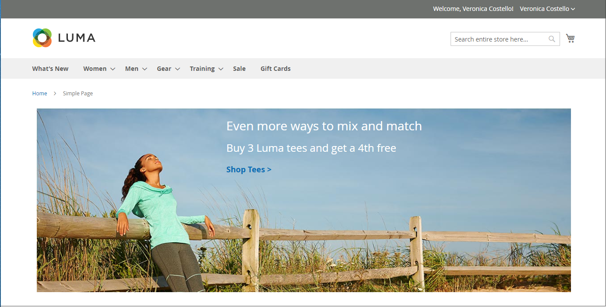
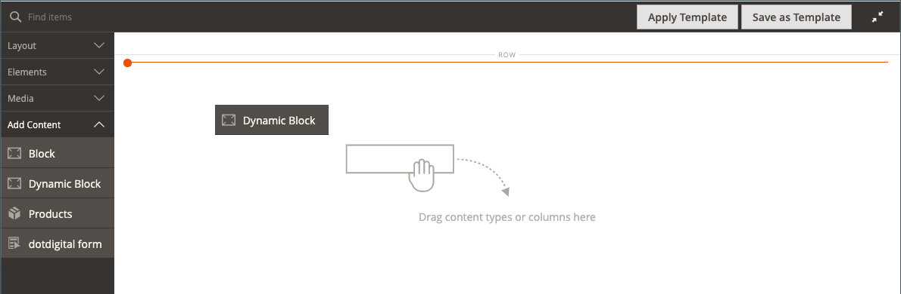
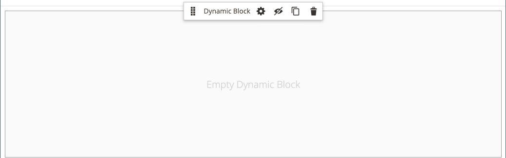
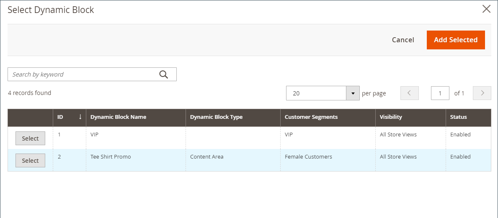
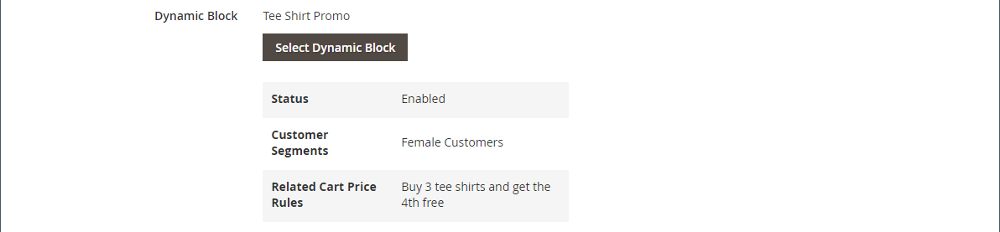
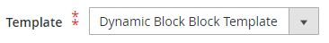
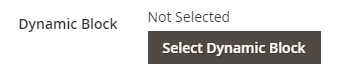
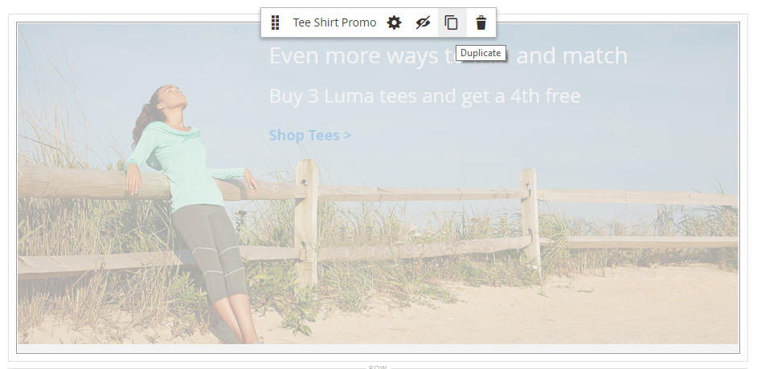

# Add Content - Dynamic Block

Use the Dynamic Block content type to add an existing [dynamic block](../content-design/dynamic-blocks.md) to the [[!DNL Page Builder] stage](workspace.md#stage).

{width="700" zoomable="yes"}

{{$include /help/_includes/page-builder-save-timeout.md}}

## Dynamic Block toolbox

| Tool      | Icon          | Description       |
| --------- | ------------- | ----------------- |
| Move      | {width="25"} | Moves the block container and its content to another position on the stage.  |
| Settings  | {width="25"} | Opens the _Edit Block_ page, where you can choose the block and change the properties of the container. |
| Hide      | {width="25"} | Hides the current block container and its content.  |
| Show      | {width="25"} | Shows the  hidden block container and its content.  |
| Duplicate | {width="25"} | Makes a copy of the block container and its content.  |
| Remove    | {width="25"} | Deletes the block container and its content from the stage. |

{style="table-layout:auto"}

{{$include /help/_includes/page-builder-hidden-element-note.md}}

## Add an existing dynamic block to the stage

1. Navigate to the [!DNL Page Builder] workspace on the target page, block, product, or category.

1. In the [!DNL Page Builder] panel, expand **[!UICONTROL Add Content]** and drag a **[!UICONTROL Dynamic Block]** placeholder to the stage.

   {width="600" zoomable="yes"}

1. Hover over the empty dynamic block container to display the toolbox and choose the _Settings_ ( {width="20"} ) icon.

   {width="600" zoomable="yes"}

1. On the _Edit Dynamic Block_ page, click **[!UICONTROL Select Dynamic Block]** and use the list to select the block.

   {width="600" zoomable="yes"}

   In the list, find the dynamic block that you want to insert, and click **[!UICONTROL Select]**. Then, click **[!UICONTROL Add Selected]**.

   {width="600" zoomable="yes"}

   A summary of the dynamic block information appears below.

   {width="600" zoomable="yes"}

1. Set **[!UICONTROL Template]** to one of the following:

   | Option | Description |
   | ------ | ----------- |
   | `Dynamic Block Block Template` | Adds a standalone block. |
   | `Dynamic Block Inline Template` | Inserts the block content into text. |

   {style="table-layout:auto"}

   {width="200"}

1. Complete the Advanced settings as needed.

1. When complete, click **[!UICONTROL Save]** to apply the settings and return to the [!DNL Page Builder] workspace.

### Advanced Settings

1. To control the positioning of the dynamic block within the parent container, choose an **[!UICONTROL Alignment]**:

   | Option | Description |
   | ------ | ----------- |
   | `Default` | Applies the alignment default setting that is specified in the style sheet of the current theme. |
   | `Left` | Aligns the list along the left border of the parent container, with allowance for any padding that is specified. |
   | `Center` | Aligns the list in the center of the parent container, with allowance for any padding that is specified. |
   | `Right` | Aligns the block along the right border of the parent container, with allowance for any padding that is specified. |

   {style="table-layout:auto"}

1. Set the **[!UICONTROL Border]** style that is applied to all four sides of the dynamic block container:

   | Option | Description |
   | ------ | ----------- |
   | `Default` | Applies the default border style that is specified by the associated style sheet. |
   | `None` | Does not provide any visible indication of the container borders. |
   | `Dotted` | The container border appears as a dotted line. |
   | `Dashed` | The container border appears as a dashed line. |
   | `Solid` | The container border appears as a solid line. |
   | `Double` | The container border appears as a double line. |
   | `Groove` | The container border appears as a grooved line. |
   | `Ridge` | The container border appears as a ridged line. |
   | `Inset` | The container border appears as an inset line. |
   | `Outset` | The container border appears as an outset line. |

   {style="table-layout:auto"}

1. If you set a border style other than `None`, complete the border display options:

   | Option | Description |
   | ------ |------------ |
   | [!UICONTROL Border Color] | Specify the color by choosing a swatch, clicking the color picker, or by entering a valid color name or equivalent hexadecimal value. |
   | [!UICONTROL Border Width] | Enter the number of pixels for the border line width. |
   | [!UICONTROL Border Radius] | Enter the number of pixels to define the size of the radius that is used to round each corner of the border. |

   {style="table-layout:auto"}

1. (Optional) Specify the names of **[!UICONTROL CSS classes]** from the current style sheet to apply to the container.

   Separate multiple class names with a space.

1. Enter values, in pixels, for the **[!UICONTROL Margins and Padding]** to determine the outer margins and inner padding of the dynamic block container.

   Enter the corresponding values in the diagram.

   | Container area | Description |
   | -------------- | ----------- |
   | [!UICONTROL Margins] | The amount of blank space that is applied to the outside edge of all sides of the container. Options: `Top` / `Right` / `Bottom` / `Left` |
   | [!UICONTROL Padding] | The amount of blank space that is applied to the inside edge of all sides of the container. Options: `Top` / `Right` / `Bottom` / `Left` |

   {style="table-layout:auto"}

## Edit dynamic block container settings

1. Hover over the dynamic block container to display the toolbox and choose the _Settings_ ( {width="20"} ) icon.

   {width="500" zoomable="yes"}

1. If needed, change the dynamic block:

   - Click **[!UICONTROL Select Dynamic Block]**.

      {width="20"}

   - In the list of active dynamic blocks, click **[!UICONTROL Select]** for the block that you want to add.

1. Update the remaining settings as needed.

1. When complete, click **[!UICONTROL Save]** to apply the settings and return to the [!DNL Page Builder] workspace.

## Duplicate a dynamic block

1. Hover over the dynamic block container to display the toolbox and choose the _Duplicate_ ( {width="20"} ) icon.

   The duplicate appears just below the original.

   {width="500" zoomable="yes"}

1. To move the new dynamic block to a different position, hover over its container, and then choose _Move_ ( {width="20"} ) in the toolbox.

1. Select and drag the dynamic block until the red guideline appears at the new position.

   The top and bottom borders of each container appear as dashed lines while the dynamic block is moved.

## Remove a dynamic block from the stage

1. Hover over the dynamic block container to display the toolbox and choose the _Remove_ ( {width="20"} ) icon.

1. When prompted to confirm, click **[!UICONTROL OK]**.

<!-- Last updated from includes: 2023-09-11 14:30:19 -->
