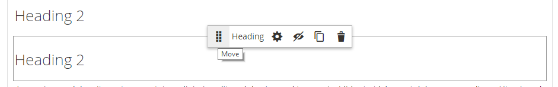
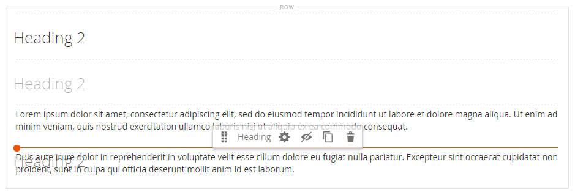

# Elements - Heading

Heading levels establish a hierarchy that organizes content and helps search engines index each page. Use the _Heading_ content type in the [[!DNL Page Builder] stage](workspace.md#stage) to add a text container with a heading level from H1 to H6 to the stage. Headings are formatted according to the style sheet that is associated with the current theme.

The [Content Heading](workspace.md) field in the _[!UICONTROL Content]_ section can be used to add an H1 heading to the top of the page. However, the field is a legacy from previous [!DNL Commerce] versions and is provided to support older content. This field does not take advantage of [!DNL Page Builder]'s advanced features. It is recommended that you leave the Content Heading field blank and use the [!DNL Page Builder] Heading content type to add headings of any level to the page.

The following example shows how the Content Heading and the Heading content type appear when formatted by the Luma theme.

{width="700" zoomable="yes"}

You can drag a heading from the _Elements_ section of the [!DNL Page Builder] panel to a row, column, or tab set on the stage. The heading level and alignment can be controlled from the editor toolbar on the stage, or by using the _Settings_ ( {width="20"} ) control.

{{$include /help/_includes/page-builder-save-timeout.md}}

## Heading editor

{width="500" zoomable="yes"}

## Heading container toolbox

As with all content containers, the toolbox appears when you hover over the container.

{width="500" zoomable="yes"}

| Tool      | Icon              | Description            |
| --------- | ----------------- | ---------------------- |
| Move      | {width="25"} | Moves the heading container to another valid place on the page. |
| (label)   | Heading  | Identifies the current container as a heading. |
| Settings  | {width="25"} | Opens the Edit Heading page, where you can change the properties of the container. |
| Hide      | {width="25"} | Hides the heading container. |
| Show      | {width="25"} | Shows the hidden heading container. |
| Duplicate | {width="25"} | Makes a copy of the heading container. |
| Remove    | {width="25"} | Deletes the heading container and its content from the stage. |

{style="table-layout:auto"}

{{$include /help/_includes/page-builder-hidden-element-note.md}}

## Add a heading

1. In the [!DNL Page Builder] panel, expand **[!UICONTROL Elements]** and drag a **[!UICONTROL Heading]** placeholder to a row, column, or tab set on the stage.

   {width="600" zoomable="yes"}

1. In the editor, enter the heading text over the `Edit Heading Text` placeholder.

   By default, the heading text is assigned a level two (H2) heading type.

   {width="500" zoomable="yes"}

1. In the toolbar, choose the appropriate heading type between H1 and H6.

1. Change the alignment, if needed.

## Edit header settings

1. Hover over the heading container to display the toolbox and choose the _Settings_ ( {width="20"} ) icon.

   {width="500" zoomable="yes"}

1. Update the heading content (**[!UICONTROL Heading Type]** and **[!UICONTROL Heading Text]**) if needed.

   You can also update this content in the heading editor.

1. Update the _[!UICONTROL Advanced]_ settings as needed.

   - To control the positioning of the heading within the parent container, choose an **[!UICONTROL Alignment]**:

      | Option | Description |
      | ------ | ----------- |
      | `Default` | Applies the alignment default setting that is specified in the style sheet of the current theme. |
      | `Left` | Aligns the list along the left border of the parent container, with allowance for any padding that is specified.|
      | `Center` | Aligns the list in the center of the parent container, with allowance for any padding that is specified. |
      | `Right` | Aligns the block along the right border of the parent container, with allowance for any padding that is specified. |

      {style="table-layout:auto"}

   - Set the **[!UICONTROL Border]** style applied to all four sides of the heading container:

      | Option | Description |
      | ------ | ----------- |
      | `Default` | Applies the default border style that is specified by the associated style sheet. |
      | `None` | Does not provide any visible indication of the container borders. |
      | `Dotted` | The container border appears as a dotted line. |
      | `Dashed` | The container border appears as a dashed line. |
      | `Solid` | The container border appears as a solid line. |
      | `Double` | The container border appears as a double line. |
      | `Groove` | The container border appears as a grooved line. |
      | `Ridge` | The container border appears as a ridged line. |
      | `Inset` | The container border appears as an inset line. |
      | `Outset` | The container border appears as an outset line. |

      {style="table-layout:auto"}

   - If you set a border style other than `None`, complete the border display options:

      | Option | Description |
      | ------ |------------ |
      | [!UICONTROL Border Color] | Specify the color by choosing a swatch, clicking the color picker, or by entering a valid color name or equivalent hexadecimal value. |
      | [!UICONTROL Border Width] | Enter the number of pixels for the border line width. |
      | [!UICONTROL Border Radius] | Enter the number of pixels to define the size of the radius that is used to round each corner of the border. |

      {style="table-layout:auto"}

   - (Optional) Specify the names of **[!UICONTROL CSS classes]** from the current style sheet to apply to the container.

      Separate multiple class names with a space.

   - Enter values, in pixels, for the **[!UICONTROL Margins and Padding]** to determine the outer margins and inner padding of the heading container.

      Enter the corresponding values in the diagram.

      | Container area | Description |
      | -------------- | ----------- |
      | [!UICONTROL Margins] | The amount of blank space that is applied to the outside edge of all sides of the container. Options: `Top` / `Right` / `Bottom` / `Left` |
      | [!UICONTROL Padding] | The amount of blank space that is applied to the inside edge of all sides of the container. Options: `Top` / `Right` / `Bottom` / `Left` |

      {style="table-layout:auto"}

1. When complete, click **[!UICONTROL Save]** to apply the settings and return to the [!DNL Page Builder] workspace.

## Duplicate a heading

For a formatted heading with specific settings, it is more efficient to duplicate the heading, rather than start over with a new placeholder.

1. Hover over the heading container to display the toolbox and choose the _Duplicate_ ( {width="20"} ) icon.

   The duplicate appears just below the original.

   {width="500" zoomable="yes"}

1. Hover over the new heading container to display the toolbox and choose the _Move_ ( {width="20"} ) icon.

   {width="500" zoomable="yes"}

1. Select and drag the heading until the red guideline marks the new position.

   The top and bottom borders of each container appear as dashed lines while the heading is moved.

   {width="500" zoomable="yes"}

1. If you want to change the heading level, click the heading text and choose the new level in the editor toolbar.

   {width="500" zoomable="yes"}
