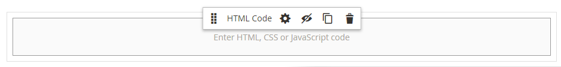

# Elements - HTML Code

Use the _HTML Code_ content type to add snippets of HTML, CSS, and JavaScript code in the [[!DNL Page Builder] stage](workspace.md#stage). For example, you might want to add custom HTML, declare a CSS class that can be applied to an element on the page. Or, you might want to add a snippet of code for a logo, button, or banner that you received from a third-party provider.

## HTML Code toolbox

<!-- zoom -->

| Tool      | Icon       | Description       |
| --------- | ---------- | ----------------- |
| Move      |  | Moves the HTML Code container to another valid place on the page. |
| Settings  |  | Opens the Edit HTML Code page, where you can change the properties of the container. |
| Hide      |  | Hides the HTML Code container. |
| Show      |  | Shows the hidden HTML Code container. |
| Duplicate |  | Makes a copy of the HTML Code container. |
| Remove    |   | Deletes the HTML Code container and its content from the stage. |

## Add HTML code

The following example demonstrates how to embed [Google Font][1] code and declare custom heading classes that override the current stylesheet.

### Step 1: Choose a Google font

1. Visit the [Google Fonts][1] site and choose the font family that you want to use.

   <!-- zoom -->

1. Copy the generated code that is to be embedded in the `<head>` section of the page and paste it temporarily into a text editor.

   - Embed Font code
   - CSS Rule

1. Add the font-family rule to each heading class, enclosing the heading classes in a `<style>` tag.

   This code is pasted into [!DNL Page Builder].

   ```html
   <style>
      h1 {color: teal; font-family: 'Khand', sans-serif; }
      h2 {color: teal; font-family: 'Khand', sans-serif; }
      h3 {color: teal; font-family: 'Khand', sans-serif; }
   </style>
   ```

### Step 2: Add the code to the page

1. In the _Admin_ sidebar of your store, go to **[!UICONTROL Content]** > _[!UICONTROL Elements]_ > **[!UICONTROL Pages]**.

1. Find the page where the font is to be available and open it in edit mode.

1. Scroll down and expand the **[!UICONTROL Content]** section.

1. In the [!DNL Page Builder] panel, expand **[!UICONTROL Elements]** and drag an **[!UICONTROL HTML Code]** placeholder to a row, column, or tab set on the stage.

   Use the red guideline to position the divider either before or after another content container in the row, column, or tab set.

   <!-- zoom -->

1. Hover over the HTML container to display the toolbox and choose the _Settings_ (  ), icon.

1. In the text box, paste the embed Google Fonts code and style declarations that you prepared.

   To make it easier to read, you can enter a few spaces to indent the code.

   <!-- zoom -->

1. Update the remaining settings as needed (see [Change HTML code settings](#html-settings) for details).

1. In the upper-right corner, click **[!UICONTROL Save]** to apply the settings and return to the [!DNL Page Builder] workspace.

   The new font renders when the page is viewed through a browser.

### Step 3: Preview the page

1. In the _[!UICONTROL Currently Active]_ section, set **[!UICONTROL Enable Page]** to `Yes`.

   <!-- zoom -->

1. In the upper-right corner, click the **[!UICONTROL Save]** arrow and choose **[!UICONTROL Save & Close]**.

1. Find the page in the grid and select **[!UICONTROL View]** in the _[!UICONTROL Actions]_ column.

   <!-- zoom -->

## Change HTML code settings {#html-settings}

1. Hover over the HTML container to display the toolbox and choose the _Settings_ (<!-- width="20px" --> ) icon.

1. In the text box, edit the code as needed.

   HTML, CSS, and JavaScript code are supported. Code snippets that belong in the `<head>` section of the page can be entered here.

   The editor also provides buttons to insert special elements in the code:

   | Button | Description |
   | ------ | ----------- |
   | Insert Widget... | Click to insert a widget at the cursor's position in the HTML text box.|
   | Insert Image... | Click to insert an uploaded image or an image from the Gallery at the cursor's position in the HTML text box.|
   | Insert Variable... | Click to insert a variable at the cursor's position in the HTML text box.|

1. Update the _[!UICONTROL Advanced]_ settings as needed.

   - To control the positioning of the code within the parent container, choose an **[!UICONTROL Alignment]**:

      | Option | Description |
      | ------ | ----------- |
      | `Default` | Applies the alignment default setting that is specified in the style sheet of the current theme. |
      | `Left` | Aligns the list along the left border of the parent container, with allowance for any padding that is specified. |
      | `Center` | Aligns the list in the center of the parent container, with allowance for any padding that is specified. |
      | `Right` | Aligns the block along the right border of the parent container, with allowance for any padding that is specified. |

      In the following example, the options are set to use a center alignment for the rendered code block.

      <!-- zoom -->

   - Set the **[!UICONTROL Border]** style applied to all four sides of the code container:

      | Option | Description |
      | ------ | ----------- |
      | `Default` | Applies the default border style that is specified by the associated style sheet. |
      | `None` | Does not provide any visible indication of the container borders. |
      | `Dotted` | The container border appears as a dotted line. |
      | `Dashed` | The container border appears as a dashed line. |
      | `Solid` | The container border appears as a solid line. |
      | `Double` | The container border appears as a double line. |
      | `Groove` | The container border appears as a grooved line. |
      | `Ridge` | The container border appears as a ridged line. |
      | `Inset` | The container border appears as an inset line. |
      | `Outset` |The container border appears as an outset line. |

   - If you set a border style other than `None`, complete the border display options:

      | Option | Description |
      | ------ |------------ |
      | [!UICONTROL Border Color] | Specify the color by choosing a swatch, clicking the color picker, or by entering a valid color name or equivalent hexadecimal value. |
      | [!UICONTROL Border Width] | Enter the number of pixels for the border line width. |
      | [!UICONTROL Border Radius] | Enter the number of pixels to define the size of the radius that is used to round each corner of the border. |

      {style="table-layout:auto"}

   - (Optional) Specify the names of **[!UICONTROL CSS classes]** from the current style sheet to apply to the container.

      Separate multiple class names with a space.

   - Enter values, in pixels, for the **[!UICONTROL Margins and Padding]** to determine the outer margins and inner padding of the code container.

      Enter the corresponding values in the diagram.

      | Container area | Description |
      | -------------- | ----------- |
      | [!UICONTROL Margins] | The amount of blank space that is applied to the outside edge of all sides of the container. Options: `Top` / `Right` / `Bottom` / `Left` |
      | [!UICONTROL Padding] | The amount of blank space that is applied to the inside edge of all sides of the container. Options: `Top` / `Right` / `Bottom` / `Left` |

[1]: https://fonts.google.com/
