# Media - Image

Use the _Image_ content type to add a JPG, GIF, or PNG image to the [[!DNL Page Builder] stage](workspace.md#stage). In addition to the default desktop image, you can specify a secondary image for mobile devices. You can also add a caption that appears below the image and link the image to any URL, product, category, or page.

>[!TIP]
>
>You can use the [Adobe Stock Integration](https://docs.magento.com/user-guide/cms/adobe-stock.html) to find and save an appropriate asset from among the millions provided by [Adobe Stock](https://stock.adobe.com). See [Using Adobe Stock Images](https://docs.magento.com/user-guide/cms/adobe-stock-manage.html) for details about how to search, refine, and save Adobe Stock assets into your gallery.

{{$include /help/_includes/page-builder-save-timeout.md}}

## Image toolbox

The image toolbox appears when you hover over the image container.

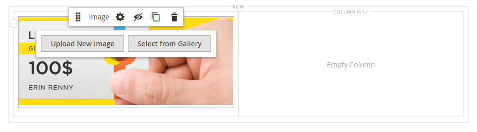<!-- zoom -->

|Tool|Icon|Description|
|--- |--- |--- |
|Move|<!-- width="25px" -->|Moves the image to another position on the stage.|
|(label)|Image|Identifies the current content container as an image. Hover over the image container to see the toolbox.|
|Settings|<!-- width="25px" -->|Opens the _Edit Image_ page, where you can change the properties of the image and container.|
|Hide|<!-- width="25px" -->|Hides the current image.|
|Show|<!-- width="25px" -->|Shows the hidden image.|
|Duplicate|<!-- width="25px" -->|Makes a copy of the image.|
|Remove|<!-- width="25px" -->|Deletes the image from the stage.|
|Upload New Image||Uploads an image from your local file system to the gallery.|
|Select from Gallery||Chooses an existing image from the gallery.|

{style="table-layout:auto"}

## Add an image

1. In the [!DNL Page Builder] panel, expand **[!UICONTROL Media]** and drag an **[!UICONTROL Image]** placeholder to the target container.

   You can add an image to a row, column, or tab. In the following example, the image is dragged to an empty column.

   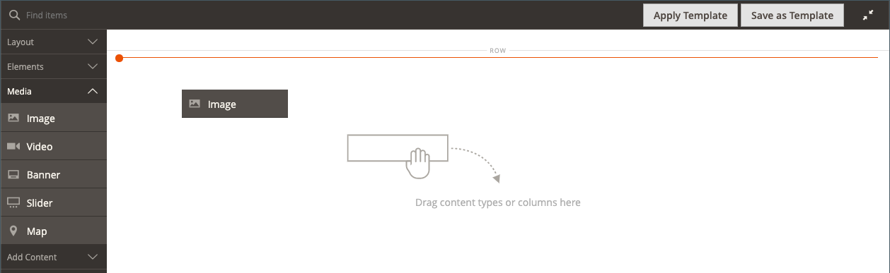<!-- zoom -->

1. Use one of the following methods to add the image asset:

   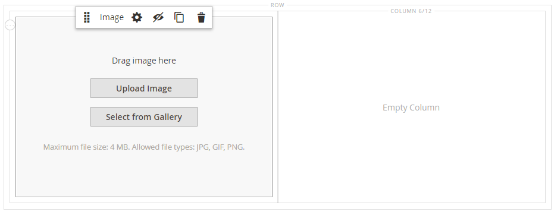<!-- zoom -->

   >[!NOTE]
   >
   >The maximum file size is 4 MB. Supported file types are JPG, GIF, and PNG.

   - _**Upload a new image**_: Use this method to upload a new image file from your system.

      - Click **[!UICONTROL Upload Image]**.

      - Locate and choose the image to add it to the gallery and target container.

      As an alternative, you can also drag an image file from your system and drop it on the _Camera_ (<!-- width="25px" -->) icon.

   - _**Select an existing asset**_: Use this method to select an existing image asset from the media storage/gallery.

      - Click **[!UICONTROL Select from Gallery]**.

      - Use the tree to navigate to the image.

      - Click the thumbnail and click **[!UICONTROL Add Selected]**.

         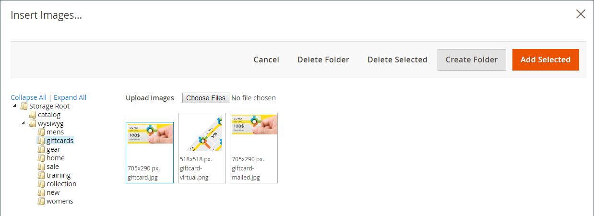<!-- zoom -->

   - _**Search and select an Adobe Stock image**_: Use this method to find an image from Adobe Stock.

      >[!NOTE]
      >
      >This method requires an [Adobe Stock integration](https://docs.magento.com/user-guide/cms/adobe-stock.html) configured for your Admin.

      - Click **[!UICONTROL Search Adobe Stock]** and search for an image.

      - Save the preview or licensed image to the gallery.

         See [Using Adobe Stock Images](https://docs.magento.com/user-guide/cms/adobe-stock-manage.html) for more information about working with Adobe Stock assets.

      - Select the asset thumbnail in the gallery and click **[!UICONTROL Add Selected]**.

   The image appears in the target container at the placeholder location. Unlike a background image, you can move the image to a different position within the current container or to a different container.

   >[!NOTE]
   >
   >The [Banner](banner.md) and [Slider](slider.md) content types also include _Upload Image_ and _Select from Gallery_ options for adding images.

   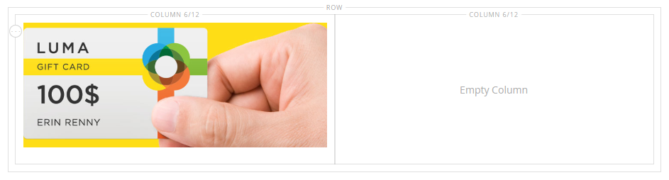<!-- zoom -->

## Change image settings

1. Hover over the image container to display the tool box and choose the _Settings_ (<!-- width="20px" --> ) icon.
   The file name, dimensions, and file size appear below the current image.

   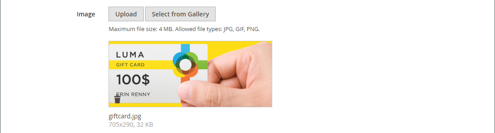<!-- zoom -->

1. To change the current **[!UICONTROL Image]**, do one of the following:

   - _**Upload a new image**_: Use this method to upload a new image file from your system.

      - Click **[!UICONTROL Upload Image]**.

      - Locate and choose the image to add it to the gallery and target container.

   - _**Select an existing asset**_: Use this method to select an existing image asset from the media storage/gallery.

      - Click **[!UICONTROL Select from Gallery]**.

      - Use the tree to navigate to the image.

      - Click the thumbnail and click **[!UICONTROL Add Selected]**.

         <!-- zoom -->

   - **Search and select an Adobe Stock image**: Use this method to find an image from Adobe Stock.

      >[!NOTE]
      >
      >This method requires an [Adobe Stock integration](https://docs.magento.com/user-guide/cms/adobe-stock.html) configured for your Admin.

      - Click **[!UICONTROL Search Adobe Stock]** and search for an image.

      - Save the preview or licensed image to the gallery.

         See [Using Adobe Stock Images](https://docs.magento.com/user-guide/cms/adobe-stock-manage.html) for more information about working with Adobe Stock assets.

      - Select the asset thumbnail in the gallery and click **[!UICONTROL Add Selected]**.

1. To add a **[!UICONTROL Mobile Image]**, use the same methods described in the previous step to select an image to be used for display on mobile devices.

   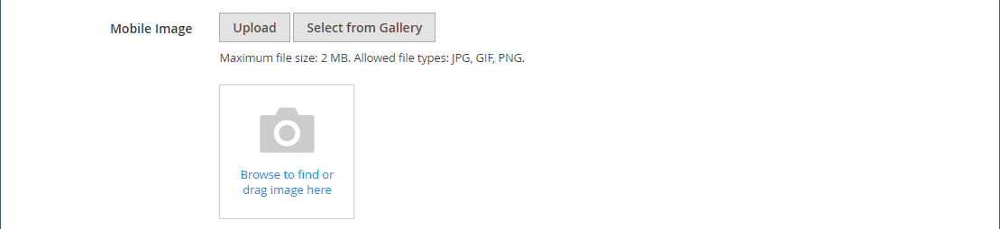<!-- zoom -->

1. If needed, specify a **[!UICONTROL Link]** for the image.

   The link is the destination page that appears when the customer clicks the image. You can use one of three link types:

   - **[!UICONTROL URL]** - Links to either a relative or fully qualified URL.

      <!-- zoom -->

   - **[!UICONTROL Product]** - Identifies the destination page based on the product name or SKU. Search for the product by name based on either a partial or full name. Choose the product from the search results list.

      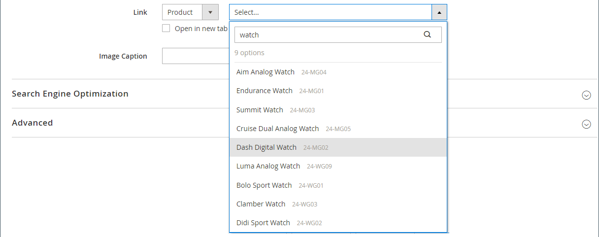<!-- zoom -->

   - **[!UICONTROL Category]** - Identifies the destination page as a specific category or subcategory in the category tree. Search for the category based on either a partial or full name. Choose the category from the expanded section of the displayed tree.

      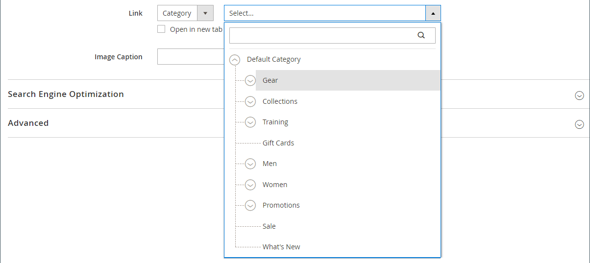<!-- zoom -->

   - **[!UICONTROL Page]** - Identifies the destination page as a specific content page. Search for the page based on either a partial or full name. Choose the page from the search results list.

      <!-- zoom -->

   If you want to prevent the visitor from navigating away from your store, select the **[!UICONTROL Open in new tab]** checkbox. When the checkbox is cleared, the linked destination opens in the same browser tab, which could effectively navigate the visitor away from your store.

1. To add an **[!UICONTROL Image Caption]**, enter the text that you want to appear below the image.

   The format of the caption is determined by the stylesheet that is associated with the current theme.

   <!-- zoom -->

   The caption typically appears below the image, and provides information about the image for visitors and search engines. If your site is available in multiple languages, you might use the same image, but  translate the caption. In HTML, the `<figcaption>` tag is a subset of the `<figure>` tag. `<figcaption>This is the image caption</figcaption>`

1. Update any of the other settings as needed:

   - [Search Engine Optimization](#search-engine-optimization)
   - [Advanced](#advanced)

1. When complete, click **[!UICONTROL Save]** to apply the settings and return to the [!DNL Page Builder] workspace.

## Move an image

1. Hover over the image container to display the toolbox and choose the _Move_ () icon.

   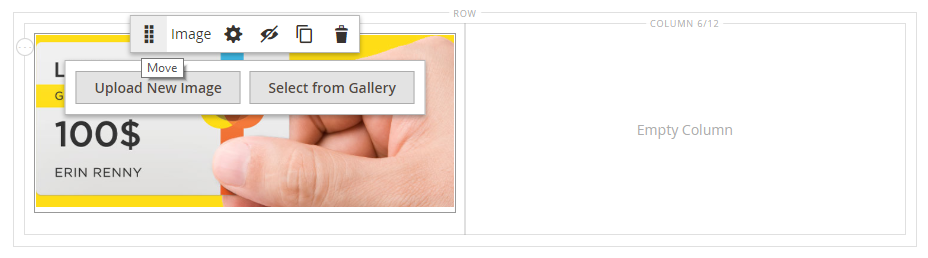<!-- zoom -->

1. Select and drag the image to the new position, just below the red guideline.

   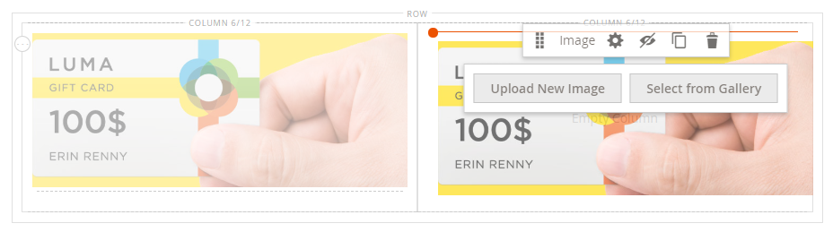<!-- zoom -->

## Remove an image

1. Hover over the image container to display the toolbox and choose the _Remove_ () icon.

1. When prompted to confirm, click **[!UICONTROL OK]**.

## Search Engine Optimization

Text for these settings is visible to search engines and improves the way the page is indexed.

- For **[!UICONTROL Alternative Text]**, enter an _alt_ text description for digital accessibility tools to display.

   The use of alt text is an accessibility best practice, and is required by law in some locales. In HTML, the `alt` attribute is a subset of the `image` tag: `<image title="tooltip" alt="description" src="image.jpg">`.

- For **[!UICONTROL Title Attribute]**, enter the text to display as a tooltip on mouseover.

   As a best practice, choose a descriptive, keyword-rich title to improve the way the image is indexed by search engines. In HTML, the `title` attribute is a subset of the `image` tag: `<image title="tooltip" alt="description" src="image.jpg">`.

## [!UICONTROL Advanced]

- To control the horizontal positioning of the images added to the container, choose an **[!UICONTROL Alignment]**.

   | Option | Description |
   | ------ | ----------- |
   | `Default` | Applies the alignment default setting that is specified in the style sheet of the current theme. |
   | `Left` | Aligns the image content along the left border of the image container, with allowance for any padding that is specified. |
   | `Center` | Aligns the image content in the center of the image container, with allowance for any padding that is specified. |
   | `Right` | Aligns the image content along the right border of the image container, with allowance for any padding that is specified. |

   {style="table-layout:auto"}

- Set the **[!UICONTROL Border]** style applied to all four sides of the image container:

   | Option | Description |
   | ------ | ----------- |
   | `Default` | Applies the default border style that is specified by the associated style sheet. |
   | `None` | Does not provide any visible indication of the container borders. |
   | `Dotted` | The container border appears as a dotted line. |
   | `Dashed` | The container border appears as a dashed line. |
   | `Solid` | The container border appears as a solid line. |
   | `Double` | The container border appears as a double line. |
   | `Groove` | The container border appears as a grooved line. |
   | `Ridge` | The container border appears as a ridged line. |
   | `Inset` | The container border appears as an inset line. |
   | `Outset` | The container border appears as an outset line. |

   {style="table-layout:auto"}

- If you set a border style other than `None`, complete the border display options:

   <!-- zoom -->

   | Option | Description |
   | ------ |------------ |
   | [!UICONTROL Border Color] | Specify the color by choosing a swatch, clicking the color picker, or by entering a valid color name or equivalent hexadecimal value. |
   | [!UICONTROL Border Width] | Enter the number of pixels for the border line width. |
   | [!UICONTROL Border Radius] | Enter the number of pixels to define the size of the radius that is used to round each corner of the border. |

   {style="table-layout:auto"}

- (Optional) Specify the names of **[!UICONTROL CSS classes]** from the current style sheet to apply to the image container.

   Separate multiple class names with a space.

- Enter values, in pixels, for the **[!UICONTROL Margins and Padding]** to specify the outer margins and inner padding of the image container.

   Enter each corresponding value in the image container diagram.

   | Container area | Description |
   | -------------- | ----------- |
   | [!UICONTROL Margins] | The amount of blank space that is applied to the outside edge of all sides of the container. |
   | [!UICONTROL Padding] | The amount of blank space that is applied to the inside edge of all sides of the container. |

   {style="table-layout:auto"}
