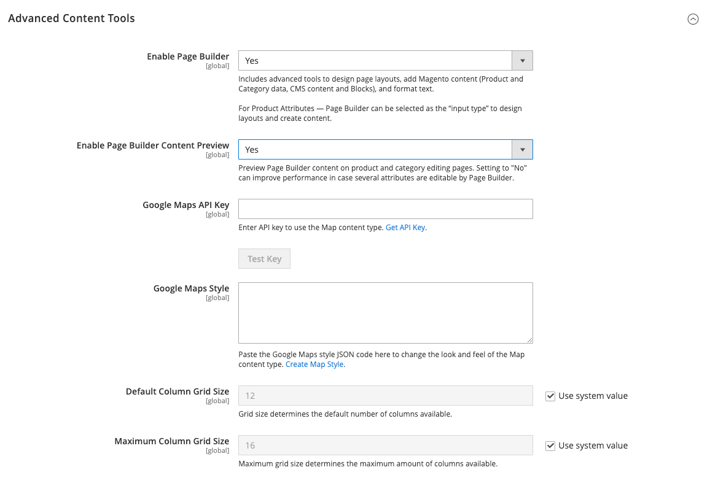
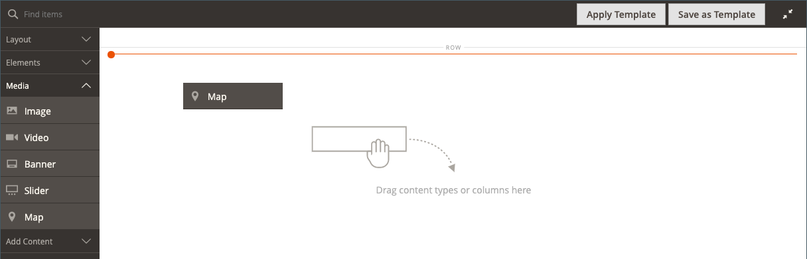
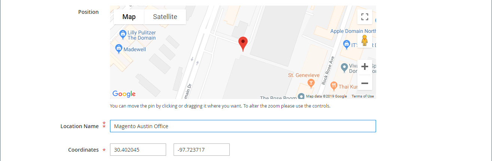
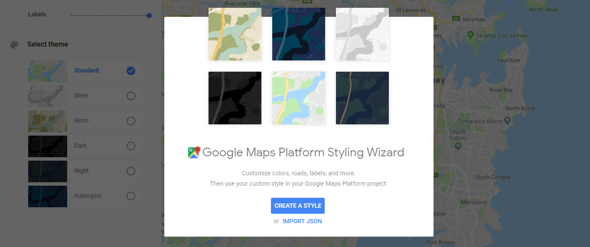
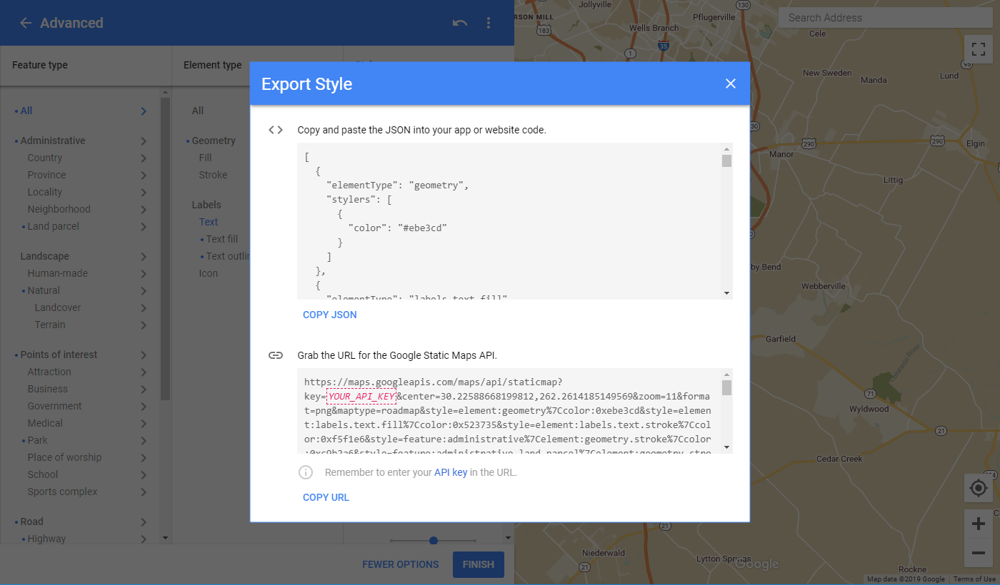
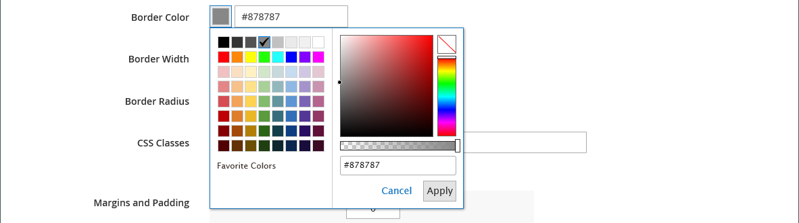
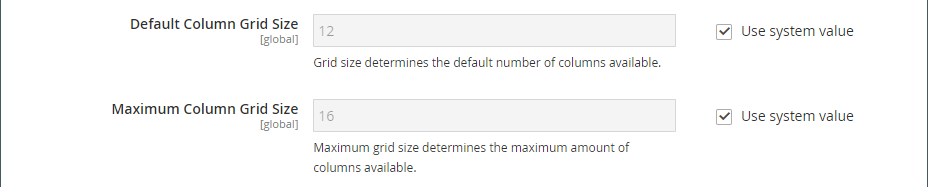

# Media - Map

Use the _Map_ content type to add a map from [[!DNL Google Maps] Platform][1] to the [[!DNL Page Builder] stage](workspace.md#stage). For example, you might add a map to a block, and then add the block to the [About Us](https://docs.magento.com/user-guide/cms/pages-core.html) and [Contact Us](https://docs.magento.com/user-guide/stores/contact-us.html) pages.

To get the most from [!DNL Google Maps] Platform, you can customize the map, highlight your store locations, and use Google [Places][2] to add rich information about your store to all [!DNL Google Maps].

## Benefits of embedding a Google map

1. Provides buyers with a full scope of information about your business (phone number, website, reviews, star ratings, and so on.) right on your site.

1. A Google map usually highlights nearby attractions, parks, restaurants, and so on. This information helps your customers determine your physical location and plan their trip.

1. Makes it easy for customers to find the address for your physical store without the need to open a new browser window and leave your site.

1. If you have a chain of physical stores, adding a Google Map on your site helps to increase your brand awareness and credibility in the form of highlighted items.

<!-- zoom -->

{{$include /help/_includes/page-builder-save-timeout.md}}

## Map toolbox

The map toolbox appears when you hover over the map container.

|Tool|Icon|Description|
|--- |--- |--- |
|Move|<!-- width="25px" -->|Moves the map to another position on the stage.|
|(label)|[!UICONTROL Map]|Identifies the current content container as a map. Hover over the map container to see the toolbox.|
|Settings|<!-- width="25px" -->|Opens the Edit Map page, where you can change the properties of the map and container.|
|Hide|<!-- width="25px" -->|Hides the current map.|
|Show|<!-- width="25px" -->|Shows the  hidden map.|
|Duplicate|<!-- width="25px" -->|Makes a copy of the map.|
|Remove|<!-- width="25px" -->|Deletes the map from the stage.|

{style="table-layout:auto"}

## Configure [!DNL Google Maps] for your Admin

Before adding a map, you must first open an [account][3] for a free trial of [!DNL Google Maps] Platform. The free trial lasts for 12 months and includes a $300 credit. If you use up your credit, Google does not bill your account without your permission.

### Step 1: Get your [!DNL Google Maps] API key

Depending on whether you already have a [!DNL Google Maps] key, use one of the following procedures to get the API key required for configuration. To set up a [!DNL Google Maps] key, you must be a site administrator authorized to enable billing for your account. If you’re not ready to set up a [!DNL Google Maps] Platform account, you can skip this step and use the placeholder map for now.

1. Go to the [Google Cloud Platform Console](https://cloud.google.com/console/google/maps-apis/overview).

1. Click the project drop-down and select or create the project for which you want to add an API key.

1. To configure your API credentials, follow the [instructions][4] in the [!DNL Google Maps] documentations.

1. Copy your API Key to the clipboard.

### Step 2: Configure [!DNL Google Maps] in [!DNL Commerce]

1. In the _Admin_ sidebar, go to **[!UICONTROL Stores]** > _[!UICONTROL Settings]_ > **[!UICONTROL Configuration]**.

1. In the left panel under _[!UICONTROL General]_, choose **[!UICONTROL Content Management]**.

1. Expand  **[!UICONTROL Advanced Content Tools]**.

   <!-- zoom -->

   For more information about the Content Management Advanced Tools configuration options, see the [Configuration Reference Guide](https://docs.magento.com/user-guide/configuration/general/content-management.html).

1. For **[!UICONTROL Google Maps API Key]**, paste the key you copied in step 1.

1. Click **[!UICONTROL Test Key]**.

   If there is a problem with your key, return to the [!DNL Google Maps] Platform site to resolve the problem. Then, try again.

1. After your key is verified, click **[!UICONTROL Save Config]**.

## Add a map to the stage

1. Open the page, block, or dynamic block to the [!DNL Page Builder] workspace.

1. In the [!DNL Page Builder] panel, expand **[!UICONTROL Media]** and drag a **[!UICONTROL Map]** placeholder to the stage.

   <!-- zoom -->

   If [!DNL Google Maps] Platform is configured for your store, a map appears for your store location.

   ![[!DNL Google Maps]](./assets/pb-tutorial2-google-map.png)<!-- zoom -->

   If [!DNL Google Maps] Platform is not yet configured for your store, a placeholder map appears instead.

   ![[!DNL Google Maps] Placeholder](./assets/pb-tutorial2-media-map-not-configured.png)<!-- zoom -->

## Add a custom map location

1. Hover over the map container to display the toolbox and choose the _Settings_ (<!-- width="20px" --> ) icon.

1. In the upper-right corner of the _[!UICONTROL Edit Map]_ page, click **[!UICONTROL Add Location]**.

1. Enter the **[!UICONTROL Location Name]** that you want to be associated with the pin on the map.

1. Collect the location coordinates that you want to use for the custom location.

   Alternatively, in the **[!UICONTROL Position]** box, you can drag the pin in the displayed map.

   If necessary, go to [[!DNL Google Maps]][5] in a new browser window and use one of the following methods to get the coordinates:

   <!-- zoom -->

   **Method 1:** Copy from URL

   - In the upper-left corner, enter the address in the **[!UICONTROL Search]** box and click the _Search_ () icon.

   - Copy the coordinates in the URL and paste them into a notepad.

   ![[!DNL Google Maps] - copy coordinates from URL](./assets/pb-media-maps-settings-add-location-coordinates-url.png)<!-- zoom -->

   **Method 2:** Copy from “What’s here?”

   - Right-click the red pin that marks the location on the map and choose **[!UICONTROL What’s here?]** in the menu.

      ![[!DNL Google Maps] - What’s here?](./assets/pb-media-maps-settings-add-location-pin-menu.png)<!-- zoom -->

   - In the displayed label, copy the text, including the coordinates and paste the text into a notepad.

      ![[!DNL Google Maps] - copying the coordinates](./assets/pb-media-maps-settings-add-location-label-coordinates.png)<!-- zoom -->

1. Enter the numbers, without the comma, in each of the **[!UICONTROL Coordinates]** boxes.

   You can also enter as much of the remaining information that you want to be available on the map.

1. Compete any other information that you want to associate with the map location:

   | Option | Description |
   | ------ | ----------- |
   | [!UICONTROL Phone Number] | The telephone number of the location. |
   | [!UICONTROL Street Address] | The street address of the location. |
   | [!UICONTROL City] | The city of the location. |
   | [!UICONTROL Region/State] | The region or state of the location. |
   | [!UICONTROL Zip/Postal Code] | The ZIP or postal code of the location. |
   | [!UICONTROL Country] | The country of the location. |
   | [!UICONTROL Comment] | Any comments that you want to include. |

   {style="table-layout:auto"}

1. When complete, click **[!UICONTROL Save]**.

   The new location appears in the map and in the map location grid on the _[!UICONTROL Edit Map]_ page.

   ![[!DNL Page Builder] - maps location grid](./assets/pb-media-maps-settings-add-location-grid.png)<!-- zoom -->

## Style the map {#styling}

Use the [!DNL Google Maps] Platform Styling Wizard to apply a one of six predefined themes or create a custom theme. You can generate a JSON file with the map style properties or a link to the styled map.

### Change the map style

1. In the _Admin_ sidebar, go to **[!UICONTROL Stores]** > _[!UICONTROL Settings]_ > **[!UICONTROL Configuration]**.

1. In the left panel under _[!UICONTROL General]_, choose **[!UICONTROL Content Management]**.

1. Expand  **[!UICONTROL Advanced Content Tools]**.

1. Under the **[!UICONTROL Google Maps Style]** text box, click [Create Map Style][6].

   <!-- zoom -->

   This action opens the [[!DNL Google Maps] Platform Styling Wizard][6] in a separate tab, where you can define a style for your [!DNL Google Maps] Platform project.

1. Click **[!UICONTROL Create a Style]** and follow the provided instructions.

   ![Selecting a predefined [!DNL Google Maps] theme](./assets/pb-media-maps-google-platform-maps-styling-wizard-select-theme.png)<!-- zoom -->

   When complete, click **[!UICONTROL Finish]**.

1. Export the completed style as JSON code or as a URL so that you can add it to the [!DNL Commerce] configuration.

   <!-- zoom -->

   - **JSON**: Below the box with the generated JSON code, click **[!UICONTROL Copy JSON]**.

   - **[!UICONTROL URL]**: Below the box with the generated URL, click **[!UICONTROL Copy URL]**.

1. Return to your Admin browser tab and paste the generated code or URL into the **Google Maps Style** box.

   If you are using a URL, replace the `YOUR_API_KEY` placeholder with your [!DNL Google Maps] API key. This URL links to your styled Google Map.

1. In the upper-right corner, click **[!UICONTROL Save Config]**.

### Change the map settings

1. Hover over the map container to display the tool box and choose the _Settings_ (<!-- width="20px" --> ) icon.

1. Change the basic settings as needed:

   | Option | Description |
   | ------ | ----------- |
   |[!UICONTROL Height]|Specifies the height of the displayed map in pixels.|
   |[!UICONTROL Show Controls]|Determines if the standard Google Map controls appear.|

   {style="table-layout:auto"}

1. Modify the _[!UICONTROL Advanced]_ settings as needed:

   -  To control the horizontal positioning of the map content that added to the container, choose an **[!UICONTROL Alignment]**:

      | Option | Description |
      | ------ | ----------- |
      | `Default` | Applies the alignment default setting that is specified in the style sheet of the current theme. |
      | `Left` | Aligns the content along the left border of the map container, with allowance for any padding that is specified. |
      | `Center` | Aligns the content in the center of the map container, with allowance for any padding that is specified. |
      | `Right` | Aligns the content along the right border of the map container, with allowance for any padding that is specified. |

      {style="table-layout:auto"}

   - Set the **[!UICONTROL Border]** style applied to all four sides of the map container:

      | Option | Description |
      | ------ | ----------- |
      | `Default` | Applies the default border style that is specified by the associated style sheet. |
      | `None` | Does not provide any visible indication of the container borders. |
      | `Dotted` | The container border appears as a dotted line. |
      | `Dashed` | The container border appears as a dashed line. |
      | `Solid` | The container border appears as a solid line. |
      | `Double` | The container border appears as a double line.|
      | `Groove` | The container border appears as a grooved line. |
      | `Ridge` | The container border appears as a ridged line. |
      | `Inset` | The container border appears as an inset line. |
      | `Outset` | The container border appears as an outset line. |

      {style="table-layout:auto"}

   - If you set a border style other than `None`, complete the border display options:

      <!-- zoom -->

      | Option | Description |
      | ------ |------------ |
      | [!UICONTROL Border Color] | Specify the color by choosing a swatch, clicking the color picker, or by entering a valid color name or equivalent hexadecimal value. |
      | [!UICONTROL Border Width] | Enter the number of pixels for the border line width. |
      | [!UICONTROL Border Radius] | Enter the number of pixels to define the size of the radius that is used to round each corner of the border. |

      {style="table-layout:auto"}

   - (Optional) Specify the names of **[!UICONTROL CSS classes]** from the current style sheet to apply to the map container.

      Separate multiple class names with a space.

   - Enter values, in pixels, for the **[!UICONTROL Margins and Padding]** to specify the outer margins and inner padding of the map container.

      Enter each corresponding value in the map container diagram.

      | Container area | Description |
      | -------------- | ----------- |
      | [!UICONTROL Margins] | The amount of blank space that is applied to the outside edge of all sides of the container. |
      | [!UICONTROL Padding] | The amount of blank space that is applied to the inside edge of all sides of the container. |

      {style="table-layout:auto"}

      >[!NOTE]
      >
      >Padding is not available for the Map content type.

1. When complete, click **[!UICONTROL Save]** to apply the settings and return to the [!DNL Page Builder] workspace.

### Change the grid size

The grid size determines the size of the map related to a [column](column.md) on the [!DNL Page Builder] stage. By default, the map is 12 columns wide, with a maximum of 16 columns.

1. In the _Admin_ sidebar, go to **[!UICONTROL Stores]** > _[!UICONTROL Settings]_ > **[!UICONTROL Configuration]**.

1. In the left panel under _[!UICONTROL General]_, choose **[!UICONTROL Content Management]**.

1. Expand  **[!UICONTROL Advanced Content Tools]**.

1. Update the grid options as needed:

   >[!NOTE]
   >
   >If needed, clear the **[!UICONTROL Use system value]** checkbox to modify these settings.

   - For **[!UICONTROL Default Column Grid Size]**, enter a new value for the default size of the grid.

   - For **[!UICONTROL Maximum Column Grid Size]**, enter a new value for the default maximum grid size.

   <!-- zoom -->

1. When complete, click **[!UICONTROL Save Config]**.

[1]: https://cloud.google.com/maps-platform/
[2]: https://cloud.google.com/maps-platform/places/
[3]: https://cloud.google.com/maps-platform/user-guide/
[4]: https://developers.google.com/maps/documentation/javascript/get-api-key
[5]: https://www.google.com/maps
[6]: https://mapstyle.withgoogle.com/
