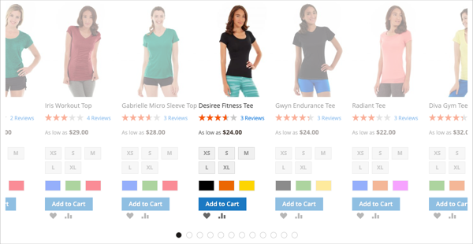
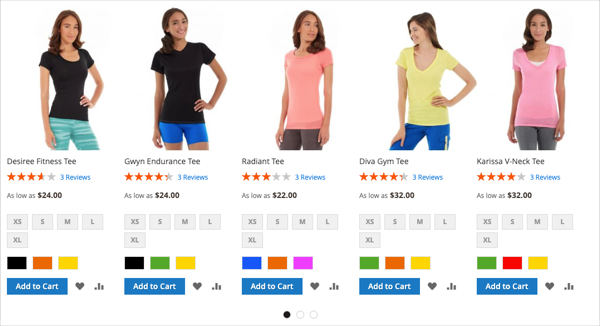
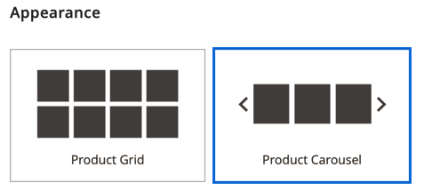
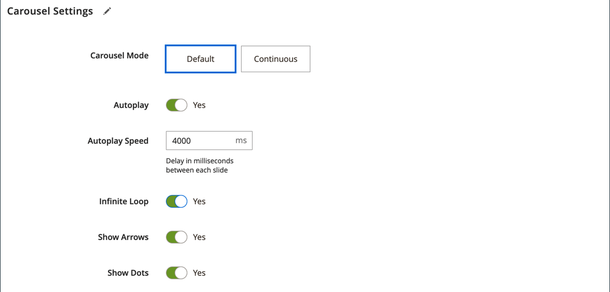
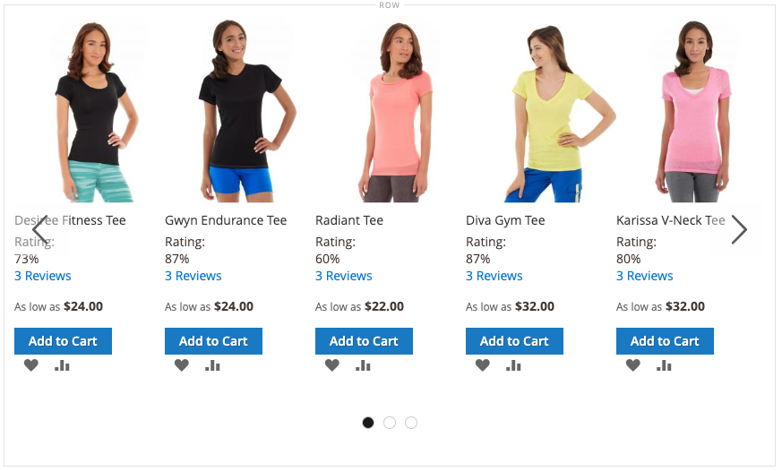

# Add Content - Products

Use the _Products_ content type to add a list of products to the [[!DNL Page Builder] stage](workspace.md#stage), using either a grid or carousel layout. Use the [Add Content - Block](block.md) tool to place the block on the [!DNL Page Builder] stage and then place a product list within the block. Or, you can add the product list directly in a row on a page.

## Guidelines for using the product carousel

The product carousel provides a powerful and engaging way to show off your products. To get the most out of it, the following guidelines are recommended:

- Add product carousels directly to page-width containers like rows, tabs, or one-column layouts. Using page-width layouts ensure the best responsive display of your products. [!DNL Page Builder] reduces the number of products shown depending on the width of the page, not the width of the container.

- Do not add a product carousel to a narrow column. As mentioned, [!DNL Page Builder], by default, determines the number of products to display based on the page width, not the column width.

- If you want your product carousel to auto-scroll continuously, set both **[!UICONTROL Autoplay]** and **[!UICONTROL Infinite Loop]** to `Yes`. If Autoplay is set to `Yes` but Infinite Loop is set to `No`, auto-scrolling stops at the end of your products list.

- Set the **[!UICONTROL Carousel Mode]** to `Continuous` to highlight, center, and scroll one product at a time within the carousel. The other products are visible in the list, but transparent in order to highlight the centered product.

   <!-- zoom -->

- To show and scroll up to five products at a time within the carousel, keep the **[!UICONTROL Carousel Mode]** set to `Default`.

   <!-- zoom -->

The following instructions show how to add a Products list to a block. You can then use a [widget](https://docs.magento.com/user-guide/cms/widgets.html) to place the block at a specific location on any page in your store.

{{$include /help/_includes/page-builder-save-timeout.md}}

## Products toolbox

| Tool      | Icon          | Description       |
| --------- | ------------- | ----------------- |
| Move      |  | Moves the products container and its content to another position on the stage.  |
| Settings  |  | Opens the _Edit Products_ page, where you can choose the products list and change the properties of the container. |
| Hide      | | Hides the current products container and its content.  |
| Show      |  | Shows the  hidden products container and its content.  |
| Duplicate |  | Makes a copy of the products container and its content.  |
| Remove    | | Deletes the products container and its content from the stage. |

{style="table-layout:auto"}

## Create a products list block

1. On the _Admin_ sidebar, go to **[!UICONTROL Content]** > _[!UICONTROL Elements]_ > **[!UICONTROL Blocks]**.

1. Click **[!UICONTROL Add New Block]**.

1. Enter the **[!UICONTROL Block Title]** and **[!UICONTROL Identifier]**.

1. Choose the **[!UICONTROL Store View]** where the block is to be available.

1. Scroll down and click **[!UICONTROL Edit with Page Builder]** or inside the content preview area to open the [!DNL Page Builder] workspace.

1. In the [!DNL Page Builder] panel, expand **[!UICONTROL Add Content]** and drag a **[!UICONTROL Products]** placeholder to the stage.

   <!-- zoom -->
   _Adding the Products content type_

## Configure the products list container

Hover over the empty _Products_ container to display the toolbox and click the _Settings_ (<!-- width="20px" --> ) icon.

<!-- zoom -->
_Products toolbox_

Complete the _Settings_ according to the following sections:

### Appearance

1. To determine how the products list is displayed on the page, choose one of the appearance types:

   | Type | Description |
   | ---- | ----------- |
   | Product Grid | Displays the products within a grid that shows five products per row (by default), with as many rows as are required to display the number entered in the **[!UICONTROL Number of Products to Display]** setting.  |
   | Product Carousel | Displays the products within a carousel (also known as a slider). The carousel shows up to five products per slide.   **Responsiveness Alert**: When you select this appearance, it is best to add the Products content type directly to a row, tab, or one-column layout where it is responsive, showing fewer products per side on smaller screens. If you add it to content types that are narrower than the width of the page (such as a narrow column), the carousel displays more products per slide than the container allows, regardless of the screen size. |

   {style="table-layout:auto"}

   <!-- zoom -->
   _Setting the product appearance_

   If you choose the product carousel, you must also configure the [Carousel Settings](#carousel-settings).

1. For **[!UICONTROL Select Products By]**, choose the method for product selection:

   You can select your products by category, SKU, or condition. These options are mutually exclusive. For example, you cannot select the Category option, use the Category selector, then switch over to the Condition option to add some conditions. Your products are selected based only on what you set for _one_ of these three options.

   - **[!UICONTROL Category]** - Choose this option to display products using a selected category.

      <!-- zoom -->
      _Selecting products by category_

      When selected, this option provides a **[!UICONTROL Category]** selector. Click the arrow and drill down to choose the category of products to display. For example, in the [!DNL Commerce] sample data, drilling in and selecting the _Women > Tops > Tees_ displays all products for that category.

      <!-- zoom -->

   - **[!UICONTROL SKU]** - Choose this option to display products using one or more SKUs

      When selected, this option provides a **[!UICONTROL Product SKUs]** text box where you must enter a comma-separated list of SKUs to display.

      <!-- zoom -->
      _Selecting products by SKU_

   - **[!UICONTROL Condition]** - Choose this option to display products according to one or more conditions that you define.

      When selected, there are tools available to add conditions to your products selection. For example, you could select only products with a Gender set to Unisex.

      <!-- zoom -->
      _Selecting products by condition_

      >[!NOTE]
      >
      >Selecting the Category or SKU option provides the **[!UICONTROL Sort By]** option of `Position`. With this sort option, the products appear in the same order that they appear in your catalog. 
      >
      >For the Category option, sorting by position displays the products in the same order that they appear in your catalog. For the SKU option, sorting by position displays the products in the order that you enter them in the **[!UICONTROL Product SKUs]** textbox.

1. For **[!UICONTROL Sort By]**, choose the sort order for the products in the list:

   | Option | Description |
   | ------ | ----------- |
   |  `Position` (for Category and SKU options only) |When you select the Category option, the Position displays products in the same order as their position in the catalog. When you select the SKU option, the Position displays products in the same order as the SKUs within the Product SKUs textbox. |
   | `Newest products first` | Sorts products by the date that they were added to the catalog, displaying the products with the most recent entry dates first. |
   | `Oldest products first` | Sorts products by the date that they were added to the catalog, displaying the products with the oldest entry dates first. |
   | `Name: A - Z` | Sorts products in alphabetical order. |
   | `Name: Z - A` | Sorts products in reverse alphabetical order. |
   | `SKU: ascending` | Sorts products by SKU in alphanumeric order. |
   | `SKU: descending` |Sorts products by SKU in reverse alphanumeric order. |
   | `Stock: low stock first` | Sorts products from the lowest to the highest available stock. |
   | `Stock: high stock first` | Sorts products from the highest to the lowest available stock. |
   | `Price: high to low` |  Sorts products from highest to lowest price. |
   | `Price: low to high` | Sorts products from lowest to highest price. |

   {style="table-layout:auto"}

   <!-- zoom -->

1. Enter the **[!UICONTROL Number of Products to Display]** in the carousel or grid.

   Values can be from `1` to `999`. The default is `5` for a grid and `20` for a carousel.

   >[!NOTE]
   >
   >Some products in the Category, SKU, or Condition settings may not appear in your products grid or carousel. For example, disabled products, products marked as not visible, out-of-stock products, and products assigned to another website are not displayed.

   >[!IMPORTANT]
   >
   >Prices for configurable, grouped, and bundled (dynamic price) products are undefined in the Admin area. Therefore, these products are not displayed in the **preview** if the products are filtered by price. These products cannot be ordered correctly in the **preview** if ordered by price.

### Carousel Settings

1. To determine how the products are displayed within the carousel, choose the **[!UICONTROL Carousel Mode]**:

   | Option | Description |
   | ------ | ----------- |
   | `Default` | The carousel displays five products per slide by default and responsively reduces that number as needed. |
   | `Continuous` | The carousel displays five products per slide by default (with half of a product on the right and left), but centers and scrolls one product at a time in an infinite loop. Products to the right and left of the centered product are dimmed so that the center product is highlighted. |

   {style="table-layout:auto"}

   If you switch between these two modes, the other carousel settings are retained, except for the **[!UICONTROL Infinite Loop]** setting, which is always set to `Yes` in Continuous mode and the field is disabled.

   <!-- zoom -->

1. If needed, set the **[!UICONTROL Autoplay]** option to `Yes`.

   When autoplay is enabled, the carousel begins scrolling automatically when the page loads. If you leave the default setting (`No`), the customer must click the slide navigation (dots or arrows) to display each slide in sequence.

   If you enable this feature, enter **[!UICONTROL Autoplay Speed]** to specify the delay in milliseconds between each slide. The default value is `4000` (4 seconds).

1. If needed, set the **[!UICONTROL Infinite Loop]** option to `Yes`.

   When infinite loop is enabled, the slide show replays indefinitely while the page is open. If you leave the default setting (`No`),  the slide show plays only once.

   >[!NOTE]
   >
   >If you set **[!UICONTROL Infinite Loop]** to `No` and **[!UICONTROL Autoplay]** set to `Yes`, the autoplay stops at the end of the number of products to be displayed.

1. If needed, set the **[!UICONTROL Show Arrows]** option to `Yes`.

   When this option is enabled, each slide includes _next_ and _previous_ navigation arrows on the left and right side. If you leave the default setting (`No`), the slides do not display navigation arrows.

1. If needed, set the **[!UICONTROL Show Dots]** option to `No`.

   When set to the default setting (`Yes`), navigation dots appear at the bottom of the carousel slider. If you disable this setting, the carousel slider does not display navigation dots.

### Advanced

1. To control the positioning of the Products list within the parent container, choose the **[!UICONTROL Alignment]**:

   | Option | Description |
   | ------ | ----------- |
   | `Default` | Applies the alignment default setting that is specified in the style sheet of the current theme. |
   | `Left` | Aligns the list along the left border of the parent container, with allowance for any padding that is specified. |
   | `Center` | Aligns the list in the center of the parent container, with allowance for any padding that is specified. |
   | `Right` | Aligns the list along the right border of the parent container, with allowance for any padding that is specified. |

   {style="table-layout:auto"}

1. Set the **[!UICONTROL Border]** style that is applied to all four sides of the Products container:

   | Option | Description |
   | ------ | ----------- |
   | `Default` | Applies the default border style that is specified by the associated style sheet. |
   | `None` | Does not provide any visible indication of the container borders. |
   | `Dotted` | The container border appears as a dotted line. |
   | `Dashed` | The container border appears as a dashed line. |
   | `Solid` | The container border appears as a solid line. |
   | `Double` | The container border appears as a double line. |
   | `Groove` | The container border appears as a grooved line. |
   | `Ridge` | The container border appears as a ridged line. |
   | `Inset` | The container border appears as an inset line. |
   | `Outset` | The container border appears as an outset line. |

   {style="table-layout:auto"}

1. If you set a border style other than `None`, complete the border display options:

   | Option | Description |
   | ------ |------------ |
   | [!UICONTROL Border Color] | Specify the color by choosing a swatch, clicking the color picker, or by entering a valid color name or equivalent hexadecimal value. |
   | [!UICONTROL Border Width] | Enter the number of pixels for the border line width. |
   | [!UICONTROL Border Radius] | Enter the number of pixels to define the size of the radius that is used to round each corner of the border. |

   {style="table-layout:auto"}

1. (Optional) Specify the names of **[!UICONTROL CSS classes]** from the current style sheet to apply to the container.

   Separate multiple class names with a space.

1. Enter values, in pixels, for the **[!UICONTROL Margins and Padding]** to determine the outer margins and inner padding of the Products container.

   Enter the corresponding values in the diagram.

   | Container area | Description |
   | -------------- | ----------- |
   | [!UICONTROL Margins] | The amount of blank space that is applied to the outside edge of all sides of the container. Options: `Top` / `Right` / `Bottom` / `Left` |
   | [!UICONTROL Padding] | The amount of blank space that is applied to the inside edge of all sides of the container. Options: `Top` / `Right` / `Bottom` / `Left` |

## Save and preview on the stage

In the upper-right corner, click **[!UICONTROL Save]** to apply the settings and return to the [!DNL Page Builder] workspace.

If you configured a product carousel, it should look similar to the following example:

<!-- zoom -->

You can now use a [widget](https://docs.magento.com/user-guide/cms/widgets.html) to place this block wherever you want it to appear in the store. Or, you can use [Add Content - Block](block.md) to add the block to an existing page, tab, or block.
