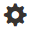
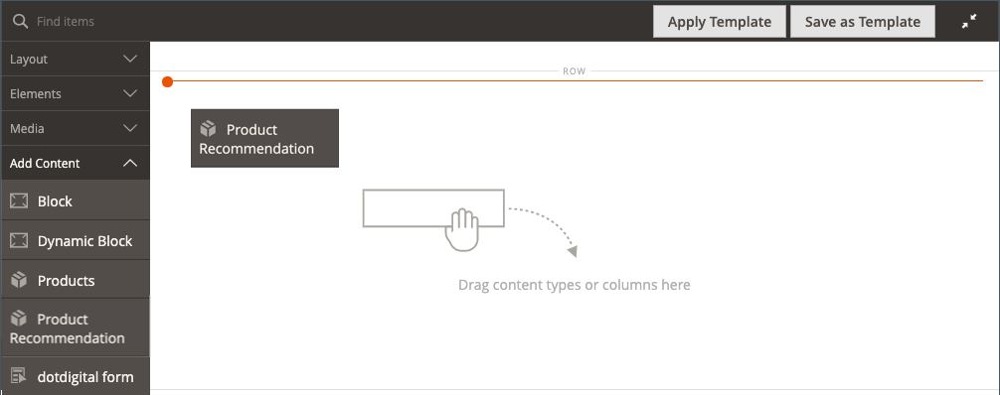
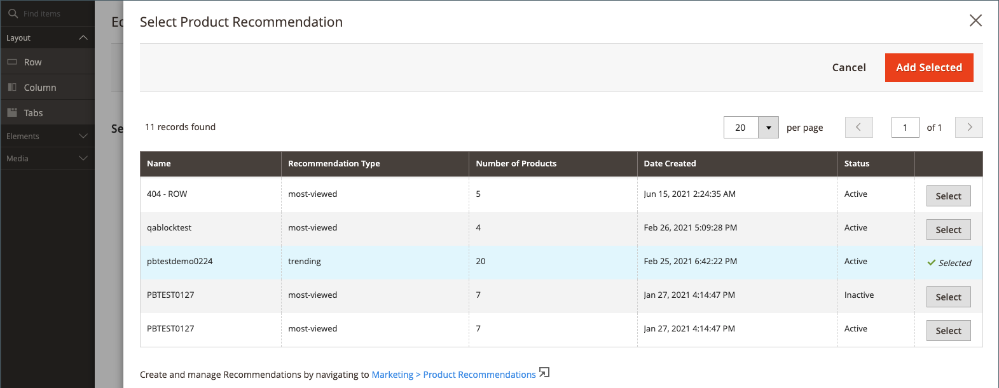
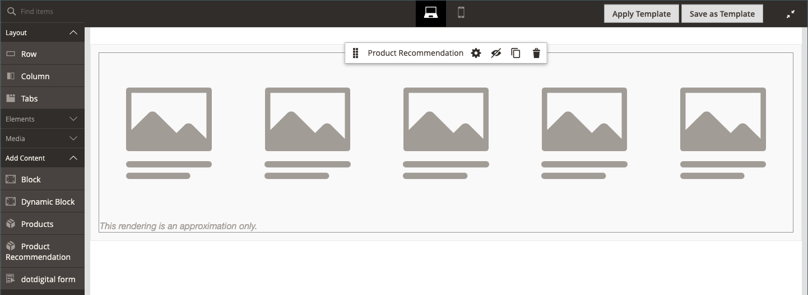

Use the _Product Recommendations_ content type to add an existing, active [recommendation unit](https://docs.magento.com/user-guide/recommendations/create.html) to the [[!DNL Page Builder] stage](workspace.md#stage) for a CMS page, block, or dynamic block.

>[!NOTE]
>
>The [!DNL Page Builder] _Product Recommendations_ content type is supported in Adobe Commerce 2.3.1 and later and available in the [Product Recommendations metapackage versions 3.0.x or later](https://marketplace.magento.com/magento-product-recommendations.html). To add [!DNL Page Builder] support for Product Recommendations, [see the installation information](https://experienceleague.adobe.com/docs/commerce-merchant-services/product-recommendations/getting-started/install-configure.html#pbsupport). This type is not available for Magento Open  Source.

{{$include /help/_includes/page-builder-save-timeout.md}}

## Product Recommendations toolbox

| Tool  | Icon | Description |
| --- | --| --- |
| Move |  | Moves the product recommendation container and its content to another position on the stage.|
| Settings |  | Opens the Edit Product Recommendation page, where you can choose the recommendation unit and change the properties of the container. |
| Hide |  | Hides the current product recommendation container and its content. |
| Show |  | Shows the hidden product recommendation container and its content. |
| Duplicate |  | Makes a duplicate copy of the product recommendation container and its content. |
| Remove |  | Deletes the product recommendation container and its content from the stage. |

## Add an existing recommendation unit

1. Make sure you have already [created a recommendation unit](https://docs.magento.com/user-guide/recommendations/create.html) for the [!DNL Page Builder] page type.

>[!NOTE]
>
>You can create recommendation units for the [!DNL Page Builder] page type only in the default store view.

1. Open the page, block, or dynamic block in edit mode.

1. Expand the _[!UICONTROL Content]_ section and click **[!UICONTROL Edit with Page Builder]** or inside the content preview area to open the [!DNL Page Builder] workspace.

1. In the [!DNL Page Builder] panel under _[!UICONTROL Layout]_, drag a **[!UICONTROL Row]** placeholder to the stage.

1. In the [!DNL Page Builder] panel under _[!UICONTROL Add Content]_, drag a **[!UICONTROL Product Recommendation]** placeholder to the row.

   <!-- zoom -->

1. Do one of the following:

   - Click **[!UICONTROL Edit Product Recommendation]**.
   - Hover over the empty container to display the toolbox and click the _Settings_ (<!-- width="20px" --> ) icon.

   <!-- zoom -->

1. In the _[!UICONTROL Selection]_ section, click **[!UICONTROL Select]**.

1. In the list of active product recommendations, find the row with the recommendation unit that you want to add and click **[!UICONTROL Select]** in the last column.

   <!-- zoom -->

1. In the upper-right corner, click **[!UICONTROL Add Selected]**.

   The name of the selected product recommendation appears in the _[!UICONTROL Selection]_ section of the _[!UICONTROL Edit Product Recommendation]_ page.

1. Make any changes necessary to the [Advanced settings](#advanced-settings).

   <!-- zoom -->

1. When complete, do the following:

   - If working with a fully maximized browser window, click the _Close Full Screen_ () icon in the upper-right corner of the workspace.

   - Click **[!UICONTROL Save]** to apply the settings and return to the [!DNL Page Builder] workspace.

   When you return to the stage, product placeholder images appear in the container.

## Edit recommendation unit settings

1. Hover over the recommendation unit container to display the toolbox and click the _Settings_ (<!-- width="20px" --> ) icon.

   <!-- zoom -->

1. Make any changes necessary to the [Advanced settings](#advanced-settings).

1. When complete, click **[!UICONTROL Save]** to apply the settings and return to the [!DNL Page Builder] workspace.

## Duplicate a recommendation unit

1. Hover over the recommendation unit container to display the toolbox and click the _Duplicate_ () icon in the toolbox.

   The duplicate appears just below the original.

1. To move the duplicated recommendation unit to a new position, hover over the container and click the _Move_ () icon in the toolbox.

1. Select and drag the recommendation unit until the red guideline appears at the new position.

    The top and bottom borders of each container appear as dashed lines while the recommendation unit is moved.

## Remove a recommendation unit from the stage

1. Hover over the recommendation unit container and click the _Remove_ () icon in the toolbox.

1. When prompted to confirm, click **[!UICONTROL OK]**.

## Advanced settings

1. To control the positioning of the Product Recommendations unit within the parent container, choose the **[!UICONTROL Alignment]**:

   | Option | Description |
   | ------ | ----------- |
   | `Default` | Applies the alignment default setting that is specified in the style sheet of the current theme. |
   | `Left` | Aligns the unit along the left border of the parent container, with allowance for any padding that is specified. |
   | `Center` | Aligns the unit in the center of the parent container, with allowance for any padding that is specified. |
   | `Right` | Aligns the unit along the right border of the parent container, with allowance for any padding that is specified. |

1. Set the **[!UICONTROL Border]** style that is applied to all four sides of the Product Recommendations unit:

   | Option | Description |
   | ------ | ----------- |
   | `Default` | Applies the default border style that is specified by the associated style sheet. |
   | `None` | Does not provide any visible indication of the unit borders. |
   | `Dotted` | The unit border appears as a dotted line. |
   | `Dashed` | The unit border appears as a dashed line. |
   | `Solid` | The unit border appears as a solid line. |
   | `Double` | The unit border appears as a double line. |
   | `Groove` | The unit border appears as a grooved line. |
   | `Ridge` | The unit border appears as a ridged line. |
   | `Inset` | The unit border appears as an inset line. |
   | `Outset` | The unit border appears as an outset line. |

1. If you set a border style other than `None`, complete the border display options:

   - **[!UICONTROL Border Color]** - Specify the color by choosing a swatch, clicking the color picker, or by entering a valid color name or equivalent hexadecimal value.

   - **[!UICONTROL Border Width]** - Enter the number of pixels for the border line width.

   - **[!UICONTROL Border Radius]** - Enter the number of pixels to define the size of the radius that is used to round each corner of the border.

1. (Optional) Specify the names of **[!UICONTROL CSS classes]** from the current style sheet to apply to the unit.

   Separate multiple class names with a space.

1. Enter values, in pixels, for the **[!UICONTROL Margins and Padding]** to determine the outer margins and inner padding of the unit.

   Enter the corresponding values in the diagram.

   | Container area | Description |
   | ------ | ----------- |
   | [!UICONTROL Margins] | The amount of blank space that is applied to the outside edge of all sides of the unit. Options: `Top` / `Right` / `Bottom` / `Left` |
   | [!UICONTROL Padding] | The amount of blank space that is applied to the inside edge of all sides of the unit. Options: `Top` / `Right` / `Bottom` / `Left` |
