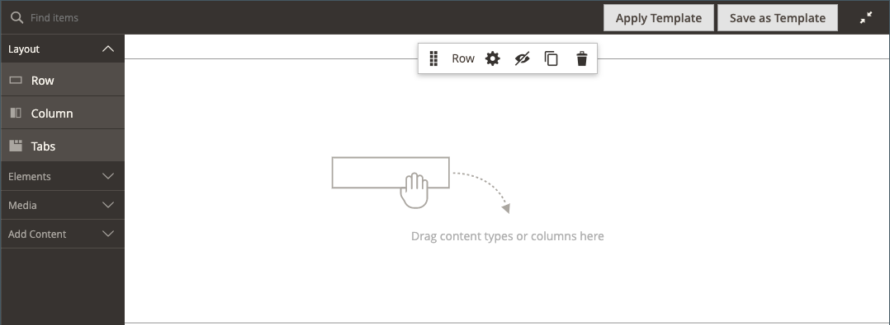
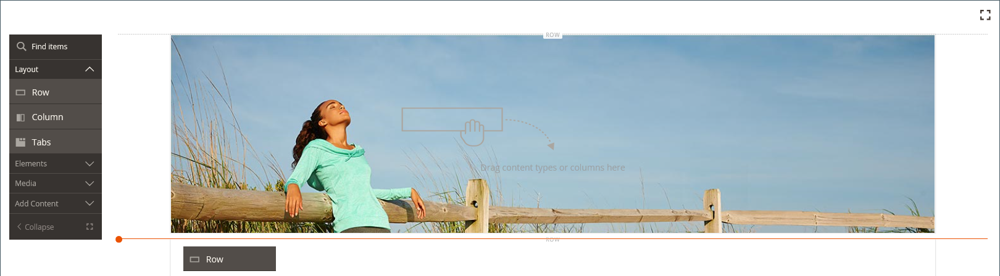
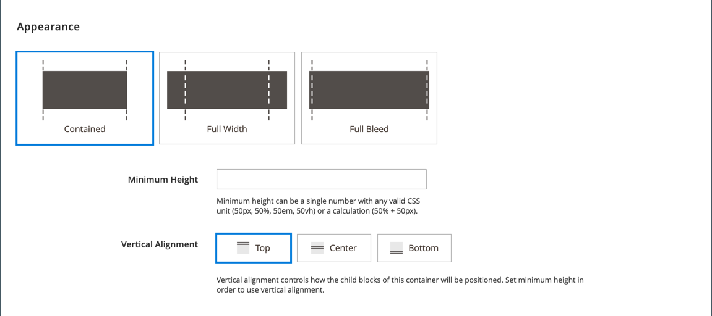
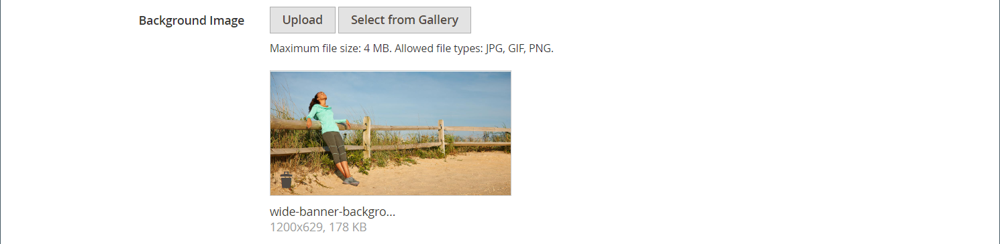
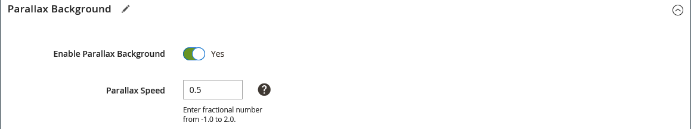
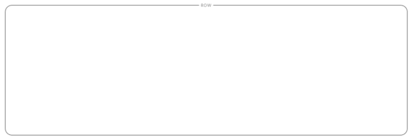

# Layout - Row

Use the _Row_ content type to add a row in the [[!DNL Page Builder] stage](workspace.md#stage).

{{$include /help/_includes/page-builder-save-timeout.md}}

## Row toolbox

The row toolbox appears when you hover over the row container. The toolbox includes options to move, hide, duplicate, edit, or remove the row. The selection of settings determines the appearance, background, and layout of the row. Additional content elements can be dragged to the row from the [!DNL Page Builder] panel on the left.

{width="600" zoomable="yes"}

| Tool      | Icon       | Description |
| --------- | ---------- | ----------- |
| Move | {width="25"} | Moves the row to another position in relation to other rows on the stage. |
| (label) | [!UICONTROL Row]  | Identifies the current content container as a row. Hover over the container to see the toolbox. |
| Settings | {width="25"} | Opens the Edit Row page, where you can change the properties of the container. |
| Hide | {width="25"} | Hides the current row. |
| Show | {width="25"} | Shows the hidden row. |
| Duplicate | {width="25"} | Makes a copy of the row. |
| Remove | {width="25"} | Deletes the row container and its content from the stage. |

{style="table-layout:auto"}

## Add a row

1. In the [!DNL Page Builder] panel under _[!UICONTROL Layout]_, drag a new **[!UICONTROL Row]** to the stage, just below the first row.

1. To format the row, hover over the row container to display the toolbox and choose the _Settings_ ( {width="20"} ) icon.

   Use the following sections for detailed information about completing the available settings.

   {width="600" zoomable="yes"}

## Change row settings

1. Hover over the row container to display the toolbox and choose the _Settings_ ( {width="20"} ) icon.

   {width="600" zoomable="yes"}

1. Use the following sections for detailed information about updating the available settings.

1. When complete, click **[!UICONTROL Save]** to apply the settings and return to the [!DNL Page Builder] workspace.

## Appearance

Use the _Appearance_ settings to determine how content is displayed in the row.

{width="600" zoomable="yes"}

- To determine how the background color and/or background image appears in relation to the container and width of the content area, choose the alignment:

   | Option | Description |
   | ------ | ----------- |
   | [!UICONTROL Contained] | The background color or image is limited to the maximum page width that is defined by the theme. |
   | [!UICONTROL Full Width] | Limits the content to the maximum page width that is defined by the theme. The background color and/or image is not limited, and extends the full width of the row. |
   | [!UICONTROL Full Bleed] | The content and background image and/or color are not limited, and extend the full width of the row. Full Bleed can be used only with [themes](../content-design/themes.md) that support the layout. |

   {style="table-layout:auto"}

- Enter the **[!UICONTROL Minimum Height]** for the row. This value can be a number with any valid CSS unit (such as `100px`, `50%`, `50em`, `100vh`) or a calculation (such as `100vh - 237px`).

   For example, you can set the minimum height of a row to stretch the full height of the page, giving you compelling options for full-page background images and videos.

- Choose a **[!UICONTROL Vertical Alignment]** setting to align any content containers that are added to the row (Top, Center, or Bottom).

## Background

There are many options for defining the background display of a row. You can apply a simple color or background image, and manage more sophisticated effects.

### Background Color

Specify the background color by choosing a swatch, by clicking the color picker, or by entering a valid color name or equivalent hexadecimal value. This setting determines the background color of the row. You can also adjust the opacity of the color.

{width="200"}

You can set the value in one of three ways:

- A predefined color name, such as `White`
- The hexadecimal color value for the color, such as `#ffffff`
- The rgba value for the color, with opacity percent, such as `rgba(255, 255, 255, 0.75)`

If you want to choose a color, click the swatch to the left of the _No Color_ box.

{width="600" zoomable="yes"}

If you click the color box to open the color picker again, the box below the slider shows the current red, green, blue, and alpha values (rgba). The last number indicates the current opacity percentage as a decimal. You can use the slider to adjust the opacity, or enter the desired decimal value.

{width="600" zoomable="yes"}

>[!NOTE]
>
>[!DNL Page Builder] also supports a transparency layer, or _alpha channel_, in background images that can be used to create backgrounds with varying degrees of opacity.

### [!UICONTROL Background Type]

A background type can be an image or a video. [!DNL Page Builder] defaults to `Image` and shows various image settings. If you select `Video`, [!DNL Page Builder] swaps the image settings with video settings. Both background types are described as follows.

{width="200"}

### Image type settings

If you set the _[!UICONTROL Background Type]_ to `Image`, use the following settings to define the background image display.

{width="600" zoomable="yes"}

- **[!UICONTROL Background Image]** - If needed, use the provided tools to choose a background image to apply to the row:

   | Option | Description |
   | ------ | ----------- |
   | [!UICONTROL Upload] |Uploads an image file from your local computer to the gallery and then applies it as the background image for the row. |
   | [!UICONTROL Select from Gallery] |Prompts you to choose an existing image from the gallery as the background image for the row. |
   | {width="25"} |Allows you to either drag the image to the camera tile or browse to the image in your local file system. |

   {style="table-layout:auto"}

- **[!UICONTROL Background Mobile Image]** - If needed, use the same tools to choose a different background image to be used for display on mobile devices.

- **[!UICONTROL Background Size]** - Set this option to determine how the background image is scaled in relation to the width of the row:

   | Option | Description |
   | ------ | ----------- |
   | `Cover` | The background image covers the full width of the row. |
   | `Contain` | The background image is limited to the width of the content area. |
   | `Auto` | Applies the size from the current style sheet. |

   {style="table-layout:auto"}

   {width="250"}

- **[!UICONTROL Background Position]** - Set this option to determine how the background image is anchored in relation to the row:

   | Anchor point | Position |
   | ------ | ----------- |
   | `Top` | Left / Center / Right |
   | `Center` | Left / Center / Right |
   | `Bottom` | Left / Center / Right |

   {style="table-layout:auto"}

   The anchor point is like a push pin that attaches the image to the row at the specified background position.

- **[!UICONTROL Background Attachment]** - Set the attachment type to determine how the background image moves in relation to the scrolling page:

   | Option | Description |
   | ------ | ----------- |
   | `Scroll` | The attached background image is synchronized to move down as the page scrolls. Use Parallax Background to control the scrolling speed. |
   | `Fixed` | (Not available for mobile) The background image does not move as the container scrolls over the image and is fixed at the specified background position. |

   {style="table-layout:auto"}

- **[!UICONTROL Background Repeat]** - Set to `Yes` to repeat the background image to fill the available space in the row.

### Video type settings

If you set the _Background Type_ to `Video`, use the following settings to define the background image display.

- **[!UICONTROL Video URL]** - Enter a valid video URL. Valid video URLs can be links to:

   - YouTube videos: `https://youtu.be/CoDhMRUUjeI`
   - Vimeo videos: `https://vimeo.com/190156113`
   - Valid video files (`.mp4` is recommended): `https://myvideos.com/spiral.mp4`

   {width="300"}

- **[!UICONTROL Overlay Color]** - Select a color to apply a transparent tint to the video.

- **[!UICONTROL Infinite Loop]** - Set to `No` to make the video play once and stop. When this option is set to `Yes` (default), the video repeats in an infinite loop.

- **[!UICONTROL Lazy Load]** - Set to `No` to make the video load with the page, even when not visible. When this option is set to `Yes` (default), the video loads from the source only when visible on the screen.

- **[!UICONTROL Play Only When Visible]** - Set to `No` to make the video start playing immediately after it loads, regardless of whether it is visible. When this option is set to `Yes` (default), the video starts playing only when it is visible.

- **[!UICONTROL Fallback Image]** - If needed, specify an image to display on the screen before the video loads and if the video does not load for some reason.

## Parallax Background

Use these options to control the speed of a scrolling background image or video in relation to the scrolling of the page. The background can be set to scroll more slowly to create a sense of immersion.

- Set **Enable Parallax Background** to `Yes`.
- Enter the **Parallax Speed** as a decimal value between `-1.0` and `2.0`.

{width="600" zoomable="yes"}

## Advanced

- To control the horizontal positioning of content containers that are added to the row, choose an **[!UICONTROL Alignment]**:

   | Option | Description |
   | ------ | ----------- |
   | `Default` | Applies the alignment default setting that is specified in the style sheet of the current theme. |
   | `Left` | Aligns the content containers along the left border of the row container, with allowance for any padding that is specified. |
   | `Center`| Aligns the content container in the center of the row container, with allowance for any padding that is specified. |
   | `Right` | Aligns the content container along the right border of the row container, with allowance for any padding that is specified. |

   {style="table-layout:auto"}

- Set the **[!UICONTROL Border]** style that is applied to all four sides of the row container:

   | Option | Description |
   | ------ | ----------- |
   | `Default` | Applies the default border style that is specified by the associated style sheet. |
   | `None` | Does not provide any visible indication of the container borders. |
   | `Dotted` | The container border appears as a dotted line. |
   | `Dashed` |  The container border appears as a dashed line. |
   | `Solid` | The container border appears as a solid line. |
   | `Double` | The container border appears as a double line. |
   | `Groove` | The container border appears as a grooved line. |
   | `Ridge` | The container border appears as a ridged line. |
   | `Inset` | The container border appears as an inset line. |
   | `Outset` | The container border appears as an outset line. |

   {style="table-layout:auto"}

- If you set a border style other than `None`, complete the border display options:

   {width="600" zoomable="yes"}
   
   | Option | Description |
   | ------ |------------ |
   | [!UICONTROL Border Color] | Specify the color by choosing a swatch, clicking the color picker, or by entering a valid color name or equivalent hexadecimal value. |
   | [!UICONTROL Border Width] | Enter the number of pixels for the border line width. |
   | [!UICONTROL Border Radius] | Enter the number of pixels to define the size of the radius that is used to round each corner of the border. |

   {style="table-layout:auto"}

   The row in the following example has a border radius of 15.

   {width="300"}

- (Optional) Specify the names of **[!UICONTROL CSS classes]** from the current style sheet to apply to the row container.

   Separate multiple class names with a space.

- Enter values, in pixels, for the **[!UICONTROL Margins and Padding]** to specify the outer margins and inner padding of the row.

   Enter each corresponding value in the row container diagram.

   | Container area | Description |
   | -------------- | ----------- |
   | [!UICONTROL Margins] | The amount of blank space that is applied to the outside edge of all sides of the container. Options: `Top` / `Right` / `Bottom` / `Left` |
   | [!UICONTROL Padding] | The amount of blank space that is applied to the inside edge of all sides of the container. Options: `Top` / `Right` / `Bottom` / `Left` |

   {style="table-layout:auto"}

   {width="600" zoomable="yes"}
