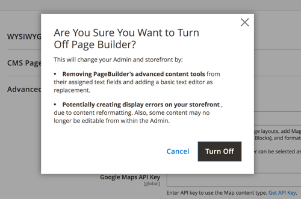

# Page Builder Setup

When enabled in the configuration, Page Builder is the default content creation tool for CMS Pages, Blocks, and Dynamic Blocks. In addition, the _Enable Advanced CMS_ button offers Page Builder as an option for Categories and Products. You can also choose the default [page layout](https://docs.magento.com/user-guide/design/page-layout.html) that you want to use for products, categories, and CMS pages. Page Builder is not available for newsletter content, which uses the WYSIWYG [editor](https://docs.magento.com/user-guide/cms/editor.html).

<!-- zoom -->

For more information about the Content Management Advanced Tools configuration options, see the [Configuration Reference Guide](https://docs.magento.com/user-guide/configuration/general/content-management.html).

## Configure Page Builder

1. On the _Admin_ sidebar, go to **Stores** > _Settings_ > **Configuration**.

1. In the left panel under _General_, choose **Content Management**.

1. Expand  **Advanced Content Tools** and verify that **Enable Page Builder** is set to `Yes`.

1. If you are ready to set up Google Maps, do the following:

   - If necessary, follow the [Get API Key][1] instructions, and then copy and paste your **Google Maps API Key**.

   - To change the **Google Maps Style**, paste the JSON code that is generated by the [Google Maps APIs Styling Wizard][2].

   >[!NOTE]
   >
   >See [Media - Map](map.md) for more information about using Google Maps in your Page Builder content.

1. To configure the number of guidelines in the Page Builder column grid, do the following:

   - For **Default Column Grid Size**, enter the default number of columns that you want to appear in the grid.

   - For **Maximum Column Grid Size**, enter the largest number of columns that you want to be available in the grid.

   

   >[!NOTE]
   >
   >See [Layout - Column](column.md) for more information about using the column grid when working with your Page Builder content.

1. When complete, click **Save Config**.

## Configure default layouts

1. On the _Admin_ sidebar, go to **Stores** > _Settings_ > **Configuration**.

1. In the left panel under _General_, choose **Web**.

1. Expand  **Default Layouts** and do the following:

   <!-- zoom -->

   For more information about the Web configuration options, see the [Configuration Reference Guide](https://docs.magento.com/user-guide/configuration/general/web.html#default-layouts).

   - Choose the **Default Product Layout** that you want to use for product pages.

   - Choose the **Default Category Layout** that you want to use for category pages.

   - Choose the **Default Page Layout** that you want to use for CMS pages.

1. When complete, click **Save Config**.

## Disable Page Builder

>[!NOTE]
>
>Disabling Page Builder replaces the Advanced Content Tools with the WYSIWYG [editor](https://docs.magento.com/user-guide/cms/editor.html), and might cause display errors in the storefront. Content that you previously created with Page Builder might not be editable from the Admin.

1. On the _Admin_ sidebar, go to **Stores** > _Settings_ > **Configuration**.

1. In the left panel under _General_, choose **Content Management**.

1. Expand  **Advanced Content Tools** and set **Enable Page Builder** to `No`.

1. When prompted to confirm, click **Turn Off**.

   <!-- zoom -->

1. When complete, click **Save Config**.

1. When prompted, [refresh](https://docs.magento.com/user-guide/system/cache-management.html) any invalid cache.

[1]: https://developers.google.com/maps/documentation/javascript/get-api-key
[2]: https://mapstyle.withgoogle.com/
